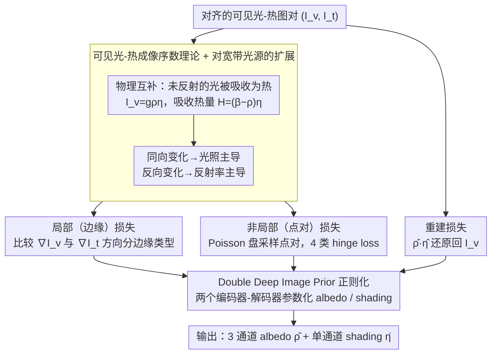

# VT-Intrinsic: Physics-Based Decomposition of Reflectance and Shading using a Single Visible-Thermal Image Pair

**会议**: CVPR 2026  
**arXiv**: [2509.10388](https://arxiv.org/abs/2509.10388)  
**代码**: [https://vt-intrinsic.github.io](https://vt-intrinsic.github.io)  
**领域**: 自监督  
**关键词**: 内在图像分解, 可见光-热成像, 反射率估计, 光照分解, 序数约束

## 一句话总结
VT-Intrinsic 利用可见光和热红外图像之间的物理互补关系（未反射的光被吸收变为热量），推导出可见光-热成像强度的序数关系（ordinality）直接对应反射率和光照的序数关系，以此为自监督信号驱动神经网络优化，实现了无需预训练数据的高质量内在图像分解。

## 研究背景与动机

1. **领域现状**：内在图像分解（IID）旨在将图像分解为反射率（albedo）和光照（shading）两个分量。这是计算机视觉和图形学的经典问题。主流方法分为：基于优化的方法（Retinex 等，依赖强先验假设）和基于学习的方法（在合成数据上训练，存在 sim-to-real gap）。

2. **现有痛点**：
    - 获取真实场景的反射率和光照 ground truth 极其困难，需要专用设备和受控程序
    - 基于学习的方法受限于合成训练数据，在真实场景中常过度平滑或产生幻觉（diffusion-based 方法尤其严重）
    - 优化方法依赖强先验假设（平滑光照、色度不变等），对复杂真实场景泛化差
    - 使用 NIR 辅助图像的方法受限于 NIR 反射率仍有显著材料变化，且 LED 照明缺少 NIR 成分

3. **核心矛盾**：IID 本身是欠约束的逆问题——仅凭单张可见光图像无法唯一确定 albedo 和 shading 的分解。现有方法要么使用不够可靠的先验，要么需要大量标注数据。

4. **本文目标** 利用一张额外的热红外图像提供物理上有意义的约束，无需预训练数据或受控照明即可实现高质量 IID。

5. **切入角度**：一个关键物理洞察——对于不透明物体，入射光中未被反射的部分被吸收为热量。因此低反射率区域在可见光中较暗，但在热图中较亮（吸收更多热量）；而光照变化在两者中同向变化。这种"序数关系"可以直接区分反射率边缘和光照边缘。

6. **核心 idea**：利用可见光和热红外图像的强度序数关系（同向=光照主导，反向=反射率主导）作为密集自监督信号来分解反射率和光照。

## 方法详解

### 整体框架
这篇论文想解决的是内在图像分解这个经典的欠约束逆问题：单张可见光图本身无法唯一地拆出反射率和光照。它的破局点是再拍一张对齐的热红外图——未被反射的光会被吸收成热量，于是同一个像素在可见光和热图里的强弱关系，本身就编码了"这里是反射率在变还是光照在变"。整条 pipeline 由此展开：先从物理上把这层互补关系推导成一组**序数约束**（局部的边缘约束 + 非局部的点对约束），再把这些约束和重建损失一起，去优化一个 Double Deep Image Prior（DDIP）网络，最终吐出 3 通道 albedo $\hat{\rho}$ 和单通道 shading $\hat{\eta}$。全程不碰任何预训练权重或外部数据，只靠这一对图像自监督。

### 关键设计

**1. 可见光-热成像序数理论：把不可观测的反射率/光照排序，翻译成可直接测量的可见光/热强度排序**

IID 难就难在 albedo 和 shading 谁大谁小根本无法直接观测，所以分解才会欠约束。本文的核心一招是引入第二个可测量通道：在 Lambertian 场景下可见光强度 $I_v = g\rho\eta$，而被吸收的热量 $\mathcal{H} = (1-\rho)\eta$。关键的过渡是，在热平衡条件下忽略导热项后，热图 $I_t$ 是吸收热量的单调代理，即 $\mathcal{H} = c_1 I_t - c_3$，于是 $I_t$ 也变得可测。把这两条放到任意两个像素 $x_i, x_j$ 上比较就得到一个干净的判别规则：当 $I_v$ 和 $I_t$ **同向**变化（都更亮），说明是光照在主导，$\eta(x_i) > \eta(x_j)$；当两者**反向**（可见光更亮但热图更暗，意味着这里反射多、吸热少），则是反射率在主导，$\rho(x_i) > \rho(x_j)$。这一步把原本看不见的 albedo/shading 序数，等价成了从两张图就能读出来的可见光/热红外序数——后面所有约束都建立在它之上。

**2. 对宽带光源的扩展：让理论在日光、白炽灯这类含红外成分的真实光源下仍然站得住**

上面的推导默认光源是纯可见光，但真实场景里的日光、白炽灯都带红外成分，会污染热信号。本文把热源项改写成 $\mathcal{H} = (\beta - \rho_v)\eta$，其中 $\beta = 1 + (1-\rho_i)l_i/l_v$ 吸收了红外照明的影响。能让序数关系继续成立的关键假设是：红外波段反射率 $\rho_i$ 在局部区域近似恒定——因为红外反射率的材料间差异本就远小于可见光，所以 $\beta$ 可当作局部常数，同向/反向的判别规则不受影响。这个假设不是拍脑袋：作者拿 USGS 光谱反射率数据库里 427 种材料做统计，94.2% 的材料对都满足序数一致性，给了它一个经验底座。

**3. 局部（边缘）损失：用两张图的梯度方向把边缘分成反射率边和光照边，再各自压住不该变的量**

边缘是 albedo/shading 分界最直观的信号，所以第一类约束直接落在边缘上。做法是比较 $\nabla I_v$ 和 $\nabla I_t$ 的余弦相似度：梯度反向（余弦 $< -\epsilon_p$）判为 albedo 边缘，同向（$> \epsilon_p$）判为 shading 边缘。判完之后反着约束——在 albedo 边缘上光照本不该突变，就惩罚 $\|\nabla\hat{\eta}\|^2$；在 shading 边缘上反射率不该突变，就惩罚 $\|\nabla\bar{\rho}\|^2$。比较的是方向而非绝对值，所以对光照强度、相机增益这些缩放因素天然鲁棒。

**4. 非局部（点对）损失：补上边缘覆盖不到的长程排序，把绝对值也钉住**

只有边缘约束是局部的，只能管相邻像素的相对变化，定不下全局的绝对水平。第四个设计用跨图像的点对来补这个洞：通过 Poisson 盘采样生成随机点对 $(x_i, x_j)$，按归一化强度差 $\delta I_v$、$\delta I_t$ 的符号把点对分成 4 类（$S_+, S_-, A_+, A_-$），再用 hinge loss 把预测的 albedo/shading 拉到对应的序数关系上。比如一个点对落在 $S_+$（两者差都为正 → 光照主导），就惩罚 $\max(\hat{\eta}_j - \hat{\eta}_i + \varepsilon_m, 0)$，逼着网络给出 $\hat{\eta}_i$ 比 $\hat{\eta}_j$ 大且留出间隔 $\varepsilon_m$。这些长程点对提供了边缘约束给不出的全局排序信息，让序数约束覆盖到整张图。

**5. Double Deep Image Prior 正则化：序数只管相对顺序，绝对值和结构靠网络先验兜底**

序数约束的软肋是它只规定谁大谁小，没法完全锁定绝对值，光靠它优化会过拟合噪声。本文用两个随机初始化的编码器-解码器网络分别参数化 albedo 和 shading，借 Deep Image Prior 的隐式正则——网络架构天然先拟合低频、后拟合高频——给解空间一个结构先验，把序数约束留下的自由度收住。再加两个硬约束兜底：albedo 输出过 sigmoid 限制在 $[0,1]$，shading 加非负性惩罚。这样物理序数负责"方向对不对"，DIP 负责"形状平不平滑"，两者互补。

### 损失函数
总损失 $\mathcal{L} = \|\hat{\rho} \cdot \hat{\eta} - I_v\|_2 + \lambda_1 \mathcal{L}_{edge} + \lambda_2 \mathcal{L}_{ord}$，第一项是重建损失（要求 albedo×shading 还原回可见光图），后两项分别是边缘约束和点对序数约束。值得注意的是热图全程只用来生成边缘和点对损失的标签，不参与重建——它是约束的来源，而非被拟合的目标。

## 实验关键数据

### 主实验（si-MSE × $10^{-2}$，↓ 越低越好）

| 方法 | 类别 | 涂色面具 Albedo | 色卡 Albedo | 白LED Albedo | 白炽灯 Albedo | 日光 Albedo |
|------|------|----------------|------------|-------------|-------------|------------|
| RGB-Retinex | 优化 | 25 | 3.4 | 2.42 | 2.33 | 2.73 |
| Intrinsic-v2 | 学习 | 27 | 2.8 | 1.25 | 4.36 | 4.17 |
| CRefNet | 学习 | 38 | 8.8 | 1.79 | 2.29 | 1.98 |
| JoLHT-Video | 物理 | 8.4 | 2.0 | N/A | ✗ | ✗ |
| **VT-Intrinsic** | 物理 | **11** | **2.7** | **0.37** | **1.06** | **1.19** |

### 序数验证实验

| 验证场景 | 准确率 |
|---------|-------|
| 20 种材料贴片 + 日光 | 98.59%（albedo 99.37%，shading 97.01%） |
| 20 种材料贴片 + 白 LED | 96.82%（albedo 94.62%，shading 100%） |
| 100 个真实场景 1063 标注点对 | 98.95%（albedo 96.96%，shading 99.62%） |
| USGS 427 种材料光谱统计 | 94.2% 的材料对满足序数一致性 |

### 关键发现
- VT-Intrinsic 在所有照明条件下均超越所有学习方法，且无需任何预训练数据
- 与 JoLHT-Video（需要热视频 + 受控照明 + 标定）性能接近，但仅需单张热图
- 专家标注验证序数准确率超过 98%，证明理论在实际材料和场景中高度可靠
- 学习方法容易过度平滑 albedo/shading（如草地光照被平坦化），diffusion 方法会产生幻觉纹理
- 白炽灯和日光实验证明了对含红外光源的鲁棒性

## 亮点与洞察
- **物理互补性的巧妙利用**：可见光捕获反射光，热成像捕获吸收热量——这对"互为补充"的信号天然编码了 albedo 和 shading 的区分信息，这一洞察极其优雅
- **从热传导方程到序数代理的推导链**：从能量守恒 → 热传输方程 → 热平衡 → 热图是吸收量的单调代理——整个理论推导环环相扣，物理直觉清晰
- **零样本超越预训练模型**：仅靠单对图像的物理约束就超越了在大规模数据上训练的学习方法，说明正确的物理归纳偏置可以胜过统计学习

## 局限与展望
- 假设 Lambertian 反射，金属、透明物体和镜面会导致失败
- 假设热量主要来自光吸收——发动机、人体等非光源热源会干扰
- 不支持多色照明
- 依赖廉价微测辐射计热相机，在弱照明或动态场景下 SNR 不足
- 热相机分辨率低于可见光相机，可能影响细节恢复
- 可扩展方向：(1) 利用 VT-Intrinsic 的高质量伪 GT 为大规模学习方法提供训练数据；(2) 将序数理论扩展到多光谱成像

## 相关工作与启发
- **vs JoLHT-Video**: JoLHT-Video 使用热视频的瞬态过程直接估计吸收光强度，需要受控照明和热视频；VT-Intrinsic 仅用稳态热图的序数关系，适用范围大大扩展
- **vs NIR-Priors**: NIR 方法假设 NIR 反射率变化小将其作为 shading 代理，但 NIR 反射率仍有显著材料变化且 LED 不发 NIR；VT-Intrinsic 利用热吸收的互补关系更本质
- **vs Intrinsic-v2**: 最新学习方法虽然在某些 indoor 场景表现不错，但在白炽灯/日光下反而变差（si-MSE 4.17-4.36），说明学习的先验对照明变化不够鲁棒

## 评分
- 新颖性: ⭐⭐⭐⭐⭐ 首次利用热红外序数约束做 IID，物理理论原创且优雅
- 实验充分度: ⭐⭐⭐⭐ 多照明条件、多材料、多场景验证，序数理论验证充分，但缺少大规模定量评估
- 写作质量: ⭐⭐⭐⭐⭐ 物理推导清晰严谨，Roger Shepard 错觉示例极其直观
- 价值: ⭐⭐⭐⭐⭐ 开辟了光-热互补性在视觉中的新范式，可为学习方法提供大规模实世界标注

<!-- RELATED:START -->

## 相关论文

- [\[CVPR 2026\] Suppressing Non-Semantic Noise in Masked Image Modeling Representations](suppressing_non-semantic_noise_in_masked_image_modeling_representations.md)
- [\[CVPR 2026\] D2Dewarp: Dual Dimensions Geometric Representation Learning Based Document Image Dewarping](d2dewarp_dual_dimensions_geometric_representation_learning_based_document_image_.md)
- [\[ICML 2025\] PDE-Transformer: Efficient and Versatile Transformers for Physics Simulations](../../ICML2025/self_supervised/pde-transformer_efficient_and_versatile_transformers_for_physics_simulations.md)
- [\[ICLR 2026\] SNAP-UQ: Self-supervised Next-Activation Prediction for Single-Pass Uncertainty](../../ICLR2026/self_supervised/snap-uq_self-supervised_next-activation_prediction_for_single-pass_uncertainty_i.md)
- [\[CVPR 2026\] Text-Phase Synergy Network with Dual Priors for Unsupervised Cross-Domain Image Retrieval](text-phase_synergy_network_with_dual_priors_for_unsupervised_cross-domain_image_.md)

<!-- RELATED:END -->
