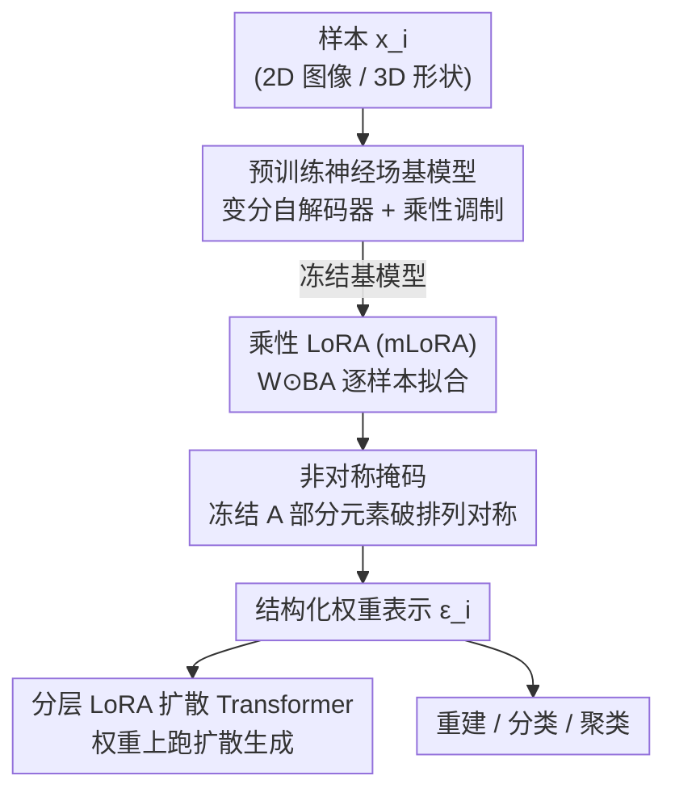

# Weight Space Representation Learning via Neural Field Adaptation

**会议**: CVPR 2026  
**论文**: [CVF Open Access](https://openaccess.thecvf.com/content/CVPR2026/html/Yang_Weight_Space_Representation_Learning_via_Neural_Field_Adaptation_CVPR_2026_paper.html)  
**代码**: 待确认  
**领域**: 自监督 / 表示学习（权重空间表示、神经场）  
**关键词**: 权重空间表示, 神经场 INR, 乘性 LoRA, 排列对称性, 权重扩散生成

## 一句话总结
本文提出用「预训练神经场基模型 + 乘性 LoRA（mLoRA）+ 非对称掩码」把每个样本独立拟合出来的网络权重约束成有结构的表示，让 INR 的权重本身既能高质量重建、又能在权重上跑扩散模型生成，还带语义可分性，在 FFHQ / ShapeNet 上全面超过此前的权重空间方法 HyperDiffusion。

## 研究背景与动机
**领域现状**：把神经网络的权重当成「可学习、可操作、可解释的对象」是近年新兴方向——已经有人把权重做合并（model merging）、用扩散模型生成权重、或把权重当作另一个网络的输入来处理。而隐式神经表示（INR / 神经场）天然把一个信号（图像、3D 形状）编码成「坐标 → 数值」的小网络的权重 $f(p\,|\,\omega)$，于是「能不能直接把这些权重当作数据的表示」就成了一个很自然的问题。

**现有痛点**：网络权重出了名地「模糊」。神经元的排列置换、通道缩放都不改变网络实现的函数——也就是说**功能完全相同的两个网络，在权重空间里可以离得任意远**。不同随机初始化拟合同一个样本，得到的参数配置天差地别。这让权重的分布是高度多模态、难以学习的，直接拿去做表示或喂给扩散模型几乎学不动。

**核心矛盾**：想用权重当表示，就要权重空间「平滑、有结构、同一语义聚到一起」；但 INR 的独立优化恰恰把每个样本扔进权重空间里一个随机的、被对称性打散的位置，结构无从谈起。

**本文目标**：给独立优化出来的权重**注入恰当的归纳偏置**，把混沌的参数空间塑造成有组织、有语义的表示空间，并验证它能同时支撑重建、生成、判别三类任务。

**切入角度**：作者观察到 LoRA 有两个对「造结构」恰好有利的性质——其一，LoRA 把更新限制在基模型定义的低维子空间内（不同 rank 的 LoRA 共享奇异向量方向，说明存在一个有意义的低秩适配子空间）；其二，低秩天然降维，缓解高维权重空间的维度灾难。于是不去做「能处理任意权重的外部编码器」，而是**直接在权重空间本身上施加结构**。

**核心 idea**：用「冻结的预训练神经场基模型 + 乘性 LoRA（element-wise 相乘而非相加）+ 非对称掩码打破排列对称」，让每个样本的 LoRA 权重直接成为它的结构化表示。

## 方法详解

### 整体框架
方法围绕一句话：**不要让每个样本从零拟合一个 MLP，而是让它们共享同一个冻结的预训练神经场，只用各自的低秩适配权重去微调；这些适配权重就是样本的表示**。输入是一批样本 $\{x_i\}_{i=1}^{N}$（2D 图像或 3D 形状），输出是每个样本对应的一组 LoRA 权重 $\varepsilon_i$，它们组成结构化的权重空间，可直接用于重建、扩散生成、分类聚类。

整条流水线是：先用变分自解码器范式训练一个带乘性调制的神经场基模型（捕捉跨样本的可迁移特征）→ 冻结基模型，对每个样本只优化它的乘性 LoRA 参数来重建该样本 → 给所有 LoRA 的 $A$ 矩阵套同一套非对称掩码消除内部排列对称 → 把得到的权重表示拉平，喂进一个分层 LoRA 扩散 Transformer 学其分布、采样生成新权重再实例化成新的神经场。

### 关键设计

**1. 乘性 LoRA（mLoRA）：用「相乘」而非「相加」来适配，避免神经场特征纠缠**

标准 LoRA 是加性的：把预训练权重矩阵 $W \in \mathbb{R}^{d_{out}\times d_{in}}$ 更新成 $W' = W + BA$，其中 $A,B$ 是低秩矩阵。但作者发现加性 LoRA 在神经场权重学习里**根本不够用**。原因在于 INR 本身是「加性合成」信号的：线性层把基函数线性组合、激活函数生成谐波，这天然就让表示高度纠缠；加性 LoRA 又往这锅已经纠缠的混合物里**注入新的信号分量**，使权重空间更难结构化。

本文改成逐元素相乘：

$$W' = W \odot BA$$

其中 $\odot$ 是 element-wise 乘法。乘性更新是去**缩放已有特征**而不是注入新特征，因此保留了通道结构、不引入额外纠缠——这也和生成式神经场里广泛使用的「乘性调制」机制一脉相承（特征通过乘性交互组合）。作者进一步指出（Corollary 2.2），一旦排列对称被消除，mLoRA 权重会和基网络的通道轴完全对齐，这正是它结构好的根源。实验里这一项被证明对重建、生成、判别都是决定性的。

**2. 非对称掩码：冻结一部分 LoRA 元素，消除低秩因子内部的排列/GL 对称**

排列对称是权重空间多模态、难学的元凶。本文里对称有两个来源：**外部对称**来自基网络神经元的置换——通过「所有样本共享同一个固定基模型」就被彻底消掉；**内部对称**藏在 LoRA 因子自己里——$r$ 个秩维度可以任意置换而不改变函数，且任意可逆矩阵 $G\in GL(r)$ 满足 $(AG)(G^{-1}B)=AB$，意味着每个函数对应一整个 $GL(r)$ 等价类。

为打破内部对称，作者对所有层所有 LoRA 的 $A$ 矩阵施加非对称掩码：每一行随机冻结 $\sim d_{out}$ 个元素，冻结位置在所有样本、所有训练运行间**共享固定**。关键差异在「怎么冻」——对 standalone MLP 和加性 LoRA，要破对称必须把冻结项初始化成大方差 $\mathcal{N}(0,\sigma I)$（论文取 $\sigma=6$），但这对神经场是灾难：大幅值固定权重逼迫其它权重去抵消它，制造纠缠、优化地形变差（实验里 LoRA-Asym 在 FFHQ 上 PSNR 直接崩到 24.63）。而 mLoRA 直接把冻结项**置零** $A_{ij}\leftarrow 0$，相当于干净地「门控掉」对应的秩分量，不需要任何补偿，天然契合乘性结构。这就是「掩码 + 乘性」必须配套的原因。

**3. 乘性调制基模型 + 变分自解码器训练：提供可迁移特征与解纠缠的底座**

LoRA 表示的质量取决于基模型够不够强、特征够不够通用。作者采用坐标式神经场，主干是 MLP，样本间的差异通过**乘性权重调制**注入——这一架构本身就和 mLoRA 的乘性形式对齐。基模型用变分自解码器范式训练：不需要设计编码器（契合 INR 的数据无关性），联合优化网络参数 $\omega$ 和每样本隐码 $\{z_i\}$：

$$\min_{\omega,\{z_i\}} \sum_{i=1}^{N} L_{recon}(f_\omega(p, z_i), x_i(p)) + \lambda_r \lVert z_i \rVert_2^2$$

之所以要在「生成式/可泛化」范式下训基模型，是因为单实例过拟合的神经场通道高度纠缠，而在多实例上学到的可迁移特征更**解纠缠**——这为后续乘性 LoRA「只缩放不注入」提供了干净的通道基底。

**4. 分层 LoRA 扩散 Transformer：尊重低秩权重的成对/分层结构来做权重生成**

要在权重上做生成，就在拉平的权重表示上跑 DDPM 扩散：前向加噪 $q(\varepsilon_t|\varepsilon_{t-1})=\mathcal{N}(\varepsilon_t;\sqrt{1-\beta_t}\varepsilon_{t-1},\beta_t I)$，$\beta_t$ 走 $10^{-4}\to 2\times10^{-2}$ 线性表，反向用 DiT 预测噪声，目标即标准简化扩散损失 $L=\mathbb{E}\lVert \epsilon - \epsilon_\theta(\varepsilon_t,t)\rVert^2$。

但直接把 LoRA 权重当无结构向量喂进 DiT 浪费了它的结构。作者设计**分层 LoRA 层编码器**：对第 $l$ 层，把每个秩分量的向量对 $(a_l^{(i)}, b_l^{(i)})$（$A^{(l)}$ 的第 $i$ 列、$B^{(l)}$ 的第 $i$ 行）当作一个 token；先用「向量级位置编码」标出秩维度索引，再用 $r$ 头注意力建模**层内** $r$ 个秩分量之间的依赖；最后加「层级位置编码」聚合后送入主干 Transformer 建模**跨层**关系。这一分层设计直接对应 LoRA 的组合结构——层内秩分量相互依赖、不同层处在神经场的不同语义层级——从而同时学到局部（层内）和全局（层间）的权重空间结构。推理时用 DDIM 采样生成新权重、再实例化成新神经场。

### 损失函数 / 训练策略
两类损失：基模型用重建损失 + 隐码 $L_2$ 正则（公式 4）联合训练；每样本 LoRA 在冻结基模型上用重建损失 $L_{recon}[f(p|\text{LoRA}(W,\varepsilon)), x_i(p)]$ 拟合（公式 2）；扩散模型用标准简化噪声预测损失（公式 6）。所有 standalone MLP / LoRA 共享同一初始化以促进一致性。

## 实验关键数据

数据集：2D 用 FFHQ 人脸（128×128，比此前权重空间方法用的分辨率高得多、更难）；3D 用 ShapeNet（单类飞机 + 10 类多类别）。对比六种表示以隔离三个变量——参数化（MLP vs LoRA）、操作（加性 vs 乘性）、对称破除（有/无非对称掩码）。

### 主实验：重建 + 生成
重建质量（FFHQ 看 PSNR↑，ShapeNet 看 Chamfer Distance↓）：

| 表示 | FFHQ PSNR↑ | ShapeNet CD-A↓ | ShapeNet CD-M↓ |
|------|-----------|----------------|----------------|
| MLP | 35.11 | 2.57 | 3.78 |
| MLP-Asym | 33.28 | 2.64 | 4.00 |
| LoRA | 35.69 | 2.44 | 3.39 |
| LoRA-Asym | 24.63 | 2.46 | 3.44 |
| mLoRA | 35.65 | 2.45 | 3.49 |
| **mLoRA-Asym** | **36.91** | **2.41** | **3.35** |

权重空间生成（FFHQ，越低越好）：

| 方法 | FD↓ | MMD-G↓ | MMD-P↓ |
|------|-----|--------|--------|
| HyperDiffusion | 0.241 | 0.158 | 1.887 |
| LoRA-Asym | 0.269 | 0.157 | 1.877 |
| mLoRA | 0.100 | 0.056 | 0.674 |
| **mLoRA-Asym** | **0.073** | **0.039** | **0.467** |

3D ShapeNet 生成上 mLoRA-Asym 同样在几乎所有指标领先（如 Airplane FD 0.011 vs HyperDiffusion 0.027，Multi FD 0.026 vs 0.117）。值得注意：纯加性 LoRA / LoRA-Asym 在生成上**全面崩盘**（Airplane FD 高达 116~270，1-NNA 接近 100%），印证了加性纠缠会毁掉权重空间结构。

### 消融 / 判别任务（ShapeNet 10 类）
| 表示 | 聚类 ARI↑ | 1-NN 分类↑ | Logistic 分类↑ |
|------|----------|-----------|----------------|
| MLP | 39.3% | 50.0% | 78.1% |
| LoRA | 56.3% | 75.2% | 86.1% |
| **mLoRA** | **67.1%** | **85.1%** | **90.0%** |
| mLoRA-Asym | 56.5% | 80.8% | 84.5% |

### 关键发现
- **乘性是结构好坏的总开关**：无论重建、生成、判别，乘性都明显优于加性；加性 LoRA 在生成上直接崩，因为它往已纠缠的神经场里注入新分量、毁掉权重空间结构。
- **非对称掩码必须配乘性**：对加性版本掩码需要大方差冻结项，反而制造纠缠（LoRA-Asym 在 FFHQ 崩到 24.63）；mLoRA 用置零冻结，掩码反而进一步降纠缠、提升重建到 36.91。
- **结构与生成强相关**：mLoRA-Asym 的权重会收敛到一个「线性模式」（不同初始化下权重相似度高、线性插值势垒低），这种良好几何直接对应最好的扩散生成质量。这也是**首次在高分辨率自然图像上成功做权重空间生成**（此前只能玩 MNIST/CIFAR）。
- **一个有趣的不一致**：判别任务上最好的是 **mLoRA（非 Asym）**，Logistic 拿到 90%，而生成/重建最好的是 mLoRA-Asym。说明判别力并不直接绑定线性模式连通性或排列对称——掩码改善了几何却未必改善语义可分性。

## 亮点与洞察
- **把「权重当表示」从加性翻成乘性，是这篇最关键的一拳**：一个看似小的运算改动（$+$ 改 $\odot$），背后是对「神经场用加性合成信号、所以再加东西会加剧纠缠」的精准诊断，乘性「只缩放不注入」从机制上保住了通道结构。
- **对称破除的工程细节很巧**：同样是非对称掩码，加性要大方差、乘性要置零，作者把「为什么乘性能简单置零」讲到了通道对齐（Corollary 2.2），是机制级而非调参级的解释。
- **分层 LoRA 扩散 Transformer 可迁移**：把 $(a^{(i)},b^{(i)})$ 当 token、用秩内注意力 + 层级位置编码尊重低秩结构的思路，对任何「在 LoRA/低秩权重上建模分布」的任务（如生成微调权重、权重检索）都能借鉴。
- **首次高分辨率自然图像权重空间生成**，把这条线从玩具数据集推到了 FFHQ-128，是实打实的能力跃迁。

## 局限与展望
- **分辨率仍受限**：FFHQ 只到 128×128，作者自己承认相对当前图像生成 SOTA 还是「modest」，权重空间方法离像素空间生成的质量差距明显。
- **判别 vs 生成的最优配置不统一**：mLoRA 最利判别、mLoRA-Asym 最利生成，缺一个能同时拿满两端的统一表示，实际用时要按任务选版本。
- **依赖强基模型 + 变分自解码器**：整套结构建立在「先训好一个可迁移、解纠缠的生成式基神经场」之上，基模型质量是上限；对没有现成基模型的新模态、跨域数据，冷启动成本未知。
- **可改进方向**：能否设计同时优化「线性模式连通性」与「语义可分性」的对称破除策略，弥合判别/生成版本的割裂；以及把分层 LoRA 扩散扩到更高分辨率、更大 rank。

## 相关工作与启发
- **vs HyperDiffusion**：HyperDiffusion 在 standalone 神经场权重上训扩散 Transformer 生成 3D/4D 形状，本文同属「在神经场权重上做生成」这条线，但把研究重点放到「适配机制（乘性 LoRA）+ 对称破除（非对称掩码）如何影响权重空间结构与语义」，在 FFHQ/ShapeNet 多类上全面超过它，尤其在多类别和高分辨率人脸上 HyperDiffusion 几乎失效。
- **vs 处理 LoRA 权重的等变网络（如 GL-equivariant networks [24]）**：这类工作构造「能处理任意权重的外部编码器」、靠等变架构尊重对称；本文反其道——**直接在权重空间上施加结构**（乘性适配 + 非对称掩码），让权重本身即表示，无需额外编码步骤。
- **vs model merging / 等变权重处理网络（NFT、permutation-equivariant functionals）**：它们把权重当外部数据来对齐或读取信息，本文则在生成权重的那一刻就把结构「内建」进去。
- **vs 标准加性 LoRA [18]**：作者证明加性形式在神经场场景下反而有害（注入分量加剧纠缠），用乘性形式替代，是对 LoRA 在「权重作为表示」语境下的针对性改造。

## 评分
- 新颖性: ⭐⭐⭐⭐⭐ 把「乘性 LoRA + 非对称掩码」作为给权重空间造结构的归纳偏置，并给出通道对齐的机制解释，角度新且自洽。
- 实验充分度: ⭐⭐⭐⭐ 2D/3D、重建/生成/判别三类任务 + 六种表示消融 + 结构几何分析，相当扎实；分辨率与模态覆盖仍偏窄。
- 写作质量: ⭐⭐⭐⭐⭐ 动机推导清晰，从「权重为何难学」一路推到乘性/掩码，机制解释到位。
- 价值: ⭐⭐⭐⭐ 首次高分辨率自然图像权重空间生成 + 可迁移的分层 LoRA 扩散设计，对「权重即表示」方向是实质推进。

<!-- RELATED:START -->

## 相关论文

- [\[ICML 2026\] How 'Neural' is a Neural Foundation Model?](../../ICML2026/self_supervised/how_neural_is_a_neural_foundation_model.md)
- [\[CVPR 2026\] DGS: Dual Gradient and Semantic-Shift Guided Low-Rank Adaptation for Class Incremental Learning](dgs_dual_gradient_and_semantic-shift_guided_low-rank_adaptation_for_class_increm.md)
- [\[CVPR 2026\] An Optimal Transport-driven Approach for Cultivating Latent Space in Online Incremental Learning](an_optimal_transport_driven_approach_for_cultivating_latent_space_in_online_incr.md)
- [\[CVPR 2026\] Assignment-Driven Hash Learning in a Hyper-Semantic Space for On-the-Fly Category Discovery](assignment-driven_hash_learning_in_a_hyper-semantic_space_for_on-the-fly_categor.md)
- [\[CVPR 2026\] Measure The Feature Universe: Topology-based Pseudo Labeling and Gravity Consistency for Source-Free Domain Adaptation](measure_the_feature_universe_topology-based_pseudo_labeling_and_gravity_consiste.md)

<!-- RELATED:END -->
