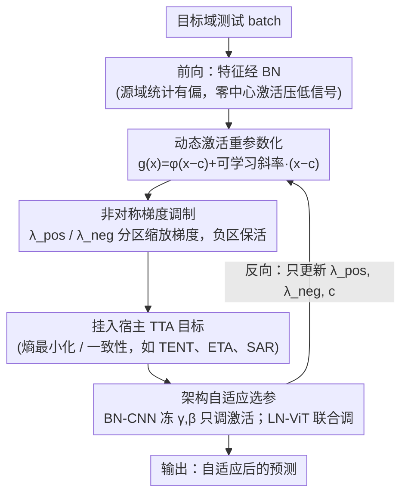

# AcTTA: Rethinking Test-Time Adaptation via Dynamic Activation

**会议**: CVPR 2026  
**arXiv**: [2603.26096](https://arxiv.org/abs/2603.26096)  
**代码**: [https://hyeongyu-kim.github.io/actta/](https://hyeongyu-kim.github.io/actta/)  
**领域**: 信号与通信 / 测试时自适应  
**关键词**: 测试时自适应, 激活函数, 分布偏移, 归一化层, 动态激活

## 一句话总结
本文提出 AcTTA，一种基于动态激活函数调制的测试时自适应框架，通过将传统固定激活函数重参数化为可学习形式（包含激活中心偏移和非对称梯度斜率），在推理时自适应调整激活行为以应对分布偏移，在 CIFAR10-C/CIFAR100-C/ImageNet-C 上一致超越基于归一化层的 TTA 方法。

## 研究背景与动机

1. **领域现状**：测试时自适应（TTA）是应对部署环境与训练分布不一致的重要范式。现有 TTA 方法主要集中在归一化层的仿射参数调整和运行统计量的重校准，如 TENT、EATA、SAR 等方法均以归一化层作为主要适应机制。

2. **现有痛点**：这种以归一化层为中心的视角忽略了一个关键组件——激活函数。激活函数作为非线性核心，根本性地塑造了特征空间的几何结构，决定了模型如何响应输入变化。然而在 TTA 中，激活函数一直被作为固定的非线性映射，从未被纳入自适应的范畴。

3. **核心矛盾**：在分布偏移下，BN 层的源域统计量不再与目标特征对齐，产生有偏的特征表示。当这些有偏特征经过以零为中心的激活函数（如 ReLU、GELU）时，有用的信号可能被抑制在激活边界以下，导致信息丢失和梯度消失。这种"零中心刚性"是限制自适应效果的关键因素。

4. **本文目标** 如何让激活函数本身成为 TTA 中的可适应组件：(1) 调整梯度行为以维持学习流；(2) 偏移激活边界以对齐新的特征中心；(3) 保持与源域预训练表示的兼容性。

5. **切入角度**：作者观察到在 TTA 之外，可学习/可调制的激活函数（如 PReLU、ACON、PAU）已证明即使细微的激活行为修改也能带来性能和训练稳定性的改善。这说明激活函数本身具有可学习的灵活性。

6. **核心 idea**：将激活函数从固定组件变为可适应的参与者——通过参数化激活中心和非对称斜率，让网络在推理时自我纠正内部偏差。

## 方法详解

### 整体框架
AcTTA 想解决的问题是：分布偏移下，BN 的源域统计量与目标特征不再对齐，有偏特征经过零中心激活函数后被压在激活边界以下，信号丢失、梯度消失。它的做法是把每个激活函数本身变成测试时可学习的模块——在原激活位置插入一个动态激活单元，推理时只更新这三个激活参数 $\lambda_{pos}$、$\lambda_{neg}$、$c$，不动网络权重、不需要源域数据。整套机制是目标无关的：它不自带损失函数，而是把这三个参数挂进任意现有 TTA 方法（熵最小化、一致性正则化等）的可学习参数集，跟着对方的目标一起优化，所以能作为即插即用模块叠在 TENT、ETA、SAR 等之上。

### 关键设计

**1. 动态激活重参数化：把固定激活变成推理时可调的参数化形式**

痛点在于激活函数一直被当成不可动的非线性映射，没法随目标域调整。AcTTA 注意到现代激活函数大多能近似为 $\phi(x) = x \cdot \sigma(\beta x)$，其导数本质上是一个输入相关的斜率函数。于是它把这个隐含的斜率显式暴露成可学习形式 $\lambda(x) = \lambda_{neg} + (\lambda_{pos} - \lambda_{neg}) \sigma(\beta x)$，由 $\lambda_{neg}$、$\lambda_{pos}$ 分别控制负、正区域的渐近斜率；同时引入可学习中心参数 $c$ 来平移激活边界。最终的激活写成

$$g(x) = \phi(x-c) + \big[\lambda_{neg} + (\lambda_{pos} - \lambda_{neg})\sigma(\beta(x-c))\big](x-c)$$

关键在于：单靠斜率适应纠不了特征中心的偏移，而 $c$ 让激活边界能跟着目标域统计量重新定心，把被压到边界以下的有用信号"接回来"。这套参数化还自带零风险起点——当 $\lambda_{neg}=\lambda_{pos}=0$、$c=0$ 时 $g(x)$ 精确退化回原始 $\phi(x)$，所以一开始就与预训练模型完全兼容，适应从无损状态出发。

**2. 非对称梯度调制：在正负区域分别缩放梯度，保住学习流**

传统零中心激活在分布偏移下会让梯度不平衡、更新有偏，特征一偏斜负半轴就容易进死区。AcTTA 借由分开学习 $\lambda_{pos}$ 和 $\lambda_{neg}$，在负区域保留非零梯度避免死梯度，在正区域灵活调响应强度，让偏斜的特征分布下网络仍有稳定的梯度可传。这个稳定性带来一个直接红利：AcTTA 能在约 10 倍于常规的学习率（$10^{-2}$ vs $10^{-3}$）下仍稳定优化，而同条件下 TENT 会直接崩溃。

**3. 架构自适应的可训练参数选择：按骨干类型挑该动哪些参数**

不同归一化机制下"该适应谁"并不一样。对基于 BN 的 CNN（如 WRN），AcTTA 冻结 BN 仿射参数 $(\gamma, \beta)$、只适应激活参数 $(\lambda_{pos}, \lambda_{neg}, c)$ 效果最好——因为 BN 依赖被扰动的运行统计量，再去改 $(\gamma,\beta)$ 反而放大分布噪声，而激活适应能绕开这层噪声直接纠偏。对基于 LN 的 ViT，则联合适应归一化与激活参数最优——LN 按样本归一化、不依赖源域统计量，它的 $(\gamma,\beta)$ 与激活参数提供互补的自由度，一起调更划算。落到实现上还有一个深度配置：只让一部分层的激活可学习，默认取 50%，不同架构最优深度不同（WRN ~50%、ResNet ~75%、ViT ~25%）。

## 实验关键数据

### 主实验

| 数据集/骨干 | 指标(Err%) | AcTTA_TENT | TENT | 提升 |
|-------------|-----------|------------|------|------|
| CIFAR10-C / WRN-28 | Error | 17.03 | 18.51 | -1.48 |
| CIFAR10-C / ResNeXt | Error | 9.53 | 10.28 | -0.75 |
| CIFAR100-C / WRN-40 | Error | 33.81 | 35.25 | -1.44 |
| ImageNet-C / ResNet50(BN) | Error | 64.95 | 66.50 | -1.55 |
| ImageNet-C / ResNet50(GN) | Error | 66.84 | 69.60 | -2.76 |
| ImageNet-C / ViT-B/16 | Error | 51.79 | 53.85 | -2.06 |

AcTTA 与其他 TTA 基线（ETA、SAR、DeYO、ROID、CMF）的组合也一致带来改进，展示了出色的模块化兼容性。

### 消融实验

| 配置 | WRN-28 Err% | ViT-B/16 Err% | 说明 |
|------|------------|--------------|------|
| TENT (仅 γ,β) | 18.51 | 53.85 | 基线 |
| AcTTA (γ,β,λ+,λ-,c) | 18.06 | 52.37 | 全参数 |
| AcTTA* (仅 λ+,λ-,c) | 17.03 | 55.30 | 冻结BN，CNN最优 |
| AcTTA* (仅 c) | 17.50 | 61.56 | 仅中心偏移 |
| 无适应 | 43.52 | 62.10 | 原始模型 |

### 关键发现
- **BN-CNN 上激活参数 > 归一化参数**：冻结 BN 仿射参数仅适应激活参数（AcTTA*）在 WRN-28 上达到最低错误率 17.03%，说明 BN 和激活适应存在重叠角色
- **中心偏移 $c$ 贡献显著**：仅适应 $c$ 就能在 CNN 上带来明显提升（18.51→17.50），说明源域运行统计量引起的残余偏差可通过调整激活边界来补偿
- **大学习率下的稳定性**：AcTTA 在10倍学习率下仍表现稳定（CIFAR100-C 上 34.56% @ LR=1e-2），而 TENT 在同等条件下完全崩溃（51.57%）
- **与其他可学习激活函数对比**：PReLU 和 PAU 在 TTA 场景下效果不佳（PAU 在 ViT 上错误率达 99.96%），说明 TTA 需要的不仅是参数化斜率，而是联合的中心偏移和非对称斜率调制
- **最优适应深度与架构相关**：WRN 最优在 ~50%，ViT 在 ~25%，ResNet 在 ~75%

## 亮点与洞察
- **激活函数作为 TTA 的新维度**：这是首次系统性地将激活函数纳入 TTA 框架，拓展了以归一化为中心的传统视角。这个思路可以迁移到其他需要在线适应的场景（如持续学习、域泛化）
- **初始化兼容性设计**：$\lambda=0, c=0$ 时完全恢复原始激活函数的设计非常巧妙——保证了零风险无损的开始。这种"加法式"模块设计是一个可复用的 trick
- **大学习率的稳定性**：通过保持负区域非零梯度，AcTTA 本质上解决了分布偏移下的梯度消失问题，使得更激进的学习率成为可能。这个发现对实时 TTA 部署意义重大

## 局限与展望
- **最优深度需要先验知识**：不同架构的最优适应深度不同（10%~75%），论文采用50%作为折中，但这不一定最优
- **在小 batch 场景下效果受限**：batch=4 时，部分组合（如 AcTTA_SAR 在 ViT 上）反而比基线差，说明激活适应对批统计也有一定依赖
- **仅在corruption benchmark上验证**：未涉及更复杂的领域偏移场景（如自然域偏移、跨模态偏移）
- **计算开销未详细分析**：增加的可学习参数数量、额外前向/反向计算时间未量化比较

## 相关工作与启发
- **vs TENT**: TENT 仅适应 BN 层 $(\gamma, \beta)$。AcTTA 表明在 CNN 上冻结 BN 参数而仅适应激活函数效果更好，说明不同组件的适应作用存在重叠
- **vs ACON**: ACON 引入了可学习门控但仍假设零中心边界，无法处理偏移的特征分布。AcTTA 的中心偏移设计直接解决了这个问题
- **vs PAU**: PAU 作为通用可学习激活在训练时有效，但在 TTA 场景下崩溃（ViT上99.96%错误率），说明 TTA 需要的是针对性的偏移-斜率调制而非通用函数逼近

## 评分
- 新颖性: ⭐⭐⭐⭐ 激活函数视角在TTA中是全新的，但重参数化形式相对简单
- 实验充分度: ⭐⭐⭐⭐⭐ 覆盖多数据集、多架构、多TTA基线，消融实验非常全面
- 写作质量: ⭐⭐⭐⭐⭐ 逻辑清晰，从动机到方法到实验层层递进
- 价值: ⭐⭐⭐⭐ 开辟了TTA的新研究方向，但实际收益幅度有限（1-3%错误率降低）

<!-- RELATED:START -->

## 相关论文

- [\[ICLR 2026\] Enhancing Instruction Following of LLMs via Activation Steering with Dynamic Rejection](../../ICLR2026/signal_comm/enhancing_instruction_following_of_llms_via_activation_steering_with_dynamic_rej.md)
- [\[ECCV 2024\] PYRA: Parallel Yielding Re-Activation for Training-Inference Efficient Task Adaptation](../../ECCV2024/signal_comm/pyra_parallel_yielding_re-activation_for_training-inference_efficient_task_adapt.md)
- [\[CVPR 2025\] Continuous Space-Time Video Resampling with Invertible Motion Steganography](../../CVPR2025/signal_comm/continuous_space-time_video_resampling_with_invertible_motion_steganography.md)
- [\[NeurIPS 2025\] Angular Steering: Behavior Control via Rotation in Activation Space](../../NeurIPS2025/signal_comm/angular_steering_behavior_control_via_rotation_in_activation_space.md)
- [\[CVPR 2026\] MERLIN: Building Low-SNR Robust Multimodal LLMs for Electromagnetic Signals](merlin_building_low-snr_robust_multimodal_llms_for_electromagnetic_signals.md)

<!-- RELATED:END -->
