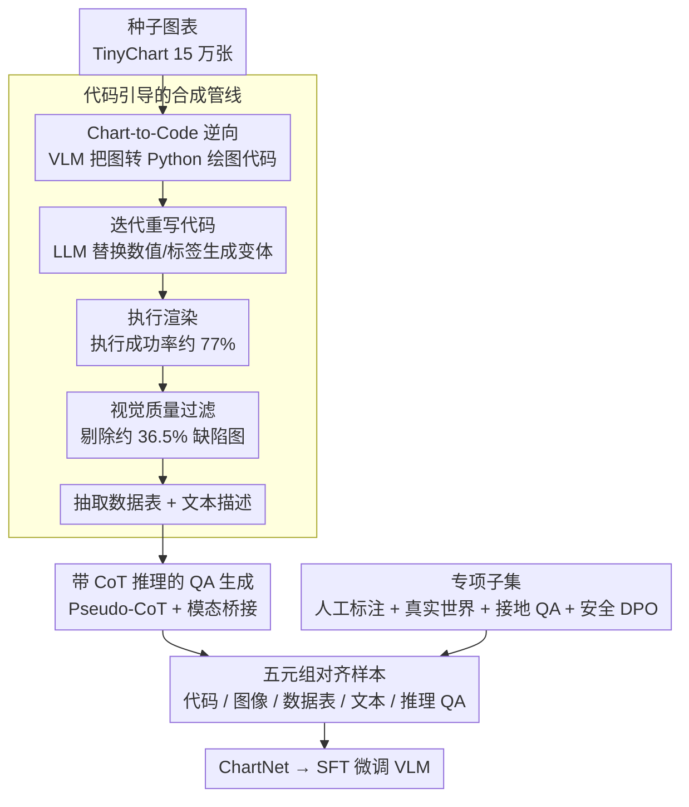

# ChartNet: A Million-Scale, High-Quality Multimodal Dataset for Robust Chart Understanding

**会议**: CVPR 2026  
**arXiv**: [2603.27064](https://arxiv.org/abs/2603.27064)  
**代码**: [HuggingFace](https://huggingface.co/datasets/ibm-granite/ChartNet)  
**领域**: 信号通信  
**关键词**: 图表理解、多模态数据集、代码引导合成、视觉语言模型、数据可视化  

## 一句话总结

提出 ChartNet，一个包含 150 万条高质量多模态对齐样本的百万级图表理解数据集，通过代码引导的合成管线生成涵盖 24 种图表类型、6 种绘图库的五元组数据（代码、图像、数据表、文本描述、带推理的 QA），在 ChartNet 上微调的 2B 模型可超越 GPT-4o 和 72B 开源模型。

## 研究背景与动机

图表理解要求模型同时推理几何视觉模式、结构化数值数据和自然语言，这是当前视觉语言模型(VLM)的薄弱环节：

1. **数据瓶颈严重**：现有数据集在规模、范围或多模态覆盖度上存在明显不足。许多只关注单一任务（如 QA 或生成描述），缺乏绘图代码、接地标注或推理轨迹等关键模态
2. **图表类型单一**：ChartQA 等广泛使用的 benchmark 仅涵盖 3 种图表类型（柱状图、折线图、饼图），且偏向基础数据提取问题
3. **规模不足**：大多数数据集在数万到数十万级别，不足以训练前沿大模型
4. **多模态对齐缺失**：少有数据集能同时提供图表图像、可执行代码、底层数据表、文本描述和推理链的完整对齐

ChartNet 的核心洞察：**图表是程序化生成的**——可执行的绘图代码可作为数据可视化的结构化中间表示，让数据生成和增强在代码空间而非图像空间进行。

## 方法详解

### 整体框架

ChartNet 的关键洞察是：图表本就是程序化生成的，所以与其在图像空间硬造数据，不如让可执行的绘图代码当结构化中间表示，把生成和增强都搬到代码空间里做。整条数据生产线绕着这个思路转：先让 VLM 把种子图表"逆向"成可执行绘图代码，再用 LLM 反复重写代码生成多样变体，执行渲染出图像，过一道视觉质量过滤把废品筛掉，最后结合图像和代码两路上下文抽出数据表、文本描述和带推理的 QA，凑成五元组对齐样本；另用几个多来源专项子集补齐合成数据够不到的角落。

### 关键设计

**1. 代码引导的合成管线：把数据增强从图像空间挪到代码空间**

直接在图像上做增强很难保证数值和标签的准确对齐，而代码天然携带结构化的数据语义。ChartNet 从 TinyChart 选 15 万张种子图，用 pixtral-large-instruct-2411 做 Chart-to-Code Reconstruction 把图像转成 Python 绘图代码，再用 gpt-oss-120b 迭代重写代码——数据值和标签在保持上下文相关的前提下被替换，于是一张种子图能裂变出任意数量的变体。

代码执行成功率约 77%，渲染后经视觉质量过滤再剔掉约 36.5% 有缺陷的图像；人工评估显示过滤把"影响可读性的问题"占比从 14.9% 压到 5.9%，说明在代码空间生成、用视觉端把关这套组合确实换来了规模与质量的兼得。

**2. 带 CoT 推理的 QA 生成：用模态桥接补上推理轨迹这一模态**

多数图表数据集只有答案、没有推理过程，模型学不到"怎么想"。ChartNet 基于 Vision-R1 框架，用 pixtral-large-instruct-2411 为每张图先生成复杂的多阶段推理问题，再构造四步 "Pseudo-CoT" 序列（Summary → Caption → Reasoning → Conclusion）。这里的巧思是模态桥接：先把图像内容转写成文字摘要和 caption，语言模型即便不直接看图也能据此推理，最后由 gpt-oss-120b 产出带 `<think>` 和 `<answer>` 标签的详细推理轨迹。

**3. 专项子集覆盖全谱：用多来源子集补齐合成数据够不到的角落**

纯合成数据容易在真实性、权威性和安全性上留空白，ChartNet 用几个专项子集把这些角落补上：

- **人工标注子集**（96,643 条）：经严格人工验证和标注的高质量对齐数据
- **真实世界图表**（30K 条）：来自世界银行、Pew Research 等权威来源，涵盖经济、科技、环境等主题
- **接地 QA 对**：从绘图代码提取几何感知标注，生成模板化的接地 QA
- **安全对齐数据**（7,600 条）：针对敏感主题生成对抗性问题与安全/不安全响应对，专供 DPO

这样五元组（代码、图像、数据表、文本、推理 QA）之外还叠上了真实分布和安全监督，让在它上面微调的模型既见过权威真实图表、又具备基础的安全对齐能力。

### 损失函数 / 训练策略

使用标准监督微调(SFT)训练 VLM：
- 训练数据涵盖四个任务：Chart-to-Code、Chart-to-Table、Chart-to-Text、Chart QA with CoT Reasoning
- 各模型使用 TRL 框架的默认超参数
- 评估在独立的 2,000 条 held-out 评估集上进行
- 自动评估使用 GPT-4o 作为评判器（QA 任务除外，使用 RapidFuzz 模糊匹配）

## 实验关键数据

### 主实验 - ChartNet 评估集

| 模型 | Chart Recon (Exec/Code-D/Code-S/Img) | Data Extract | Summary | QA w/CoT |
|------|---------------------------------------|-------------|---------|----------|
| granite-vision-2B | 63.4/60.7/67.0/77.2 | 53.8 | 64.0 | 59.9 |
| **+ ChartNet** | **90.4/72.8/90.0/92.8** | **70.3** | **83.9** | **65.0** |
| llava-7B | 45.3/27.0/52.9/59.6 | 17.0 | 51.2 | 55.1 |
| **+ ChartNet** | **83.9/69.4/88.6/91.5** | **58.8** | **80.3** | **70.3** |
| GPT-4o | 95.9/48.8/77.2/88.2 | 46.7 | 77.1 | 61.1 |

微调后的 **2B 模型超越 GPT-4o**（数据提取 70.3 vs 46.7，摘要 83.9 vs 77.1）。

与更大模型对比（off-the-shelf）：

| 模型 | Data Extract | Summary | QA w/CoT |
|------|-------------|---------|----------|
| Qwen2-VL-72B | 50.3 | 75.9 | 60.3 |
| Mistral-24B | 53.2 | 79.8 | 60.0 |
| **granite-2B + ChartNet** | **70.3** | **83.9** | **65.0** |

### 消融实验 / 公开 Benchmark

ChartCap 摘要（granite-vision-2B）：
- 基线：BLEU_4=1.6, METEOR=6.4, ROUGE_L=9.6
- +ChartNet：BLEU_4=12.4, METEOR=30.1, ROUGE_L=24.9

ChartMimic-v2 代码生成（granite-vision-2B）：
- 基线：v2-direct=30.84
- +ChartNet：v2-direct=58.42（+27.58）

超紧凑模型也获得显著能力：SmolVLM-256M 和 Granite-Docling-258M 从零能力变为可用。

### 关键发现

1. **数据质量 > 模型规模**：在图表理解这类视觉/数值/语言紧密耦合的领域，提供高质量代码对齐的多模态监督far比单纯扩大模型规模更有效
2. **跨规模一致提升**：从 256M 到 7B 的所有模型在所有任务上都获得显著提升，且提升幅度与模型大小无关
3. **代码作为中间表示的价值**：Chart-to-Code 的代码对齐训练为模型提供了程序化理解图表的结构性监督
4. **数据提取任务提升最大**：GPT-4o 仅 46.7%，但 ChartNet 微调的 2B 模型达 70.3%，体现了紧密的代码-数据-图像对齐的价值
5. **合成数据能力泛化到真实世界**：在 ChartCap 和 ChartMimic-v2 等真实 benchmark 上同样有效

## 亮点与洞察

- **在代码空间而非图像空间进行数据增强**是一个优雅的设计——代码天然提供了结构化的数据表示，使得多模态对齐更精确
- 五元组对齐（代码、图像、数据表、文本、推理QA）比任何已有数据集都更完整
- 2B 模型超越 GPT-4o 和 72B 模型的结果强有力地证明了领域特定高质量数据的价值
- 安全对齐子集的设计为图表领域的 AI 安全提供了基础设施

## 局限与展望

- 合成数据为主，虽有真实世界子集但占比较小，可能存在领域偏移
- 种子图表来源单一（TinyChart），可能限制初始多样性
- 代码执行成功率 77% 意味着约 23% 的生成被浪费
- 视觉过滤后仍有 5.9% 的图表有质量问题
- 评估依赖 GPT-4o 作为 judge，可能存在系统性偏差
- 缺少对图表中数学推理、统计分析等深度理解能力的评估

## 相关工作与启发

- **UniChart/TinyChart**：先驱性的多任务图表数据集，但规模和模态覆盖不如 ChartNet
- **ChartQA**：广泛使用但仅 3 种图表类型、14K 样本，已接近性能饱和
- **CoSyn**：同样使用代码引导合成，但限于 3 种绘图库和更少的图表类型
- **启发**：代码引导的数据合成范式可推广到其他"程序化生成"的视觉理解任务（如 3D 场景理解、UI 理解等）

## 评分

- **新颖性**: 7/10 — 代码引导合成管线的思路不算全新，但系统化和规模化执行做得出色
- **实验充分度**: 9/10 — 多模型、多规模、多任务、多 benchmark 的全面评估
- **写作质量**: 8/10 — 结构清晰，对比表格详尽，贡献明确
- **价值**: 9/10 — 作为最大的开源图表理解数据集，对社区价值极高，"2B > GPT-4o" 的结果令人印象深刻

<!-- RELATED:START -->

## 相关论文

- [\[CVPR 2026\] MERLIN: Building Low-SNR Robust Multimodal LLMs for Electromagnetic Signals](merlin_building_low-snr_robust_multimodal_llms_for_electromagnetic_signals.md)
- [\[AAAI 2026\] Balancing Multimodal Domain Generalization via Gradient Modulation and Projection](../../AAAI2026/signal_comm/balancing_multimodal_domain_generalization_via_gradient_modulation_and_projectio.md)
- [\[CVPR 2026\] CLAY: Conditional Visual Similarity Modulation in Vision-Language Embedding Space](clay_conditional_visual_similarity.md)
- [\[ECCV 2024\] Defect Spectrum: A Granular Look of Large-Scale Defect Datasets with Rich Semantics](../../ECCV2024/signal_comm/defect_spectrum_a_granular_look_of_large-scale_defect_datasets_with_rich_semanti.md)
- [\[ICCV 2025\] Boosting Multimodal Learning via Disentangled Gradient Learning](../../ICCV2025/signal_comm/boosting_multimodal_learning_via_disentangled_gradient_learning.md)

<!-- RELATED:END -->
