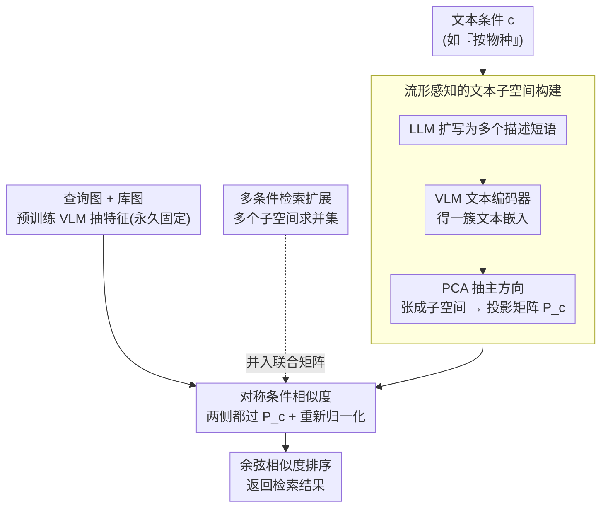

# CLAY: Conditional Visual Similarity Modulation in Vision-Language Embedding Space

**会议**: CVPR 2026  
**arXiv**: [2604.11539](https://arxiv.org/abs/2604.11539)  
**代码**: 无  
**领域**: 信号通信  
**关键词**: 条件图像检索, 视觉语言模型, 相似度调制, 免训练, 超球面几何

## 一句话总结
CLAY 提出免训练的条件视觉相似度计算方法，通过在 VLM 嵌入空间中构建文本条件子空间来调制相似度，无需重新计算数据库特征即可适应不同检索条件，并支持多条件检索。

## 研究背景与动机

**领域现状**：图像检索系统通常依赖固定的单一相似度度量，但人类感知相似性是自适应的——看同一张图可能关注物种、颜色、动作等不同方面。

**现有痛点**：(1) 训练型方法需要对每种条件训练特定模型，且条件变化时需重算所有数据库特征；(2) 现有方法仅支持单条件检索，无法同时指定多个关注维度；(3) 训练数据需要每种条件的配对图像。

**核心矛盾**：条件变化时重新计算数据库嵌入计算开销大，而不同条件需要不同的相似度计算方式。

**核心 idea**：将条件化过程从视觉特征提取中分离——固定视觉嵌入不变，在相似度计算空间中根据文本条件动态调制。

## 方法详解

### 整体框架
CLAY 要解决的是「同一个数据库、不同检索条件」的复用问题：传统做法把条件烤进特征里，换条件就得重算整库特征，代价高且只能管一个维度。CLAY 反过来——视觉特征始终用预训练 VLM 抽一次、永久固定，条件只作用在「比较的那一步」。给定一句文本条件（如"按物种"），它生成一个投影矩阵 $P_c$，把查询图和库图的视觉特征都投到这个条件子空间里再算余弦相似度。换条件只是换一张 $P_c$，库特征一动不动。

### 关键设计

**1. 流形感知的文本子空间构建：让一句条件张成一个有意义的方向集合**

单独一个文本嵌入只是空间里的一个点，无法定义"语义方向"这种概念，更别说投影。CLAY 先用 LLM 把条件文本扩写成多个描述性短语（"物种"扩成"这是一只鸟"、"这是哺乳动物"等），过 VLM 文本编码器拿到一簇嵌入，再用 PCA 抽主方向，张成一个正交子空间并得到投影矩阵 $P_c$。这样条件相关的语义被一组方向共同刻画，而不是孤立一点。关键的一步是照顾 VLM 嵌入空间的超球面几何——所有特征本就归一化在单位球面上，投影会把向量拉离球面，所以投影后必须重新归一化，否则相似度的几何意义就错了（消融里"无归一化"明显掉点正源于此）。

**2. 对称条件相似度：查询和库特征用同一张矩阵过滤**

最自然的实现是只变换查询、库特征不动（非对称），但这样库特征里仍残留大量条件无关信息（按物种检索时，颜色、背景、姿态都还在），会干扰排序。CLAY 让两侧都过同一个 $P_c$：

$$\text{csim}(I_q, I_d \mid c) = \cos\big(P_c \cdot f(I_q),\; P_c \cdot f(I_d)\big)$$

双向投影意味着查询和库图都被剥到只剩条件相关的成分再比较，干扰被对称地滤掉。而 $P_c$ 可以离线预计算并缓存，检索时换条件只是切一张矩阵、零额外特征计算——这正是"改度量不改特征"带来的效率红利。

**3. 多条件检索扩展：子空间求并集**

现实里用户常想同时按"物种"和"颜色"检索，但已有方法都是单条件。CLAY 直接把多个条件各自的子空间取并集，拼成一个联合投影矩阵，让它同时保留两类语义方向。因为整套机制只在子空间层面操作，多条件不需要任何重新训练或重算特征，加一个维度就是多并入一组主方向而已。

### 损失函数 / 训练策略
完全免训练，仅利用预训练 VLM 的特征空间——所有"学习"都被 LLM 扩写 + PCA 取主方向替代。

## 实验关键数据

### 主实验

| 数据集 | 指标 | CLAY | GeneCIS (训练型) | FocalLens |
|--------|------|------|-----------------|-----------|
| GeneCIS 基准 | Recall@1 | 竞争性/优 | 基线 | 基线 |
| CLAY-EVAL | MR@K | SOTA | 不支持多条件 | 不支持 |

### 消融实验

| 配置 | 检索精度 | 说明 |
|------|---------|------|
| 对称投影 | 最优 | 完整方法 |
| 非对称投影 | 下降 | 数据库侧噪声 |
| 单文本嵌入 | 大幅下降 | 子空间表达力不足 |
| 无归一化 | 下降 | 忽略超球面几何 |

### 关键发现
- 免训练方法在标准基准上达到或超过训练型方法，且计算效率更高
- 对称 vs 非对称投影的差异证明了双向过滤条件无关信息的重要性
- 超球面几何的考虑（归一化）对性能影响显著

## 亮点与洞察
- **"改变度量而非特征"**：颠覆了传统思路——不改变特征提取，而是改变比较方式，使数据库特征可完全复用
- **免训练即 SOTA**：不需要任何训练数据就达到训练型方法的性能，实用性极强

## 局限与展望
- 依赖 LLM 生成的文本描述质量
- 子空间维度的选择需要调优
- 在极细粒度条件下可能不够精确

## 相关工作与启发
- **vs GeneCIS**: 需要训练+配对数据，条件变化需重算特征
- **vs FocalLens**: 也是条件检索但需训练，不支持多条件

## 评分
- 新颖性: ⭐⭐⭐⭐⭐ 将条件化从特征提取移到相似度空间，思路新颖
- 实验充分度: ⭐⭐⭐⭐ 构建了新评估数据集
- 写作质量: ⭐⭐⭐⭐ 数学表述精炼
- 价值: ⭐⭐⭐⭐⭐ 免训练+高效+多条件支持，非常实用

<!-- RELATED:START -->

## 相关论文

- [\[ICLR 2026\] Mamba-3: Improved Sequence Modeling using State Space Principles](../../ICLR2026/signal_comm/mamba-3_improved_sequence_modeling_using_state_space_principles.md)
- [\[ICML 2025\] Fourier Position Embedding: Enhancing Attention's Periodic Extension for Length Generalization](../../ICML2025/signal_comm/fourier_position_embedding_enhancing_attentions_periodic_extension_for_length_ge.md)
- [\[ECCV 2024\] RAW-Adapter: Adapting Pre-trained Visual Model to Camera RAW Images](../../ECCV2024/signal_comm/raw-adapter_adapting_pre-trained_visual_model_to_camera_raw_images.md)
- [\[ICML 2025\] Large Language Model (LLM)-enabled In-context Learning for Wireless Network Optimization](../../ICML2025/signal_comm/large_language_model_llm-enabled_in-context_learning_for_wireless_network_optimi.md)
- [\[AAAI 2026\] Balancing Multimodal Domain Generalization via Gradient Modulation and Projection](../../AAAI2026/signal_comm/balancing_multimodal_domain_generalization_via_gradient_modulation_and_projectio.md)

<!-- RELATED:END -->
