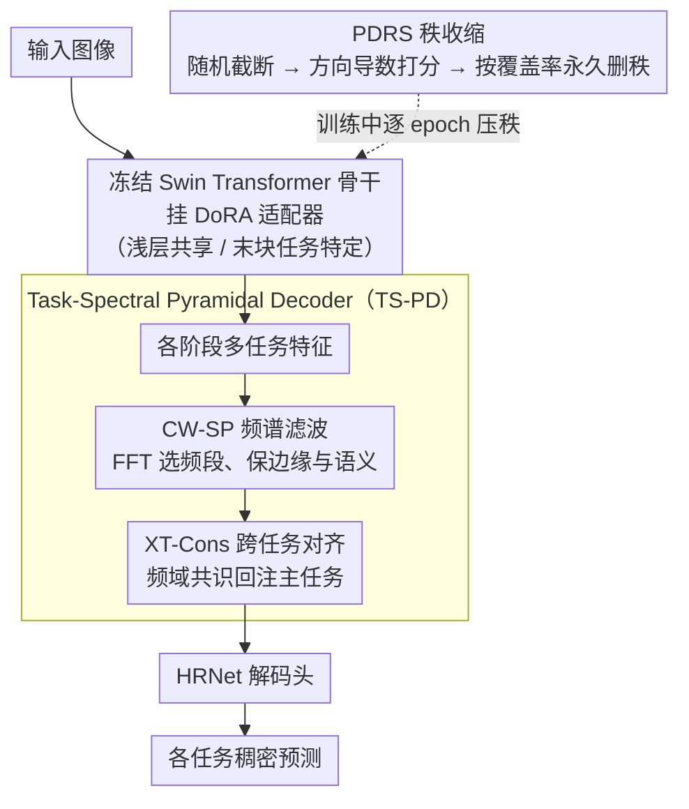

# FAAR: Efficient Frequency-Aware Multi-Task Fine-Tuning via Automatic Rank Selection

**会议**: CVPR 2026  
**arXiv**: [2603.20403](https://arxiv.org/abs/2603.20403)  
**代码**: 有（论文中提到）  
**领域**: 参数高效微调 / 多任务学习  
**关键词**: LoRA, 自动秩选择, FFT, multi-task learning, PEFT

## 一句话总结

提出 FAAR，一种频率感知的多任务参数高效微调方法，通过 Performance-Driven Rank Shrinking (PDRS) 为每个任务和层动态选择最优秩，并设计 Task-Spectral Pyramidal Decoder (TS-PD) 利用 FFT 频率信息增强空间感知和跨任务一致性，以传统微调 1/9 的参数量实现更优性能。

## 研究背景与动机

多任务学习（MTL）旨在同时学习多个任务，共享表示以发现任务间的关系和结构。随着骨干模型参数量不断增长，传统全量微调变得越来越不可行。参数高效微调（PEFT），特别是基于低秩适应（LoRA）的方法成为主流。

然而，现有 LoRA-based MTL 方法存在两个核心局限：

**固定秩问题**：现有方法对所有层和所有任务使用统一的秩，这不符合直觉——不同任务可能需要不同的适应强度，不同层也需要不同程度的微调灵活性。深层需要更强的适应能力来处理任务特定的精细信息，而浅层可能只需少量调整。

**缺乏空间归纳偏置**：现有 LoRA-based MTL 策略忽视了跨任务交互在深层的作用。对于语义分割、深度估计、法线估计等密集视觉任务，强空间感知和跨任务几何一致性至关重要，但低秩适应本身缺乏这种能力。

FAAR 的解决思路：
- 通过动态秩收缩（PDRS）解决固定秩问题，让每个任务/每层自动找到最优秩
- 通过频率分析（TS-PD）引入廉价但有效的空间信息和跨任务关系

## 方法详解

### 整体框架

FAAR 要解决的是密集视觉多任务微调里两件互相纠缠的事：一是怎么不靠人工调参就给每层每个任务挑到合适的秩，二是怎么给低秩适配补上它天生缺失的空间感知和跨任务一致性。整体流程是这样转的：输入图像先过一个**冻结**的 Swin Transformer 骨干，骨干的注意力层和 MLP 层上挂着 DoRA 适配器——每个阶段最后一个块用任务特定适配器、前面的块共享一套适配器；骨干吐出的多任务特征再送进 Task-Spectral Pyramidal Decoder (TS-PD) 做频率增强和跨任务对齐，最后由 HRNet 解码头出各任务的稠密预测。贯穿整个训练的是 PDRS，它一边训练一边把适配器的秩从 64 逐步压到个位数。

### 关键设计

**1. Performance-Driven Rank Shrinking（PDRS）：让损失自己决定每层每任务该留多少秩**

固定秩的毛病在于它假设所有层、所有任务的适应强度一样，可现实是深层和任务特定层需要更强的微调能力、浅层和共享层只要轻微调整。PDRS 不预设这个分配，而是在训练中"边用边删"。它分两步走：前向时做**秩掩码**——每次随机采一个前缀长度 $b \in \{1, ..., r_{curr}\}$，构造二进制掩码只放行前 $b$ 个秩分量，即 $A^{eff} = \text{diag}(m) A$、$B^{eff} = B \text{diag}(m)$；这种随机截断会逼着重要的秩-1 更新往低维方向集中，而不是均匀摊在所有秩上。反向时做**覆盖筛选**——给每个活跃秩 $i$ 算一个重要性分数，用的是 MTL 损失对该秩分量的方向导数（梯度和参数的内积），这直接反映"这个秩-1 更新对降损失贡献多大"：

$$s_i = \frac{1}{2}\left(\left|\left\langle A_{:,i}^{eff}, \frac{\partial \mathcal{L}}{\partial A_{:,i}^{eff}} \right\rangle\right| + \left|\left\langle B_{i,:}^{eff}, \frac{\partial \mathcal{L}}{\partial B_{i,:}^{eff}} \right\rangle\right|\right)$$

分数用 EMA 跨批次平滑 $\hat{s}_i \leftarrow \beta \hat{s}_{i-1} + (1-\beta) s_i$；每个 epoch 末把秩按分数降序排，取满足覆盖率 $\rho$ 的最少秩数 $K = \min\{k : c(k) \geq \rho\}$，没被覆盖的秩**永久删除**、不再参与后续优化。这就是它和 AdaLoRA（按奇异值大小裁）的根本区别——PDRS 的裁剪准则直接挂在优化目标上，所以收缩出来的秩分布天然符合"深层/任务层留得多、浅层/共享层删得狠"的直觉。

**2. DoRA 适配器：把低秩适应拆成幅度和方向，专为极低秩服务**

PDRS 会把秩压到极低（全局约 5），而普通 LoRA 在这种极低秩下表现并不稳。FAAR 改用 DoRA，它把权重更新解耦成一个标量幅度 $m_i$ 和一个归一化方向：

$$\text{Out}_i^{DoRA} = m_i \frac{W_i + \alpha B_i A_i}{\|W_i + \alpha B_i A_i\|_2} x + b_i$$

幅度和方向分开学，意味着即便方向子空间被压得很窄，幅度仍能独立调节，更新的稳定性就保住了。值得注意的是这个好处只在低秩区间兑现——消融里高秩时 DoRA 反而不如 LoRA（+1.36 vs +2.55），但经 PDRS 收缩到低秩后 DoRA 的优势才显出来（+4.92）。换句话说，DoRA 和 PDRS 是一对：单独上 DoRA 没用，配上秩收缩才有协同。

**3. Task-Spectral Pyramidal Decoder（TS-PD）：用 FFT 给低秩适配补上空间感知和跨任务一致性**

低秩适配本身缺空间归纳偏置，而语义分割、深度、法线这类稠密任务恰恰吃强空间感知和跨任务几何一致性。TS-PD 的思路是把这两件事都搬到频域去做，因为频域天然能把边缘（高频）和语义（低频）分开，且操作比空间域便宜。它由两个模块组成。**Channel-wise Spectral Filter（CW-SP）** 对每个任务特征做 FFT，学一组任务/分辨率特定的 2D 频率滤波矩阵 $W_t^{res}$，通过逐元素乘 $Y = W \odot FFT(I)$ 选择性放大或压制不同频段，再逆 FFT 回特征空间、配可学习的 scale/shift 调制——这样边缘检测能保住它依赖的高频、深度估计能同时取用高低频。**Cross-Task Consensus Alignment（XT-Cons）** 则负责跨任务对齐：对某个主任务，先算出所有辅助任务频谱的平均表示 $F_{avg}$ 作为"共识"，再从主任务频谱提高/低频掩码 $M_{low}, M_{high}$，算出主任务与共识的频域差异并用可学习标量 $\alpha$ 缩放：

$$\Delta_{low,high} = M_{low,high} * (F_{avg} - FFT(X_i^{main}))$$

把这个差异回注主任务，相当于让辅助任务的"共识"在频域里轻推主任务的几何表示，比在空间域里直接做跨任务交互省得多。

### 一个完整示例

拿 PASCAL-Context 的某一层适配器走一遍秩怎么收缩：训练起点初始秩 $r_{init}=64$，前向时每个 batch 随机放行一个前缀（比如这次 $b=23$、下次 $b=51$），逼着模型把有效更新挤进低维；反向时按方向导数给这 64 个秩打分并 EMA 累积。第一个 epoch 结束，按覆盖率 $\rho=0.95$ 一卡，发现前 30 个秩就吃下了 95% 的累积重要性，于是后 34 个秩被永久删除，秩降到 30。后续 epoch 继续这个"随机截断 → 打分 → 按覆盖率裁"的循环，秩一路收缩，到收敛时一个共享浅层可能只剩 3、4 个秩，而一个任务特定深层会保住十几个秩——全局平均落在约 5。整个过程没有人工指定每层的秩，分配是损失自己挑出来的。

### 损失函数 / 训练策略

总目标是各任务加权和 $L_{MTL} = \sum_{i=1}^T w \times L_i$：语义分割和人体部件分割用像素交叉熵，深度估计和法线估计用 L1 损失，显著性检测用平衡交叉熵。覆盖率统一设 $\rho_{shared} = \rho_{task} = 0.95$（验证集上选的），骨干为 ImageNet-1k 预训练的 Swin-Tiny、解码器为 HRNet，初始秩 64 在训练中动态收缩到全局约 5。单张 NVIDIA A40 训练，学习率 $5 \times 10^{-4}$，batch size 32。

## 实验关键数据

### 主实验

**PASCAL-Context 数据集**（4 个任务）：

| 方法 | SemSeg (mIoU↑) | HumanParts (mIoU↑) | Saliency (mIoU↑) | Normals (rmse↓) | Δm (%) | 参数量(M) |
|------|----------------|---------------------|-------------------|-----------------|--------|-----------|
| Single Task | 67.21 | 61.93 | 62.35 | 17.97 | 0 | 112.62 |
| MTL Full FT | 67.56 | 60.24 | 65.21 | 16.64 | +2.23 | 30.06 |
| MTLoRA (r=64) | 67.90 | 59.84 | 65.40 | 16.60 | +2.55 | 8.34 |
| TADFormer (r=64) | 70.82 | 60.45 | 65.88 | 16.48 | +4.24 | 7.38 |
| **FAAR** | **72.02** | **61.25** | **66.11** | **16.35** | **+5.28** | **3.38** |

**NYUDv2 数据集**（3 个任务）：

| 方法 | SemSeg (mIoU↑) | Depth (rmse↓) | Normals (rmse↓) | Δm (%) | 参数量(M) |
|------|----------------|---------------|-----------------|--------|-----------|
| Single Task | 42.65 | 0.60 | 22.83 | 0 | 84.00 |
| MTL Full FT | 38.85 | 0.66 | 24.33 | -8.49 | 28.10 |
| TADFormer (r=64) | 40.85 | 0.64 | 27.48 | -10.42 | 8.90 |
| **FAAR** | **41.27** | **0.63** | **26.35** | **-7.88** | **2.85** |

### 消融实验

PASCAL-Context 上的组件消融：

| 配置 | SemSeg | HumanParts | Saliency | Normals | Δm |
|------|--------|------------|----------|---------|-----|
| MTLoRA (r=64) | 67.90 | 59.84 | 65.40 | 16.60 | +2.55 |
| + DoRA (高秩) | 67.55 | 60.00 | 64.70 | 17.20 | +1.36 |
| + PDRS w/ LoRA | 68.11 | 59.93 | 65.54 | 16.50 | +2.83 |
| + PDRS w/ DoRA (1) | 71.35 | 61.02 | 65.92 | 16.42 | +4.92 |
| + TS-PD (2) | 70.73 | 60.95 | 65.92 | 16.40 | +4.63 |
| **FAAR (1+2)** | **72.02** | **61.25** | **66.11** | **16.35** | **+5.28** |

### 关键发现

1. **秩收缩模式符合直觉**：任务特定层和深层倾向于保留更大的秩，因为它们处理更精细的任务特定信息；共享层和浅层的秩被大幅削减
2. **DoRA 在低秩时显著优于 LoRA**：高秩时 DoRA 性能反而下降（+1.36 vs +2.55），但经 PDRS 收缩到低秩后 DoRA 发挥巨大优势（+4.92）
3. **初始秩对最终性能影响不大**：$r_{init} \in \{16, 32, 64\}$ 时结果几乎相同，说明 PDRS 的搜索空间足够
4. **XT-Cons 的跨任务对齐有效**：在 TS-PD 基础上额外带来 +0.8% Δm 提升，验证了频域跨任务一致性的价值
5. **9倍参数节省**：FAAR (3.38M) vs MTL Full FT (30.06M)，同时性能更优

## 亮点与洞察

- **秩收缩以性能为导向**：不同于 AdaLoRA（基于奇异值重要性）或 DyLoRA（训练对低秩的鲁棒性），PDRS 直接用 MTL 损失的方向导数指导秩削减，更直接地与优化目标对齐
- **频率域作为跨任务桥梁**：首次在密集视觉 MTL 中利用 FFT。频率域自然区分了边缘/语义信息，为不同任务提供了有意义的共享基础
- **DoRA + 极低秩的协同效应**：高秩时 DoRA 不一定优于 LoRA，但当秩被 PDRS 动态压缩到极低值时，DoRA 的幅度-方向解耦变得关键
- **全任务同时改善**：FAAR 在所有 4 个 PASCAL 任务上均优于基线，不存在某些任务以牺牲其他任务为代价的情况

## 局限与展望

1. 在 NYUDv2 上所有 MTL PEFT 方法均未超过单任务训练，FAAR 也未完全解决小数据集上的 MTL 困难
2. 覆盖率参数 $\rho$ 仍需手动设定（虽然论文称 0.95 在验证集上选择，但不同数据集可能需要不同值）
3. 仅验证了 Swin-Tiny 骨干，对更大骨干（如 Swin-Base/Large）或 ViT 的效果未知
4. TS-PD 的频率滤波矩阵对每个分辨率和任务单独学习，任务数量增多时参数增长
5. 跨任务对齐仅在频域进行，空间域的交互可能提供额外互补信息

## 相关工作与启发

- **MTLoRA / TADFormer**：MTL 中的 LoRA 基线方法，使用固定秩
- **AdaLoRA / AutoLoRA / DyLoRA**：单任务下的自动秩选择方法，FAAR 将其扩展到多任务
- **FADA / NightAdapter**：频率适配器在域泛化/夜晚分割中的应用，启发了 TS-PD 的设计
- **DiTASK**：通过神经微分同胚适应奇异值的替代方案

## 评分

- 新颖性: ⭐⭐⭐⭐ （PDRS和TS-PD各自有新意，但都是已有思路的改进组合）
- 实验充分度: ⭐⭐⭐⭐ （两个数据集、详细消融、参数效率对比完整）
- 写作质量: ⭐⭐⭐⭐ （结构清晰，但公式和缩写较多影响可读性）
- 价值: ⭐⭐⭐⭐ （为MTL PEFT提供了实用且高效的解决方案，9倍参数节省很有吸引力）

<!-- RELATED:START -->

## 相关论文

- [\[CVPR 2025\] DiTASK: Multi-Task Fine-Tuning with Diffeomorphic Transformations](../../CVPR2025/signal_comm/ditask_multi-task_fine-tuning_with_diffeomorphic_transformations.md)
- [\[AAAI 2026\] Task Aware Modulation Using Representation Learning for Upscaling of Terrestrial Carbon Fluxes](../../AAAI2026/signal_comm/task_aware_modulation_using_representation_learning_for_upsaling_of_terrestrial_.md)
- [\[CVPR 2026\] ChartNet: A Million-Scale, High-Quality Multimodal Dataset for Robust Chart Understanding](chartnet_a_million-scale_high-quality_multimodal_dataset_for_robust_chart_unders.md)
- [\[CVPR 2026\] Dual-Imbalance Continual Learning for Real-World Food Recognition](dual-imbalance_continual_learning_for_real-world_food_recognition.md)
- [\[CVPR 2026\] AcTTA: Rethinking Test-Time Adaptation via Dynamic Activation](actta_rethinking_test-time_adaptation_via_dynamic_activation.md)

<!-- RELATED:END -->
