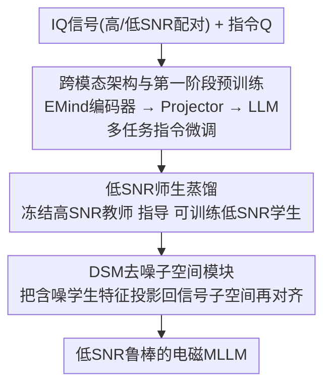

# MERLIN: Building Low-SNR Robust Multimodal LLMs for Electromagnetic Signals

**会议**: CVPR 2026  
**论文**: [CVF Open Access](https://openaccess.thecvf.com/content/CVPR2026/html/Shen_MERLIN_Building_Low-SNR_Robust_Multimodal_LLMs_for_Electromagnetic_Signals_CVPR_2026_paper.html)  
**代码**: 项目页 https://em-merlin.github.io （代码待确认）  
**领域**: 信号与通信 / 多模态VLM  
**关键词**: 电磁信号, 多模态大模型, 低信噪比鲁棒性, 知识蒸馏, 子空间去噪

## 一句话总结
MERLIN 把"原生 MLLM"范式搬到电磁（IQ）信号领域：先构建 13.4 万对信号-文本数据（EM-134K）和覆盖感知/推理的 EM-Bench 基准，再用"高 SNR 教师→低 SNR 学生"的两阶段蒸馏框架（核心是把含噪特征投影回信号子空间的 DSM 模块），让模型在信噪比低于 0 dB 的噪声环境下仍保持鲁棒，在 EM-Bench 上全面超过 GPT-5 / Claude-4 等通用大模型。

## 研究背景与动机

**领域现状**：雷达、通信、导航等场景都需要对电磁信号做精细感知与推理。深度学习已能处理单一的 EM 感知任务（如调制识别），而把 MLLM 范式引入电磁域被视为实现"多任务泛化"的有希望路径——把原始信号特征对齐到 LLM 的语义空间，就能像视觉 MLLM 那样用一个模型应对多种任务。RadioLLM、Spectrum-LLM、WirelessLLM 等先驱工作已做了铺垫。

**现有痛点**：作者指出现有 EM 多模态工作大多**偏离了端到端的原生 MLLM 范式**，转而采用流水线式或任务特定架构——要么只是把信号特征"文本化"后塞给 LLM，没有真正的多模态融合；要么是双输入但非生成式、融合很浅且与任务强绑定。结果是：和语言没有语义对齐、被困在单模态空间、跨信号源泛化差。

**核心矛盾**：把原生 MLLM 直接搬过来会撞上电磁域三个独有障碍——（1）**数据稀缺**：EM 信号天然涉密且复杂，缺乏大规模的信号-文本配对数据；（2）**无标准基准**：没有统一评测就无法公平比较不同架构与训练策略；（3）**低 SNR 脆弱性**：标准"编码器-LLM"架构在信噪比低于 0 dB（噪声功率超过信号功率）时性能急剧崩塌，因为噪声污染了底层信号特征、放大了信号与文本之间的语义鸿沟。

**本文目标**：分别解决数据、基准、模型三个子问题，为电磁域 MLLM 打地基。

**切入角度**：作者做了两个关键观察。其一，单纯调整训练数据中低/高 SNR 的配比（多喂低 SNR 数据）只带来边际收益，无法实质改善低 SNR 表现——说明问题不在数据层而在**特征层**。其二，可视化发现低 SNR 信号的 embedding 在各类别间高度重叠（特征坍缩），但只要把含噪 embedding **沿直线插值**逼近其干净版本，生成性能就会戏剧性恢复（随插值率从 0→1，准确率约 45%→65% ⚠️ 读自图 5c）。这两点共同指向"在特征空间直接对抗噪声"的解法。

**核心 idea**：用"高 SNR 教师指导低 SNR 学生"的知识蒸馏，把干净信号的结构特性迁移给含噪学生；并设计一个去噪子空间模块（DSM）在对齐前先把含噪特征投影回信号子空间，强制学生学到**噪声不变**的表示。

## 方法详解

### 整体框架
MERLIN 的目标是造一个在低 SNR 下不崩的电磁 MLLM。它采用两阶段训练：**第一阶段**用 EM-134K 做多任务指令微调，建立信号-语言的跨模态链接；**第二阶段**冻结第一阶段模型作为"高 SNR 教师"，再训练一个"低 SNR 学生"，通过三路蒸馏损失（其中特征蒸馏经过 DSM 去噪）把教师的干净表示灌给学生。基础架构由三件套组成：信号编码器（EMind）把原始 IQ 信号编码成高维隐表示 → 轻量 Projector（两层 MLP+GELU）把信号特征投影进 LLM 的 embedding 空间 → 与文本 token embedding 拼接后送入 LLM（Qwen3-4B-Instruct）自回归生成答案。

### 关键设计

**1. 跨模态架构与第一阶段多任务预训练：先把信号说成人话**

针对"信号特征与语言没有语义对齐"的痛点，第一阶段把任务统一成多任务、指令跟随的生成问题：给定信号 $S$ 和问题/指令 $Q$，模型自回归生成答案文本 $A$。训练目标是标准的下一 token 预测损失

$$\mathcal{L}_{\text{pretrain}}(\Theta) = -\sum_{i=1}^{M} \log P(a_i \mid a_{<i}, Q, S; \Theta)$$

其中 $\Theta = \{\theta_{\text{enc}}, \theta_{\text{proj}}, \theta_{\text{llm}}\}$ 是信号编码器、Projector、LLM 的可训练参数，三者联合优化。这一阶段把雷达/通信的调制识别、协议识别、参数估计、干扰识别、片段检测乃至策略生成等十多种子任务全压进同一个生成框架，让 LLM 学会"读懂"IQ 信号并用自然语言作答，从而获得跨任务泛化能力——这正是流水线式旧方法做不到的。

**2. 低 SNR 师生知识蒸馏：让含噪学生对齐干净教师**

第一阶段模型在 0 dB 以下会崩，而光加低 SNR 数据没用。第二阶段因此搭了一个知识蒸馏框架：教师和学生都用第一阶段权重初始化，**教师冻结**、只读高 SNR 信号作静态参考；**学生全参可训**、只读低 SNR 信号。训练数据是平行元组 $(I_{\text{high}}, I_{\text{low}}, Q, A)$，每步教师收 $(I_{\text{high}}, Q)$、学生收 $(I_{\text{low}}, Q)$。学生用三路复合目标优化：

$$\mathcal{L} = \mathcal{L}_{\text{task}} + \lambda_{\text{logits}} \mathcal{L}_{\text{logits}} + \lambda_{\text{feat}} \mathcal{L}_{\text{feat}}$$

其中 $\mathcal{L}_{\text{task}}$ 是在低 SNR 输入上的标准交叉熵（锚定主任务）；$\mathcal{L}_{\text{logits}}$ 是 logit 级蒸馏，最小化教师/学生 softened logits 的 KL 散度 $\mathcal{L}_{\text{logit}} = T^2 \mathrm{KL}(\mathrm{Softmax}(z^{\text{Student}}/T), \mathrm{Softmax}(z^{\text{Teacher}}/T))$（$T$ 为温度），保证语言建模层的语义一致；$\mathcal{L}_{\text{feat}}$ 是特征级蒸馏（下条详述）。这种"用同一信号的干净版当老师"的设计，把"恢复干净特征"这件事变成了一个有明确监督信号的迁移问题，而且因为带数据回放（replay）保留了第一阶段的通用多任务能力。

**3. DSM 去噪子空间模块：在对齐前先把噪声投影掉**

直接让学生含噪特征 $f_{\text{Student}}$ 去对齐教师干净特征 $f_{\text{Teacher}}$ 并不稳定，因为学生特征被噪声污染。DSM 假设信号子空间与噪声子空间近似正交，于是学一个投影矩阵 $P = U U^{T}$ 张成信号子空间，在算蒸馏损失前先把学生 embedding 投影进去：

$$\Phi(f_{\text{Student}}) = P f_{\text{Student}}, \qquad \mathcal{L}_{\text{feat}} = \lVert f_{\text{Teacher}} - \Phi(f_{\text{Student}}) \rVert_2^2$$

这一步把含噪特征里属于"噪声子空间"的分量先剔除，再与教师对齐，相当于在特征层做了一次显式去噪，稳定了优化、让学生能从退化输入里重建鲁棒特征。它直接回应了动机里那个观察——既然"沿干净方向插值"能恢复性能，那就用一个可学的子空间投影把这件事自动化。DSM 是 MERLIN 区别于普通蒸馏的核心创新点。

### 损失函数 / 训练策略
两阶段都用 AdamW + 余弦学习率，每阶段最多 8 epoch，全局 batch 256、初始学习率 5e-5，按 10% 留出集的验证损失早停，8×A100(80GB) 训练。第二阶段的低 SNR 配对由对 EM-134K 的高 SNR 信号注入高斯噪声生成，并混入原预训练集做回放以维持通用能力。所有信号统一到 20 MHz 采样率、SNR 从 -20 到 20 dB 均匀分布、定长 1024 采样点。

## 实验关键数据

> 评测指标说明：**感知任务**用单选题准确率（5 选项含"无法回答"做置信评估）；**推理任务**用 Rouge-L / BLEU 评估开放式策略生成；**SNR** 定义为信噪比，低 SNR 指 SNR < 0 dB（噪声功率超过信号功率）。

### 主实验
EM-Bench 上对比通用闭源/开源大模型（基线只把信号文本化喂入，无专用信号编码器）。感知任务为准确率(%)，推理任务为 Rouge-L/BLEU：

| 模型 | 感知 Avg.(%) | 调制识别 MOD | 雷达干扰 RJR | 推理 Anti-CJ (Rouge/BLEU) |
|------|------|------|------|------|
| GPT-5 | 23.20 | 28.00 | 14.00 | 0.01 / 0.00 |
| Claude-4-Sonnet | 32.35 | 30.00 | 25.17 | 0.11 / 0.00 |
| Gemini-2.5-Pro | 29.92 | 24.00 | 17.20 | 0.10 / 0.00 |
| EMind（判别式基线） | — ⚠️ 仅部分子任务 | 23.23 | 55.87 | — |
| **MERLIN (Ours)** | **78.27** | **44.97** | **82.77** | **0.45 / 0.15** |

通用大模型在简单任务上有点能力，但在精细参数估计和推理（生成干扰/反干扰策略）上几乎全军覆没（Rouge/BLEU 近 0），说明纯文本化喂信号走不通；MERLIN 感知平均 78.27%、推理 Rouge-L 普遍 0.3–0.45，把感知和推理同时拉到新 SOTA。

### 消融实验
在 EM-Bench 多选任务上逐步叠加蒸馏组件（准确率%），Low-SNR 列为低信噪比子集，Overall 为整体：

| 配置 | Feature KD | DSM | Logits | Low-SNR | Overall |
|------|:---:|:---:|:---:|------|------|
| Stage-1（预训练基线） | × | × | × | 59.7 | 71.8 |
| + Stage-2（仅微调） | × | × | × | 62.9 | 77.6 |
| + Feature KD | ✓ | × | × | 64.2 | 77.9 |
| + DSM | ✓ | ✓ | × | 64.4 | 78.0 |
| **MERLIN（全量）** | ✓ | ✓ | ✓ | **65.1** | **78.6** |

### 关键发现
- **专门的第二阶段是大头**：从 Stage-1 到 Stage-2，仅在目标数据上微调，低 SNR 就从 59.7→62.9、整体 71.8→77.6，验证"专门的适配阶段不可或缺"。
- **特征级蒸馏验证核心假设**：加 MLP 特征蒸馏后低 SNR 再涨到 64.2，印证"为获得噪声鲁棒性，应该教模型如何表示信号"这一中心论点。
- **DSM 与 logits 蒸馏锦上添花**：DSM 把低 SNR 推到 64.4，再加 logit 蒸馏拿到最高 65.1 / 整体 78.6，说明在特征层和输出分布层同时引导学生有协同收益。每个组件都是有意为之的设计而非堆砌。
- **数据层 vs 特征层**：单纯改训练数据 SNR 配比只有边际收益，特征层插值却能戏剧性恢复性能——这是整个方法成立的实证基石。

## 亮点与洞察
- **"特征坍缩 + 线性插值可恢复"是漂亮的诊断**：作者没有一上来堆模块，而是先用插值实验证明"低 SNR 退化是特征层问题"，再据此设计 DSM——动机和方法是闭环的，这种"先诊断后下药"的思路可迁移到任何带噪输入的多模态对齐场景。
- **DSM 把"沿干净方向插值"做成了可学投影**：用 $P=UU^T$ 的子空间投影显式剔除噪声分量，比直接 L2 对齐稳定，本质是把信号处理里的子空间去噪思想嫁接进了深度蒸馏。
- **数据+基准+模型三位一体**：EM-134K（13.4 万对、底层语料 3580 万 IQ 样本）和 EM-Bench（4200 条专家校验 QA、3 层 14 子任务）本身就是能复用的基础设施，对电磁域 MLLM 研究的门槛降低很有价值。

## 局限与展望
- 评测主体仍是仿真/合成数据为主（EM-134K 大半来自 simulation），真实采集占比有限，真实电磁环境（多径、非高斯噪声）下的迁移能力待验证。
- 低 SNR 配对靠**高斯噪声注入**构造，与真实信道噪声分布可能有差距，DSM 的"信号/噪声子空间正交"假设在真实非高斯干扰下是否成立存疑。
- 蒸馏需要平行的高/低 SNR 配对作监督，对没有干净参考的纯真实数据不直接适用；可探索自蒸馏或无配对的鲁棒化路径。
- 推理任务用 Rouge/BLEU 评策略生成，这类指标对"策略是否真正有效"的衡量较弱，⚠️ 绝对分值（如 Rouge-L 0.45）的语义质量需结合人评看待。

## 相关工作与启发
- **vs RadioLLM / Spectrum-LLM / WirelessLLM**：它们用 Q-Former 或新编码策略把 IQ/时序信号映射进 LLM 语义空间，但多为流水线/任务特定、融合浅；MERLIN 走端到端原生 MLLM 路线并专门解决低 SNR 崩塌，泛化与鲁棒性更强。
- **vs 纯数据增强（多喂低 SNR 数据）**：数据层调配比只有边际收益；MERLIN 从特征层用蒸馏+DSM 入手，是本文实验直接对照得出的更优路径。
- **vs 图像/EEG 域的噪声鲁棒方法**：本文借鉴了物理引导增强、对比学习特征恢复等思想，但把"特征层对抗噪声"具体化为跨模态师生蒸馏 + 子空间投影，适配了信号-语言的对齐场景。

## 评分
- 新颖性: ⭐⭐⭐⭐ 把原生 MLLM 范式 + 子空间去噪蒸馏引入电磁域，DSM 设计有新意，但师生蒸馏框架本身较成熟。
- 实验充分度: ⭐⭐⭐⭐ 主结果对比多个顶级大模型、消融逐组件清晰；但真实数据与非高斯噪声评测偏少。
- 写作质量: ⭐⭐⭐⭐ 动机-方法闭环讲得清楚，图表完整；个别公式/拼写有 OCR 瑕疵。
- 价值: ⭐⭐⭐⭐⭐ 同时给出数据集、基准、框架三件套，为电磁域 MLLM 打下可复用地基。

<!-- RELATED:START -->

## 相关论文

- [\[CVPR 2026\] ChartNet: A Million-Scale, High-Quality Multimodal Dataset for Robust Chart Understanding](chartnet_a_million-scale_high-quality_multimodal_dataset_for_robust_chart_unders.md)
- [\[CVPR 2025\] Breaking the Low-Rank Dilemma of Linear Attention](../../CVPR2025/signal_comm/breaking_the_low-rank_dilemma_of_linear_attention.md)
- [\[ICLR 2026\] Enhancing Instruction Following of LLMs via Activation Steering with Dynamic Rejection](../../ICLR2026/signal_comm/enhancing_instruction_following_of_llms_via_activation_steering_with_dynamic_rej.md)
- [\[AAAI 2026\] Balancing Multimodal Domain Generalization via Gradient Modulation and Projection](../../AAAI2026/signal_comm/balancing_multimodal_domain_generalization_via_gradient_modulation_and_projectio.md)
- [\[ICML 2025\] Deep Electromagnetic Structure Design Under Limited Evaluation Budgets](../../ICML2025/signal_comm/deep_electromagnetic_structure_design_under_limited_evaluation_budgets.md)

<!-- RELATED:END -->
