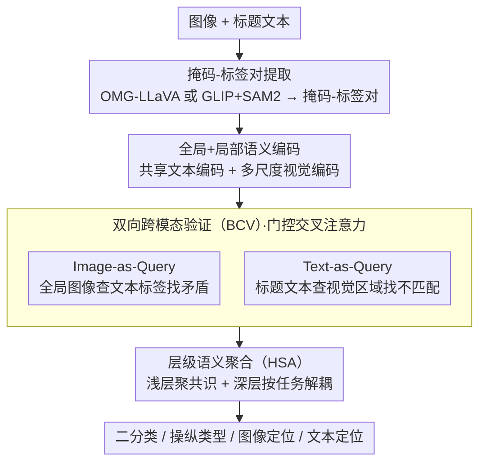

# Bridging Pixels and Words: Mask-Aware Local Semantic Fusion for Multimodal Media Verification

**会议**: CVPR 2026  
**arXiv**: [2603.26052](https://arxiv.org/abs/2603.26052)  
**代码**: 无  
**领域**: 社会计算  
**关键词**: 多模态虚假信息, 双向跨模态验证, 掩码-标签对, 层级语义聚合, 深度伪造检测

## 一句话总结
提出 MaLSF 框架，利用掩码-标签对作为语义锚点，通过双向跨模态验证（BCV）和层级语义聚合（HSA）模块实现主动式局部语义冲突检测，在 DGM4 和假新闻检测任务上取得 SOTA。

## 研究背景与动机
**领域现状**: 高级生成模型（DALL·E、Stable Diffusion 等）使多模态深度伪造日益逼真；DGM4 任务要求同时检测和定位图文操纵。

**现有痛点**: 现有方法（HAMMER、UFAFormer、EMSF 等）依赖"被动式"整体融合——将整张图像和全文编码为高维向量然后融合，导致**特征稀释**：一个致命的单词替换（如"recovered"→"failed"）在全局文本特征中几乎不可察觉，细微冲突信号被全局语义对齐淹没。

**核心矛盾**: 最隐蔽的虚假信息恰恰存在于细微的**局部语义不一致**中（如运动员拿香槟庆祝的图片配"未能参加冲刺"的文字），全局融合无法捕捉这种冲突。

**本文要解决**: 如何像人类一样进行主动的双向交叉验证——读到"failed"时主动在图像中搜索失败证据，看到"香槟"时主动在文本中搜索胜利语义？

**切入角度**: 用掩码-标签对将像素区域与文本描述建立精确对应，实现细粒度局部推理。

**核心idea**: 将多模态验证从"被动融合"转变为"主动审讯"——BCV 模块充当审讯者，HSA 模块充当推理引擎，层级化聚合多粒度冲突信号。

## 方法详解

### 整体框架
MaLSF 想把多模态验证从"被动整体融合"扭转成"主动局部审讯"。给定一张图和一段文字，它先用 Parser 抽出一组掩码-标签对 $\{(\mathbf{M}_i, \mathbf{L}_i)\}$ 作为连接像素与语词的验证单元，编码成文本特征和多尺度视觉特征；接着 BCV 模块从图、文两个方向交叉盘问，找局部矛盾；HSA 模块再把多粒度的冲突信号层级化地聚合起来，最后分支化地同时输出二分类、操纵类型、图像定位和文本定位。

### 关键设计

**1. 掩码-标签对提取：给"像素"和"语词"建立可对账的基本单元**

全局融合之所以会"特征稀释"，根子在于没有一个细粒度的对账单位——一个致命的换词淹没在整段文本向量里。MaLSF 先把图像区域和文本描述绑成掩码-标签对，作为后续局部验证的最小单元。它给两种互补的 Parser：Open Vocabulary Parser 用 OMG-LLaVA 端到端生成描述和掩码-标签对，标签由模型自主决定；Caption-Anchored Parser 走两阶段，先用 GLIP 从图像加原始标题提取物体边界框，再用 SAM2 生成精细掩码。

两种 Parser 产出本质不同的标签集（开放词表 vs 受限于原文），互为对照——前者覆盖面广、后者贴合原始语境，框架对二者都鲁棒说明它依赖的是"有可对账的局部单元"这件事本身，而非某种特定的标签来源。

**2. 双向跨模态验证（BCV）：像审讯者一样从两个方向交叉取证**

人识破假新闻靠的是主动质询——读到"failed"会回图里找失败证据，看到"香槟"会回文里找胜利语义；单向匹配会漏掉只在某一个方向才暴露的冲突。BCV 据此设两路验证。Image-as-Query 用全局图像特征去查询文本标签，揪图像与文本标签的矛盾：

$$\{\mathbf{F}_{\text{img}}^{\text{cap}}, \mathbf{F}_{\text{img}}^1, ..., \mathbf{F}_{\text{img}}^N\} = \mathcal{T}_V(\mathbf{V}_{\text{img}}, [\mathbf{l}_{\text{cap}}, \{w_j^l \mathbf{l}_j\}])$$

Text-as-Query 反过来用标题文本去查询视觉区域，揪文字与掩码区域的不匹配：

$$\{\mathbf{F}_{\text{cap}}^{\text{img}}, \mathbf{F}_{\text{cap}}^1, ..., \mathbf{F}_{\text{cap}}^N\} = \mathcal{T}_L(\mathbf{l}_{\text{cap}}, [\mathbf{V}_{\text{img}}, \{w_i^v \mathbf{V}_i\}])$$

两路都带一个门控 $w_i^v = \sigma(\phi_l(\mathbf{l}_{\text{cap}}^{cls})^\top \phi_v(\mathbf{v}_i^{cls}))$，自动挑出信息量大的局部语义、压低噪声区域。这样一来全局不一致、局部不一致、跨模态不一致三个层级的冲突都能被覆盖，比任何单向验证都更难漏判。

**3. 层级语义聚合（HSA）：从共识到任务特定，逐层把冲突信号收口**

验证产出的是一堆多粒度信号，若直接拍平喂给各个任务头，全局共识和细粒度上下文会互相干扰。HSA 因此分两层收口。浅层融合把 [CLS] token 和序列 token 分开聚合——$a_{\text{img}}, a_{\text{cap}}$ 聚合 [CLS] 捕获全局共识，$s_{\text{img}}, s_{\text{cap}}$ 聚合序列保留细粒度上下文。

深层融合再按任务解耦：二分类聚合两模态的 cls 特征；操纵类型用可学习 token $p_v, p_l$ 分别查询图像/文本序列；图像定位用可学习 token $p_{\text{bbox}}$ 查询视觉序列、过线性层输出 bbox；文本定位直接用文本序列做逐位置二分类。先聚共识、再按任务拆查询，让每个头学到自己需要的表示，同时不破坏底层的语义连贯。

### 损失函数 / 训练策略
$$\mathcal{L} = \mathcal{L}_{bcls} + \alpha \mathcal{L}_{mcls} + \beta \mathcal{L}_{ig} + \gamma \mathcal{L}_{tg}$$
- $\mathcal{L}_{ig}$: L1 loss + GIoU loss（图像定位）
- 其余均为交叉熵损失

## 实验关键数据

### 主实验（DGM4 数据集）

| 方法 | AUC | ACC | mAP | IoU_mean | Text F1 | ΔAvg |
|------|-----|-----|-----|----------|---------|------|
| HAMMER | 93.19 | 86.39 | 86.22 | 76.45 | 71.35 | 0 |
| UFAFormer | 93.81 | 86.80 | 87.85 | 78.33 | 72.02 | +1.13 |
| EMSF | 95.11 | 88.75 | 91.42 | 80.83 | 73.44 | +3.33 |
| **MaLSF★** | **95.56** | **89.33** | 90.76 | **82.47** | **76.88** | **+4.87** |
| **MaLSF◇** | **95.60** | **89.37** | 90.46 | 82.37 | **77.19** | **+4.94** |

### 消融实验（假新闻检测，Weibo21）

| 方法 | Accuracy | Fake F1 | Real F1 |
|------|----------|---------|---------|
| CAFE | 88.2 | 88.5 | 87.6 |
| FND-CLIP | 94.3 | 94.0 | 94.6 |
| DAMMFND | 94.7 | 94.8 | 94.7 |
| **MaLSF★** | **95.5** | **95.5** | **95.4** |

### 关键发现
- MaLSF 在 DGM4 所有指标上均取得 SOTA，特别是图像定位（IoU_mean +1.64）和文本定位（F1 +3.44）提升最大
- 两种 Parser 效果相当，Open Vocabulary Parser 略好，说明框架对不同掩码-标签提取方式鲁棒
- 在假新闻检测（纯二分类任务）上也取得 SOTA，证明框架通用性
- BCV 的双向设计比单向验证显著更好

## 亮点与洞察
- "特征稀释"问题的诊断非常精准——全局融合确实会淹没关键的局部冲突信号
- 掩码-标签对作为"语义锚点"是连接像素和语词的优雅桥梁
- BCV 的"审讯者"比喻直观且与实际效果吻合
- 两种 Parser 的设计展示了开放性和受限性标签的互补价值

## 局限与展望
- 掩码-标签对的质量依赖于外部模型（OMG-LLaVA、GLIP、SAM2），错误会传播
- 固定数量的掩码-标签对可能不适应所有场景（简单场景过多，复杂场景不足）
- 计算开销随掩码-标签对数量线性增长
- 可结合 LLM 进行更高层次的语义推理（如因果关系判断）

## 相关工作与启发
- HAMMER/HAMMER++ 开创了 DGM4 任务，但全局推理为主
- EMSF 的双分支交叉注意力是进步，但仍是被动融合
- 启示：多模态验证应模拟人类认知的"主动质询"过程，而非被动匹配

## 评分
- 新颖性: ⭐⭐⭐⭐ BCV + HSA 的双向验证-层级聚合设计新颖，掩码-标签对桥梁思路好
- 实验充分度: ⭐⭐⭐⭐⭐ DGM4 + 假新闻检测双任务验证，两种 Parser，全面消融
- 写作质量: ⭐⭐⭐⭐ 认知科学类比生动，但公式密度较高
- 价值: ⭐⭐⭐⭐ 对多模态虚假信息检测有实际推进，框架思路有通用性

<!-- RELATED:START -->

## 相关论文

- [\[ICML 2026\] IDO: Incongruity-Aware Distribution Optimization for Multimodal Fake News Detection](../../ICML2026/social_computing/ido_incongruity-aware_distribution_optimization_for_multimodal_fake_news_detecti.md)
- [\[CVPR 2026\] Probabilistic Concept Graph Reasoning for Multimodal Misinformation Detection](probabilistic_concept_graph_reasoning_for_multimodal_misinformation_detection.md)
- [\[ACL 2026\] Content Fuzzing for Escaping Information Cocoons on Social Media](../../ACL2026/social_computing/content_fuzzing_for_escaping_information_cocoons_on_digital_social_media.md)
- [\[ACL 2026\] ClaimDB: A Fact Verification Benchmark over Large Structured Data](../../ACL2026/social_computing/claimdb_a_fact_verification_benchmark_over_large_structured_data.md)
- [\[ACL 2026\] Synthia: Scalable Grounded Persona Generation from Social Media Data](../../ACL2026/social_computing/synthia_scalable_grounded_persona_generation_from_social_media_data.md)

<!-- RELATED:END -->
