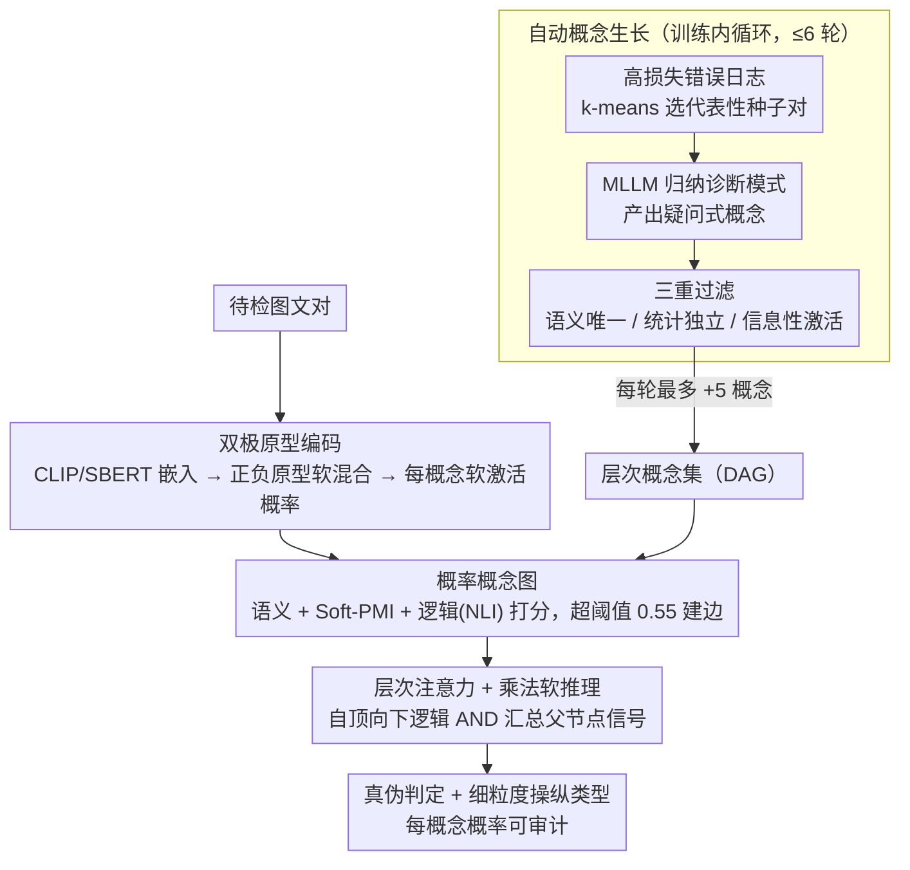

# Probabilistic Concept Graph Reasoning for Multimodal Misinformation Detection

**会议**: CVPR 2026  
**arXiv**: [2603.25203](https://arxiv.org/abs/2603.25203)  
**代码**: [https://github.com/2302Jerry/pcgr](https://github.com/2302Jerry/pcgr)  
**领域**: 机器人  
**关键词**: 多模态虚假信息检测, 概念图推理, 概率推理, 可解释AI, 概念自动生长

## 一句话总结

本文将多模态虚假信息检测（MMD）重构为基于概念图的结构化概率推理问题，提出PCGR框架，通过MLLM自动发现并验证人类可理解的概念节点，构建层次化概率概念图，实现可解释的虚假信息检测，在三个基准上全面超越13个baseline。

## 研究背景与动机

1. **领域现状**：多模态虚假信息（图文结合的假新闻/谣言）日益泛滥，现有检测方法主要分两类：(1)端到端黑盒模型（融合图文特征直接分类），性能好但不可解释；(2)机制驱动模型（基于操纵类型或检索证据），透明度更高但依赖固定概念集，难以适应新型操纵手法。
2. **现有痛点**：黑盒模型无法解释决策过程，令人难以信任；现有可解释方法要么依赖固定的人工定义概念集（泛化差），要么仅产生事后解释（与推理过程脱节）。
3. **核心矛盾**：人类事实核查员通过结构化推理来判断信息真伪（分解→逐一验证→综合判断），但现有模型缺乏这种可审计的推理过程。
4. **本文目标** (a) 概念集如何自动扩展以适应新型操纵手法；(b) 如何将概率推理嵌入模型架构而非后处理；(c) 如何同时支持粗粒度（真/假）和细粒度（操纵类型）检测。
5. **切入角度**：受人类事实核查过程的启发——将MMD建模为"概念级评估→层次推理→综合裁定"的过程，每个概念都用软概率而非硬判断。
6. **核心 idea**：构建一个可自动生长的层次化概率概念图，将推理直接嵌入模型架构，使每个中间概念状态都可审计。

## 方法详解

### 整体框架

PCGR 把多模态虚假信息检测重新表述成一个在"概念图"上做的结构化概率推理：不直接拿融合特征分类，而是先长出一批人类能读懂的判断维度（每个维度是一句疑问式概念，如"文本是否夸大了事件？"），把每个图文对在这些概念上打出激活概率，再沿概念间的依赖关系自顶向下聚合，得出真伪判定。整条流水线遵循"先构建后推理"（build-then-infer）：先用 MLLM 自动发现并验证概念、把它们组织成层次化有向无环图（DAG）；再把待检实例编码进概念空间、为每个概念算出软激活概率；最后在图上做层次软推理、把不确定性逐层汇总成最终结论。关键在于推理过程不是事后解释，而是模型架构本身——每个中间概念的概率都可被检查和干预。

### 关键设计

**1. 自动概念生长：让判断维度跟着操纵手法一起进化**

固定概念集应付不了不断翻新的造假套路，所以 PCGR 把"发现新概念"做成训练内循环。它维护一份高损失样本的"错误日志"，每轮用 k-means 聚类从中选出代表性种子对，喂给一个扮演"专家事实核查员"的 MLLM（如 GPT-5 / Qwen3-omni）：模型先分析这些样本为什么具有误导性，归纳出可复用的诊断模式，再产出简洁的疑问式概念。新生概念不是照单全收，要过三道闸——语义唯一性（与现有概念余弦相似度 $\le 0.8$，避免重复）、统计独立性（Pearson 相关系数 $\le 0.9$，避免冗余）、信息性激活（预期激活概率落在 $[0.05, 0.95]$，避免恒真/恒假的废维度）。每轮最多新增 5 个概念，最多生长 6 轮，于是概念集既能扩张又不会失控膨胀。

**2. 双极原型编码：把"没证据"和"反证据"区分开**

每个概念的激活概率不能简单当作二分类输出，因为"找不到支持证据"和"找到反对证据"是两回事。PCGR 为每个概念 $c_k$ 同时维护正、负两个原型 $h_i^+, h_i^-$，分别代表它被激活/未激活的状态，实际表示是两者按激活度的软混合 $h_i = \tau_i h_i^+ + (1-\tau_i) h_i^-$。编码时用两路独立 CLIP 抽图文嵌入 $v, t$、Sentence-BERT 抽概念描述嵌入 $d_i$，再通过一个低秩双线性交互算出每个概念的 logit：$\ell_k = h_k \oplus \mu_k U^\top \text{diag}(\phi(e_k)) V^\top \nu_k$，$p_k = \text{Linear}(w_k \ell_k + b_k)$。双极结构让"证据缺失"对应到中间概率而非直接判否，使后续聚合不会被信息不足误导成强信号。

**3. 概率概念图与乘法软推理：用"逻辑 AND"的方式汇总线索**

概念之间不是平铺的，PCGR 把图文对放在底层 $\mathcal{L}_0$，更高层自底向上生长成 DAG。一条边是否存在由三种依赖信号共同决定——语义依赖（嵌入余弦相似度）、统计依赖（soft PMI，$\log \frac{\bar{p}_{ij}}{\bar{p}_i \bar{p}_j}$，衡量两个概念是否常一起激活）、逻辑依赖（NLI 模型给出的蕴含/矛盾分数）：

$$s_{ij} = -\alpha\cos(h_i,h_j) + \beta\,\text{Soft-PMI} + \gamma r_{ij}^{ent} - \delta r_{ij}^{contr}$$

只有 $s_{ij}$ 超过阈值 $\zeta=0.55$ 才建边。推理方向自顶向下，高层抽象假设为低层细节提供先验。最终每个概念的后验概率用乘法聚合父节点信号：$\hat{p}_i = \lambda p_i \cdot (1-\lambda) \prod_{j \in Pa(i)} (\alpha_{ij} p_j)$，其中父节点权重 $\alpha_{ij}$ 由自顶向下的层次注意力给出。之所以用乘法而非加法或投票，是因为虚假信息的判定本质是多个一致性线索"同时成立"才可信——这正是逻辑 AND 的语义，任何一个父节点给出强否定都会把整条链的得分拉低，因而比加权求和更鲁棒、概率也更好校准。

### 一个完整示例

以一条配图假新闻为例走一遍流水线：输入是一张被篡改的现场照片配上一段夸张文案。编码阶段，概念"文本是否夸大事件？"因文案用词激烈而激活（$p\approx 0.8$），概念"图像是否经过生成/编辑？"因画面伪影被触发（$p\approx 0.7$），而"图文是否语义一致？"由于配图与文案错位被判为低一致（即一致概率低、不一致信号强）。在概念图里，这三者作为高层假设"该内容可信"的父节点；乘法聚合时，只要其中任意一个给出强否定（如一致性概率很低），$\prod_{j\in Pa(i)}(\alpha_{ij}p_j)$ 就被显著拉低，最终"可信"后验塌缩到接近 0，模型判为虚假。整个过程里，用户能逐节点读出"是文案夸大 + 图像伪造 + 图文错位三条线索叠加导致判假"，而不是只拿到一个黑盒分数——这正是把推理嵌进架构带来的可审计性。

### 损失函数 / 训练策略

总损失把检测目标和概念结构约束加权相加：$L = (1-\eta) L_{veracity} + \eta L_{ortho}$。其中 $L_{veracity}$ 是二元交叉熵检测损失，$L_{ortho} = \sum_{i \neq j} \frac{q_i^\top q_j}{\|q_i\|^2 \|q_j\|^2}$ 是概念正交性正则项，逼着不同概念学到互不冗余的判断维度（与概念生长阶段的统计独立性过滤呼应）。训练采用交替优化，让概念生成模块和检测模块轮流更新，避免两者互相干扰。当数据带细粒度标签时（文本操纵 / 视觉操纵 / 跨模态不一致），这些标签被用作 $\mathcal{L}_0$ 的锚定概念并额外监督，使粗粒度真伪判定和细粒度操纵类型识别共用同一张概念图。

## 实验关键数据

### 主实验（粗粒度检测）

| 方法 | MiRAGeNews Acc | MiRAGeNews F1 | MMFakeBench Acc | MMFakeBench F1 | AMG Acc | AMG F1 |
|------|---------------|---------------|-----------------|---------------|---------|--------|
| GPT-5 | 56.8 | 54.0 | 58.8 | 57.2 | 59.9 | 57.9 |
| MGCA (最强baseline) | 72.3 | 66.6 | 74.1 | 71.3 | 78.2 | 76.8 |
| **PCGR** | **80.2** | **70.9** | **80.6** | **73.5** | **84.3** | **79.8** |

### 消融实验（AMG数据集）

| 配置 | 说明 | 性能下降 |
|------|------|---------|
| w/o acg | 去掉自动概念生长 | Mic-F1和Mac-F1下降约12.9%和12.5%（最大降幅） |
| w/o dag | 用扁平结构替代层次DAG | 显著下降 |
| w/o hat | 用标准注意力替代层次注意力 | 显著下降 |
| w/o ma | 用投票替代乘法聚合 | 明显下降 |
| w/o alt | 去掉交替训练 | 明显下降 |
| w/o warm | 去掉预热阶段 | 适度下降 |
| w/o cf | 去掉概念过滤 | 适度下降 |

### 关键发现

- **超越GPT-5**：PCGR在所有数据集上大幅超越GPT-5（如MiRAGeNews上80.2% vs 56.8%），表明专用检测器虽然参数少但通过显式推理架构可超越通用MLLM。
- **OOD鲁棒性**：在MiRAGeNews（测试集含未知图像生成器和发布者）上PCGR仍稳定，而大多数baseline性能大幅退化。
- **概念自动生长贡献最大**：去掉ACG导致最大性能下降（~12.9%），证实了持续发现新概念对于适应新型操纵手法的关键作用。
- **细粒度检测**：在MMFakeBench 4类和AMG 6类细粒度检测中，PCGR的Mic-F1均最优（68.6%和75.6%），表明概念图可同时支持粗/细粒度任务。

## 亮点与洞察

- **推理即架构**：PCGR将推理过程直接嵌入模型架构，而非依赖外部prompting或后处理解释。这使推理过程可审计、可干预——用户可以检查每个概念节点的概率来理解为什么模型做出某个判断。
- **概念自动生长的优雅设计**：用MLLM生成→三重过滤→验证的流程实现概念集的持续进化，避免了人工标注概念的高成本，同时通过过滤保证质量。
- **乘法聚合的合理性**：用乘法形式近似"逻辑AND"来聚合概念概率，语义上非常合理——虚假信息判定需要多个独立线索同时成立，任何一个强否定信号都应该"拉低"最终得分。

## 局限与展望

- 概念生长依赖MLLM（如GPT-5）的能力，如果MLLM本身对某种新型操纵手法不敏感，可能无法生成有效概念
- 概念数量增长可能导致推理开销增加，需要定期修剪不活跃的概念
- 仅在图文对上验证，视频虚假信息的时序推理未涉及
- 论文将其归类在robotics领域似乎不太准确，更应归入多模态/可信AI领域

## 相关工作与启发

- **vs Concept Bottleneck Models (CBMs)**：CBMs使用固定的扁平概念空间，限制了对复杂推理任务的扩展性。PCGR通过层次化DAG和自动生长解决了这两个限制。
- **vs Graph-of-Thought (GoT)**：GoT在LLM中通过prompting实现图结构推理，但依赖外部提示。PCGR将概率概念图直接嵌入模型参数中，无需外部prompting。
- **vs HAMMER/MGCA**：HAMMER和MGCA是当前最强的MMD专用模型，但仍依赖端到端特征融合。PCGR通过显式概念层提供了额外的推理结构。

## 评分

- 新颖性: ⭐⭐⭐⭐⭐ 将MMD重构为概率概念图推理是非常原创的框架设计，概念自动生长机制也很新颖
- 实验充分度: ⭐⭐⭐⭐ 三个数据集、13个baseline对比、详细消融和案例分析，但缺乏推理效率分析
- 写作质量: ⭐⭐⭐⭐ 框架描述清晰，图示质量高，但方法部分公式密度较高
- 价值: ⭐⭐⭐⭐ 在可信AI/虚假信息检测领域有实际价值，可解释性是强卖点

<!-- RELATED:START -->

## 相关论文

- [\[AAAI 2026\] Reasoning About the Unsaid: Misinformation Detection with Omission-Aware Graph Inference](../../AAAI2026/social_computing/reasoning_about_the_unsaid_misinformation_detection_with_omission-aware_graph_in.md)
- [\[AAAI 2026\] T2Agent: A Tool-augmented Multimodal Misinformation Detection Agent with Monte Carlo Tree Search](../../AAAI2026/social_computing/t2agent_a_tool-augmented_multimodal_misinformation_detection_agent_with_monte_ca.md)
- [\[CVPR 2026\] Bridging Pixels and Words: Mask-Aware Local Semantic Fusion for Multimodal Media Verification](bridging_pixels_and_words_mask-aware_local_semantic_fusion_for_multimodal_media_.md)
- [\[ACL 2026\] Probing Multimodal Large Language Models on Cognitive Biases in Chinese Short-Video Misinformation](../../ACL2026/social_computing/probing_multimodal_large_language_models_on_cognitive_biases_in_chinese_short-vi.md)
- [\[ICML 2026\] IDO: Incongruity-Aware Distribution Optimization for Multimodal Fake News Detection](../../ICML2026/social_computing/ido_incongruity-aware_distribution_optimization_for_multimodal_fake_news_detecti.md)

<!-- RELATED:END -->
