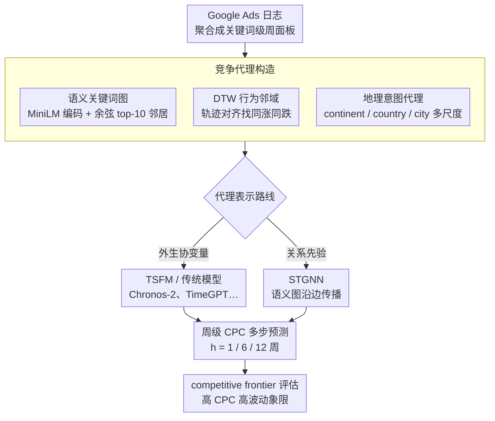

# Competition-Aware CPC Forecasting with Near-Market Coverage

**会议**: CVPR 2026  
**arXiv**: [2603.13059](https://arxiv.org/abs/2603.13059)  
**代码**: 无  
**领域**: 时间序列  
**关键词**: CPC预测, 搜索广告拍卖, 竞争代理, 时空图网络, 时间序列基础模型

## 一句话总结
这篇论文把搜索广告中的 CPC 预测重新表述为“竞争状态部分不可观测”下的时间序列预测问题，用语义相似性、CPC 轨迹对齐和地理意图三个可观测代理去近似隐含竞争，再分别以协变量和图先验两种形式注入预测器，在中长期预测上显著优于纯自回归基线。

## 研究背景与动机
搜索广告里的 CPC 不是一个稳定的业务指标，而是拍卖过程的结果变量。对广告主而言，它直接决定同样预算能买到多少点击，因此预测误差会很快转化成投放计划偏差、预算浪费和利润压缩。

现有 CPC 预测方法面临一个很核心的困难：广告主只能看到自己这一侧的曝光、点击、花费和最终 CPC，却看不到竞争对手的出价、质量分、预算消耗节奏，也看不到平台内部完整的拍卖状态。也就是说，真正决定价格形成的“竞争环境”是隐变量。

作者认为，很多已有方法之所以在中长期 horizon 上开始失效，不是因为模型容量不够，而是因为输入里缺少了能反映竞争变化的结构化信号。纯自回归方法擅长延续短期惯性，但当竞争者切换预算、局部市场需求上升、关键词替代关系变化时，仅靠单变量历史很难稳住预测。

论文的逻辑链条很清楚：

**领域现状**：搜索广告研究对 GSP 拍卖、排序机制和 CTR 建模已经很多，但对“单个广告主视角下如何预测未来 CPC”研究不足。

**现有痛点**：观测到的是结果，不是竞争原因；而 CPC 恰恰对竞争态势极其敏感。

**核心矛盾**：真实竞争状态不可直接观测，但它会在可观测变量中留下痕迹。

**本文要解决的问题**：能否用一组高质量代理信号，把隐式竞争结构显式化，再交给预测模型吸收。

**切入角度**：从三个互补视角近似竞争，分别是关键词语义替代性、历史 CPC 轨迹行为相似性，以及地理意图所对应的局部市场结构。

**核心 idea**：与其发明一个全新的预测架构，不如先把“竞争”构造成能被不同模型使用的先验和协变量，让模型在部分可观测环境下获得更稳定的中长期预测能力。

我觉得这篇论文的动机写得比较扎实。它没有把贡献包装成万能大模型或全新 GNN，而是承认真正的新意在于“代理变量构造”和“代理变量表示方式”。这比很多只换 backbone 的工作更有业务解释力。

## 方法详解

### 整体框架
这篇论文要解决的是搜索广告里一个很别扭的预测问题：广告主想预测未来的 CPC，但决定 CPC 的竞争状态（对手出价、预算节奏、平台拍卖态势）根本看不到。作者的回答不是发明新架构，而是先把隐式竞争“翻译”成可观测的代理信号，再决定用什么形式把它喂给预测器，整套东西因此是一个 competition-aware forecasting 框架，而不是单一模型。

整体怎么转可以顺着数据流看一遍。原始输入是 Google Ads 2021–2023 年的日志，先聚合成关键词级周面板，每个关键词每周一行，带点击、展示、花费、设备结构、搜索类型结构等运营变量。在此之上，作者从关键词文本和历史轨迹里派生出三类竞争代理（语义、行为、地理），然后把这些代理分两条路线接入模型：一条是协变量路线，把代理整理成无泄漏的外生特征喂给时间序列基础模型（TSFM）或传统模型；另一条是关系先验路线，把关键词之间的竞争关系编码成一张固定语义图，交给时空图网络（STGNN）。预测目标是对 1811 个关键词的周级 CPC 做多步预测，horizon 取 $h \in \{1, 6, 12\}$ 周，分别对应短期出价调整、中期战术规划、长期预算分配。作者刻意不去重建真实拍卖机制，而是押注一个更弱但更可操作的假设：只要代理足够稳定、足够贴近竞争结构，就足以改善预测。

### 关键设计
方法的真正分量不在某个公式，而在三类代理怎么构造、又以什么方式接入模型，下面五个设计点把这两件事拆开讲。

**1. 语义邻域与语义关键词图：用文本语义补出“抢同一批流量”的对手**

在广告拍卖里，真正的竞争关系常常不是字符串表面相同，而是搜索意图可替代——两个写法不同的“机场租车”关键词可能在抢同一批高意图流量，光看词面抓不到这层关系。作者用 all-MiniLM-L6-v2 给每个关键词编码出 384 维向量 $e_i \in \mathbb{R}^{384}$，再用余弦相似度找语义邻居，每个关键词连向最相近的 $k=10$ 个邻居，构成一张固定语义图，并对邻接矩阵做行归一化。这一步关键在于：很多 STGNN 依赖现成的物理拓扑（道路网、电网），而 CPC 预测根本没有天然的图，于是作者主动把“语义替代性”物化成图结构，让跨关键词的信息有路可走。

**2. 基于 DTW 的行为邻域：从轨迹里抓“同涨同跌”的隐性联动**

语义图只覆盖词面可替代的对手，但有些关键词词面毫不相似，却会一起被季节、预算调整或市场冲击推动，这类联动只看文本是抓不到的。作者改从历史 CPC 轨迹下手，用 Dynamic Time Warping 衡量两条序列的相似性，并加 Sakoe-Chiba band 约束避免病态对齐，从而把“走势相似但时间点可能错位”的关键词聚到一起。重要的是这个行为邻域只用历史轨迹做统计汇总，不引入任何未来信息，是 leakage-free 的。它和语义代理形成互补：语义代理刻画的是静态替代关系，DTW 行为代理刻画的是动态共振关系，两者各抓一种竞争痕迹。

**3. 地理意图代理：把本地化的需求与竞争密度结构化**

租车这类业务的搜索需求高度本地化，机场、城市、国家对应的需求强度和竞争密度完全不同，地理结构本身就决定了局部市场是否拥挤。作者结合关键词文本、地理词典和层级映射，为每个关键词打上 continent / country / city 多尺度地理标签，把“用户意图的地理归属”转成结构化变量。一个反直觉但很有用的经验是：地理粒度并非越细越好，continent 这种粗粒度反而更稳，因为细粒度会把训练样本切得过碎，统计信号被稀疏性吃掉。

**4. 两种代理表示路线：把“信息”和“模型”解耦来比**

同一组 competition proxy，作者不固定绑死在某个 backbone 上，而是让它走两条不同的接入路线：协变量路线把邻域历史汇总、地理变量和核心运营变量一起喂进 TSFM 或传统模型；图路线则把关键词间的语义连边变成 STGNN 的固定图，让信息沿图传播。这样设计是因为作者真正想回答的问题不是“哪个 backbone 最强”，而是“同一份竞争信息，到底当外生条件用更好，还是当关系先验用更好”——只有把表示方式和模型家族拆开，这个比较才干净。最终结果也确实分化：协变量路线和图路线在不同 horizon 上各占上风，说明二者各有适用区间。

**5. competitive frontier 评估视角：把误差和真实业务风险对齐**

平均 sMAPE 掩盖了一件事——业务上真正怕预测失手的，是那些又贵又波动大的关键词，因为它们的误差直接烧预算。作者用均值 CPC 表示“价值”、用变异系数表示“波动性”，把关键词分成四个象限，单独拎出右上角高 CPC、高 volatility 的 frontier 区域来分析。这一步让论文不只是报一个平均数，而是把预测提升和业务风险直接挂钩，使“代理有没有用”这个问题落到最该稳的那批词上。

### 损失函数 / 训练策略
训练和评测设置统一服务于两个目标：避免时序泄漏、适配重尾分布。数据按时间严格切分，最后 20% 作 out-of-sample test；horizon 取 1 / 6 / 12 周，分别对应短期出价、中期战术、长期预算三种规划周期；主指标是 sMAPE，辅指标是 RMSE。STGNN 采用全局训练，在整个关键词面板上联合学习；图模型用 MAE 而非平方误差做优化目标，因为 CPC 分布重尾明显（后文 p99 达 12.13、偏度 3.34），平方误差容易被极端值支配。作者刻意不在 loss 工程上做文章，而把主要精力压在输入结构上——对这个问题而言，先把竞争信息表达对，比换一个更花哨的训练技巧更值钱。

## 实验关键数据
数据部分很关键，因为它解释了为什么这篇工作需要 competition-aware 的建模方式。

- 原始日志规模约 16.6 亿条，来自 2021 到 2023 年的 Google Ads 车租行业数据。
- 每条记录包含关键词、匹配查询、落地页 URL、设备类型、搜索类型，以及 impressions、clicks、cost 等数值指标。
- 经过领域过滤、域名质量过滤和关键词标准化后，保留 1811 条关键词时间序列。
- 每条关键词要求在 127 周窗口中至少出现 110 周，避免极短生命周期词带来的假信号。
- 周级聚合后得到 218,924 个 keyword-week 样本。
- 周级 CPC 定义为 $\mathrm{CPC}_{k,t} = \frac{\mathrm{cost}_{k,t}}{\mathrm{clicks}_{k,t}}$，只在 clicks 大于 0 时计算。
- CPC 均值为 2.86，最大值达到 80.16，p99 为 12.13，偏度 3.34，说明价格分布明显重尾。
- competitive frontier 的高风险象限包含 402 个关键词，是作者重点分析的业务关键区域。

### 主实验
先看跨 horizon 的家族级总结，可以非常直观地看到不同模型在不同规划周期上的分工。

| 预测 horizon | 最强传统/ML 基线 sMAPE | 最强 TSFM sMAPE | 最强 STGNN sMAPE | 结论 |
|------|------|------|------|------|
| 1 周 | 30.42 | 27.94 | **25.82** | 短期上图模型最强，说明局部竞争传播对即时预测更有帮助 |
| 6 周 | 35.04 | **27.14** | 30.42 | 中期上带竞争协变量的基础模型最稳 |
| 12 周 | 40.23 | **29.14** | 37.46 | 长期上 TSFM 明显领先，图结构优势变弱 |

作者进一步把 6 周这个最关键的业务 horizon 展开，因为这是 competition-aware 设计最能拉开差距的时间点。

| 模型家族 | 架构 | 最优 competition-aware 配置 | sMAPE | RMSE |
|------|------|------|------|------|
| 统计/ML | SARIMAX | 单变量滞后 | 43.93 ± 23.55 | 1.660 ± 1.759 |
| 统计/ML | XGBoost | 核心运营特征 | 36.64 ± 17.51 | 1.301 ± 1.119 |
| 统计/ML | TabPFN | 核心运营特征 | 35.04 ± 17.77 | 1.250 ± 1.133 |
| TSFM | Moirai | leakage-free lags + calendar stabilization | 30.14 ± 18.24 | 1.000 ± 0.970 |
| TSFM | TimeGPT | calendar conditioning + growth clamp | 29.29 ± 17.07 | 1.002 ± 1.008 |
| TSFM | **Chronos-2** | **地理意图协变量** | **27.14 ± 15.04** | **0.841 ± 0.846** |
| STGNN | GraphWaveNet | 语义图 + search mix | 30.57 ± 20.57 | 1.005 ± 0.941 |
| STGNN | GConvLSTM | 语义图 + 大洲地理 | 30.69 ± 20.42 | 1.001 ± 0.955 |
| STGNN | DCRNN | 语义图 + 地理 + 语义邻域 CPC | 30.42 ± 20.42 | 1.000 ± 0.926 |

从这个表可以看出三件事：

- 纯基线已经到达明显天花板，最好也只有 35.04。
- 竞争协变量给 TSFM 的收益最大，尤其是 Chronos-2 + 地理意图直接把 6 周 sMAPE 拉到 27.14。
- 图模型虽然在 6 周不如 Chronos-2，但依然系统性优于非图基线，说明关系先验是有信息量的。

### 消融实验
论文最有价值的消融不是“去掉某一层网络”，而是比较不同 competition proxy 的有效性和粒度选择。

| 配置/分析 | horizon | 关键指标 | 说明 |
|------|------|------|------|
| Core only | 6 周 | 31.61 sMAPE | 只用核心输入时的图模型参考点 |
| **Core + Geo + Sem CPC** | 6 周 | **30.71 sMAPE** | 最优 6 周配置，地理代理和语义邻域 CPC 互补 |
| All proxies naive stacking | 6 周 | 34.0 sMAPE | 无选择地堆特征反而最差，比最优方案差 3.3 点 |
| Core only | 12 周 | 38.32 sMAPE | 长期预测下的参考基线 |
| **Core + Continent** | 12 周 | **37.93 sMAPE** | 长期最稳的是粗粒度地理先验 |
| All proxies naive stacking | 12 周 | 43.13 sMAPE | 比最优配置差 5.2 点，说明特征越多并不越好 |

作者还专门比较了地理粒度，结果很能说明“粗先验比细先验更稳”。

| 地理分辨率 | 1 周 sMAPE | 6 周 sMAPE | 12 周 sMAPE | 解释 |
|------|------|------|------|------|
| **Continent (7 dummies)** | **26.36** | **30.90** | **37.93** | 粗粒度最稳定，兼顾结构信息和样本密度 |
| Country (63 dummies) | 26.72 | 31.51 | 38.70 | 信息更细，但样本被切碎，稳健性下降 |
| City (268 dummies) | 27.16 | 31.82 | 39.04 | 粒度过细，噪声和稀疏性问题更明显 |

### 关键发现
- **发现 1**：竞争代理不是可有可无的辅助信息，而是中长期预测性能的决定因素之一。6 周和 12 周的提升远大于 1 周，说明它们主要在应对 regime shift 和局部市场变化时发挥作用。
- **发现 2**：不同 horizon 需要不同的表示方式。1 周时 STGNN 最强，说明短期更依赖跨关键词的即时关系传播；6 周和 12 周时 TSFM 更强，说明中长期更需要稳定的外生先验来抑制漂移。
- **发现 3**：地理代理比作者最初的文本直觉还重要。最强整体结果来自 Chronos-2 + geographic intent，而不是某种复杂图结构。
- **发现 4**：selective augmentation 比 exhaustive stacking 更重要。把所有代理都堆进去会变差，说明 noisy auction 环境里高质量先验必须有选择地使用。
- **发现 5**：提升主要集中在高 CPC 高波动的 competitive frontier 区域。作者报告在 6 周上，Core + Geo + Sem CPC 相比 Core only 可把这一高风险区域的误差再降 1.3 个百分点。

## 亮点与洞察
- 这篇论文最好的地方是问题建模很准确。它没有把 CPC 预测简单看成普通时序任务，而是明确指出这是“部分可观测竞争系统”下的预测问题，这个 framing 直接决定了后续方法设计。
- 三类代理的选择很有层次。语义代理抓替代性，DTW 代理抓行为同步，地理代理抓局部市场结构，三者分别对应三种不同来源的竞争痕迹。
- “代理表示方式”这个视角很值得学。很多工作只比较 backbone，这篇文章则把“同一信息到底作为协变量还是图先验更好”单独拿出来分析，研究问题更干净。
- competitive frontier 的评估方式很实用。广告业务里平均误差不是唯一目标，真正危险的是贵且波动大的词；作者把评测重点放到这些词上，实验更接近真实投放决策。
- 一个很有启发的结论是：粗粒度地理比细粒度地理更稳。这提醒我们在商业时序里，先验不是越细越好，而要看它是否能在有限样本下形成稳定统计信号。
- 论文也给出一个重要工程经验：在高噪声拍卖环境里，特征工程的关键不是“多”，而是“对”。这对做工业预测非常重要。

## 局限与展望
- 作者自己承认，数据只来自 car-rental 这一垂直行业，且市场相对集中，因此结论未必能直接推广到竞争主体更多、查询意图更散的行业。
- 语义图是固定图，无法表达关键词替代关系随季节、事件、竞争者策略变化而动态变化的事实。对于广告市场，这一点其实很关键。
- 论文依然是在单广告主可见数据上构建代理，因此代理再好也只是近似，不可能等价替代真实拍卖状态。
- 行为邻域用 DTW 虽然合理，但仍是离线静态邻域，没显式建模邻居关系随时间滚动更新的过程。
- 文章主要分析的是预测误差，没有继续往下连接到实际 bidding 或 budget allocation 的收益提升，这让业务闭环还差半步。

我觉得可以继续做的方向包括：

1. 把固定语义图升级为动态图，让边权随时间和市场状态变化。
2. 在图上显式区分“替代关系”和“互补关系”，而不是只用单一相似度建边。
3. 引入事件信号或外部需求信号，例如旅游旺季、节假日、机场流量等，进一步增强长期 horizon 的稳定性。
4. 直接评估“更准的 CPC 预测是否真的带来更优投放 ROI”，把预测任务连到决策优化。

## 相关工作与启发
- **vs 传统 CPC 预测方法**：传统方法大多围绕自回归、树模型或少量业务特征展开，默认当前序列自己就包含足够信息；本文则强调单序列观测不完整，必须补竞争结构。
- **vs 常见 TSFM 应用**：很多 TSFM 工作只证明大模型能 zero-shot 或 few-shot 预测，但不讨论该喂什么结构化协变量。本文的价值在于说明，基础模型并不是天然知道竞争关系，它仍然需要好的外生代理。
- **vs 常见 STGNN 工作**：交通和天气任务通常自带空间拓扑，广告 CPC 没有天然图。本文给出的启发是，只要能把业务中的“替代性”转成稳定关系图，STGNN 也能迁移到商业拍卖系统。
- **对自己做研究的启发 1**：在很多工业问题里，真正缺的不是更深的网络，而是把不可见机制转成可见代理的能力。这个思路可以迁移到推荐、竞价、供应链和金融市场预测。
- **对自己做研究的启发 2**：评测时应该优先看高风险子集，而不是只看全局平均值。对于长尾重尾数据，子群鲁棒性往往比平均指标更有决策价值。
- **对自己做研究的启发 3**：可以把“代理构造”和“表示方式选择”分开做消融，这样更容易解释性能来源，也更容易指导后续系统设计。

## 评分
- 新颖性: ⭐⭐⭐⭐ 将 CPC 预测明确建模为部分可观测竞争问题，并系统比较代理构造与表示路线，这个切入点是有新意的。
- 实验充分度: ⭐⭐⭐⭐☆ 覆盖传统模型、TSFM、STGNN、多 horizon 和 competitive frontier 分析，实验面较完整，但跨行业泛化仍不足。
- 写作质量: ⭐⭐⭐⭐ 动机、问题 framing 和实验结论都比较清晰，读完后能明确知道作者想证明什么。
- 价值: ⭐⭐⭐⭐☆ 对广告投放这种高业务价值场景很实用，也给更一般的工业预测任务提供了“用代理恢复隐变量结构”的方法论启发。

<!-- RELATED:START -->

## 相关论文

- [\[CVPR 2026\] SATTC: Structure-Aware Label-Free Test-Time Calibration for Cross-Subject EEG-to-Image Retrieval](sattc_structure-aware_label-free_test-time_calibration_for_cross-subject_eeg-to-.md)
- [\[CVPR 2026\] STCast: Adaptive Boundary Alignment for Global and Regional Weather Forecasting](stcast_adaptive_boundary_alignment_for_global_and_regional_weather_forecasting.md)
- [\[CVPR 2026\] L2GTX: From Local to Global Time Series Explanations](l2gtx_from_local_to_global_time_series_explanations.md)
- [\[CVPR 2026\] PFGNet: A Fully Convolutional Frequency-Guided Peripheral Gating Network for Efficient Spatiotemporal Predictive Learning](pfgnet_a_fully_convolutional_frequency-guided_peripheral_gating_network_for_effi.md)
- [\[ICML 2026\] OLIVIA: Harmonizing Time Series Foundation Models with Power Spectral Density](../../ICML2026/time_series/olivia_harmonizing_time_series_foundation_models_with_power_spectral_density.md)

<!-- RELATED:END -->
