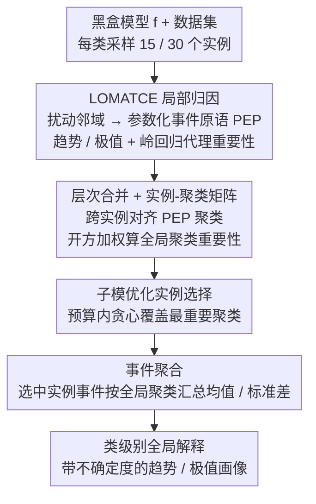

# L2GTX: From Local to Global Time Series Explanations

**会议**: CVPR 2026  
**arXiv**: [2603.13065](https://arxiv.org/abs/2603.13065)  
**代码**: 无  
**领域**: 时间序列  
**关键词**: 时间序列可解释性, 全局解释, 参数化事件原语, 模型无关, 局部到全局聚合

## 一句话总结

L2GTX 提出一种完全模型无关的局部到全局解释方法，通过从 LOMATCE 局部解释中提取参数化时间事件原语（趋势/极值），跨实例合并冗余聚类并以子模优化选取代表性实例，最终聚合为简洁的类级别全局解释，在6个时序分类数据集上保持稳定的全局忠实度。

## 研究背景与动机

**领域现状**：深度学习在时间序列分类中取得了很高的准确率，广泛应用于金融、传感器监控和医疗等领域。然而这些模型本质上是黑盒，给定输入序列后直接输出预测，缺乏对决策依据的可解释性。

**现有痛点**：现有 XAI 方法面临三个关键局限：(i) 为图像和表格数据设计的模型无关方法（如 LIME/SHAP）难以直接扩展到时间序列，因为时序数据具有强时间依赖性和非独立观测特性；(ii) 时间序列的全局解释合成研究严重不足，大多数方法只提供局部解释（标记某些时间步或子序列对单个预测的重要性）；(iii) 少数已有的全局方法通常绑定特定模型架构（如依赖 CAM 或 LRP），无法实现架构中立的可解释性。

**核心矛盾**：局部解释只能说明单个实例的预测依据，无法揭示模型在类级别层面的系统性决策行为。而直接从模型内部提取全局特征又受限于特定架构。需要一种既不依赖模型内部结构、又能从局部时间模式合成类级别全局理解的通用方法。

**本文目标** (a) 如何在不访问模型内部的情况下获得高质量局部时序解释？(b) 如何跨实例合并相似的时间事件以减少冗余？(c) 如何在有限预算下选择最具代表性的实例？(d) 如何将局部事件聚合为简洁的类级别全局解释？

**切入角度**：作者观察到 LOMATCE 局部解释已经以参数化事件原语（PEP）的形式提供了语义丰富的局部解释——描述"增趋势"、"减趋势"、"极大值"、"极小值"等时间行为。这些原语比原始时间步重要性更具人类可解读性，且可以跨实例进行结构化比较和合并。

**核心 idea**：通过层次聚类合并跨实例的参数化事件原语，并以子模优化选择最大化覆盖度的代表性实例，将局部事件聚合为类级别全局时序解释。

## 方法详解

### 整体框架

L2GTX 接收一个训练好的黑盒时序分类模型 $f$ 和数据集 $\mathcal{X}$，最终为每个类别产出一份全局解释——以参数化事件原语（PEP）的统计摘要形式呈现"这类样本通常因为哪些趋势和极值被判成这一类"。它的核心思路是把一堆零散的、逐实例的局部解释"对齐、去冗余、再聚合"成一张类级别的全景图，整个过程完全在模型外部完成，不碰任何内部权重或激活。

具体地，方法先用 LOMATCE 对采样到的实例逐个生成局部解释，得到每个实例自己的 PEP 聚类和重要性分数；接着把不同实例里语义相似的 PEP 聚类做层次合并，对齐成共享的全局聚类，并据此构建实例-聚类矩阵来衡量每个全局聚类的整体重要性；然后在预算约束下用子模贪心挑出少量最具代表性的实例，避免把所有样本一股脑聚合进来引入噪声；最后把这些实例的事件属性按全局聚类汇总成均值/标准差统计，写成类级别解释。为保证类平衡，小/中型数据集每类采样 $n_{\text{inst}}=15$ 个实例，大型数据集采样 $n_{\text{inst}}=30$ 个。

### 关键设计

**1. LOMATCE 局部归因：把"哪里重要"升级成"什么样的时间行为重要"**

时序数据的逐时间步重要性（像 LIME/SHAP 给出的那种）只能告诉你"第 t 步重要"，既不语义也难跨实例比较。L2GTX 用 LOMATCE 给每个实例 $X_i$ 生成的不是时间步权重，而是参数化事件原语——它在实例周围随机扰动时间段构造出 $S$ 个邻域样本，从中抽取四类带参数的事件：递增趋势与递减趋势（参数为 start_time、duration、avg_gradient）、局部极大值与局部极小值（参数为 time、value）。这样每个"重要片段"都被描述成一个人类能读懂的趋势或极值，而不只是坐标。

为了在邻域内量化这些事件的贡献，方法对每种 PEP 类型独立做 K-means 聚类（$K$ 由轮廓系数自动选），把邻域样本编码成事件矩阵 $\mathbf{Z}_i \in \mathbb{R}^{S \times K}$，再训练一个加权岭回归代理模型拟合黑盒预测，得到每个聚类的重要性系数 $\hat{\beta}_i \in \mathbb{R}^K$，最后只保留 top-$n$ 聚类。这一步是后面全局聚合的原料：它把局部解释统一成了"带参数、可比较、可合并"的事件结构，这正是让局部到全局成为可能的前提。

**2. 层次合并与实例-聚类矩阵：把各自为政的局部聚类对齐成共享坐标系**

每个实例的 PEP 聚类都是各算各的，A 实例的"前段增趋势聚类"和 B 实例里类似的趋势并不在同一个编号下，直接拼起来无法跨实例统计。L2GTX 对同一类型 PEP 的所有聚类质心做凝聚层次聚类，按用户设定的合并百分位 $p$ 算出切割距离，把语义相近的局部聚类并成全局聚类 $\mathcal{G}_e$——$p$ 越大，切得越粗，全局聚类越少、解释越紧凑，这给了用户一个单一旋钮去调节解释的粒度。

对齐之后就能搭出实例-聚类矩阵 $\mathbf{M} \in \mathbb{R}^{N \times |\mathcal{G}|}$，其中 $M_{i,j} = \sum_{C_{i,k} \in G_j} I(C_{i,k})$ 汇总了实例 $i$ 落在全局聚类 $j$ 上的局部重要性。在此基础上，每个全局聚类的整体重要性沿用 SP-LIME 的开方加权策略

$$I_j = \sqrt{\sum_{i=1}^N |M_{i,j}|}$$

这样既奖励在多个实例中反复出现的事件，又用开方抑制少数高分实例的主导，得到一个稳健的"哪些时间行为对这个类最关键"的排序。

**3. 子模优化实例选择：用少量样本覆盖最重要的事件，而非全量平均**

把所有实例的事件直接平均会同时混入冗余和噪声，少数边缘样本反而会污染全局摘要。L2GTX 把"选代表实例"建模成一个加权覆盖问题：在预算 $B$ 内贪心地每次挑出能让"尚未被覆盖的全局聚类"加权覆盖增益最大的实例，选中后更新覆盖向量再继续。由于覆盖函数是子模的，这种贪心选择能以小代价逼近最优覆盖，最终用很少的实例就把按 $I_j$ 排序的最重要全局聚类基本兜住，既保证代表性又控制了解释的体量。

**4. 事件聚合与全局解释生成：从对齐后的事件统计出类级别画像**

选定代表实例后，方法丢掉局部聚类这一层中间结构，把所选实例的全部 PEP 事件直接归入它们各自对应的全局聚类，再对每个事件属性算均值和标准差。趋势类事件用 (start_time, duration) 的统计刻画"这个类的关键趋势通常发生在序列哪一段、持续多久"，极值类事件用 (time, value) 的统计刻画"关键极值出现在哪个时刻、幅度多大"。汇总出来的就是一份简洁、可读、带不确定度的类级别解释，例如"该类样本普遍在中段出现一次高幅极大值"。

### 损失函数 / 训练策略

L2GTX 是后处理解释方法，不涉及端到端训练，唯一被优化的子目标是 Step 1 里那个加权岭回归代理。衡量解释质量的核心指标是**全局忠实度**（GF），定义为所选实例集上局部代理保真度的平均：

$$\text{GF}(\mathcal{S}) = \frac{1}{|\mathcal{S}|} \sum_{x_i \in \mathcal{S}} F(x_i)$$

其中 $F(x_i)$ 是实例 $x_i$ 的局部岭回归代理的 $R^2$ 分数。GF 越高，说明被选中代表全局解释的那批实例本身的局部解释越可信。所有实验用 3 个随机种子重复，报告宏平均 GF 和 95% 置信区间。

## 实验关键数据

### 主实验

在6个 UCR 时序数据集上，使用 FCN 和 LSTM-FCN 两种架构：

| 数据集 | 模型 | GF (p=25) | GF (p=50) | GF (p=75) | GF (p=95) |
|--------|------|-----------|-----------|-----------|-----------|
| ECG200 | FCN | 0.784 | 0.788 | 0.780 | 0.792 |
| GunPoint | FCN | 0.593 | 0.599 | 0.601 | 0.597 |
| Coffee | FCN | 0.683 | 0.678 | 0.678 | 0.678 |
| FordA | FCN | 0.674 | 0.672 | 0.673 | 0.672 |
| FordB | FCN | 0.675 | 0.679 | 0.673 | 0.673 |
| CBF | FCN | 0.625 | 0.626 | 0.633 | 0.625 |
| ECG200 | LSTM-FCN | 0.828 | 0.832 | 0.829 | 0.831 |
| FordB | LSTM-FCN | 0.661 | 0.656 | 0.651 | 0.655 |
| CBF | LSTM-FCN | 0.519 | 0.508 | 0.519 | 0.502 |

### 消融实验

| 配置 | 关键指标 | 说明 |
|------|---------|------|
| 合并百分位 p=25到95 | GF 稳定，CI 重叠 | 强压缩不牺牲忠实度 |
| p 增大 | 全局聚类数单调减少 | 更紧凑的解释空间 |
| FCN vs LSTM-FCN | 两者在相同区域高重要性 | 方法捕获架构无关的决策线索 |
| ECG200 案例分析 | Normal vs Infarction 与医学一致 | 梗死信号以少量显著偏转主导 |
| Coffee 案例分析 | Robusta 高幅极大值 vs Arabica 低幅 | 与咖啡光谱学文献一致 |

### 关键发现

- **聚类合并不损失忠实度**：p 从25增到95时 GF 保持稳定且置信区间重叠
- **跨架构一致性**：FCN 和 LSTM-FCN 产生结构一致的解释，共享决策时间线索
- **案例与领域知识契合**：ECG200 梗死类以显著偏转为主、Coffee 中 Robusta 以高强度极大值为主
- **CBF 上 LSTM-FCN 的 GF 偏低**（约0.5），可能反映局部线性代理的近似局限

## 亮点与洞察

- **首个完全模型无关的时序局部到全局解释方法**。不依赖模型内部结构，适用于任何黑盒时序分类器。将"模型无关"贯穿到全局层面
- **参数化事件原语提供语义解释**。用趋势和极值描述时序模式，比"第t步重要"更有意义。天然支持跨实例对齐和领域语义映射
- **贪心子模优化兼顾覆盖度与预算**。在少量实例中最大化覆盖最重要全局聚类
- **合并百分位提供可调粒度**。用户可通过单一参数 p 控制解释紧凑度，且忠实度稳定

## 局限与展望

- **计算开销**：LOMATCE 事件聚类是计算瓶颈，长时间序列时尤其明显
- **仅支持单变量时序**：多变量场景需处理跨通道交互
- **缺乏人类中心评估**：没有领域专家主观评估
- **部分数据集 GF 偏低**：CBF 约0.5、GunPoint 约0.6，受限于局部线性代理
- **缺乏与其他全局解释方法的定量对比**

## 相关工作与启发

- **vs SP-LIME**: 选择代表性实例但不聚合。L2GTX 增加跨实例合并和全局统计聚合
- **vs GLocalX**: 为表格数据做局部到全局聚合。L2GTX 适配到时序参数化事件结构
- **vs LOMATCE**: L2GTX 的局部解释基础。贡献在于系统化的局部到全局路径
- **vs CAM/LRP 系列**: 依赖模型内部表示，架构特异。L2GTX 更通用但只能间接推断

## 评分

- **新颖性**: ⭐⭐⭐⭐ 局部到全局聚合在时序 XAI 中是新尝试，但单个组件缺乏方法学突破
- **实验充分度**: ⭐⭐⭐⭐ 6数据集+2模型+多百分位，但缺乏与其他全局方法定量对比
- **写作质量**: ⭐⭐⭐⭐⭐ 结构清晰，公式完备，案例分析有说服力
- **价值**: ⭐⭐⭐⭐ 填补时序全局可解释性空白，但应用场景论述不够深入

<!-- RELATED:START -->

## 相关论文

- [\[CVPR 2026\] STCast: Adaptive Boundary Alignment for Global and Regional Weather Forecasting](stcast_adaptive_boundary_alignment_for_global_and_regional_weather_forecasting.md)
- [\[CVPR 2026\] Towards Uncertainty-aware Unsupervised Domain Adaptation for Videos and Time-Series with Causal Optimal Transport](towards_uncertainty-aware_unsupervised_domain_adaptation_for_videos_and_time-ser.md)
- [\[CVPR 2026\] Real-Time Long Horizon Air Quality Forecasting via Group-Relative Policy Optimization](real-time_long_horizon_air_quality_forecasting_via_group-relative_policy_optimiz.md)
- [\[CVPR 2026\] SATTC: Structure-Aware Label-Free Test-Time Calibration for Cross-Subject EEG-to-Image Retrieval](sattc_structure-aware_label-free_test-time_calibration_for_cross-subject_eeg-to-.md)
- [\[CVPR 2026\] PFGNet: A Fully Convolutional Frequency-Guided Peripheral Gating Network for Efficient Spatiotemporal Predictive Learning](pfgnet_a_fully_convolutional_frequency-guided_peripheral_gating_network_for_effi.md)

<!-- RELATED:END -->
