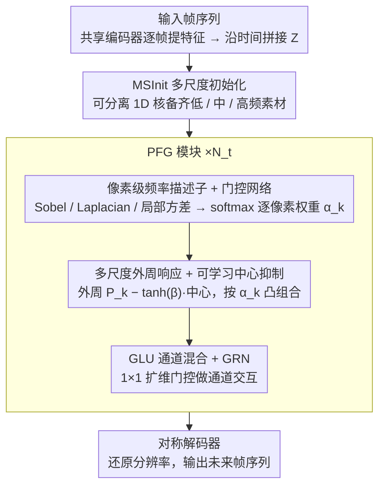

# PFGNet: A Fully Convolutional Frequency-Guided Peripheral Gating Network for Efficient Spatiotemporal Predictive Learning

**会议**: CVPR 2026  
**arXiv**: [2602.20537](https://arxiv.org/abs/2602.20537)  
**代码**: [fhjdqaq/PFGNet](https://github.com/fhjdqaq/PFGNet)  
**领域**: 时间序列  
**关键词**: 时空预测学习, 大核卷积, 频率引导门控, center-surround 抑制, 纯卷积架构

## 一句话总结

提出 PFGNet，一种纯卷积时空预测框架，通过像素级频率引导门控（PFG）动态调制多尺度大核外周响应并施加可学习中心抑制，模拟生物视觉的 center-surround 带通滤波机制，在 Moving MNIST、TaxiBJ、KTH、Human3.6M 四个基准上以极少参数和计算量达到 SOTA 或近 SOTA 性能。

## 研究背景与动机

**时空预测学习 (STPL)** 旨在从历史帧预测未来帧，广泛应用于天气临近预报、自动驾驶、交通流量预测和人体运动预测等场景

**循环模型**（ConvLSTM、PredRNN 系列、SwinLSTM、VMRNN）具有较强的时序建模能力，但自回归推理导致并行性差、延迟高

**纯卷积模型**（SimVP、TAU、STLight）具备完全并行性和可扩展性，但固定均匀的感受野无法适应空间上变化的运动模式

**大核卷积网络**（RepLKNet、SLaK、UniRepLKNet）证实足够大的感受野能让 CNN 近似全局上下文，但仍采用均匀核，忽略了像素级感受野大小的变化需求

**生物学启发**：视网膜和初级视觉皮层的 center-surround 拮抗感受野本质上是空间带通滤波器，选择性地增强中频（边缘、纹理）同时抑制低频（均匀区域）和高频（噪声）

**核心 gap**：现有工作缺乏像素级频率引导和显式中心抑制。通道级或频段级门控无法适应局部纹理；均匀大核在均匀区域浪费计算。没有先前工作在纯卷积 STPL 框架中统一生物 center-surround、频域滤波和自适应大核融合

## 方法详解

### 整体框架

PFGNet 想解决的痛点很具体：纯卷积时空预测器虽然能完全并行、跑得快，但它那套均匀的感受野没法适应空间上不均匀的运动——纹理密集处需要大视野去整合远程上下文，平坦背景处大核反而在浪费算力、放大冗余的低频。它沿用 SimVP 的「编码器—翻译器—解码器」三段骨架，把全部创新塞进中间的翻译器。具体地说，输入帧先经共享空间编码器逐帧提特征 $\mathbf{F}_t = \text{Enc}(\mathbf{I}_t)$，沿时间维拼成 $\mathbf{Z} \in \mathbb{R}^{C' \times H' \times W'}$（$C' = T_{\text{in}} \cdot C$）；翻译器先用 MSInit 铺一层覆盖低/中/高频的多尺度底子，再叠 $N_t$ 个 PFG 模块做频率引导的自适应时空建模；最后对称解码器还原分辨率，吐出未来帧序列。整篇的关键就在 PFG 模块如何「按每个像素的频率特性去挑感受野」。

### 关键设计

**1. 多尺度初始化 MSInit：用极小代价给门控备好多尺度素材**

PFG 模块要在多个尺度的响应之间做选择，可如果送进去的只有单一尺度的小核特征，门控就陷入两难——要么无米下锅（缺远程上下文），要么每次都得触发全尺度计算（太贵）。MSInit 就是为在进 PFG 之前先廉价地把低、中、高频响应都备齐而设。它对每个尺度 $m$ 用一对可分离一维核（$1 \times k_m$ 接 $k_m \times 1$）去近似 $k_m \times k_m$ 卷积，旁挂一支 $3 \times 3$ 深度卷积增强中频敏感度、再加一条恒等连接保住梯度流；各分支经 $1 \times 1$ 卷积投影后拼接，实际取 $k_m \in \{3, 5, 7\}$。这样后续门控拿到的是已经分好频带的素材，而整个铺垫几乎不增加开销。

**2. 像素级频率描述子与门控网络：让每个像素自己说"我要多大的感受野"**

纹理丰富的区域要宽感受野整合远程信息，均匀区域则该压住冗余的低频响应——这种需求是逐像素变化的，通道级或频段级门控都给不出这么细的粒度。PFG 先为每个像素算一个三维频率描述子：用固定深度卷积分别抽 Sobel 梯度幅值 $\mathbf{f}_1$（边缘强度）、Laplacian 绝对值 $\mathbf{f}_2$（曲率）、$3 \times 3$ 局部方差 $\mathbf{f}_3$（纹理复杂度），各取通道均值后拼成 $\mathbf{F} \in \mathbb{R}^{3 \times H' \times W'}$；三种线索互补，给门控一个稳定的频率感知信号。门控网络再用 $1 \times 1$ 卷积把它映成每像素、每尺度的 logits，过 softmax 得到归一化权重 $\alpha_k(h,w)$，强制每个像素在 $K$ 个尺度间做一次凸组合——也就是把"用多大的核"这件事变成可微的、逐像素的软选择。

**3. 多尺度外周响应加可学习中心抑制：把大核做成会放大运动的环形带通滤波器**

这一步是 PFG 真正干活的地方，也是生物 center-surround 思想的落地处。对每个尺度 $k \in \mathcal{K} = \{9, 15, 31\}$，先用可分离 1D 卷积算外周响应 $\mathbf{P}_k = \mathbf{v}_k * (\mathbf{h}_k * \mathbf{X})$，把复杂度从 $\mathcal{O}(k^2)$ 压到 $\mathcal{O}(2k)$；再用一支 $3 \times 3$ 深度卷积取中心响应 $\mathbf{C} * \mathbf{X}$，然后让外周减去被调制后的中心：

$$\mathbf{Y}_k = \mathbf{P}_k - \tanh(\boldsymbol{\beta}_k) \odot (\mathbf{C} * \mathbf{X})$$

其中 $\boldsymbol{\beta}_k \in \mathbb{R}^{C'}$ 是逐通道可学习参数。"大核减小核"在频域上恰好就是一个环形带通滤波器（类似 DoG），它放大中频的运动分量，压掉 DC 低频背景和高频噪声——这正是视网膜与初级视觉皮层 center-surround 拮抗在做的事。这里之所以用 $\tanh$ 而非 sigmoid，是因为特征图同时含正负值、需要双向调制（消融里 $\tanh$ 明显优于 sigmoid）。最后把各尺度响应按门控权重凸组合：

$$\text{PFG}(\mathbf{X}) = \sum_{k \in \mathcal{K}} \boldsymbol{\alpha}_k \odot \mathbf{Y}_k$$

于是一个落在锐利边缘上的像素会把权重压向大核、把远程运动上下文整合进来，而一片平坦背景上的像素则倾向小核、顺带被中心抑制削掉冗余低频——感受野就真正变成了逐像素自适应。

**4. GLU 通道混合与 GRN 归一化：在空间自适应之后补一道轻量的通道交互**

PFG 解决的是"空间上选多大的核"，可通道之间还差一次特征重组。这里用 $1 \times 1$ 卷积把通道从 $C'$ 扩到 $2E$（$E = 4C'$），均分成 $\mathbf{U}$、$\mathbf{V}$，走 GLU 风格门控 $\sigma(\mathbf{U}) \odot \text{DW}_{3\times3}(\mathbf{V})$ 后再投回 $C'$，配 GRN 归一化和 LayerScale 稳住训练。GLU 给的是轻量的通道选择能力，与 PFG 的空间自适应正好互补——一个管"看哪里"，一个管"看什么"。

### 损失函数与训练策略

遵循 OpenSTL 统一评测框架，训练目标就是标准 MSE 损失。优化器用 Adam，各数据集学习率不同（Moving MNIST 1e-3、TaxiBJ 2e-3、KTH 2e-4/1e-4、Human3.6M 1.5e-3），TaxiBJ/KTH/Human3.6M 上加 0.1 的 DropPath 正则。效率上的关键是所有大核都被分解成可分离 1D 卷积，$k=31$ 时核参数和乘加量直接减少 15 倍，这也是它能以极低算力跑到 SOTA 的根本原因。

## 实验关键数据

### TaxiBJ 数据集（核心结果）

| 方法 | 类型 | Params | FLOPs | MSE ↓ | MAE ↓ | SSIM ↑ |
|------|------|--------|-------|-------|-------|--------|
| VMRNN | 循环 | 2.6M | 0.9G | 0.2887 | 14.69 | 0.9858 |
| SwinLSTM | 循环 | 2.9M | 1.3G | 0.3026 | 15.00 | 0.9843 |
| SimVP | 非循环 | 13.8M | 3.6G | 0.3282 | 15.45 | 0.9835 |
| TAU | 非循环 | 9.6M | 2.5G | 0.3108 | 14.93 | 0.9848 |
| **PFGNet** | **非循环** | **1.9M** | **0.6G** | **0.2881** | **14.75** | **0.9857** |

PFGNet 以 **1.9M 参数、0.6G FLOPs** 超越所有循环和非循环基线，参数量仅为 SimVP 的 1/7、TAU 的 1/5。

### Moving MNIST + Human3.6M（跨数据集泛化）

| 方法 | Moving MNIST MSE ↓ | Moving MNIST SSIM ↑ | H3.6M Params | H3.6M FLOPs | H3.6M MAE ↓ | H3.6M SSIM ↑ |
|------|---------------------|---------------------|--------------|-------------|-------------|--------------|
| SimVP | 23.8 | 0.948 | 41.2M | 197.0G | 1511.5 | 0.9822 |
| TAU | 19.8 | 0.957 | 37.6M | 182.0G | 1390.7 | 0.9839 |
| VMRNN | 16.5 | 0.965 | — | — | — | — |
| **PFGNet** | **15.2** | **0.967** | **7.3M** | **58.3G** | **1392.4** | **0.9838** |

Moving MNIST 上 MSE 15.2 为所有方法最优；Human3.6M 上以 7.3M 参数（TAU 的 1/5）达到近 SOTA 性能。

### 消融实验要点

| 消融项 | TaxiBJ MSE ↓ | 结论 |
|--------|--------------|------|
| 去除 MSInit | 0.3119 | 多尺度初始化对门控效果至关重要 |
| 均值融合替代 softmax | 0.3033 | 像素级自适应加权优于固定权重 |
| 固定 β=0（无中心抑制） | 0.2993 | 中心抑制可进一步压低误差 |
| 固定 β=±1 | 0.3209/0.3286 | 可学习 β 远优于固定值 |
| sigmoid 替代 tanh | 0.3142 | tanh 的双向调制更适合特征图 |
| 完整 PFGNet | **0.2881** | 各组件协同最优 |

## 亮点与洞察

1. **生物学-数学统一**：将大核中心抑制形式化为可学习的环形带通滤波器（DoG 近似），为 CNN 感受野设计提供频域理论基础——这不是简单的 bio-inspired，而是有严格的频域分析支撑
2. **极致效率**：所有大核（最大 31×31）完全分解为 1D 卷积，$k=31$ 时参数和计算量减少 15 倍。TaxiBJ 上仅 1.9M/0.6G 即超越所有方法
3. **三重频率线索互补**：梯度幅值、Laplacian、局部方差分别捕获边缘强度、曲率、纹理复杂度，消融证实三者缺一不可
4. **纯卷积无注意力**：不使用任何注意力机制或循环结构，完全并行化，适合实时部署
5. **KTH 上 SSIM 全场最优**：尽管 PSNR 略低于 SwinLSTM，但 SSIM 最高说明结构保持（肢体轮廓、关节轨迹）更优，论文对此给出了合理分析

## 局限与展望

1. **频率线索均为固定滤波器**：Sobel、Laplacian 和局部方差均为手工设计的固定算子，未来可探索可学习的频率特征提取
2. **仅评测四个基准**：缺少天气预报（WeatherBench）、自动驾驶（nuScenes）等更复杂的实际场景验证
3. **中心核尺寸固定**：消融仅比较了 3×3 和 5×5，未探索动态中心核大小的可能性
4. **长时预测能力待验证**：KTH 最多 40 帧，更长时间序列（100+帧）的表现未知
5. **与 Transformer/SSM 混合架构的比较不充分**：仅对比了 VMRNN 中的 Mamba 组件，缺少与最新 SSM 时空模型的直接比较
6. **频率门控机制的可解释性**：虽展示了 argmax 可视化，但缺乏对不同场景下门控行为的深度定量分析

## 相关工作与启发

- **SimVP** [Gao et al., 2022]：PFGNet 的基础流水线，证明强空间骨干可隐式建模时间演化。PFGNet 在此基础上引入频率引导的自适应感受野
- **UniRepLKNet** [Ding et al., 2024]："see wide without going deep"的设计哲学，验证大核可以线性复杂度近似全局注意力。PFGNet 进一步增加像素级动态性
- **PeLK** [Chen et al., 2024]：外周卷积可将核扩展到 100+，但缺乏频率引导。PFGNet 的 PFG 模块填补了这一空白
- **Octave Convolution** [Chen et al., 2019]：按频率分组处理特征但需显式频域变换。PFGNet 完全在空间域通过固定滤波器提取频率线索，避免额外变换开销
- **DoG 模型**：经典的 center-surround 感受野模型，PFGNet 将其从固定参数推广到逐通道可学习、逐像素自适应选择

## 评分

- **新颖性**: ⭐⭐⭐⭐ — 生物 center-surround 机制与频域带通理论的结合是新颖的，像素级频率引导门控在 STPL 中属首创
- **实验充分度**: ⭐⭐⭐⭐ — 四个标准基准 + 详细消融 + 效率对比，遵循 OpenSTL 统一框架保证公平性；但缺少更复杂的实际场景
- **写作质量**: ⭐⭐⭐⭐⭐ — 从生物学动机到数学形式化再到实验的叙事链完整流畅，频域分析严谨
- **价值**: ⭐⭐⭐⭐ — 纯卷积 + 极低计算量即达 SOTA 的方案具有很强的实用性，PFG 模块可作为即插即用组件

<!-- RELATED:START -->

## 相关论文

- [\[NeurIPS 2025\] Simple and Efficient Heterogeneous Temporal Graph Neural Network](../../NeurIPS2025/time_series/simple_and_efficient_heterogeneous_temporal_graph_neural_network.md)
- [\[ICML 2025\] TQNet: Temporal Query Network for Efficient Multivariate Time Series Forecasting](../../ICML2025/time_series/temporal_query_network_for_efficient_multivariate_time_series_forecasting.md)
- [\[ICLR 2026\] Towards Generalizable PDE Dynamics Forecasting via Physics-Guided Invariant Learning](../../ICLR2026/time_series/towards_generalizable_pde_dynamics_forecasting_via_physics-guided_invariant_lear.md)
- [\[ECCV 2024\] Semantically Guided Representation Learning For Action Anticipation](../../ECCV2024/time_series/semantically_guided_representation_learning_for_action_anticipation.md)
- [\[AAAI 2026\] iTimER: Reconstruction Error-Guided Irregularly Sampled Time Series Representation Learning](../../AAAI2026/time_series/beyond_observations_reconstruction_error-guided_irregularly_sampled_time_series_.md)

<!-- RELATED:END -->
