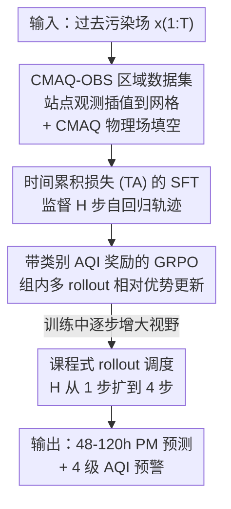

# Real-Time Long Horizon Air Quality Forecasting via Group-Relative Policy Optimization

**会议**: CVPR 2026  
**论文**: [CVF Open Access](https://openaccess.thecvf.com/content/CVPR2026/html/Kang_Real-Time_Long_Horizon_Air_Quality_Forecasting_via_Group-Relative_Policy_Optimization_CVPR_2026_paper.html)  
**代码**: https://github.com/kaist-cvml/FAKER-Air  
**领域**: 时序预测 / 强化学习对齐  
**关键词**: 空气质量预测、GRPO、长程时空预测、类别奖励、课程式 rollout

## 一句话总结
本文针对东亚长程（48–120 小时）PM 浓度预测，先发布一套观测对齐的区域数据集 CMAQ–OBS，再用「带时间累积损失的 SFT + 带类别 AQI 奖励的 GRPO」两阶段训练（FAKER-Air），把 MSE 训练固有的「过预报、误报多」问题对齐到真实的运营成本上，在保持 F1 的同时把误报率（FAR）相对 SFT 基线降低 47.3%。

## 研究背景与动机
**领域现状**：当前主流的数据驱动天气/空气质量预测靠 Aurora、GraphCast、Pangu-Weather 这类基础模型，从 ERA5、CAMS 等全球再分析数据里学全球大气动力学。其中 Aurora 是唯一开源、且显式包含 PM 预测的模型，因此成为本文唯一可比的 baseline。

**现有痛点**：全球模型在东亚水土不服。一是**区域精度低**——CAMS 在中韩相对地面观测平均偏差高达 52.66 µg/m³；二是**没有实时性**——全球再分析有几天的更新延迟，无法及时发预警。根因是数据失衡：东亚只占全球训练覆盖的不到 15%，却贡献了 60% 以上的重污染暴露，全球模型必然欠拟合本地动力学。

**核心矛盾**：即便把模型迁到本地数据上做监督训练，长程预测仍有两个深层矛盾。其一，长程预测要做连续的 6 小时自回归 rollout，但 teacher forcing 训练时只喂真值，模型从没见过自己的预测，造成 train-test 失配（exposure bias），早期小误差沿时间步累积放大。其二，平方误差（MSE）是**成本对称**的，而空气质量决策是**非对称**的——漏报一次重污染（Bad/VeryBad）远比在清洁天气下误报（Good/Moderate）代价高；MSE 在不确定区间倾向上偏预测，导致 SFT 模型「过预报」、误报率居高不下。

**本文目标**：在东亚做稳定的长程 PM 预测，且分类结果可靠到能直接驱动实时预警系统。

**切入角度**：作者把「逐点回归」换成「决策对齐」的视角——预测质量不该只看 MSE，而要看它在 AQI 分级预警里的运营可靠性；既然要对齐一个可验证的、非对称的成本，那就引入策略优化（RL）。

**核心 idea**：先用「时间累积损失」的 SFT 打牢长程一致性的底子，再用「带类别 AQI 奖励 + 课程式 rollout 的 GRPO」把策略对齐到运营优先级上——这是首次把策略优化引入时空预测。

## 方法详解

### 整体框架
FAKER-Air（Forecast Alignment via Knowledge-guided Expected-Reward）是一个建立在 Aurora 式 3D encoder-decoder backbone 上的**两阶段训练框架**，前面再加一个数据层。输入是过去若干步的网格化污染场 $x_{1:T}$，输出是未来 48–120 小时、以 6 小时为步长的 PM 浓度场，最终落到 4 级 AQI 分类预警。

整条管线分三块：① **数据层**——构建并对齐 CMAQ–OBS 区域数据集，把稀疏站点观测插值到 27 km 网格，并用物理驱动的 CMAQ 填补空间空洞，既保证区域精度又支持小时级实时初始化；② **Stage 1（SFT）**——在该数据集上做监督微调，但用「时间累积损失」监督 $H$ 步自回归轨迹而非单步，压住 exposure bias；③ **Stage 2（GRPO）**——从 SFT 策略出发，对同一状态采样多条 rollout，用类别 AQI 奖励把它们转成组内相对优势来更新策略，并用课程式 rollout 把预测视野从短到长逐步放开。

### 关键设计

**1. CMAQ–OBS 区域数据集：用物理场补上稀疏观测的空洞，同时拿到实时性**

要解决全球模型「区域精度低 + 无实时性」的双痛点，作者构建并发布了一套覆盖 2016–2023（8+ 年）的东亚数据集，把两类互补信号拼在一起：稀疏但准的**站点观测（OBS）**——来自韩国 532 站、中国 1,290–1,781 站的 6 小时间隔 PM2.5/PM10/O3 地面实测；以及稠密但需校正的 **CMAQ 物理再分析**——27 km 分辨率、对东亚气象与排放定制的连续网格场。建模时把点观测空间插值到 CMAQ 网格，既当输入特征也当真值。

这套组合的价值在于：CMAQ 相对地面真值的平均误差降到 21.33 µg/m³，比 CAMS（52.66）相对改善 **59.5%**；更关键的是它能在小时级内从本地观测初始化，绕开全球再分析几天的更新延迟，满足实时预警的硬约束。而 CMAQ 的多变量空间连续性还提供了物理上自洽的先验，在自回归 rollout 中缓解分布漂移，缓和长程退化。

**2. 时间累积损失（TA loss）：用多步自回归监督压住误差累积**

针对 teacher forcing 造成的 exposure bias，Stage 1 不再只监督单步。普通 SFT 最小化下一步 MSE：$L_{\text{SFT}} = \mathbb{E}_{x,y}\big[\lVert f_\theta(x_{1:T}) - y_{T+1}\rVert_2^2\big]$，但它把每个 lead time 独立看待，模型训练时从不接触自己的 rollout 误差。TA loss 改成监督 $H$ 步的自回归轨迹——第 $i$ 步的预测显式以模型自己前面的输出为条件：

$$\hat{y}_{T+i} = f_\theta\big(x_{1:T},\, \hat{y}_{T+1:T+i-1}\big), \quad i = 1,\dots,H.$$

每步损失 $\ell_i(\theta)$ 是跨变量组的加权 MSE，并用线性递增的步权重 $w_i = b + (1-b)\frac{i-1}{H-1}$（$b\in(0,1]$）逐渐加重靠后的远期视野，最后归一化聚合：$L_{\text{TA}}(\theta) = \sum_{i=1}^{H} \tilde{w}_i\,\ell_i(\theta),\ \tilde{w}_i = w_i / \sum_j w_j$。让模型在训练阶段就经历多步误差累积，缩小了 teacher-forced 训练与自回归推理之间的分布偏移，从而稳住长程一致性。

**3. 带类别 AQI 奖励的 GRPO：把成本对称的 MSE 换成成本非对称的决策对齐**

TA loss 解决了稳定性，但优化的还是成本对称的平方误差，和「漏报重污染比误报清洁天气更糟」的运营成本错配。Stage 2 把预测重述成策略优化问题：模型 $f_\theta$ 定义随机策略 $\pi_\theta(a_t\mid s_t)$，状态 $s_t$ 编码时空输入、动作 $a_t$ 是 $t{+}1$ 时刻的预测浓度场，目标是最大化期望任务奖励 $J(\theta)=\mathbb{E}_{\pi_\theta}\big[\sum_t r(s_t,a_t)\big]$。

奖励采用 RLVR 式可验证的二元类别奖励：设 $\hat{c}_t=\text{AQI}(a_t)$、$c_t=\text{AQI}(y_t)$，则 $R(a_t,y_t)=1$ 当 $\hat{c}_t=c_t$，否则为 0。GRPO 的关键是不直接用绝对奖励，而是对同一状态采样 $G$ 条轨迹（用 $a=\mu+\sigma\epsilon$、$\epsilon\sim\mathcal{N}(0,I)$，配对反向采样降方差），把各自奖励 $r_t^{(g)}$ 经 softmax 归一化成相对优势：

$$A_g = \frac{\exp(r_t^{(g)}/\tau)}{\sum_{j=1}^{G}\exp(r_t^{(j)}/\tau)}.$$

再用这个优势加权对数似然来更新策略：$L_{\text{GRPO}} = -\,\mathbb{E}_{(a_t^{(g)},r_t^{(g)})\in \mathcal{G}_t}\big[A_g \log \pi_\theta(a_t^{(g)}\mid s_t)\big]$。这种「组内排名」的设计不需要 critic 也不需要单独的奖励模型，把概率推向组内表现更好的轨迹、压低不可靠的——配合类别 AQI 奖励，自然就把策略导向「清洁天气少误报、重污染保召回」的运营优先级。⚠️ 论文正文采用二元 0/1 奖励（公式 7），而引言里描述对 Good/Moderate 误报加重惩罚、对 Bad/VeryBad 漏报加重惩罚，措辞上略有出入，以原文为准。

**4. 课程式 rollout 调度（CR）：从短视野到长视野，稳住长程策略学习**

直接在长视野上做 GRPO，回报估计方差大、credit assignment 弱，且后期状态依赖模型自己的预测，早期误差会把状态分布推离流形。CR 让 rollout 视野 $H$ 随训练 epoch 逐步增大：$H_e = \min\big(H_{\max},\ \lfloor H_{\min}+\kappa e\rfloor\big)$，早期只放到 1 步、随训练扩到 4 步，$\kappa$ 控制扩张速率。这样模型先掌握短期动力学再去啃不确定的远期，显著降低早期训练的梯度噪声；同时 GRPO 用整条轨迹的策略梯度（而非 SFT 的逐步快照）来更新，隐式鼓励了时间一致性，让模型捕捉气溶胶输运与累积的长程依赖。

### 损失函数 / 训练策略
两阶段训练在东亚数据上进行：Stage 1 用 Aurora 式 3D encoder-decoder，batch size 8、30 epochs、one-cycle LR，rollout loss 用 4 步自回归。Stage 2 GRPO 用 batch size 1、4 epochs，每个输入用配对（共享噪声）采样生成 4 条轨迹，优化基于离散 AQI 阈值的类别奖励。数据划分 2016–2021 训练、2022 验证、2023 测试，2 张 H200 分布式数据并行，随机种子 42。

## 实验关键数据

### 主实验
长程预测（PM2.5，120h，二元 + 4 级 AQI 指标）下 GRPO 各配置对比。二元指标 Acc/F1/Prec 越高越好、FAR 越低越好、Bias≈1 最佳；AQI 为 4 级分类。

| 模型 | 奖励 | CR | Acc | F1 | FAR↓ | Bias | F1-macro | F1-micro |
|------|------|----|-----|-----|------|------|----------|----------|
| Aurora（baseline） | – | – | 68.93 | 16.06 | 2.24 | 0.13 | 23.43 | 34.03 |
| FAKER-Air SFT | – | – | 69.62 | 59.90 | 32.86 | 1.52 | 41.59 | 44.03 |
| FAKER-Air GRPO | MSE | ✘ | 74.50 | 48.44 | 10.54 | 0.64 | 37.57 | 43.73 |
| FAKER-Air GRPO | AQI | ✘ | 71.40 | 56.28 | 24.19 | 1.17 | 40.75 | 42.26 |
| **FAKER-Air GRPO** | **AQI** | **✔** | **74.51** | **56.72** | **17.32** | **0.96** | **41.90** | **45.16** |

完整模型相比 SFT 基线，FAR 从 32.86 降到 17.32（相对 **−47.3%**），F1 从 59.90 微降到 56.72（仍有竞争力），Bias 从 1.52（明显过预报）回到 0.96（接近 1，校准良好），同时 F1-micro/F1-macro 均提升。相比 Aurora，F1 提升约 **3.5×**（16.06→56.72）。

### 消融实验
SFT 阶段各组件对长程 F1 的贡献（PM2.5，overall F1）。

| OBS | CMAQ | TA(T=2) | TA(T=4) | Overall F1 | 说明 |
|-----|------|---------|---------|-----------|------|
| – | – | – | – | 16.06 | Aurora baseline |
| ✔ | ✘ | ✘ | ✘ | 50.74 | 仅本地 OBS：相对 Aurora 大幅跃升 |
| ✔ | ✔ | ✘ | ✘ | 54.40 | 加 CMAQ 物理场：长程更稳 |
| ✔ | ✔ | ✔ | ✘ | 57.65 | 加 TA(T=2) |
| ✔ | ✔ | ✘ | ✔ | **59.90** | TA(T=4)：远期视野涨幅最大 |

### 关键发现
- **数据层贡献最猛**：仅把训练数据从全球换成本地 OBS，PM2.5 的 F1 就从 16.06 跳到 50.74、PM10 从 4.73 跳到 41.63，印证「区域数据失衡」是全球模型东亚失效的主因；CMAQ 物理场进一步在长 lead time 上稳住自回归。
- **TA loss 在远期收益更大**：TA(T=4) 相比无 rollout loss，越往后的视野（+48h 之后）提升越明显（PM2.5 各远期约 +8.5～+10.5），正好对应它压制误差累积的设计目标。
- **GRPO 是「降误报」专用件，但有 F1 代价**：纯 MSE 奖励的 GRPO 虽把 FAR 压到 10.54，却把 F1 砍到 48.44（牺牲召回）；换成类别 AQI 奖励 + CR 后，在 FAR=17.32 与 F1=56.72 间取得平衡，且 Bias 最接近 1，说明类别奖励 + 课程调度共同把「过预报」纠了回来。

## 亮点与洞察
- **首次把策略优化引入时空预测**：把「预测浓度场」重述为「策略输出动作」，用可验证的 AQI 分类奖励替代连续值估计，绕开了奖励模型与 critic，是一条把 RLVR/GRPO 从 LLM 迁到地学预测的可复用路径。
- **抓住了「指标 ≠ 决策」的本质矛盾**：论文最「啊哈」的点是指出 MSE 的成本对称性与空气质量预警的成本非对称性根本冲突——高预测精度照样高误报，于是用奖励显式编码非对称成本，这个思路可迁移到任何「漏报/误报代价悬殊」的预警任务（洪水、地震、医疗筛查）。
- **课程式 rollout 是稳长程 RL 的实用 trick**：先短后长地放开预测视野来降梯度方差，对任何自回归生成 + RL 微调的设定（含长文本、长视频）都有借鉴意义。

## 局限与展望
- **F1 与 FAR 的 trade-off 没被完全打破**：降 FAR 的同时 F1 相对 SFT 仍有约 3 分回落，GRPO 更像「把过预报偏置往回拉」而非纯涨点，实际部署需按预警容忍度调权。
- **奖励设计存在表述不一致**：正文用二元 0/1 奖励，引言又描述按 AQI 类别加权惩罚，二者强度结构不同，复现时需以源码为准（⚠️ 以原文为准）。
- **区域与时段受限**：数据仅覆盖中韩、2016–2023，且依赖 CMAQ 这套定制再分析；迁到缺少高质量区域再分析的地区时，数据层优势能否复现存疑。
- **GRPO 训练成本**：batch size 1、每输入 4 条 rollout，长程采样开销不小，扩展到更长视野或更高分辨率的可扩展性待验证。

## 相关工作与启发
- **vs Aurora / GraphCast / Pangu-Weather**：它们做全球尺度、靠 ERA5/CAMS 大规模预训练，本文做区域尺度 + 实时，靠 CMAQ–OBS 补区域精度与实时性；Aurora 是唯一开源含 PM 的模型故作 baseline，本文 F1 约为其 3.5×。
- **vs 纯 SFT / teacher forcing 预测**：SFT 用逐步 MSE，本文用 TA loss 监督多步轨迹压 exposure bias，再叠 GRPO 对齐决策成本，区别在于把「预测准」升级为「预警可靠」。
- **vs RLHF / PPO / DPO**：RLHF/PPO 需在线 RL 且不稳，DPO 去掉奖励模型但仍是偏好分类；本文选 GRPO 用组内相对排名替代绝对奖励，无需 critic、无需奖励模型，更稳，且把它从语言对齐迁到时空预测的决策对齐。

## 评分
- 新颖性: ⭐⭐⭐⭐⭐ 首次把 GRPO/策略优化引入时空预测，并用类别奖励对齐非对称运营成本
- 实验充分度: ⭐⭐⭐⭐ 多视野、多指标、SFT/GRPO 双阶段消融齐全，但缺跨区域泛化验证
- 写作质量: ⭐⭐⭐⭐ 动机链清晰，但奖励公式与引言描述存在表述不一致
- 价值: ⭐⭐⭐⭐⭐ 发布区域数据集 + 可落地的实时长程预警框架，工程价值高

<!-- RELATED:START -->

## 相关论文

- [\[AAAI 2026\] AirDDE: Multifactor Neural Delay Differential Equations for Air Quality Forecasting](../../AAAI2026/time_series/airdde_multifactor_neural_delay_differential_equations_for_air_quality_forecasti.md)
- [\[AAAI 2026\] Optimal Look-back Horizon for Time Series Forecasting in Federated Learning](../../AAAI2026/time_series/optimal_look-back_horizon_for_time_series_forecasting_in_federated_learning.md)
- [\[ICLR 2026\] Towards Robust Real-World Multivariate Time Series Forecasting: A Unified Framework](../../ICLR2026/time_series/towards_robust_real-world_multivariate_time_series_forecasting_a_unified_framewo.md)
- [\[ICLR 2026\] Rating Quality of Diverse Time Series Data by Meta-learning from LLM Judgment](../../ICLR2026/time_series/rating_quality_of_diverse_time_series_data_by_meta-learning_from_llm_judgment.md)
- [\[AAAI 2026\] Detecting the Future: All-at-Once Event Sequence Forecasting with Horizon Matching](../../AAAI2026/time_series/detecting_the_future_all-at-once_event_sequence_forecasting_with_horizon_matchin.md)

<!-- RELATED:END -->
