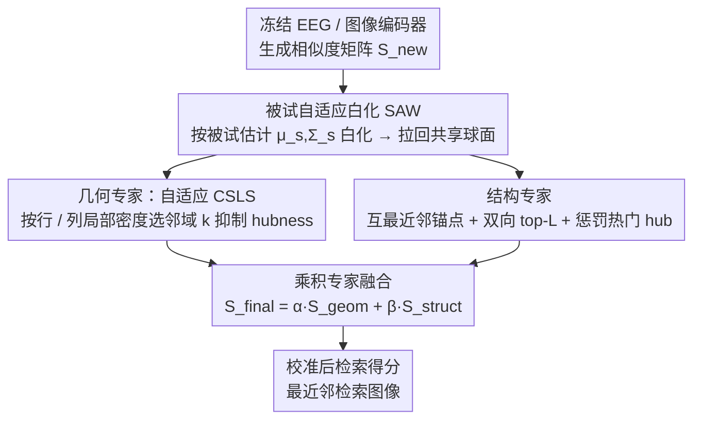

# SATTC: Structure-Aware Label-Free Test-Time Calibration for Cross-Subject EEG-to-Image Retrieval

**会议**: CVPR 2026  
**arXiv**: [2603.20738](https://arxiv.org/abs/2603.20738)  
**代码**: [https://github.com/QunjieHuang/SATTC-CVPR2026](https://github.com/QunjieHuang/SATTC-CVPR2026)  
**领域**: 时间序列  
**关键词**: EEG解码, 跨被试检索, 无标签校准, hubness缓解, 相似度矩阵

## 一句话总结

提出SATTC，一个无标签的测试时校准头，通过几何专家（被试自适应白化+自适应CSLS）和结构专家（互最近邻+双向top-k排名+类别流行度）的乘积专家融合，在冻结的EEG和图像编码器上直接操作相似度矩阵，显著改善跨被试EEG-to-image检索的Top-1精度并降低hubness效应。

## 研究背景与动机

1. **领域现状**：EEG-to-image检索将脑电信号映射到共享嵌入空间，通过最近邻检索对应图像。近期工作（ATM等）通过对比学习训练强大的EEG编码器，在THINGS-EEG基准上取得了较好的零样本检索性能。
2. **现有痛点**：当前pipeline存在三个测试时限制——(1) 缺乏结构感知的无标签测试时校准，推理简化为裸露的最近邻搜索；(2) 无被试自适应的密度感知hubness缓解，全局固定的CSLS邻域大小无法适应不同query和类别的局部密度差异；(3) 未利用互最近邻、双向排名等结构线索来诊断和修正small-k shortlist质量。
3. **核心矛盾**：跨被试部署时，不同被试的EEG特征分布（均值、方差、协方差结构）存在显著统计偏移（subject shift），加上高维嵌入空间的hubness效应（少数"热门"图像霸占多数query的top-k列表），导致small-k shortlist极不可靠——这在实际神经解码应用中是致命问题。
4. **本文目标** 在编码器冻结、无目标域标签的严格约束下，仅通过操作EEG-图像相似度矩阵来校准检索排名。
5. **切入角度**：将跨被试检索重新定义为一个"相似度矩阵校准"问题——不修改编码器权重，只修改相似度结构本身。从两个互补视角切入：几何视角（密度感知的局部缩放）和结构视角（排名关系中的一致性模式）。
6. **核心 idea**：用几何专家缓解密度不均匀导致的hubness，用结构专家锁定高置信匹配并惩罚热门hub类别，两者乘积融合得到校准后的检索得分。

## 方法详解

### 整体框架

这篇论文要解决的是跨被试EEG-to-image检索的"测试时排名不可靠"问题：编码器已经训好了，但换一个新被试上线时，谁都不想为它重新标注数据、重新微调网络。SATTC的做法是把整个问题降维成"校准一张相似度矩阵"——冻结EEG编码器 $f_{\text{eeg}}$ 和图像编码器 $f_{\text{img}}$，测试时拿它们生成一个 $|Q| \times |C|$ 的相似度矩阵 $S_{\text{new}}$（行是query脑电，列是候选图像类别），SATTC只是一个作用在这张矩阵上的算子 $F: S_{\text{new}} \mapsto S_{\text{final}}$，不碰任何网络权重。

矩阵进来后走三步：先用被试自适应白化把不同被试的脑电特征拉回同一套统计坐标系，再让一个"几何专家"按局部密度自适应地做CSLS缩放、一个"结构专家"从排名关系里挖出可信匹配和虚假热门，最后两个专家在logit空间相加融合，$S_{\text{final}} = \alpha S_{\text{geom}} + \beta S_{\text{struct}}$，输出校准后的检索得分。整个流程无标签、无训练，对底层用什么编码器完全无所谓。

### 关键设计

**1. 被试自适应白化（SAW）：在没有标签的情况下把不同被试拉回同一个球面**

跨被试检索最大的障碍是subject shift——不同人的脑电特征分布（均值、方差、协方差结构）差得很远，一个query在新被试坐标系里看起来就像离群点。SAW对每个被试 $s$ 单独估计均值 $\mu_s$ 和协方差 $\Sigma_s$，构造一个正则化白化变换 $W_s = (\Sigma_s + \lambda I)^{-1/2}$，把该被试的EEG嵌入先减均值、再用 $W_s$ 白化、最后做L2归一化；图像端可选做一次全局白化。白化后每个被试的特征都近似零均值、单位协方差、单位范数，等于被映射到了同一个共享球面上，分布偏移在几何上被直接抹平。之所以有效，是因为它不需要任何目标域标签，纯靠二阶统计量就把"不同被试"这个变量消掉了——消融里它也是单一贡献最大的一步，把Top-5从30.5%抬到36.4%。

**2. 自适应CSLS几何专家：让每个query和类别用"适合自己密度"的邻域来抑制hubness**

高维嵌入空间里有hubness效应：少数"热门"图像会霸占大量query的top-k，挤掉真正正确但冷门的匹配。经典CSLS用一个固定全局邻域 $k$ 做密度惩罚，但跨被试脑电嵌入的密度高度不均——稀疏区固定 $k$ 会过度惩罚正确却稀少的匹配，密集hub区又惩罚不足。自适应版本因此为每个query按行密度 $\rho_{\text{row}}(q)$ 映射出自己的 $k_{\text{row}}(q) \in [k_{\min}, k_{\max}]$，为每个类别按列密度 $\rho_{\text{col}}(c)$ 映射出 $k_{\text{col}}(c)$。CSLS得分仍是经典形式

$$S_{\text{geom}}(q,c) = 2s(q,c) - r_q(q) - r_c(c)$$

只是其中两个邻域平均项 $r_q$、$r_c$ 改用各自的自适应邻域大小来算。好处是不必再为整个数据集去调一个全局 $k$，密度差异由数据自己说了算。

**3. 结构专家：从排名一致性里加固可信匹配、压住虚假热门**

几何专家从密度入手，结构专家则换个角度——直接读相似度矩阵的排名关系。它在做CSLS之前先从 $S_{\text{new}}$ 算好行/列排名，识别三类信号：第一类是锚点，即严格的互最近邻MNN@1对（$r_{\text{row}}(q,c)=r_{\text{col}}(c,q)=1$，query和图像互为对方第一名），给正偏置 $+\lambda_{\text{anchor}}$；第二类是双向top-L对，作为更宽松的一致性匹配；第三类是hub候选——行排名低但列排名高、频繁出现在多个query的top-K里的类别 $c$，给负偏置 $-\lambda_{\text{pen}} h(c)$，其中 $h(c)$ 是归一化的hubness得分。互最近邻之所以可靠，是因为两个样本互相把对方排第一，这种双向确认在跨域检索里几乎不会出错；反过来，反复出现在各家top-K里的类别多半是虚假热门，需要主动压。关键是这张结构矩阵一次性算完就固定下来，不参与后续迭代，避免"热门越压越被自己强化"的反馈循环。

### 损失函数 / 训练策略

SATTC本身不涉及训练，所有操作在测试时完成。底层EEG编码器用AdamW优化器、batch size 1024、学习率 $5 \times 10^{-4}$、温度 $\tau=1.0$ 训练。乘积融合仅需调一个标量 $\beta$（默认1.9），$\alpha$ 固定为1。

## 实验关键数据

### 主实验

THINGS-EEG数据集上200-way跨被试检索（LOSO协议，平均所有fold和3个种子）：

| 方法 | Top-5 (%)↑ | Top-1 (%)↑ |
|------|-----------|-----------|
| ATM (原始) | 20.0 | 5.5 |
| 标准化基线 (cosine+L2+CW) | 30.5 | 9.2 |
| + SAW | 36.4 | 13.7 |
| + SAW + CW | 36.8 | 13.5 |
| + SAW + CW + CSLS (fixed k=12) | 38.1 | 14.1 |
| + SAW + CW + Ada-CSLS | 38.8 | 13.9 |
| **SATTC (完整)** | **38.4** | **14.8** |

跨编码器即插即用泛化（SATTC作为通用校准层）：

| 编码器 | Top-5 基线→+SATTC | Top-1 基线→+SATTC |
|--------|-------------------|-------------------|
| ATM | 30.5→38.4 (+7.9) | 9.2→14.8 (+5.6) |
| EEGNetV4 | 20.5→34.8 (+14.3) | 5.4→10.8 (+5.4) |
| EEGConformer | 11.6→23.2 (+11.6) | 2.5→6.9 (+4.4) |
| ShallowFBCSPNet | 14.6→30.8 (+16.2) | 3.5→11.1 (+7.6) |

### 消融实验

| 配置 | Top-5 (%) | Top-1 (%) | 说明 |
|------|-----------|-----------|------|
| 标准化基线 | 30.5 | 9.2 | cosine+L2+CW |
| + SAW | 36.4 | 13.7 | 最大单一增益 (+6.2/+4.5) |
| + SAW + CW | 36.8 | 13.5 | CW额外增益有限 |
| + Ada-CSLS | 38.8 | 13.9 | 几何校准 |
| + 结构PoE (SATTC) | 38.4 | 14.8 | Top-1显著提升 |

### 关键发现
- SAW是最大的性能贡献源，Top-5绝对提升6.2个百分点，说明被试间统计偏移是跨被试检索的首要障碍
- 结构专家主要提升Top-1（13.9→14.8），而不损害Top-5，说明它精准地锁定了"最正确的那个匹配"
- 自适应CSLS vs 固定CSLS在精度上接近，但hubness分布更均匀（类别流行度曲线更平坦）
- SATTC对所有4种架构风格的编码器都有效（CSP/CNN/Transformer），验证了编码器无关性
- $\beta$ 在较大范围内稳定，默认1.9与最优设置差距仅0.1个百分点

## 亮点与洞察
- **问题重构精妙**：将跨被试检索从"如何训练更好的编码器"重构为"如何在测试时校准相似度矩阵"，这个视角让方法完全与编码器解耦。任何新编码器出来后，直接加上SATTC就能提升，无需重新训练
- **互补专家设计巧妙**：几何专家从密度角度解决hubness，结构专家从排名一致性角度解决hubness，两者互补而不冲突。乘积融合在logit空间就是简单加权求和，既简洁又有效
- **实验设计严谨**：嵌套LOSO避免了数据泄漏，开发集选取策略（easy/medium/hard被试）避免了超参过拟合，且所有超参在编码器间共享，真正验证了编码器无关性

## 局限与展望
- 仅在THINGS-EEG这一个数据集上验证，泛化到其他EEG-图像数据集待确认
- 结构专家是手工设计的启发式规则（排名、MNN、流行度），可以考虑可学习的改进
- 当前实现需要预计算完整相似度矩阵，不支持在线流式推理（SAW+CSLS部分可以online）
- 未与训练时的域适应方法（对抗训练等）结合使用，两者可能互补
- Top-1精度绝对值仍然很低（14.8%），说明EEG-to-image检索本身仍然极具挑战性

## 相关工作与启发
- **vs ATM**: ATM使用非标准化的点积相似度，简单切换到cosine+L2+白化就能从20%提升到30.5% Top-5，说明推理pipeline的标准化被严重忽视
- **vs 标准CSLS (Lample et al., 2018)**: 用于跨语言词嵌入对齐，固定邻域大小；SATTC的自适应版本不需要调全局k
- **vs 训练时域适应方法 (MS-MDA等)**: 它们在训练时对齐分布，SATTC在测试时校准——两者互补，可叠加使用

## 评分
- 新颖性: ⭐⭐⭐⭐ 将检索校准问题和EEG跨被试问题结合的视角新颖，但各组件（白化、CSLS、MNN）都是已有技术
- 实验充分度: ⭐⭐⭐⭐ 多编码器验证、详细消融、hubness分析充分，但仅一个数据集
- 写作质量: ⭐⭐⭐⭐ 公式推导清晰，实验递增对比清楚展示了每个组件的贡献
- 价值: ⭐⭐⭐⭐ 编码器无关的即插即用校准层很有实用价值，但应用领域较窄（脑机接口）

<!-- RELATED:START -->

## 相关论文

- [\[AAAI 2026\] Task-Aware Retrieval Augmentation for Dynamic Recommendation](../../AAAI2026/time_series/task-aware_retrieval_augmentation_for_dynamic_recommendation.md)
- [\[NeurIPS 2025\] Learning with Calibration: Exploring Test-Time Computing of Spatio-Temporal Forecasting](../../NeurIPS2025/time_series/learning_with_calibration_exploring_test-time_computing_of_spatio-temporal_forec.md)
- [\[ICLR 2026\] Free Energy Mixer](../../ICLR2026/time_series/free_energy_mixer.md)
- [\[CVPR 2026\] Towards Uncertainty-aware Unsupervised Domain Adaptation for Videos and Time-Series with Causal Optimal Transport](towards_uncertainty-aware_unsupervised_domain_adaptation_for_videos_and_time-ser.md)
- [\[ACL 2026\] Test of Time: Rethinking Temporal Signal of Benchmark Contamination](../../ACL2026/time_series/test_of_time_rethinking_temporal_signal_of_benchmark_contamination.md)

<!-- RELATED:END -->
