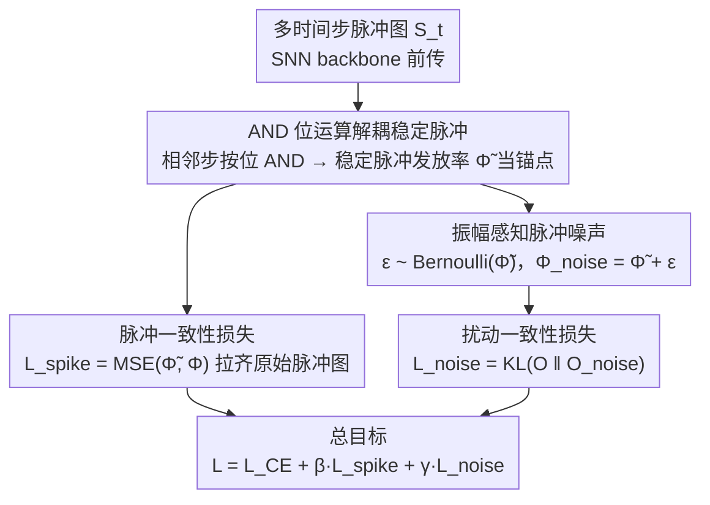

<!-- 由 src/gen_stubs.py 自动生成 -->
# Stable Spike: Dual Consistency Optimization via Bitwise AND Operations for Spiking Neural Networks

**会议**: CVPR2026  
**arXiv**: [2603.11676](https://arxiv.org/abs/2603.11676)  
**代码**: 待确认  
**领域**: 时间序列  
**关键词**: 脉冲神经网络, 时间步一致性, 位运算AND, 稳定脉冲骨架, 振幅感知噪声, 神经形态识别, 低延迟推理

## 一句话总结

提出 Stable Spike 双一致性优化框架，利用硬件友好的 AND 位运算从多时间步脉冲图中解耦稳定脉冲骨架，并注入振幅感知脉冲噪声增强泛化，在超低延迟(T=2)下将神经形态物体识别精度提升最高 8.33%。

## 研究背景与动机

**SNN 低功耗优势**：脉冲神经网络通过稀疏二值脉冲传递信息，在神经形态芯片上仅需加法运算，功耗远低于传统 ANN，是实现低功耗AI的重要范式。

**时间步不一致性问题**：SNN 在不同时间步的神经元状态和输入电流存在差异，导致脉冲图(spike map)在多时间步之间差异过大，严重影响整体表示质量和预测稳定性。

**早期时间步尤为混乱**：由于膜电位通常初始化为0，早期时间步的输出比后期更加混乱，这在低延迟推理场景下尤为致命。

**已有方法局限**：MPS 等方法通过修改神经元动力学间接促进一致性，但需要改变神经元模型，难以在神经形态芯片上通用部署（芯片上神经元模型通常是预设的）。

**SNN 噪声的特殊要求**：与 ANN 可直接使用高斯噪声不同，SNN 的二值离散特性要求噪声也是离散的，否则会造成训练-推理精度不匹配；同时脉冲发放率对噪声振幅更敏感。

**超低延迟的实际需求**：神经形态物体识别追求低延迟(T≤4)推理，但现有方法通常需要10+时间步才能取得良好性能，亟需低延迟下的性能提升方案。

## 方法详解

### 整体框架

Stable Spike 想解决的是 SNN 在不同时间步脉冲图差异过大、低延迟下早期时间步尤其混乱的问题。它不去改神经元动力学，而是在训练阶段加上**双一致性优化**：一条线从相邻时间步的脉冲图里用 AND 位运算抽出「稳定脉冲骨架」，把原始脉冲图往这个锚点上拉齐；另一条线在稳定脉冲发放率上注入离散噪声，逼模型对扰动给出一致预测。两条线合到同一个目标里训练，推理时完全不增加额外结构：$\mathcal{L}_{total} = \mathcal{L}_{CE} + \beta \mathcal{L}_{spike} + \gamma \mathcal{L}_{noise}$。

### 关键设计

**1. AND 位运算解耦稳定脉冲：把跨时间步一致的语义骨架挑出来当锚点**

时间步之间脉冲图为什么差异大？因为膜电位初始化为 0，早期时间步的发放本身就乱。作者的做法是对相邻时间步 $t$ 和 $t+1$ 的脉冲图做按位 AND，只保留两步都发放的位置：$\tilde{S}_{i,t} = S_{i,t} \mathbin{\&} S_{i,t+1}$。从 $T$ 个脉冲图能提出 $T-1$ 个稳定脉冲图，再平均成稳定脉冲发放率 $\tilde{\Phi} = \frac{1}{T-1}\sum_{t=0}^{T-2}\tilde{S}_t$ 当特征骨架。AND 的关键在于它只检索 (1,1) 对——两步都发放才算数，天然把只在单步出现的噪声脉冲过滤掉；相比之下 OR 会把一致和不一致的脉冲一起捞进来、XOR 干脆只留不一致的，语义都不如 AND 纯净。这套运算又正好是神经形态芯片原生支持的，所以不用改神经元、即插即用。

**2. 振幅感知脉冲噪声：让扰动强度跟着发放率走，既练泛化又不毁关键语义**

SNN 的二值离散特性让它没法像 ANN 那样直接加高斯噪声——连续噪声会造成训练-推理格式不匹配，而脉冲发放率对噪声振幅又特别敏感。作者让噪声概率正比于稳定脉冲发放率：$\varepsilon_{c,i,j} = \text{Bernoulli}(\tilde{\Phi}_{c,i,j})$。发放率高的元素更可能被扰动、充分促进泛化，发放率低的元素几乎不动、避免把关键语义破坏掉；而且噪声本身是离散二值的，和脉冲数据格式一致。扰动后的发放率 $\Phi_{noise} = \tilde{\Phi} + \varepsilon$ 前传得到噪声预测 $O_{noise}$，再要求它和原预测保持一致。

### 损失函数

| 损失 | 公式 | 作用 |
|------|------|------|
| 脉冲一致性损失 | $\mathcal{L}_{spike} = \text{MSE}(\tilde{\Phi}, \Phi)$ | 引导原始脉冲图向稳定骨架收敛 |
| 扰动一致性损失 | $\mathcal{L}_{noise} = \alpha^2 \text{KL}(O \| O_{noise})$ | 鼓励对噪声扰动产生一致预测 |
| 分类损失 | $\mathcal{L}_{CE}$ | 标准交叉熵 |

温度参数 $\alpha=2$，平衡系数 $\beta=\gamma=1.0$。仅对 backbone 特征计算稳定脉冲，额外开销仅为分类器的一次前传。

## 实验

### 主要结果

**神经形态数据集（低延迟 T=4）**：

| 方法 | 架构 | T | CIFAR10-DVS | DVS-Gesture | N-Caltech101 |
|------|------|---|-------------|-------------|--------------|
| TAB (ICLR'24) | VGG-9 | 4 | - | 87.50 | - |
| SLT (AAAI'24) | VGG-9 | 4 | - | 88.19 | - |
| CLIF (ICML'24) | VGG-9 | 4 | - | 89.58 | - |
| **Ours** | **VGG-9** | **4** | **77.1** | **94.44** | **83.92** |
| QKFormer (NeurIPS'24) | QKFormer | 4 | 81.2 | 93.75 | - |
| **Ours** | **QKFormer** | **4** | **82.9** | **95.49** | - |

**ImageNet（T=4, ResNet-34）**：达 70.59%，超越 MPS(69.03%)、STAA-SNN(70.40%) 等所有对比方法。

### 消融实验

**双损失组合效果（VGG-9, T=4）**：

| 配置 | CIFAR10-DVS | DVS-Gesture |
|------|-------------|-------------|
| Baseline | 72.9 | 87.15 |
| +$\mathcal{L}_{spike}$ | 75.2 (+2.4) | 91.32 (+4.17) |
| +$\mathcal{L}_{noise}$ | 75.4 (+2.6) | 94.09 (+6.94) |
| +Both | **77.1 (+4.2)** | **94.44 (+7.29)** |

**位运算选择**：AND 优于 OR（DVS-Gesture: 94.44 vs 88.54）和 XOR（89.58），OR 因同时检索一致/不一致脉冲导致严重退化。

**噪声设计消融**：固定概率脉冲噪声(p=0.5时DVS-Gesture 88.89%)或连续高斯噪声(std=0.5时91.67%)均显著逊于振幅感知脉冲噪声(94.44%)。

### 关键发现

- **超低延迟优势突出**：T=2 时 DVS-Gesture 提升 8.33%（83.68→92.01），低延迟下提升越显著
- **功耗降低**：除第一层外，所有层的脉冲发放率更低，整体功耗从 189.83 降至 181.02（×10⁶pJ）
- **损失景观更平滑**：消除尖锐局部极值，呈单一全局最优趋势，优化更稳定
- **与其他方法兼容**：可与 Knowledge-Transfer 协同，N-Caltech101 达 94.25%

## 亮点

- AND 位运算解耦稳定脉冲的思路简洁有效，硬件友好且即插即用，无需修改神经元或架构
- 振幅感知脉冲噪声巧妙解决 SNN 离散性和噪声敏感性的双重约束
- 在超低延迟(T=2)场景下性能提升极为显著，直接推进 SNN 实用化
- 跨架构(VGG/ResNet/Transformer)、跨数据类型(神经形态/静态)的广泛验证

## 局限性

- 需要至少 T≥2 个时间步才能计算 AND，T=1 场景不适用
- 平衡系数 $\beta, \gamma$ 对性能有一定影响（92.01%~95.14%），需要针对数据集调参
- 仅针对分类任务验证，未扩展到检测、分割等下游任务
- 静态数据集上的提升不如神经形态数据集显著

## 相关工作

- **MPS (ICLR'25)**：通过膜电位平滑和相邻时间步 logit 蒸馏间接促进一致性，需修改神经元动力学
- **Knowledge-Transfer (AAAI'24)**：从静态数据向神经形态数据迁移知识，与本文方法互补
- **QKFormer (NeurIPS'24)**：Transformer 风格 SNN 架构，本文方法可在其基础上进一步提升
- **STAA-SNN (CVPR'25)**：关注 SNN 时空注意力增强，ImageNet 上与本文性能接近
- **EnOF-SNN / BKDSNN**：通过知识蒸馏/对比学习促进空间一致性，但缺乏时间维度的稳定锚点

## 评分

- 新颖性: ⭐⭐⭐⭐ — AND 位运算解耦稳定脉冲的视角新颖，振幅感知噪声设计巧妙
- 实验充分度: ⭐⭐⭐⭐⭐ — 3种架构×多数据集，消融覆盖位运算/噪声/超参/时间步/功耗/损失景观
- 写作质量: ⭐⭐⭐⭐ — 动机清晰，方法推导完整，图表丰富
- 价值: ⭐⭐⭐⭐ — 即插即用的SNN增强方案，超低延迟提升显著，对神经形态计算实用化有推动意义

<!-- RELATED:START -->

## 相关论文

- [\[ICLR 2026\] Weight-Space Linear Recurrent Neural Networks](../../ICLR2026/time_series/weight-space_linear_recurrent_neural_networks.md)
- [\[ICLR 2026\] Tuning the burn-in phase in training recurrent neural networks improves their performance](../../ICLR2026/time_series/tuning_the_burn-in_phase_in_training_recurrent_neural_networks_improves_their_pe.md)
- [\[AAAI 2026\] Urban Incident Prediction with Graph Neural Networks: Integrating Government Ratings and Crowdsourced Reports](../../AAAI2026/time_series/urban_incident_prediction_with_graph_neural_networks_integrating_government_rati.md)
- [\[CVPR 2026\] Real-Time Long Horizon Air Quality Forecasting via Group-Relative Policy Optimization](real-time_long_horizon_air_quality_forecasting_via_group-relative_policy_optimiz.md)
- [\[AAAI 2026\] Transparent Networks for Multivariate Time Series](../../AAAI2026/time_series/transparent_networks_for_multivariate_time_series.md)

<!-- RELATED:END -->
