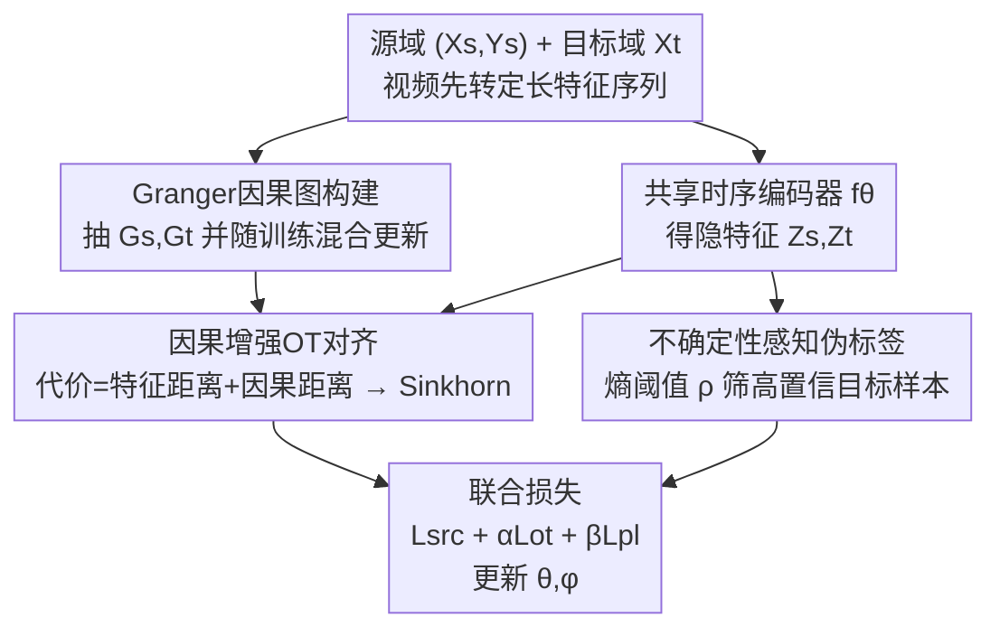

# Towards Uncertainty-aware Unsupervised Domain Adaptation for Videos and Time-Series with Causal Optimal Transport

**会议**: CVPR 2026  
**论文**: [CVF Open Access](https://openaccess.thecvf.com/content/CVPR2026/html/Mishra_Towards_Uncertainty-aware_Unsupervised_Domain_Adaptation_for_Videos_and_Time-Series_with_CVPR_2026_paper.html)  
**代码**: 待确认（论文称 CausalOT/README.md，未给出公开仓库）  
**领域**: 时序 / 视频无监督域适应  
**关键词**: 无监督域适应, 最优传输, Granger因果, 伪标签, 不确定性校准

## 一句话总结
本文提出 Causal-OT：把通道间的 Granger 因果图嵌进最优传输（OT）的代价矩阵里做跨域对齐，同时用基于熵的不确定性筛选伪标签，让时序与视频的无监督域适应既保住时间-因果结构、又不被过自信的伪标签带偏，在 6 个时序基准上平均涨 4.5% 准确率、4 个视频基准上涨 2.5%。

## 研究背景与动机
**领域现状**：无监督域适应（UDA）要把一个有标签的源域模型迁到无标签的目标域。在 1D 时序（人体活动识别、传感器信号、睡眠分期等）和视频动作识别里，主流做法要么用最优传输（OT）/最大均值差异（MMD）做分布对齐，要么把图像域的伪标签自训练直接搬过来。

**现有痛点**：这两类做法各有硬伤。分布对齐类（如基于 OT 的 TransPL、MMD 类方法）通常把各通道当成相互独立、与时间无关的特征来匹配，丢掉了多通道之间随时间演化的依赖关系——而这些依赖恰恰是因果性的。伪标签类则严重依赖模型预测的类别概率，但时序模型在域偏移下往往**过自信**（confidence 很高但预测是错的），错误伪标签在自训练中被不断强化，形成 confirmation bias，把模型越带越偏。论文 Figure 1 给出实证：基线 TransPL 在 SSC 上 ECE（期望校准误差）高达 13.55，说明置信度与真实正确率严重错位。

**核心矛盾**：现有方法把**时间对齐**和**不确定性抑制**当成两个互相独立的目标分开优化，这种割裂既无法刻画通道间的因果依赖，也忽视了预测不确定性会反过来污染对齐质量。结果就是表示的可迁移性受限、训练不稳定。

**本文目标**：用一个统一框架同时解决三件事——分布对齐、因果结构保持、预测不确定性，而这三者在以往工作里只被各覆盖一部分（见下文 Table 1）。

**切入角度**：作者的关键假设是，跨域真正不变的不是某个通道的数值分布，而是通道之间的**因果机制**（如加速度计的重力分量在不同用户间稳定，但陀螺仪/EMG 信号会因设备位置而剧变）。因此与其对齐"特征长什么样"，不如对齐"特征之间的因果结构"。

**核心 idea**：把 Granger 因果图作为域不变的归纳先验直接焊进 OT 的代价矩阵，让传输计划既对齐特征分布、又对齐因果结构；再用熵阈值筛掉不可靠伪标签，避免噪声自我强化。

## 方法详解

### 整体框架
Causal-OT 的输入是有标签源域时序 $(X_s, Y_s)$ 和无标签目标域时序 $X_t$（视频先被转成定长深度特征序列，复用同一套时序管线）。整体流程是：先在原始信号上为两域各抽一张 Granger 因果图 $(G_s, G_t)$；再用一个共享时序编码器 $f_\theta$ 把样本映射到隐空间特征 $(Z_s, Z_t)$；然后构造一个**同时含特征距离与因果图距离**的代价矩阵 $C$，解熵正则化 OT 得到传输计划 $\gamma^*$ 做跨域对齐；分类头 $h_\phi$ 在源域上有监督训练并给目标样本打伪标签，但只保留低熵（高置信）的目标样本参与训练；最后用 $\mathcal{L}_{total}=\mathcal{L}_{src}+\alpha\mathcal{L}_{OT}+\beta\mathcal{L}_{PL}$ 端到端联合更新 $\theta$ 和 $\phi$。

视频侧不改核心模型，只换输入接口：每段视频均匀切成 $T$ 段（实测 $T=5$ 最优），每段用 ResNet-101（TA3N 风格）或 3D backbone 抽段级嵌入，再经源域统计标准化 + PCA 压成 $X\in\mathbb{R}^{d\times T}$（默认 $d=2048$），之后因果图抽取/OT 对齐/伪标签全部与时序设定一模一样。

### 关键设计

**1. Granger 因果图构建 + 原始信号/隐特征混合更新：用"通道因果结构"当域不变先验，且让它随训练保持一致**

痛点是：把多通道当独立特征对齐会丢掉通道间随时间演化的依赖；但如果只在原始信号上估一次因果图、之后再不更新，编码器学出的特征 $Z=f_\theta(X)$ 会在训练中漂走，固定的图就和当前表示对不上了。作者用 Granger 因果为每个域算一张有向图 $G=(V,E,W)$，节点 $V$ 是 $d$ 个通道，邻接矩阵 $W\in\mathbb{R}^{d\times d}$ 存 Granger 影响分数。为了稳健：先用 Augmented Dickey-Fuller 检验信号平稳性，用 BIC 选 VAR 模型最优滞后阶 $p$，只保留 p-value < 0.05 的边，再把 $W$ 按行归一化。图的 Laplacian $L=D-W$ 做特征分解，取前 $k$ 个非平凡特征向量得到每节点的因果描述子 $\phi_i=\Phi(G)[i]$。

关键在"混合更新"策略：在原始信号 $X$ 上算 $\{G_s,G_t\}$ 做初始化（因为原始信号反映真实时间依赖、最可靠），warm-up $W_{init}$ 个 epoch 后，每隔 $T$ 个 epoch 在当前隐特征 $Z^{(t)}$ 上重估因果图，并与原始图按 $A^{(t)}=\alpha A_X+(1-\alpha)A_Z^{(t)}$ 融合，其中 $\alpha\in[0.6,0.9]$ 偏向稳定的原始信号结构。这样因果项始终跟着训练演化、能真正影响传输耦合 $\gamma$，而不是退化成一个常数偏置。

**2. 因果增强的最优传输代价 + Sinkhorn 对齐：把"因果结构距离"焊进 OT 代价矩阵**

只对齐特征点对几何关系（标准 OT）不够，作者要让对齐同时尊重高阶时间依赖。于是把源、目标样本之间的成对代价定义为特征距离与因果描述子距离的加权和：

$$C_{ij}=\|f_s(x_i^s)-f_t(x_j^t)\|_2^2+\lambda\|\phi_i^s-\phi_j^t\|_2^2$$

第一项是隐特征相似度，第二项是两样本对应的因果嵌入差异，$\lambda$ 控制因果项权重。由于 $C_{ij}$ 全程可微，整套可端到端梯度优化。然后在该代价矩阵上解熵正则化 OT：

$$\gamma^*=\arg\min_{\gamma\in\Pi(\mu_s,\mu_t)}\langle\gamma,C\rangle+\varepsilon H(\gamma)$$

其中 $\Pi(\mu_s,\mu_t)$ 是固定边缘分布的耦合集合，$H(\gamma)=\sum_{ij}\gamma_{ij}\log\gamma_{ij}$ 是熵正则项，$\varepsilon>0$ 控制平滑度，用 Sinkhorn 迭代高效求解。因为 $C_{ij}$ 依赖于因果项，因果结构会**主动调制**最优耦合，把源/目标特征映到"因果一致"的位置，而非只对齐数值。作者把这套"特征对齐 + 图结构对齐"的双层正则视为核心创新，认为它能（i）跨域强制因果动力学的结构对齐、（ii）通过抑制对伪相关的敏感性稳定训练、（iii）让传输映射尊重共享因果机制从而稳健泛化。

> ⚠️ 论文 contribution 里提到用 "Frobenius-norm graph alignment loss" 对齐两域的传输诱导因果结构，但正文方法部分实际是把因果描述子距离 $\|\phi_i^s-\phi_j^t\|_2^2$ 写进 OT 代价矩阵来实现的，二者表述略有出入，以原文公式 (2) 为准。

**3. 不确定性感知伪标签：用预测熵筛掉过自信的错误目标样本**

伪标签在早期训练或强域偏移下噪声极大，而时序模型又偏过自信，直接全用会放大错误。作者对每个目标样本算 soft 预测 $\hat y_t^j=h_\phi(Z_t^j)\in\Delta^K$，再用预测分布的熵衡量不确定性：

$$U_t^j=-\sum_{k=1}^K \hat y_{t,j}^{(k)}\log \hat y_{t,j}^{(k)}$$

只保留熵低于阈值 $\rho$ 的样本组成可信索引集 $I=\{j\mid U_t^j<\rho\}$（实现里 $\rho=0.5$），这些低熵=高置信样本才被当作伪标签（soft 或 hard）算损失。这样既减少标签噪声、又把训练集中在可靠样本上。一个值得注意的点：伪标签是在 **OT 对齐后的因果一致特征**上算的，所以即使在目标域也能保持时间一致性，而不是在原始噪声特征上盲打伪标签。

### 损失函数 / 训练策略
总目标是三项加权和：

$$\mathcal{L}_{total}=\mathcal{L}_{src}+\alpha\mathcal{L}_{OT}+\beta\mathcal{L}_{PL}$$

- **源分类损失** $\mathcal{L}_{src}=\frac{1}{N_s}\sum_i \text{CE}(h_\phi(Z_s^i),y_s^i)$，用干净标签锚定决策边界。
- **因果 OT 损失** $\mathcal{L}_{OT}=\langle\gamma^*,C\rangle$，用上面含因果项的代价矩阵做对齐。
- **不确定性伪标签损失** $\mathcal{L}_{PL}=\frac{1}{|I|}\sum_{j\in I}\text{CE}(h_\phi(Z_t^j),\hat y_t^j)$，只在筛后集合 $I$ 上算。

超参：因果正则系数 1.0、Sinkhorn 正则 0.01、熵阈值 0.5，$\alpha=\beta=1.0$ 全任务固定，学习率 $1\times10^{-3}$、weight decay $1\times10^{-4}$，训练 100 epoch；backbone 是 CNN+TCN+LSTM 的共享结构，按数据集调超参。

作者还给了**理论支撑**（Proposition 1）：在 $\ell$ 为 $L$-Lipschitz 且有界的代理损失下，目标风险被界为

$$R_t(h)\le R_s(h)+L\,\mathbb{E}_{\gamma^*}[\|f_s(x_s)-f_t(x_t)\|]+\lambda\,\mathbb{E}_{\gamma^*}[\|\phi_i^s-\phi_j^t\|]+D_{\mathcal{H}}(P_s,P_t)$$

即最小化 causal-OT 目标同时压低了特征级距离、因果结构失配与假设差异，从而提升域偏移下的可迁移性——这正好补上 TransPL 等纯经验方法缺乏的对"因果失配 + 伪标签不确定性"的理论刻画。

## 实验关键数据

### 主实验
时序侧在 6 个基准（UCIHAR / WISDM / HHAR / SSC / MFD / Boiler）上评测，每个用户当一个域，按 AdaTime 协议选 10 个源-目标对。视频侧用 UCF101 / HMDB51 / Kinetics-600 / Gameplay 做跨域动作识别。

WISDM 与 UCIHAR 上的平均准确率对比（节选代表性基线）：

| 数据集 | 指标 | No Adapt | TransPL | CoDATS | SHOT | 本文 Causal-OT |
|--------|------|----------|---------|--------|------|----------------|
| WISDM | Acc% | 59.8 | 64.0 | 63.7 | 62.2 | **68.03** |
| UCIHAR | Acc% | 57.0 | 69.0 | 62.7 | 67.8 | **73.97** |

视频侧 UCF101↔HMDB51（full，ResNet-101 backbone）：

| 方法 | U→H | H→U | 平均 |
|------|-----|-----|------|
| Source Only | 73.9 | 71.7 | 72.8 |
| TA3N | 78.3 | 81.8 | 80.1 |
| MA2LT-D | 85.0 | 86.6 | 85.8 |
| TransferAttn | 88.1 | 88.3 | 88.2 |
| 本文 Causal-OT | **90.2** | **89.5** | **89.85** |

相比强基线 TransPL，UCIHAR 上提升 +4.97%；视频两个方向均超过此前最好的 TransferAttn 约 1.6%。

### 消融实验
| 配置 | 关键指标（HHAR 对齐分） | 说明 |
|------|------------------------|------|
| Sinkhorn OT 求解器 | 0.84 | 最佳对齐，本文默认 |
| Greenkhorn | 0.81 | 略降，计算/稳定性有小折中 |
| Unbalanced OT | 0.79 | 最低 |
| w/o 不确定性建模 | 见 supp Fig.18 | WISDM 多对上去掉后掉点 |

### 关键发现
- **OT 求解器**：Sinkhorn 对齐质量最高（0.84），Greenkhorn/Unbalanced 略逊，说明熵正则化的标准 Sinkhorn 在该框架下兼顾对齐与稳定性最好。
- **校准显著改善**：Figure 1 显示 ECE 从 TransPL 的 13.55（SSC）/4.37（MFD）降到 11.23/3.78，置信度更可靠、过自信被压下来——这正是不确定性感知伪标签的直接收益。
- **不确定性与 F1 近似线性负相关**（supp Fig.8a）：熵越低 F1 越高，说明模型的熵估计确实和预测质量挂钩，是可泛化现象而非特定数据假象。
- **可迁移距离损失**（Fig.6）在所有迁移场景上随 epoch 稳定下降到 −0.6 ~ −1.2，越负代表域对齐越强，反映训练稳健、跨任务一致。

## 亮点与洞察
- **把"对齐什么"从分布换成因果结构**：核心洞察是跨域真正不变的是通道间因果机制而非数值分布，于是不直接对齐特征、而是把 Granger 因果图距离塞进 OT 代价矩阵。这个"用因果描述子改造传输代价"的思路可迁移到任何有结构先验的对齐任务。
- **混合更新化解"静态图漂移"难题**：在原始信号上初始化、再周期性在隐特征上重估并按 $\alpha$ 融合，巧妙绕开了"固定因果图会和演化特征脱节"的坑，值得复用到任何"先验图 + 表示学习"联合训练的场景。
- **伪标签放在对齐后特征上算**：先 OT 对齐到因果一致空间、再打伪标签，相当于让不确定性筛选作用在更干净的表示上，比在原始噪声特征上盲打更可靠——这是个容易被忽略的执行顺序细节。
- **一套框架吃两种模态**：视频只通过"转成定长深度特征序列"接入，核心模型零改动就泛化到视频 UDA，说明该框架的模态无关性。

## 局限与展望
- **作者承认**：未来需探索自适应阈值、因果图平滑、演化因果结构以拓宽实用性——暗示当前熵阈值 $\rho$、融合系数 $\alpha$ 等都是固定超参，缺乏自适应。
- **因果图依赖 Granger/VAR 假设**：Granger 因果建立在线性 VAR + 平稳性检验上，对强非线性、非平稳或长程依赖的通道关系可能刻画不足；通道数 $d$ 很大时 $d\times d$ 邻接矩阵与特征分解的开销也会上升。
- **表述与可复现性存疑**：contribution 提到的 Frobenius-norm 图对齐损失与正文 OT 代价实现不完全一致；代码只给了 "CausalOT/README.md" 而无公开仓库链接，复现门槛偏高。大量关键结果（HHAR、PTB、视频 Kinetics/Gameplay、消融）都被放进 supplementary，正文证据相对单薄。
- **改进思路**：把线性 Granger 换成神经 Granger 或注意力式因果发现以处理非线性依赖；把固定熵阈值 $\rho$ 改成随训练 schedule 或基于 batch 统计的自适应阈值，缓解早期高熵样本被一刀切丢弃的问题。

## 相关工作与启发
- **vs TransPL**：TransPL 是时序 UDA 里较早的训练式方法，用 OT + Transformer 做特征对齐 + 伪标签，但不建模因果结构、也不显式处理预测不确定性，校准差（ECE 13.55）。本文在它基础上把因果图嵌进 OT 代价、加熵筛伪标签，并补了泛化上界的理论分析，准确率与校准双升。
- **vs CauDiTS**：CauDiTS 走因果解耦表示学习路线，强调因果但不做分布对齐。本文把因果与 OT 分布对齐统一在一个传输代价里，兼顾两者。
- **vs RAINCOAT**：RAINCOAT 处理特征与标签偏移、强调分布对齐，但同样不显式建因果结构、不做不确定性筛选；本文 Table 1 主张自己是唯一同时覆盖"分布对齐 + 因果保持 + 不确定性"三者的方法。
- **启发**：把领域先验（因果图/物理约束/拓扑结构）改造成 OT 代价的一部分，是一种比"对齐后再加正则"更紧耦合的注入方式，值得在跨域分割、跨模态检索等需要结构一致性的任务上尝试。

## 评分
- 新颖性: ⭐⭐⭐⭐ 把 Granger 因果图嵌进 OT 代价 + 熵感知伪标签的统一框架，组合是新的，且配了泛化上界，但每个组件（OT 对齐、因果图、熵筛选）单看都是已有工具的拼装。
- 实验充分度: ⭐⭐⭐ 覆盖 6 时序 + 4 视频基准、多种基线，主结果有说服力；但正文表格偏少、大量关键消融与数据集塞进 supplementary，正文自洽证据略单薄。
- 写作质量: ⭐⭐⭐ 动机和方法逻辑清楚、公式完整，但存在 contribution 与正文实现表述不一致、个别句子语法粗糙等问题。
- 价值: ⭐⭐⭐⭐ 时序/视频 UDA 中"因果结构 + 不确定性"联合建模这个角度实用，校准改善对落地（活动识别、传感器）有实际意义，可复现性是主要折扣。

<!-- RELATED:START -->

## 相关论文

- [\[ICML 2025\] TransPL: VQ-Code Transition Matrices for Pseudo-Labeling of Time Series Unsupervised Domain Adaptation](../../ICML2025/time_series/transpl_vq-code_transition_matrices_for_pseudo-labeling_of_time_series_unsupervi.md)
- [\[CVPR 2026\] SATTC: Structure-Aware Label-Free Test-Time Calibration for Cross-Subject EEG-to-Image Retrieval](sattc_structure-aware_label-free_test-time_calibration_for_cross-subject_eeg-to-.md)
- [\[AAAI 2026\] Optimal Look-back Horizon for Time Series Forecasting in Federated Learning](../../AAAI2026/time_series/optimal_look-back_horizon_for_time_series_forecasting_in_federated_learning.md)
- [\[AAAI 2026\] Interpreting Fedspeak with Confidence: A LLM-Based Uncertainty-Aware Framework Guided by Monetary Policy Transmission Paths](../../AAAI2026/time_series/interpreting_fedspeak_with_confidence_a_llm-based_uncertainty-aware_framework_gu.md)
- [\[AAAI 2026\] ProbFM: Probabilistic Time Series Foundation Model with Uncertainty Decomposition](../../AAAI2026/time_series/probfm_probabilistic_time_series_foundation_model_with_uncertainty_decomposition.md)

<!-- RELATED:END -->
