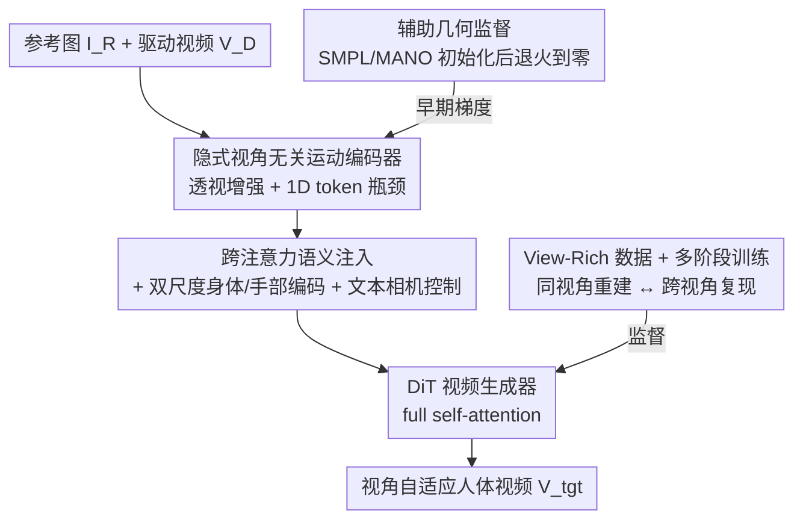

# 3D-Aware Implicit Motion Control for View-Adaptive Human Video Generation

**会议**: CVPR 2026  
**论文**: [CVF Open Access](https://openaccess.thecvf.com/content/CVPR2026/html/Fang_3D-Aware_Implicit_Motion_Control_for_View-Adaptive_Human_Video_Generation_CVPR_2026_paper.html)  
**代码**: [项目主页](https://hjrphoebus.github.io/3DiMo)（暂未见代码仓库）  
**领域**: 视频生成 / 扩散模型 / 人体动画  
**关键词**: 人体运动控制、隐式运动表示、3D 感知、视频扩散、文本相机控制

## 一句话总结
3DiMo 把人体运动控制从「依赖外部 SMPL 重建」改成「与视频生成器联合端到端学一套视角无关的隐式运动 token」，靠跨注意力语义注入 + 多视角富数据监督让模型从 2D 驱动帧里恢复真正的 3D 运动，从而在忠实复现动作的同时支持文本自由控制相机视角，运动保真度和画质都显著超过 2D 姿态与 SMPL 基线。

## 研究背景与动机
**领域现状**：人体图像动画（用驱动视频的动作去驱动一张参考图）目前主流是给生成器喂「显式运动信号」。一类是 2D 姿态/DensePose（AnimateAnyone、MimicMotion），靠像素对齐注入；另一类是用 SMPL(-X) 这种参数化 3D 网格（Uni3C、MTVCrafter），渲染或投影成 2D 再做控制。

**现有痛点**：2D 姿态把运动**死死绑在驱动视角上**——生成视频本质上是驱动视角的 2D 投影，没法换视角、没法做电影感运镜。SMPL 这类显式 3D 看似引入了几何，但参数化重建本身有深度歧义（前倾、肢体接触错误、Z 轴运动失真）和动力学不准；更糟的是，当这些**有偏的 3D 信号通过刚性投影对齐**强加给生成器时，会**压住大模型本身的 3D 先验**，反而让运动更不合理。

**核心矛盾**：大规模视频生成器其实已经具备很强的 3D 空间与运动推理能力，但现有方法用「外部重建的显式约束」去控制它，等于让一个本来懂 3D 的模型去服从一个不懂 3D 的老师，二者打架。

**本文目标**：让模型从 2D 驱动帧里**隐式地恢复底层 3D 运动**，同时把相机控制解耦出来交给文本自由指挥。

**切入角度**：作者主张两条原则——(1) 运动编码器应该和生成器**端到端联合训练**，让运动表示天然对齐生成器的空间先验，而不是靠刚性投影；(2) 想逼出真正的 3D 感知，必须用**跨视角监督**，因为只做同视角重建模型只会学到 2D 投影规律。

**核心 idea**：用「与生成器联合学到的、视角无关的隐式运动 token」替代「外部 SMPL 重建」，并用多视角富数据强制运动跨视角一致，让 3D 感知和文本相机控制作为副产品自然涌现。

## 方法详解

### 整体框架
给定一张参考图 $I_R$ 和一段驱动视频 $V_D=\{I_D^t\}$，3DiMo 要把驱动视频里**本质存在于 3D 空间**的运动迁移到参考主体上，同时保留文本指定的相机轨迹。整条管线是：驱动帧先做随机透视变换增强 → 送进运动编码器（身体编码器 $E_b$ + 手部编码器 $E_h$）蒸馏成紧凑的 1D 运动 token → 通过跨注意力注入到一个预训练 DiT 视频生成器里，与参考图 token、文本 token 一起在 full self-attention 中交互 → 生成器吐出目标视频 $V_{tgt}$，让参考主体重演同一套 3D 运动，相机则听文本的。

训练上有两个并行的监督目标——**同视角重建**（输出就是驱动视频本身）和**跨视角复现**（输出是同一动作在另一视角/相机轨迹下拍的视频）——靠一个覆盖单视角/多视角/运动相机的 view-rich 数据集驱动。早期还挂一个轻量几何解码器，把运动特征回归到 SMPL/MANO 参数做初始化，随训练退火到零。推理时编码器直接从 2D 驱动帧抽运动 token，就能驱动任意参考角色。

### 关键设计

**1. 隐式视角无关运动编码器：用 1D token 瓶颈把 2D 布局挤掉，只留运动语义**

痛点是 2D 姿态会把运动绑死在驱动视角。作者的解法是把运动编码器设计成一个 Transformer 的 1D tokenizer：每帧 patchify 成视觉 token 后，拼上 $K{=}5$ 个可学习的 latent token，经过若干注意力层交互，**只保留输出的 latent token** 作为运动表示。这个「压成极少量 1D token」的语义瓶颈强行丢掉了 2D 结构信息——外观细节和视角特定的姿态布局都被挤掉，只剩 3D 空间运动的内在语义。为了进一步逼出视角无关，编码前对驱动帧做**随机透视变换**（motion-invariant 增强），把空间运动和它的视角特定 2D 投影解耦；再叠加颜色抖动等外观增强防止驱动帧的身份泄漏。和 X-Nemo、X-UniMotion 这类同样做隐式表示的工作相比，关键区别在于后者仍停在 2D 空间模式、没法泛化到真 3D 运动和相机控制，而 1D 瓶颈 + 透视增强 + 联合训练是这里逼出 3D 的组合拳。

**2. 跨注意力语义注入 + 双尺度编码 + 文本相机控制：不做刚性投影，让运动和相机各管各的**

既然不想用显式相机参数把运动转成视角相关的 2D 对齐控制，作者直接用**跨注意力**把运动 token 注入生成器：在 DiT 每个 full self-attention 之后接一层 cross-attention，**只让视频 token 去 attend 运动 token，文本 token 保持不变**。这样运动是「语义级」交互而非刚性空间约束，于是生成器原生的文本驱动相机控制能力得以保留——想换视角只要在文本里加一句相机运动描述（如 "the camera arcs left"），它走的还是 DiT 原来那条 text→视觉的通路。换句话说，运动控制走 cross-attention、相机控制走 text，两条路天然解耦，相机控制成了 3D 感知的副产品和「是否真学到 3D」的试金石。考虑到单一紧凑表示同时抓全身大动作和手部精细动作很吃力，作者用**双尺度**两个编码器——身体编码器 $E_b$ 抓粗粒度躯干运动、手部编码器 $E_h$ 抓精细手势——把两路 token 拼接 $z=[z_b;z_h]$ 后一起注入，实现全身 + 手部的统一控制。

**3. View-Rich 数据 + 多阶段训练：用跨视角监督逼出真 3D，而不是 2D 投影**

光有 1D 瓶颈还不够：如果只做**同视角重建**，模型完全可以靠学「视角相关的 2D 运动模式」蒙混过关，因为同视角复现根本不需要真正的空间推理。作者的对策是构造一个 view-rich 数据集，从监督目标角度提供三类样本——(1) 同视角重建（自监督学表现力丰富的运动动力学）；(2) 多视角复现（固定相机阵列拍同一动作的同步多视角，强制跨视角运动一致）；(3) 运动相机下复现（同一动作配不同相机轨迹，把运动和视角解耦、支撑文本相机控制）。数据来源混了三种：~600K 互联网视频（量大、运动多样但只有单视角）、~60K UE5 渲染（精确运动 + 多样相机轨迹但有域差）、~100K 真实多视角/运动相机采集（真 3D 监督）。相机视角/运动的文本描述用 Qwen2.5-VL 统一标注。训练采用**渐进多阶段**：第一阶段只用单视角数据做自重建，稳定初始化运动学习；第二阶段引入重建 + 跨视角复现的均衡混合，把表示从 2D 动力学过渡到 3D 空间语义；第三阶段完全用多视角 + 运动相机数据，强化视角无关性和文本相机控制的兼容性。一个细节：参考图取自监督目标的首帧，自动让生成运动和参考主体的朝向对齐，省掉了 Uni3C 那种显式 SMPL-到-图对齐或相机回归。

**4. 辅助几何监督退火：早期借 SMPL 站起来，站稳了就把拐杖撤掉**

直接端到端训练收敛慢且不稳，尤其引入跨视角监督后。原因有二：diffusion loss 在像素上均匀分布、缺乏对运动语义的针对性强调；且强大的 DiT backbone 早期倾向用自带先验从单图硬生成看似合理的视频，于是运动表示拿到的梯度反馈很弱。作者挂一个轻量 MLP 几何解码器 $D_g$，把拼接的运动表示 $z=[z_b;z_h]$ 回归到姿态参数 $\theta=[\theta_b;\theta_h]$，伪标签来自现成 SMPL/MANO 估计器；**关键是监督时排除全局根朝向**，以保证视角无关学习。SMPL 虽有深度歧义和表现力局限，但作为「易优化的轻量辅助解码器」能高效灌入鲁棒的 3D 人体先验，给后续学习一个良好初始化。这个监督只在第一阶段和第二阶段前期施加，loss 权重**逐步退火**，第二阶段后段及整个第三阶段完全移除——让模型从「几何引导的初始化」演化到「对齐 DiT 感知与生成能力的运动表示」，最终摆脱外部估计、长出真正的 3D 感知。

### 损失函数 / 训练策略
主目标是 flow-based diffusion 的 v-prediction 重建损失（同视角 / 跨视角两套目标视频）；辅助几何损失是运动特征到 SMPL/MANO 姿态参数的回归，权重随训练退火到零。三阶段分别跑 10K / 15K / 5K 步，121 帧、480×854、batch 64、Adam、lr 1e-5，约三天训完。

## 实验关键数据

### 主实验
在 TikTok 50 段 + 互联网 100 段视频上评测，基线包含 2D 姿态（AnimateAnyone、MimicMotion）和 3D SMPL（Uni3C、MTVCrafter）。由于多数基线不支持相机操控，3DiMo 评测时用「静态相机」文本提示。

| 方法 | SSIM↑ | PSNR↑ | LPIPS↓ | FID↓ | FVD↓ |
|------|-------|-------|--------|------|------|
| AnimateAnyone (2D) | 0.7325 | 17.21 | 0.2754 | 68.72 | 862.5 |
| MimicMotion (2D) | 0.7051 | 16.83 | 0.3286 | 62.45 | 628.2 |
| MTVCrafter (SMPL) | 0.7489 | 18.03 | 0.2542 | 57.21 | 379.6 |
| Uni3C (SMPL) | 0.7185 | 17.53 | 0.2639 | 41.28 | 321.9 |
| **3DiMo (本文)** | 0.7390 | 17.96 | **0.2206** | **36.92** | **297.4** |

3DiMo 在 LPIPS、FID、FVD 三项感知/视频保真指标上全面领先。SSIM/PSNR 略低于 MTVCrafter，作者解释这是**预期的**：这两个像素级指标对轻微视角偏移很敏感，而部分评测视频含微弱的非预期相机运动；基线在 2D 对齐范式下会照搬这些运动，而 3DiMo 的「静态相机」文本提示反而抑制了漂移、保持几何一致，于是感知更好但像素级和 GT 有小差异。用户研究（30 人，每方法看 10 段跨身份动画，5 分 Likert）四个维度也都第一，尤其在运动自然度（4.18）和 3D 物理合理性（4.05）上优势明显，总分 4.38 高于 Uni3C 的 4.24。

### 消融实验

| 配置 | SSIM↑ | PSNR↑ | LPIPS↓ | FID↓ | FVD↓ | 说明 |
|------|-------|-------|--------|------|------|------|
| w/ SMPL ctrl. | 0.724 | 17.1 | 0.238 | 39.7 | 348.2 | 用 SMPL 姿态当运动表示，复现深度歧义错误 |
| w/ stage 1 only | 0.745 | 18.3 | 0.220 | 40.5 | 305.4 | 只做单视角重建，塌成 2D 投影、跟不了相机 |
| w/ stage 1 & 2 | 0.723 | 17.9 | 0.221 | 38.2 | 314.5 | 缺第三阶段，相机有时只动背景、主体仍正面 |
| w/ channel concat. | 0.703 | 16.8 | 0.304 | 48.2 | 395.6 | 用通道拼接替代 cross-attn，控制大幅退化 |
| w/o geo. superv. | 0.684 | 15.8 | 0.347 | 51.3 | 383.1 | 去掉几何监督，收敛不稳、运动控制崩 |
| w/o hand enc. | 0.726 | 17.5 | 0.234 | 38.1 | 298.7 | 去掉手部编码器，精细手势丢失 |
| **Full Model** | 0.739 | 18.0 | **0.221** | **36.9** | **297.4** | 完整模型 |

### 关键发现
- **几何监督最关键**：去掉它 LPIPS 从 0.221 飙到 0.347、FID 从 36.9 升到 51.3，是所有消融里掉点最狠的，印证早期 SMPL 初始化对稳定收敛不可或缺。
- **条件注入机制有讲究**：cross-attention 换成 channel concat，FVD 从 297.4 恶化到 395.6，说明语义级交互比刚性拼接更适合运动表示的注入。
- **隐式 vs 显式 3D**：对「单手叉腰」的正面驱动动作，SMPL 变体从侧视角看会失去手-胯接触关系，而隐式表示正确保持物理接触，直观说明蒸馏自生成器的运动表示比现成参数化重建有更强的 3D 空间感知。
- **多阶段是为 3D 感知而非刷指标**：砍掉后两个 view-rich 阶段（stage 1 only）视觉指标甚至略好，但模型会塌成 2D 投影、跟不上文本相机——这两阶段换来的「真 3D 理解」恰恰是本任务的核心能力，指标小幅波动不能反映。

## 亮点与洞察
- **范式反转的洞察很漂亮**：与其用不准的外部 3D 去约束一个本来懂 3D 的生成器，不如让运动表示去对齐生成器的内在先验。这把「相机可控」从一个需要显式建模的目标，变成了「学到真 3D 后自然涌现的副产品」，思路很省力又自洽。
- **1D token 语义瓶颈是个可迁移 trick**：用极少量可学习 latent token 把 2D 结构挤掉、只留运动语义，本质是用瓶颈强制解耦内容与视角，这套思路可迁到任何「想剥离视角/外观、只保留某种内在动态」的条件生成任务。
- **辅助监督退火很务实**：承认 SMPL 不准但仍当「易优化的脚手架」用来破冷启动，再退火撤掉避免被它的偏差污染——「先借不完美先验起步、再断奶」是个通用的训练稳定化套路。
- **用「相机能不能被文本控住」当 3D 感知的探针**：把一个本难量化的目标（是否真学到 3D）转化成一个可观测的行为信号，评测设计上很巧。

## 局限与展望
- **依赖一个本身就很强的 DiT backbone**：整套方法建立在「预训练视频生成器自带 3D 先验」之上，换个 3D 先验弱的 backbone 是否还成立没有讨论。⚠️ 论文未给 backbone 的具体规模/来源。
- **数据成本高**：多视角同步阵列 + 运动相机的真实采集（含自有专有数据）门槛很高，single-view 互联网数据虽量大但提供不了 3D 监督，复现门槛偏高。
- **像素级指标天然吃亏**：SSIM/PSNR 落后于 SMPL 基线虽有合理解释，但也意味着在「需要严格贴合驱动视角」的场景下本方法不占优；评测里的「非预期相机漂移」也提示 GT 本身不够干净。
- **手部仍靠单独编码器补**：说明单一表示抓不住精细手势，未来若能统一全身 + 手部到一套表示会更优雅。

## 相关工作与启发
- **vs AnimateAnyone / MimicMotion（2D 姿态）**: 它们靠像素对齐注入 2D 姿态，把运动绑死在驱动视角、丢失深度，导致肢体深度排序错误；3DiMo 用视角无关隐式 token，能恢复 3D 运动并自由换视角。
- **vs Uni3C / MTVCrafter（SMPL 显式 3D）**: 它们靠外部 SMPL(-X) 重建 + 渲染/投影做控制，受深度歧义和重建不准拖累，还会压住生成器先验；3DiMo 只在早期借 SMPL 初始化再退火撤掉，最终对齐生成器内在先验，3D 合理性更高。Uni3C 强调精确相机轨迹控制，本文则聚焦从 2D 观测建模 3D 运动、相机交给文本。
- **vs X-Nemo / X-UniMotion（隐式表示）**: 同样做隐式运动表示，但它们停留在 2D 空间模式、无法泛化到真 3D 运动和相机控制；本文用透视增强 + 跨视角富数据监督 + 联合训练把表示推进到真 3D。

## 评分
- 新颖性: ⭐⭐⭐⭐⭐ 把运动控制从「外部显式约束」反转为「对齐生成器内在 3D 先验的隐式表示」，并让相机控制自然涌现，范式层面有新意。
- 实验充分度: ⭐⭐⭐⭐ 主实验 + 用户研究 + 6 项消融较完整，但缺 backbone 细节与失败案例的定量刻画。
- 写作质量: ⭐⭐⭐⭐⭐ 动机推导清晰，「为什么 SMPL 会压住先验」「为什么同视角重建不够」讲得透。
- 价值: ⭐⭐⭐⭐ 给可控人体视频生成提供了「不靠重建、靠对齐先验」的实用范式，但数据采集门槛较高。

<!-- RELATED:START -->

## 相关论文

- [\[CVPR 2026\] CineScene: Implicit 3D as Effective Scene Representation for Cinematic Video Generation](cinescene_implicit_3d_as_effective_scene_representation_for_cinematic_video_gene.md)
- [\[CVPR 2026\] Pantheon360: Taming Digital Twin Generation via 3D-Aware 360° Video Diffusion](pantheon360_taming_digital_twin_generation_via_3d-aware_360deg_video_diffusion.md)
- [\[CVPR 2026\] Generative Video Motion Editing with 3D Point Tracks](generative_video_motion_editing_with_3d_point_tracks.md)
- [\[CVPR 2026\] Let Your Image Move with Your Motion! – Implicit Multi-Object Multi-Motion Transfer](let_your_image_move_with_your_motion_--_implicit_multi-object_multi-motion_trans.md)
- [\[CVPR 2026\] Endless World: Real-Time 3D-Aware Long Video Generation](endless_world_real-time_3d-aware_long_video_generation.md)

<!-- RELATED:END -->
