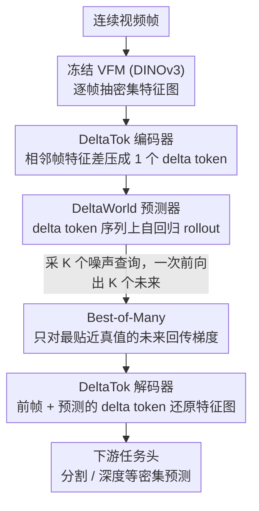

# A Frame is Worth One Token: Efficient Generative World Modeling with Delta Tokens

**会议**: CVPR 2026  
**arXiv**: [2604.04913](https://arxiv.org/abs/2604.04913)  
**代码**: [deltatok.github.io](https://deltatok.github.io)  
**领域**:视频生成
**关键词**: 世界模型, Delta token, 视频预测, 帧差压缩, Best-of-Many训练

## 一句话总结
提出 DeltaTok 将连续帧的 VFM 特征差压缩为单个 delta token，配合 Best-of-Many 训练的 DeltaWorld 在单次前向传播中高效生成多样化未来预测，参数量仅为 Cosmos 的 1/35、FLOPs 仅为 1/2000，但在密集预测任务上表现更优。

## 研究背景与动机
**领域现状**：世界模型需要预测未来状态以支持自主决策（如自动驾驶）。未来固有地不确定，模型需要生成多个可能的未来。

**现有痛点**：
   - **判别式世界模型**：产出单一决定性预测，在不确定情况下坍缩为条件均值，无法捕获多样未来
   - **现有生成式世界模型**（如Cosmos）效率低下，因为：(i) 面向像素重建优化，而非语义理解；(ii) 需要多次前向传播生成单个假设；(iii) 未利用帧间时空冗余

**关键洞察**：自然视频中，连续帧之间差异是结构化的、通常低维的——背景静止，仅小部分场景变化。表示整帧为密集特征图导致大量冗余。

**核心idea**：只编码帧间变化（delta）而非整帧，将视频从3D时空表示压缩为1D时间序列。

## 方法详解

### 整体框架
这篇论文要解决的是"如何让生成式世界模型既能吐出多个可能的未来、又不至于慢到没法用"。它的整条流水线建立在一个观察上：自然视频里连续帧之间的差异是结构化且低维的，背景基本静止，真正变的只有一小块场景，所以与其把每帧都表示成密集的特征图，不如只编码"帧与帧之间变了什么"。具体地，先用冻结的 VFM（DINOv3）把每帧抽成特征，再让 DeltaTok 把相邻两帧的特征差压成单个 delta token，于是一段视频从 3D 时空张量被压成一条 1D 的时间序列；DeltaWorld 预测器就在这条 delta token 序列上做生成式预测，一次前向同时给出多个未来假设，最后再解码回空间特征图喂给下游任务头。

### 关键设计

**1. DeltaTok：把一整帧特征图的冗余压进一个 delta token**

把整帧表示成 $32 \times 32 = 1024$ 个 token 的密集特征图，大部分信息都浪费在没动的背景上。DeltaTok 的做法是只保留"变化量"：编码器 $z_t = g(x_{t-1}, x_t, z_{\text{init}}) \in \mathbb{R}^D$ 把前后两帧特征压成单个 delta token，解码器 $\hat{x}_t = h(x_{t-1}, z_t)$ 再用前帧加这个 delta token 把当前帧特征还原回来，整体靠 MSE 重建损失 $L_{\text{tok}} = \|x_t - \hat{x}_t\|^2$ 训练。在 $512 \times 512$ 分辨率下这相当于 $1024\times$ 的压缩（1024 个 token 变成 1 个）。它之所以能压到这么狠还重建得回来，是因为 delta 天生低维——"无变化"对应的就是直接保留前帧，模型只需要学会描述真正变动的那部分，比从头压缩一整帧的信息密度高得多。

**2. Best-of-Many 训练：一次前向采多个未来，只监督最贴近真值的那个**

未来本质上不确定，判别式模型会在多个可能里坍缩成条件均值，而现有生成式模型往往要跑很多次前向才能采出一个假设。BoM 换了个思路：一次性采 $K$ 个高斯噪声查询 $q^k \sim \mathcal{N}(\mu, \Sigma)$，让模型在一次前向里同时给出 $K$ 个未来，然后只挑最接近真值的那个回传梯度：

$$k^\star = \arg\min_k \sum_{h,w} \ell(x_{t+1,h,w}, \hat{x}^k_{t+1,h,w}), \qquad L_{\text{BoM}} = \sum_{h,w} \ell(x_{t+1,h,w}, \hat{x}^{k^\star}_{t+1,h,w})$$

不同的噪声查询会被映射到不同的未来模式，于是单次前向就能覆盖多种可能，彻底绕开了扩散模型那套迭代去噪。更关键的是，因为它跑在被压成单 token 的 delta 序列上，多采几十上百个假设的额外开销几乎可以忽略，这才让"采样多个未来"从奢侈变成默认。

**3. DeltaWorld：在 delta token 序列上自回归地把未来一帧帧推出来**

前两个设计在这里被串成一条完整管线。预测器直接在 delta token 序列上工作，$\hat{z}_{t+1} = f(q^k, Z_{1:t}, T_{1:t}, \tau_{t+1})$，BoM 损失也直接在 delta token 空间计算、不需要先解码，所以预测器本身只占推理总 FLOPs 的约 0.5%，绝大部分算力其实花在冻结的 VFM 上。生成时按自回归方式 rollout：把预测出的 delta token 逐步追加进上下文窗口，再预测下一个。唯一需要特殊处理的是第一帧——它没有前帧可作差，于是用一张黑背景帧与它作差来表示绝对特征，给整条序列一个起点。

### 损失函数 / 训练策略
- DeltaTok 单独训练 50K 迭代
- DeltaWorld 预测器训练 300K 迭代 + 5K 低学习率微调
- $K = 256$（BoM 训练时采样数），评估时采样20个
- VFM: DINOv3 ViT-B，预测器也用 ViT-B

## 实验关键数据

### 主实验

| 方法 | GFLOPs↓ | VSPW mIoU (Mid) | Cityscapes mIoU (Mid) | KITTI RMSE (Mid) |
|------|---------|------|------|------|
| DINO-world (判别式) | 5.8K | 47.9 | 49.8 | 4.07 |
| Cosmos-4B | 60M | 47.0 (44.5) | 49.1 (48.4) | 4.08 (4.14) |
| Cosmos-12B | 64M | 47.7 (45.5) | 53.3 (51.2) | 4.01 (4.14) |
| **DeltaWorld** | **31K** | **50.1 (46.7)** | **55.4 (51.3)** | **3.88 (4.17)** |

*括号内为mean，括号外为best-of-20*

### 消融实验（渐进式设计验证）

| 步骤 | GFLOPs | VSPW best(mean) | Cityscapes best(mean) | 说明 |
|------|--------|------|------|------|
| (0) 判别式基线 | 959 | 44.8 | 45.4 | 均值预测 |
| (1) +BoM | 12013 | 47.0 (39.4) | 46.8 (31.1) | best提升但mean崩 |
| (2) +帧压缩 | 6315 | 45.7 (40.3) | 42.7 (35.5) | 效率提升但精度不足 |
| (3) +Delta压缩 | 6721 | **46.8 (44.4)** | **48.7 (45.5)** | mean恢复到基线水平 |

### 关键发现
- DeltaWorld的best预测全面超越Cosmos（不论4B还是12B），FLOPs却仅为1/2000
- Delta压缩 vs 帧压缩：mean从35.5恢复到45.5（Cityscapes），证明delta的容量效率远超整帧
- Delta的自然先验：预测"无变化" = 保留前帧，模型不需要重新编码静态背景
- Best-of-Many的K增大 → best持续提升且不牺牲mean（K=64后mean稳定）
- 预测器在delta空间仅占推理FLOPs的0.5%

## 亮点与洞察
- **极端压缩+高质量**：512×512帧压缩为1个token（1024×），且可重建
- **单次前向传播生成多样未来**：彻底避免扩散模型的迭代去噪
- **delta先验优雅**：连续帧差的低维结构与"无变化即保留"完美匹配世界模型需求
- **mean恢复到判别式水平**是重要验证：多样性没有以牺牲合理性为代价

## 局限与展望
- 当场景变化剧烈（场景切换），delta token 可能不够用（虽可退化为绝对编码）
- 自回归rollout中误差可能累积
- 当前仅在15M参数级别验证，扩展到更大模型的效果待探索
- 侧重实验指标但缺少对生成多样性的定性分析

## 相关工作与启发
- Delta编码思想借鉴经典视频编码（帧间压缩），但首次将其与VFM特征空间结合
- Best-of-Many相比扩散模型的优势在于单次前向——这对实时系统意义重大
- DINO-world → DeltaWorld 的渐进扩展非常教科书式

## 评分
- 新颖性: ⭐⭐⭐⭐⭐ Delta token化+BoM组合解决了高效生成式世界模型的核心要求
- 实验充分度: ⭐⭐⭐⭐⭐ 渐进消融+3数据集+效率分析非常透彻
- 写作质量: ⭐⭐⭐⭐⭐ 渐进式展示从判别到高效生成的路径，极其清晰
- 价值: ⭐⭐⭐⭐⭐ 为自动驾驶等场景提供了实用的多假设预测方案

<!-- RELATED:START -->

## 相关论文

- [\[CVPR 2026\] GT-SVJ: Generative-Transformer-Based Self-Supervised Video Judge For Efficient Video Reward Modeling](gt-svj_generative-transformer-based_self-supervised_video_judge.md)
- [\[CVPR 2026\] Towards Holistic Modeling for Video Frame Interpolation with Auto-regressive Diffusion Transformers](towards_holistic_modeling_for_video_frame_interpolation_with_auto-regressive_dif.md)
- [\[CVPR 2026\] Thinking with Frames: Generative Video Distortion Evaluation via Frame Reward Model](thinking_with_frames_generative_video_distortion_evaluation_via_frame_reward_mod.md)
- [\[CVPR 2026\] YOSE: You Only Select Essential Tokens for Efficient DiT-based Video Object Removal](yose_you_only_select_essential_tokens_for_efficient_dit-based_video_object_remov.md)
- [\[CVPR 2026\] STARFlow-V: End-to-End Video Generative Modeling with Autoregressive Normalizing Flows](starflow-v_end-to-end_video_generative_modeling_with_autoregressive_normalizing_.md)

<!-- RELATED:END -->
