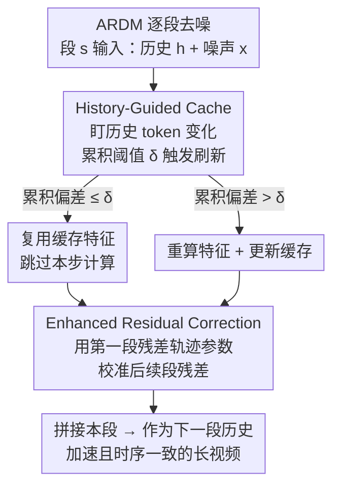

# Accelerating Autoregressive Video Diffusion via History-Guided Cache and Residual Correction

**会议**: CVPR 2026  
**论文**: [CVF Open Access](https://openaccess.thecvf.com/content/CVPR2026/html/Nan_Accelerating_Autoregressive_Video_Diffusion_via_History-Guided_Cache_and_Residual_Correction_CVPR_2026_paper.html)  
**代码**: 待确认  
**领域**: 视频生成 / 扩散模型加速  
**关键词**: 自回归视频扩散, 特征缓存, 误差累积, 训练free加速, 残差修正  

## 一句话总结
针对自回归视频扩散模型（ARDM）逐段生成时"缓存近似误差会随时间累积放大"这一致命问题，提出训练free的 ARCache：用 History-Guided Cache 根据历史 token 的变化来调度缓存时机（段内抑误差），用 Enhanced Residual Correction 借第一段干净的残差轨迹去校准后续段（段间防漂移），在三个 ARDM 上实现最高 3.13× 加速且画质几乎无损。

## 研究背景与动机

**领域现状**：视频生成正从标准扩散模型（SDM，一次性生成固定长度视频）转向自回归扩散模型（ARDM，如 FramePack-F1、SkyReels-V2、Matrix-Game），后者把长视频拆成若干 segment，每段都以前面已生成内容（历史 token）为条件顺序合成，因此能变长生成、细粒度控时序，还能做交互式世界模型。但 ARDM 推理很慢，实时应用受限。

**现有痛点**：加速扩散最有效的手段之一是"特征缓存"——利用相邻去噪步特征高度冗余，把某一步算出的特征缓存起来给后面几步复用，从而跳过重复计算（DeepCache、FORA、PAB、TeaCache、TaylorSeer 等）。这些方法在 SDM 上很成功，且设计上"与范式无关"，看起来可以无缝塞进 ARDM。但作者实测发现：**直接套用到 ARDM 上会崩**——后段帧出现严重伪影、时序断裂。

**核心矛盾**：根因在于 SDM 和 ARDM 的计算图本质不同。SDM 所有帧一次性联合生成，缓存带来的近似误差被限制在单次推理内；而 ARDM 每段都依赖前段输出，**早段引入的近似误差会顺着历史条件一路传播、级联放大**（error accumulation），越往后画质塌得越厉害。缓存换来的速度，被误差漂移吃掉了质量。

**本文目标**：设计一个**专为 ARDM 顺序特性量身定制**的缓存加速框架，把误差累积这件事从两个维度按住——① 抑制单段内的近似误差（段内）；② 阻断误差跨段传播（段间）。

**切入角度**：作者做了两个关键观察。其一，定量相关性分析（Spearman 相关）显示：在 ARDM 里，**输出的变化和"历史 token 的变化"相关性远高于和"当前噪声 token / 全部输入"的相关性**——历史 token 才是判断"该不该刷新缓存"的可靠信号，而以往方法（如 TeaCache）盯的是全部输入，盯错了。其二，PCA 分析显示：未加速 ARDM 的**残差特征在不同 segment 间轨迹高度相似且稳定**，第一段尤其干净（无历史误差）。

**核心 idea**：用"盯历史 token 调度缓存"替代"盯全部输入"来决定何时复用（HGC），再用"第一段的干净残差轨迹"去校正后续被污染段的残差（ERC），两者合起来既加速又不让误差滚雪球。

## 方法详解

### 整体框架

ARCache 是一个 training-free 的缓存框架，挂在任意 ARDM 的去噪循环上。ARDM 逐段生成：第 $s$ 段在每个去噪步 $t$ 的输入由两部分组成——历史 token $h_t^s$（编码前面已生成段）和当前段的噪声 token $x_t^s$，经 $T$ 步去噪得到本段，再拼接、作为下一段的历史。最朴素的缓存（baseline，如把 PAB 直接搬过来）是在段内固定间隔复用激活 $F([h_{t-k}^s, x_{t-k}^s]) := F([h_t^s, x_t^s])$，理论上能 $(N{+}1)$ 倍加速，但实测误差跨段累积、后段全是伪影。

ARCache 用两个互补模块替换这个朴素方案：**History-Guided Cache（HGC）** 负责"何时复用才安全"——通过监控历史 token 的变化量来自适应决定缓存刷新时机，把单段内的近似误差压到最低；**Enhanced Residual Correction（ERC）** 负责"复用之后怎么不漂"——用第一段稳定的残差轨迹参数去校准后续段被污染的残差，阻断跨段误差传播。整条 pipeline 见下图：

### 关键设计

**1. History-Guided Cache（HGC）：盯"历史 token 的变化"而非全部输入来决定缓存时机**

朴素缓存和 TeaCache 这类方法判断"现在能不能复用上一步特征"时，看的是全部模型输入的波动。但在 ARDM 里这是错配的：作者通过 Spearman 相关分析发现，输出的步间变化与**历史 token** 的变化高度相关（相关性比"当前噪声 token—输出"高出一大截），因为历史 token 一旦变化，意味着有新的、不同的上下文信息被注入，输出必然随之偏移；反之历史 token 几乎不动时，输出也基本不变、此时复用最安全。所以应该盯历史 token。

HGC 据此定义一个**历史偏差度量**，衡量相邻去噪步之间历史 token 的归一化变化：

$$\Delta(h_t^s) = \frac{\lVert h_t^s - h_{t+1}^s \rVert_1}{\lVert h_{t+1}^s \rVert_1}$$

再引入**累积阈值机制**：设 $t_{ref}$ 是最近一次缓存刷新的时间步，只要从 $t_{ref}$ 起累积的历史偏差还没超过可调阈值 $\delta$，就一直维持缓存复用；一旦累积偏差越过 $\delta$ 就触发刷新、把 $t_{ref}$ 更新到当前步：

$$\sum_{i=t+1}^{t_{ref}} \Delta(h_i^s) \le \delta < \sum_{i=t}^{t_{ref}} \Delta(h_i^s)$$

$\delta$ 直接控制"加速—质量"权衡：$\delta$ 越大越敢复用、越快但越糙。这样 HGC 把"什么时候刷新缓存"和"新内容什么时候真正进来"对齐，从源头减少了单段加速引入的近似误差。消融里它对应的对照组是 IGC（=TeaCache，盯输入）和 CGC（盯当前段），HGC 在同等加速下 PSNR/SSIM 全面更高。

**2. Enhanced Residual Correction（ERC）：借第一段干净残差轨迹校准后续段，防误差漂移**

HGC 解决了段内，但跨段的历史误差仍会传播。一个自然想法是直接用 TaylorSeer——它把特征及其导数建模成随时间步稳定的轨迹，用泰勒展开预测/修正缓存特征。但 TaylorSeer 在逐层特征上做，显存和算力开销巨大（论文里它在长序列上直接 OOM）。更要命的是，作者发现**直接拿 TaylorSeer 修正后续段的残差会越修越歪**：PCA 显示后段（如第 7 段）加速后的残差轨迹会逐渐偏离其未加速的稳定轨迹，因为后段轨迹本身已被历史误差污染，沿着这条"脏轨迹"外插修正只会进一步放大误差。

ERC 的破解点来自另一个 PCA 观察：未加速 ARDM 的残差轨迹在**不同 segment 之间高度相似且稳定**，而第一段不含任何历史误差、又被 HGC 进一步净化，最接近理想轨迹。于是 ERC 不再用当前段被污染的轨迹，而是**用第一段的轨迹参数去校正所有后续段**。具体地，残差用一阶轨迹公式近似（$r_{t_a}^s, r_{t_b}^s$ 是最近两次重算步的残差，$t_a < t_b$，$\lambda_t^s$ 是轨迹参数）：

$$r_t^s = r_{t_b}^s + \lambda_t^s\,(r_{t_a}^s - r_{t_b}^s)$$

由于后段（$s>1$）的 $\lambda_t^s$ 因误差累积越来越不可靠，ERC 把它替换成**第一段算出的稳定参数** $\lambda_t^1$：

$$\lambda_t^s = \lambda_t^1 = \frac{L1_{rel}(r_t^1, r_{t_b}^1)}{L1_{rel}(r_{t_a}^1, r_{t_b}^1)},\quad s>1$$

并用它修正所有后续段的残差轨迹：

$$r_t^s = r_{t_b}^s + \frac{L1_{rel}(r_t^1, r_{t_b}^1)}{L1_{rel}(r_{t_a}^1, r_{t_b}^1)}\,(r_{t_a}^s - r_{t_b}^s),\quad s>1$$

这样每一段的修正都被一个"干净且稳定的参考"牵引，从而抑制误差漂移、保住时序一致性。而且 ERC 只在残差层面做（不是逐层特征），开销几乎可忽略——消融里加上 ERC 后延迟从 96.40s 仅升到 96.74s，PSNR 却从 24.13 提到 24.79。

> ⚠️ 上面 $L1_{rel}$、$\lambda$ 等符号系按原文公式 (5)(6)(7) 转写，原文 OCR 部分上下标较糊，以 CVF 原文为准。

## 实验关键数据

### 主实验

在三个代表性 ARDM 上对比（FramePack-F1 图生视频、SkyReels-V2 文生视频、Matrix-Game 交互世界模型），视觉保真用 PSNR/SSIM/LPIPS（相对原始未加速视频）+ 任务专用 benchmark（VBench / VBench-I2V / GameWorld Score）。ARCache 提供 slow（重质量）/ fast（重速度）双模式。

| 模型 | 方法 | 加速比↑ | PSNR↑ | SSIM↑ | LPIPS↓ | Task Score↑ |
|------|------|---------|-------|-------|--------|-------------|
| FramePack-F1 | PAB (I=2) | 2.86× | 21.19 | 0.6673 | 0.1887 | 88.33% |
| | TeaCache-fast | 2.54× | 22.91 | 0.7110 | 0.1554 | 88.62% |
| | TaylorSeer | 2.03× | 21.36 | 0.6619 | 0.2023 | 88.65% |
| | **ARCache-slow** | 1.51× | **28.13** | **0.8408** | **0.0770** | **88.82%** |
| | **ARCache-fast** | **2.88×** | 24.34 | 0.7659 | 0.1254 | 88.81% |
| SkyReels-V2 | TeaCache-slow | 1.40× | 26.65 | 0.8575 | 0.1048 | 77.28% |
| | TaylorSeer | OOM | OOM | OOM | OOM | OOM |
| | **ARCache-slow** | 1.53× | **29.10** | **0.8835** | **0.0852** | 77.47% |
| | **ARCache-fast** | **1.87×** | 25.70 | 0.8389 | 0.1223 | 77.04% |
| Matrix-Game | TeaCache-fast | 3.06× | 18.41 | 0.6775 | 0.3282 | 78.95% |
| | TaylorSeer | OOM | OOM | OOM | OOM | OOM |
| | **ARCache-slow** | 1.63× | **22.77** | **0.7811** | **0.2306** | **79.39%** |
| | **ARCache-fast** | **3.13×** | 19.37 | 0.7093 | 0.3016 | 79.07% |

关键观察：① ARCache-slow 在三个模型上 PSNR/SSIM/LPIPS 全是最优，质量明显领先；② ARCache-fast 给出 2.88× / 1.87× / 3.13× 加速且画质仍有竞争力；③ TaylorSeer 在长序列（SkyReels-V2、Matrix-Game）直接 OOM，PAB 静态缓存在 SkyReels-V2 上质量塌方（PSNR 仅 14.77、Task Score 跌到 62.07%），凸显静态调度在动态内容上不可靠。

### 消融实验（FramePack-F1，200 对随机图文样本）

| 配置 | 取值 | 加速比 | PSNR↑ | SSIM↑ | LPIPS↓ |
|------|------|--------|-------|-------|--------|
| IGC (=TeaCache，盯输入) | δ=0.10 | 1.49× | 22.93 | 0.7953 | 0.1323 |
| CGC (盯当前段) | δ=0.10 | 1.49× | 22.80 | 0.7870 | 0.1382 |
| **HGC (盯历史，本文)** | δ=0.10 | 1.52× | **24.13** | **0.8169** | **0.1159** |
| HGC | δ=0.20 | 2.59× | 22.93 | 0.7991 | 0.1265 |
| HGC | δ=0.30 | 2.88× | 20.89 | 0.7413 | 0.1815 |
| HGC w/o ERC | δ=0.10 | 1.52× | 24.13 | 0.8169 | 0.1159 |
| **HGC w/ ERC** | δ=0.10 | 1.51× | **24.79** | **0.8266** | **0.1117** |

### 关键发现
- **盯历史是对的**：同为 δ=0.10，HGC 比 IGC（TeaCache）PSNR 高 1.2（24.13 vs 22.93）、比 CGC 更高，验证了"ARDM 输出更依赖历史 token"的分析——这是本文最核心的实证支撑。
- **δ 是干净的速度旋钮**：δ 从 0.10→0.30，加速从 1.52×→2.88×，但 PSNR 从 24.13 掉到 20.89，给出可控的速度—质量权衡。
- **ERC 近乎免费**：加 ERC 后延迟仅 96.40→96.74s（几乎不变），PSNR +0.66、SSIM +0.0097、LPIPS −0.0042，因为它只在残差层面算、不像 TaylorSeer 逐层算，开销可忽略却显著抑制漂移。

## 亮点与洞察
- **把"误差累积"识别为 ARDM 缓存加速的根本瓶颈**，并区分成"段内 / 段间"两个正交问题分别下药（HGC + ERC），问题拆解很干净——这个 intra/inter 的视角可迁移到任何顺序生成 + 缓存的场景。
- **"盯历史 token 而非全部输入"是一个便宜且有效的换信号**：仅把缓存调度的监控对象从 $x$ 换成 $h$，几乎零成本就显著提质，背后是一次扎实的相关性分析支撑，而非拍脑袋。
- **"借第一段干净轨迹校准后续段"很巧**：不去硬修被污染的当前轨迹（越修越歪），而是利用 ARDM 残差轨迹的跨段相似性，把"干净参考"这个稀缺资源（第一段）复用到全程——这是对 ARDM 结构性质的精准利用。
- **完全 training-free**：挂上即用、可热插到 FramePack-F1/SkyReels-V2/Matrix-Game 等多种 ARDM，工程落地友好。

## 局限性 / 可改进方向
- **依赖手工调阈值 δ**：作者自己承认核心局限是 δ 需手动调，不同模型/内容下的最优值要试，未来要做 threshold-free 全自适应缓存。
- **fast 模式质量仍有可见折损**：高加速档（δ 大）下 PSNR/SSIM 明显下降（如 FramePack-F1 fast PSNR 24.34 vs slow 28.13），并非"无损加速"，只是相对 baseline 更优。
- **ERC 假设"第一段足够干净且跨段轨迹相似"**：若首段本身质量差，或后续段内容与首段差异极大（强场景切换），用首段参数校准的有效性可能下降，论文未深入讨论这类失配情形。⚠️ 此为笔者推测，原文未实验验证。

## 相关工作与启发
- **vs TeaCache**：TeaCache 用标定多项式估计器自适应调度，但盯的是全部模型输入的波动（即本文消融里的 IGC），忽略了 ARDM 特有的"输出—历史"强相关；ARCache 把监控对象换成历史 token，在 fast/slow 两档都超过 TeaCache。
- **vs TaylorSeer**：TaylorSeer 在逐层特征上做泰勒轨迹修正，显存爆炸（长序列 OOM）且沿被污染轨迹外插会放大误差；ARCache 只在残差层面用第一段稳定参数修正，开销可忽略且不漂移。
- **vs PAB**：PAB 固定间隔静态缓存，在内容动态变化的视频上质量崩（SkyReels-V2 PSNR 仅 14.77）；ARCache 的自适应调度更适配 ARDM 的动态历史。

## 评分
- 新颖性: ⭐⭐⭐⭐ 首个面向 ARDM 的 training-free 缓存框架，intra/inter 误差分解 + 历史信号 + 首段轨迹校准三点都有洞察。
- 实验充分度: ⭐⭐⭐⭐ 三类任务三个模型、对比 4 类 baseline、消融覆盖各组件与超参，较扎实；缺与训练based加速法的对比。
- 写作质量: ⭐⭐⭐⭐ 动机—分析—方法逻辑清晰，图 1/3/4 的分析支撑到位。
- 价值: ⭐⭐⭐⭐ 长视频/世界模型实时化的现实痛点，热插即用、泛化性好，工程价值高。

<!-- RELATED:START -->

## 相关论文

- [\[AAAI 2026\] FilmWeaver: Weaving Consistent Multi-Shot Videos with Cache-Guided Autoregressive Diffusion](../../AAAI2026/video_generation/filmweaver_weaving_consistent_multi-shot_videos_with_cache-guided_autoregressive.md)
- [\[CVPR 2026\] RFDM: Residual Flow Diffusion Models for Video Editing](rfdm_residual_flow_diffusion_models_for_video_editing.md)
- [\[CVPR 2026\] DisCa: Accelerating Video Diffusion Transformers with Distillation-Compatible Learnable Feature Caching](disca_accelerating_video_diffusion_transformers_wi.md)
- [\[CVPR 2026\] Accelerating Diffusion-based Video Editing via Heterogeneous Caching: Beyond Full Computing at Sampled Denoising Timestep](accelerating_diffusion-based_video_editing_via_heterogeneous_caching_beyond_full.md)
- [\[ICML 2026\] Light Forcing: Accelerating Autoregressive Video Diffusion via Sparse Attention](../../ICML2026/video_generation/light_forcing_accelerating_autoregressive_video_diffusion_via_sparse_attention.md)

<!-- RELATED:END -->
