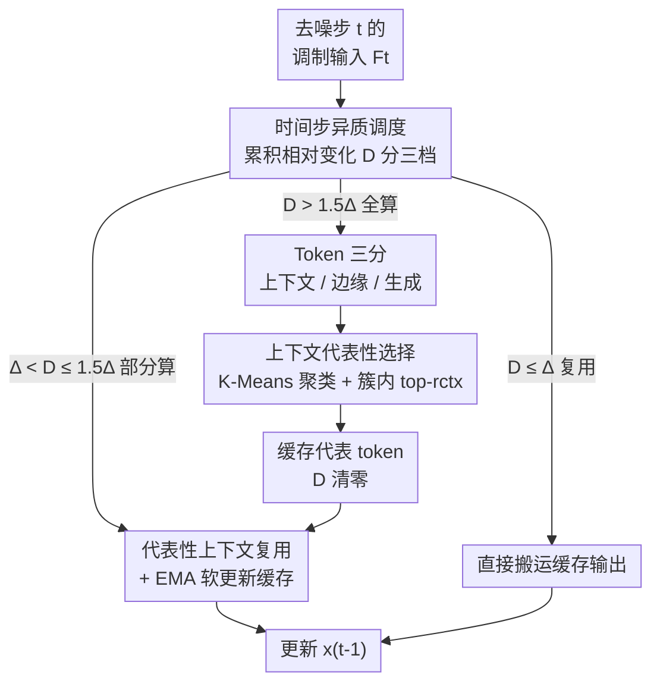

# Accelerating Diffusion-based Video Editing via Heterogeneous Caching: Beyond Full Computing at Sampled Denoising Timestep

**会议**: CVPR 2026  
**论文**: [CVF Open Access](https://openaccess.thecvf.com/content/CVPR2026/html/Liu_Accelerating_Diffusion-based_Video_Editing_via_Heterogeneous_Caching_Beyond_Full_Computing_CVPR_2026_paper.html)  
**代码**: 待确认  
**领域**: 视频生成 / 扩散模型加速  
**关键词**: 视频编辑, 扩散 Transformer, 特征缓存, Token 异质性, 训练无关加速  

## 一句话总结
针对带掩码的视频编辑（MV2V）任务，提出训练无关的 HetCache：既在去噪时间步维度按累积变化量把步骤分成"全算/部分算/复用"三档，又在单步内部按掩码空间先验把 token 切成上下文/边缘/生成三类，只对最具语义代表性的上下文 token 做注意力，从而在 Wan2.1-VACE 上拿到 2.67× 加速且画质几乎不掉。

## 研究背景与动机

**领域现状**：扩散模型（尤其是把骨干换成 Transformer 的 DiT）已成为高质量视频编辑的主流，能在掩码补全、物体替换、文本引导编辑等任务上灵活生成。但 DiT 的两个特性让推理极慢：一是去噪要迭代几十上百步、每步都要前向一遍网络；二是单步内部时空 token 之间是稠密自注意力，复杂度随 token 数平方增长。

**现有痛点**：现有的训练无关加速几乎都只盯**时间步维度**的冗余——把相邻去噪步的中间特征缓存下来复用（TeaCache、PAB、AdaCache 等），却忽略了 DiT **架构内部**的冗余：大量时空 token 之间的注意力其实是重复计算、对最终输出几乎没有增量贡献。也就是说，时间步层面省了，单步内部该算的 token 还是全算。

**核心矛盾**：视频编辑（MV2V）天然带有"感兴趣区域（ROI）"——掩码内是要生成的内容，掩码外是参考上下文。这两类 token 重要性极不均衡：掩码（生成）token 必须每步全量更新以保证编辑保真，而掩码外的上下文 token 只需提供**稀疏但强**的语义引导即可。如果像通用视频生成那样对一个时间步里所有 token 做**统一**的缓存/复用，就会在掩码区域里损伤重建质量。

**切入角度**：作者观察到一个关键障碍——上下文 token 的"代表性"和"与生成区的交互强度"只有**算完注意力之后**才能看到，事先无法直接知道哪些上下文 token 值得保留。于是需要一个机制：在全算步里测出这些 token 的重要性并缓存下来，后续步骤直接复用这批代表性 token。

**核心 idea**：去噪时间步和上下文 token 对最终质量的贡献都是**不均等的（heterogeneous）**——既然不均等，就该"分维度、分类别"地做选择性缓存，而不是一刀切地统一复用或随机采样。

## 方法详解

### 整体框架

HetCache 是一个训练无关的缓存框架，输入是带掩码 $M$ 的视频编辑任务（latent $x_T$、文本/结构条件），输出是去噪后的 $x_0$，整个加速发生在采样循环里、不动模型权重。它把"省计算"拆到两个正交维度上协同：

- **时间步维度（步级调度）**：用一个轻量代理量估计每个去噪步的"输出会变多大"，据此把步骤分成**全算步 / 部分算步 / 复用步**三档——变化大的步才全算，平稳的步直接复用缓存。
- **Token 维度（单步内选择）**：在全算步里，借助掩码的空间先验把时空 token 切成**上下文 / 边缘 / 生成**三类；其中占大头、却制造冗余的上下文 token，按"语义代表性 + 与生成 token 的交互强度"筛出一小撮缓存下来，供后续部分算步复用。

两个维度的关键在于：步级调度决定**何时**省，token 选择决定**省哪些**；缓存在全算步建立、在部分算步以 EMA 方式软更新、在复用步直接搬运。下面的流程图展示一次去噪循环里三档步骤如何切换、以及全算步内部的 token 三分与上下文筛选。

### 关键设计

**1. 时间步异质调度：用累积"调制输入变化量"把去噪步分成全算/部分算/复用三档**

时间步层面的痛点是"相邻去噪步往往变化很小、全算就是浪费，但平稳到什么程度才能复用、需要一个可量化的判据"。HetCache 沿用"时间步嵌入调制后的噪声输入与模型输出变化强相关"这一观察，先算单步的相对变化作为轻量代理：把调制输入记为 $F_t = T_t \odot x_t$（$x_t$ 是该步 latent，$T_t$ 是预训练时间步嵌入，$\odot$ 表示调制），则相邻步差异为

$$L_1^{rel}(F,t) = \frac{\lvert F_t - F_{t+1}\rvert_1}{\lvert F_{t+1}\rvert_1}.$$

关键不是看单步差异，而是把它沿连续步**累积**：$D_{a\to b} = \sum_{t=a}^{b-1} L_1^{rel}(F,t)$，用累积量 $D$ 决定第 $b$ 步的计算模式。给定缓存阈值 $\Delta$，分三档：① $D > 1.5\Delta$ 为**全算步**，做完整前向并刷新缓存；② $\Delta < D \le 1.5\Delta$ 为**部分算步**，只重算一部分 token、缓存用 EMA 软更新；③ $D \le \Delta$ 为**复用步**，直接搬缓存输出、不计算。每次全算或部分算后把 $D$ 清零重新累积。这样把昂贵的全算只留给"轨迹突变"的少数步，平稳区段激进复用——比逐步固定复用更自适应，因为预算是按真实变化量动态分配的。

**2. 掩码空间先验 Token 三分：把"该全更新"和"可被采样"的 token 区分开**

单步内部的痛点是"自注意力对所有 token 一视同仁全算，但编辑任务里 token 重要性极不均衡"。HetCache 用编辑掩码 $M$ 提供的空间先验，在每个全算步把时空 token 分成三类：**生成 token**（掩码内、要合成的新内容，是编辑核心）、**边缘 token**（紧贴掩码边界的未掩码区，决定边界平滑、几何连续与局部融合）、**上下文 token**（远离编辑区的未掩码区，提供全局语义一致与长程结构）。三者贡献不同：生成 token 定义新内容，边缘 token 保证边界过渡平滑，上下文 token 维持生成区与场景其余部分的语义对齐。

这个三分的意义在于明确了"哪些不能省"：注意力代价 $O(X^2) = O((X_c + X_m + X_g)^2)$ 里，真正关键的是**生成-边缘**交互（决定重建保真与边界）和**生成-上下文**交互（决定语义一致），而占据二次方主导项的**上下文-上下文**稠密交互贡献甚微。因此生成 token 与边缘 token 全量保留、全注意力计算，只有上下文 token 才作为被采样的对象——这是后续选择性缓存的前提。

**3. 上下文代表性选择：聚类 + 注意力重要性筛出最该缓存的那一小撮上下文 token**

承接上一点，问题变成"上下文 token 要省，但省错了会损伤语义引导，怎么挑出最具代表性、与生成区交互最强的子集"。难点是 token 的代表性和交互强度只有算完注意力才看得见。HetCache 的做法是：在上下文集合 $X_{ctx}=\{x_i\}$ 上做一次轻量 K-Means 聚类得到 $K$ 个语义簇 $\{S_k\}$，簇心 $\mu_k = \frac{1}{|S_k|}\sum_{x_i\in S_k} x_i$，先把上下文按语义结构分组；再用**缓存下来的稀疏上下文→生成注意力分数**估计每个 token 的重要性：

$$\alpha_i = \frac{1}{|X_{gen}|}\sum_{j\in X_{gen}} \bar{A}_{i,j},$$

其中 $\bar{A}_{i,j}$ 是上下文 token $i$ 到生成 token $j$ 的归一化注意力聚合，$\alpha_i$ 越大说明该上下文 token 对 ROI 的贡献越强。然后在**每个簇内**取 top-$r_{ctx}$ 比例的 token 组成代表集 $X^\star_{ctx}$。这样把参与注意力的上下文 token 从 $X_l$ 降到 $r_{ctx}X_l$，注意力复杂度由 $O((X_l+X_m+X_n)^2)$ 降到 $O((r_{ctx}X_l+X_m+X_n)^2)$，而聚类每个部分算步只做一次、开销很小。"先按簇分组再簇内 top-k"避免了重要 token 全集中在少数簇而漏掉其它语义区，比对全体上下文统一采样或随机采样更稳——消融里正是这两条（context 代表性 + correlation 交互）共同把画质拉到最好。

### 一个完整示例

以默认配置 $\Delta=0.02$（fast 档）、$r_{ctx}=0.7$、$K=16$ 走一遍：去噪进行到某步 $t$，先算调制输入 $F_t$ 并把相对变化累加进 $D$。

- 若此时 $D \le \Delta$：判为**复用步**，直接把上一缓存输出 $O_{cache}$ 搬过来当 $O_t$，整步几乎零计算。
- 若 $\Delta < D \le 1.5\Delta$：判为**部分算步**——按掩码把 token 切成上下文/边缘/生成，对上下文做 K-Means 得到 16 个簇，用缓存的注意力分数算每个上下文 token 的 $\alpha_i$，每簇取前 70% 组成 $X^\star_{ctx}$，只在 $X_{gen}\cup X_{mar}\cup X^\star_{ctx}$ 上跑前向得到 $O_t$，再以 EMA 软更新缓存 $O_{cache}\leftarrow(1-\gamma)O_{cache}+\gamma O_t$，并把 $D$ 清零。
- 若 $D > 1.5\Delta$：判为**全算步**，对全部 token 跑完整前向，缓存整体刷新 $O_{cache}\leftarrow O_t$，$D$ 清零。

最后用 $O_t$ 更新 $x_{t-1}$，进入下一步。整段视频里，全算步只占少数（突变点），大量步落在部分算/复用上，省下的主要是上下文-上下文那块二次方注意力。

## 实验关键数据

实验用 Wan-2.1-VACE 作为支持 VACE/MV2V 的 SOTA 骨干，主要对手是公认最强的视频扩散缓存方法 TeaCache。slow/fast 档对应阈值 $\Delta=0.05$ 与 $0.02$；token 选择固定 $r_{ctx}=0.7$、$K=16$。评测覆盖 VACE-Benchmark 视频补全与 VPBench 文本引导编辑两条线。

### 主实验

VACE-Benchmark 视频补全（50 步，相对 100 步 Wan2.1-VACE 基线）：

| 方法 | FLOPs(P)↓ | 延迟(s)↓ | 加速↑ | PSNR↑ | VFID↓ | VBench(%)↑ |
|------|-----------|----------|-------|-------|-------|-----------|
| Wan2.1-VACE (100步) | 145.21 | 445.52 | 1.00× | 16.06 | 57.18 | 76.54 |
| TeaCache-fast | 36.30 | 186.45 | 2.53× | 16.51 | 54.86 | 76.80 |
| HetCache-slow | 30.68 | 176.31 | 2.53× | 16.50 | 54.73 | 76.58 |
| **HetCache-fast** | **23.60** | **166.81** | **2.67×** | **16.58** | **54.51** | 75.88 |

同档加速比下，HetCache 的 FLOPs 比 TeaCache-fast 再低约 35%（23.60 vs 36.30），延迟更短，PSNR/VFID 还略好——说明省的是真冗余而非有用计算。

VPBench 文本引导编辑（相对 75 步基线）：

| 方法 | FLOPs(P)↓ | 延迟(s)↓ | 加速↑ | VFID↓ | VBench(%)↑ |
|------|-----------|----------|-------|-------|-----------|
| Wan2.1-VACE (75步) | 64.59 | 246.05 | 1.00× | 27.07 | 79.26 |
| TeaCache-fast | 21.53 | 137.70 | 1.79× | 26.47 | 80.73 |
| **HetCache-fast** | **13.99** | **128.61** | **1.91×** | 27.14 | 80.59 |

更高分辨率/更长视频/外绘/换 LTX 骨干等设置下趋势一致：如 720P 补全 HetCache 拿到 2.91×、57帧×480P 长视频拿到 3.06×，均高于 TeaCache 的 2.40~2.44×。

### 消融实验

去掉 token 级缓存的两个组件（Context 代表性、Correlation 交互），其余不变（VACE-Benchmark）：

| 配置 | Context | Correlation | 加速↑ | PSNR↑ | VFID↓ | VBench↑ |
|------|:--:|:--:|-------|-------|-------|---------|
| HetCache-- | ✗ | ✗ | 3.13× | 16.60 | 54.54 | 76.19 |
| HetCache-（仅Context） | ✓ | ✗ | 2.93× | 16.54 | 54.75 | 75.80 |
| HetCache-（仅Correlation） | ✗ | ✓ | 2.51× | 16.60 | 55.36 | 76.24 |
| **HetCache（完整）** | ✓ | ✓ | 2.67× | 16.58 | **54.51** | **76.29** |

### 关键发现
- **两个组件要合用才最优**：只用 Context 或只用 Correlation 单独看 VFID 都不如完整版（54.75 / 55.36 vs 54.51）；统一/随机采样上下文（HetCache--）虽然加速最高（3.13×），但语义引导变弱、生成区质量下降——印证"低质量上下文 token 会直接拖累目标区域生成"。完整版是在加速与质量间取了更好的平衡点（2.67×、VFID 与 VBench 最佳）。
- **保留更多上下文更稳**：$r_{ctx}$ 越大（保留越多上下文 token）整体性能越鲁棒，符合直觉。
- **K 不是越大越好**：簇数 $K$ 对 PSNR 不是单调影响，说明上下文的语义结构存在"有效容量"，过细划分（如 $K=64$）并不带来收益。

## 亮点与洞察
- **把"两个维度的冗余"同时吃掉**：以往缓存只在时间步维度省，HetCache 第一次把"步级调度"和"单步内 token 选择"正交地组合起来，二者互不干扰又叠加收益——这是它比 TeaCache 在同加速比下 FLOPs 更低的根因。
- **ROI 视角下的 token 三分很巧**：用编辑掩码这个"免费先验"把 token 按语义角色分层，明确"生成/边缘必须全算、上下文-上下文才是该砍的二次方大头"，把加速精准落在不伤保真的地方，而非无差别压缩。
- **训练无关、即插即用**：不动权重、不需重训或标定，可挂在 Wan、LTX 等不同 DiT 骨干上，工程落地成本低。
- **可迁移思路**："先聚类再簇内按交互强度 top-k"这套选择性缓存，对其它带 ROI/条件区的生成任务（图像 inpainting、可控生成）同样适用——凡是存在"少量关键 token 提供强引导"的结构，都能照搬。

## 局限与展望
- **强依赖掩码先验**：token 三分建立在显式编辑掩码（ROI）之上，对无掩码的通用视频生成（没有明确上下文/生成划分）该策略的优势会大打折扣，论文也把场景限定在 MV2V。
- **阈值/比例需人工设定**：$\Delta$、$r_{ctx}$、$K$ 都是手调超参，不同骨干/分辨率下最优值可能漂移；消融显示 $r_{ctx}$ 越大越稳、$K$ 非单调，但缺少自适应选取机制。
- **质量并非全面占优**：在 fast 档个别指标（如 VACE 上 VBench 75.88 略低于基线 76.54）有轻微让步，属于追求极致加速的代价。⚠️ 文中正文提到 100 步基线为 108.91 PFLOPs/342.57 s，与表 1 的 145.21/445.52 不一致，疑为不同设置或笔误，**以原文为准**。
- **改进方向**：把阈值与保留比例做成随内容动态自适应（如按累积变化或注意力熵在线调整 $r_{ctx}$），或把掩码先验放宽为可学习的软 ROI，扩到无掩码生成。

## 相关工作与启发
- **vs TeaCache**：TeaCache 用调制输入估计输出变化、做时间步级的缓存复用，但对一个时间步内所有 token 做**同质**决策。HetCache 复用了它的步级代理量，但额外引入 token 级异质选择，因此同加速比下 FLOPs 更低、画质相当或更好。
- **vs PAB / AdaCache / FastCache**：这些同样是时间步维度的特征缓存/复用，缺少对 ROI 引起的 token 异质性建模；表 1 中它们多在 1.8~2.0× 加速、且 FastCache 的 VFID 明显劣化（68.55）。
- **vs 剪枝/量化等架构优化**：参数级压缩或 token 合并/剪枝虽能降本，但通常要微调或标定、有工程开销；HetCache 训练无关、即插即用。
- **vs 采样器加速（高阶 ODE / 步蒸馏）**：它们减少去噪步数，与 HetCache 的"步内 token 缓存"正交，理论上可叠加使用。

## 评分
- 新颖性: ⭐⭐⭐⭐ 首次把步级与 token 级冗余在视频编辑场景下正交协同，ROI 驱动的 token 三分 + 簇内交互筛选有新意。
- 实验充分度: ⭐⭐⭐⭐ 覆盖补全/编辑两类任务、多分辨率/时长/外绘、双骨干及组件消融，较扎实；缺一些超参自适应分析。
- 写作质量: ⭐⭐⭐⭐ 动机与方法层次清晰，算法伪代码完整；个别数字前后不一致需读者甄别。
- 价值: ⭐⭐⭐⭐ 训练无关、可挂多种 DiT，直接推动视频编辑走向实时/交互，落地价值高。

<!-- RELATED:START -->

## 相关论文

- [\[ICML 2026\] WorldCache: Accelerating World Models for Free via Heterogeneous Token Caching](../../ICML2026/video_generation/worldcache_accelerating_world_models_for_free_via_heterogeneous_token_caching.md)
- [\[CVPR 2026\] DisCa: Accelerating Video Diffusion Transformers with Distillation-Compatible Learnable Feature Caching](disca_accelerating_video_diffusion_transformers_wi.md)
- [\[CVPR 2026\] Accelerating Autoregressive Video Diffusion via History-Guided Cache and Residual Correction](accelerating_autoregressive_video_diffusion_via_history-guided_cache_and_residua.md)
- [\[CVPR 2026\] Causality in Video Diffusers is Separable from Denoising](causality_in_video_diffusers_is_separable_from_denoising.md)
- [\[CVPR 2026\] D2Cache: Second-Order Delta Caching for Higher Video Diffusion Acceleration](d2cache_second-order_delta_caching_for_higher_video_diffusion_acceleration.md)

<!-- RELATED:END -->
