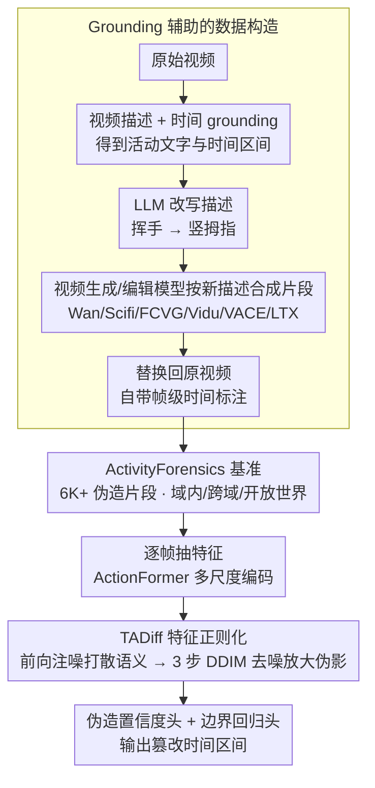

# ActivityForensics: A Comprehensive Benchmark for Localizing Manipulated Activity in Videos

**会议**: CVPR 2026  
**arXiv**: [2604.03819](https://arxiv.org/abs/2604.03819)  
**代码**: [https://activityforensics.github.io](https://activityforensics.github.io)  
**领域**: 视频生成  
**关键词**: 视频篡改检测, 活动级伪造, 时间定位, 扩散模型特征正则化, 视频取证

## 一句话总结
首次提出活动级视频伪造定位任务和ActivityForensics大规模基准数据集（6K+伪造片段），通过grounding辅助的自动化数据构造管线制造高度逼真的活动篡改，并提出Temporal Artifact Diffuser (TADiff)基线方法，通过扩散式特征正则化放大伪造线索。

## 研究背景与动机

**领域现状**：视频篡改定位旨在识别未裁剪视频中的篡改片段。现有基准（ForgeryNet、Lav-DF、AV-Deepfake1M、TVIL）主要关注外观级伪造（人脸替换、目标移除）。

**现有痛点**：随着视频生成技术（Wan、Sora、VACE等）的飞速进步，活动级伪造已成为新兴威胁——修改人物动作以扭曲事件语义（如将政客的中性站姿篡改为不当行为），高度逼真且极具欺骗性，严重威胁媒体真实性和公信力。但目前没有针对活动级伪造定位的基准。

**核心矛盾**：外观级伪造和活动级伪造的检测逻辑根本不同——前者依赖像素层面的纹理异常，后者需要理解动作语义变化与时间一致性。直接将动作定位模型迁移到伪造定位上会导致过度依赖语义信息。

**切入角度**：构建首个活动级伪造定位基准，利用视频描述和时间grounding自动化数据构造（避免高成本人工操作），同时提出针对性基线方法。

**核心idea**：(1) grounding辅助的自动化数据管线将篡改片段无缝嵌入原始视频；(2) TADiff通过注入噪声扰动抑制语义偏差，再通过扩散去噪放大伪造伪影线索。

## 方法详解

### 整体框架

这篇论文有两个并行的产出：一套能自动制造活动级伪造视频的数据管线，和一个针对这类伪造的检测基线 TADiff。数据这一侧，原始视频先经过视频描述和时间 grounding 模型，拿到"某段时间内人在做什么"的文字与时间区间；再让 LLM 把这段描述改写成语义被篡改的版本（如"挥手"改成"竖拇指"）；然后用视频生成/编辑模型按新描述合成对应片段，无缝替换回原视频，最终得到一段看起来连贯、但中间某几秒动作语义被悄悄换掉的视频，以及精确到帧的篡改时间标注。

检测这一侧，TADiff 走的是标准的时间动作定位骨架：逐帧抽特征 → ActionFormer 多尺度 Transformer 编码成时间特征序列 → 在这串特征上做一次扩散式正则化 → 最后接伪造置信度头和边界回归头，输出"哪几秒是伪造的"。真正的新东西只在中间那一步特征正则化。

### 关键设计

**1. Grounding 辅助的数据构造：用现成的描述和定位模型，把人工制造伪造数据的成本压下去**

活动级伪造数据很难靠人工堆出来——要找到合适的视频、确定改哪一段、合成出视觉上连贯的篡改片段，每一步都费人力。这里的做法是把这条链路全部自动化：先用视频描述模型说清楚视频里发生了什么，用时间 grounding 模型框出每个活动对应的时间段，再让 LLM 把活动描述改成一个语义不同但场景合理的版本；接着调用一组视频生成/编辑模型（Wan、Scifi、FCVG、Vidu、VACE、LTX）按改写后的描述生成新片段，并把它替换回原始时间段。因为篡改片段是顺着原视频的描述和时间结构生成的，替换后边界处的外观和运动都比较自然，伪造比一般"硬剪一段进来"逼真得多，同时时间标注是构造过程自带的，不需要额外人工标。

**2. ActivityForensics 基准的构成：一个覆盖多种生成器、定位难度刻意做高的大规模数据集**

数据管线的产物组织成 ActivityForensics 基准本身。它用了 6 种篡改方法（4 个视频生成：Wan、Scifi、FCVG、Vidu；2 个视频编辑：VACE、LTX），产出 6K+ 伪造片段，各篡改方法分布均匀（其中 Vidu 只用于测试）。难度上特意做高了定位挑战——超过 60% 的篡改片段只占整段视频时长的不到 30%，也就是说要在一段大部分为真的视频里精确框出那一小段伪造。评估按三种设置展开：域内（训练测试同篡改方法）、跨域（在一种方法上训、迁到另一种测）、开放世界（训练集混合多种方法），分别考察拟合、泛化和混合训练三种现实场景。

**3. Temporal Artifact Diffuser（TADiff）：在时间特征上先注噪、再去噪，把被语义淹没的伪造伪影重新放大出来**

直接把动作定位模型搬来做伪造定位有个隐患：这类模型为了识别动作，特征里编码的几乎全是高层语义，而活动级伪造逼真到语义层面已经"说得通"，真正能暴露破绽的是低层伪影——纹理不一致、运动不连续这些细节，恰恰是定位特征最不敏感的部分。TADiff 的思路是借扩散过程把这两者重新分开，它接在 ActionFormer 多尺度 Transformer 之后、预测头之前，对时间特征序列做一趟正则化。前向过程往时间特征序列里注入高斯噪声，

$$x_s = \sqrt{\bar{\alpha}_s}\, f + \sqrt{1-\bar{\alpha}_s}\, \epsilon$$

这一步故意让特征偏离原本紧贴的语义流形，相当于先把"语义说得通"这层外壳打散。反向过程再用一个轻量时间卷积去噪器（FiLM 条件化、以扩散步 $s$ 为条件）把特征拉回来，按 DDIM 式更新

$$x_{s-1} = \sqrt{\bar{\alpha}_{s-1}}\,\hat{x}_0 + \sqrt{1-\bar{\alpha}_{s-1}-\sigma_s^2}\,\hat{\epsilon} + \sigma_s z$$

去噪只跑 3 步。关键在于：注噪抑制了主导的语义信号，去噪过程在重建时会保留并强化那些对伪造敏感的低层信号，于是原本被语义掩盖的伪影线索被放大，置信度头和边界回归头就更容易抓到篡改边界。

### 损失函数 / 训练策略
$\mathcal{L} = \mathcal{L}_{cls} + \mathcal{L}_{reg}$：focal loss（伪造置信度）+ smooth L1 loss（边界回归）。端到端训练，AdamW 优化器，batch_size=16，lr=0.001。

## 实验关键数据

### 主实验（域内和开放世界）

| 设置 | 方法 | AP@0.75 | AP@0.95 | avg AP | avg AR |
|------|------|---------|---------|--------|--------|
| 域内 | ActionFormer | 86.29 | 46.79 | 70.67 | 74.31 |
| | UMMAFormer | 87.02 | 48.55 | 71.94 | 75.74 |
| | DiGIT | 78.61 | 44.92 | 64.69 | 70.43 |
| | **TADiff (Ours)** | **87.52** | **56.57** | **75.05** | **77.15** |
| 开放世界 | ActionFormer | 89.81 | 57.08 | 77.82 | 83.31 |
| | UMMAFormer | 91.13 | 57.57 | 78.79 | 84.15 |
| | **TADiff (Ours)** | **92.35** | **69.06** | **83.64** | **87.92** |

### 跨域实验（不同篡改方法之间迁移）

| 方向 | 方法 | avg AP | avg AR |
|------|------|--------|--------|
| A→B | ActionFormer | 67.18 | 72.14 |
| | **TADiff (Ours)** | **69.63 (+2.45)** | **74.91 (+2.77)** |
| B→A | ActionFormer | 37.14 | 51.03 |
| | **TADiff (Ours)** | **40.89 (+3.75)** | **52.56 (+1.53)** |

### 消融实验
模块消融（noise=前向注噪，denoise=反向去噪；两者全开即完整 TADiff）：

| 设置 | noise | denoise | avg AP | avg AR | 说明 |
|------|-------|---------|--------|--------|------|
| 域内 | ✗ | ✗ | 70.67 | 74.31 | 即 ActionFormer 基线 |
| 域内 | ✓ | ✗ | 70.38 | 74.01 | 只注噪反而略降 0.29 |
| 域内 | ✗ | ✓ | 73.52 | 76.22 | 只去噪稳定提升 |
| 域内 | ✓ | ✓ | **75.05** | **77.15** | 完整 TADiff |
| 开放世界 | ✗ | ✗ | 77.82 | 83.31 | 基线 |
| 开放世界 | ✓ | ✗ | 79.75 | 84.82 | 只注噪 +1.93 AP |
| 开放世界 | ✗ | ✓ | 80.10 | 85.58 | 只去噪 |
| 开放世界 | ✓ | ✓ | **83.64** | **87.92** | 完整 TADiff |

### 关键发现
- **TADiff在高IoU阈值（AP@0.95）上改进最显著**：域内+9.78，开放世界+11.98，说明扩散正则化特别有助于精确定位边界
- **注噪与去噪互补**：单独注噪在域内会破坏判别特征、略掉 0.29 AP，但在开放世界能打破语义耦合、带来 +1.93 AP；单独去噪两种设置都涨；二者合用才最佳——注噪把模型推离语义偏置流形，去噪重建对伪影敏感的表征，缺一不可
- **去噪步数**：域内在 3 步达峰（75.05% AP）后略降，说明几步迭代就够恢复时序一致性；开放世界峰值更靠后（4 步，83.99% AP），因测试视频来自未见商业模型，更长去噪有助于适应分布差异
- **特征可分性（t-SNE）**：无 TADiff 时真/伪特征大量重叠（Fisher 判别分数仅 1.74），加 TADiff 后真伪簇明显分离（升到 2.64），定量印证"抑语义、放伪影"的动机
- 跨域设置下B→A比A→B困难得多（avg AP仅40 vs 70），说明不同篡改方法之间的泛化是关键挑战；开放世界设置因训练混合多种篡改机制反而不掉点，反向背书数据集多样性
- DiGIT（动作定位方法）在活动级伪造上表现不佳，验证了活动级和外观级伪造检测的根本差异

## 亮点与洞察
- **新任务定义**：首次形式化活动级伪造定位任务，与外观级伪造形成互补。随着视频生成模型快速发展，这一任务的现实意义越来越大
- **自动化数据管线**：grounding辅助的数据构造方法避免了人工标注的高成本，且确保了篡改片段与上下文的视觉一致性，可扩展到更多视频生成模型
- **扩散式特征正则化**：TADiff的核心洞察——通过注噪打断语义编码、去噪放大伪影信号——简洁且有效，可迁移到其他低层线索敏感的检测任务

## 局限与展望
- 当前篡改方法限于6种，但Sora等未支持受控起止帧的模型未纳入，未来需持续扩展
- TADiff是在ActionFormer基础上的轻量改进，更深层的取证架构设计（如结合光流、频域分析）值得探索
- 活动级伪造定位依赖视觉伪影线索，当视频生成质量进一步提升后，这些线索可能消失，需要向更高层的时间-语义一致性检测发展
- 跨域泛化能力仍有限（B→A方向avg AP仅40），需要更强的域不变特征学习

## 相关工作与启发
- **vs ForgeryNet/Lav-DF**: 它们关注人脸伪造（外观级），本文关注活动伪造（语义级），检测逻辑根本不同
- **vs TVIL**: TVIL关注时间视频修复定位（目标移除），本文关注活动修改，伪造类型更隐蔽
- **vs ActionFormer**: 动作定位架构被直接用于伪造定位，但语义偏差导致性能受限，TADiff通过特征正则化解决了这一问题

## 评分
- 新颖性: ⭐⭐⭐⭐ 首个活动级伪造定位基准，任务定义有前瞻性
- 实验充分度: ⭐⭐⭐⭐⭐ 三种评估协议、多种SOTA基线、跨域迁移分析全面
- 写作质量: ⭐⭐⭐⭐⭐ 问题动机清晰，数据构造管线和方法设计描述完整
- 价值: ⭐⭐⭐⭐⭐ 高度时效性，随视频AI生成能力增长，该任务的重要性将持续提升

<!-- RELATED:START -->

## 相关论文

- [\[CVPR 2026\] VABench: A Comprehensive Benchmark for Audio-Video Generation](vabench_a_comprehensive_benchmark_for_audio-video_generation.md)
- [\[ICML 2026\] Explainable Forensics of Manipulated Segments in Untrimmed Long Videos](../../ICML2026/video_generation/explainable_forensics_of_manipulated_segments_in_untrimmed_long_videos.md)
- [\[CVPR 2026\] VideoRealBench: A Chain-of-Thought Realism Evaluation Benchmark for Generated Human-Centric Videos](videorealbench_a_chain-of-thought_realism_evaluation_benchmark_for_generated_hum.md)
- [\[ICLR 2026\] DrivingGen: A Comprehensive Benchmark for Generative Video World Models in Autonomous Driving](../../ICLR2026/video_generation/drivinggen_a_comprehensive_benchmark_for_generative_video_world_models_in_autono.md)
- [\[CVPR 2026\] SemVideo: Reconstructs What You Watch from Brain Activity via Hierarchical Semantic Guidance](semvideo_reconstructs_what_you_watch_from_brain_activity_via_hierarchical_semant.md)

<!-- RELATED:END -->
