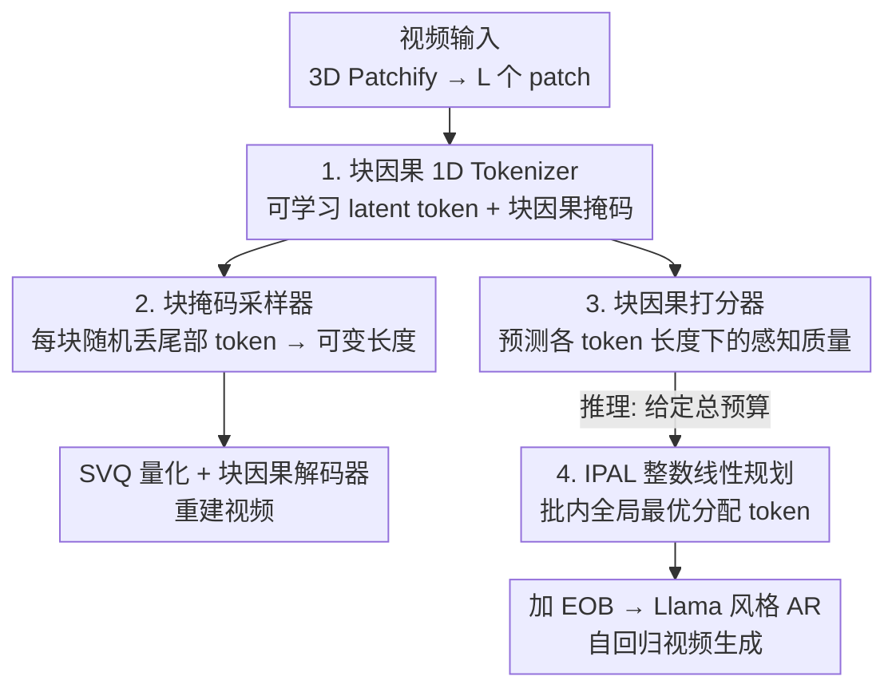

# AdapTok: Learning Adaptive and Temporally Causal Video Tokenization in a 1D Latent Space

**会议**: CVPR 2026  
**论文**: [CVF Open Access](https://openaccess.thecvf.com/content/CVPR2026/html/Li_AdapTok_Learning_Adaptive_and_Temporally_Causal_Video_Tokenization_in_a_CVPR_2026_paper.html)  
**代码**: https://github.com/VisionXLab/AdapTok  
**领域**: 视频生成 / 视频 Tokenizer  
**关键词**: 视频 tokenization, 1D 隐空间, 时序因果, 自适应 token 分配, 整数规划  

## 一句话总结
AdapTok 把视频编码成一段**时序因果的 1D 离散 token 序列**，训练时按块随机丢弃尾部 token 学到"可变长度"表征，再用一个打分器预测"某块用 N 个 token 时的重建质量"，推理时用整数线性规划在固定总预算下把 token 按内容复杂度动态分配给不同帧/不同样本，从而在 UCF-101 上用更少 token 拿到 rFVD=28 的重建并显著提升自回归视频生成质量。

## 研究背景与动机
**领域现状**：随着 LLM 把自回归（AR）生成做成跨模态的通用范式，视频生成也走"先把视频量化成离散 token、再用因果 transformer 自回归预测"的路线。视频不同于图像之处在于**帧间存在时序因果性**，所以一批工作（Cosmos-Tokenizer、MAGVIT 系列等）给 tokenizer 加上因果卷积或因果注意力掩码，让编/解码只依赖过去帧，支持在线流式处理、提升吞吐。

**现有痛点**：绝大多数因果 tokenizer 给**每一帧都分配固定数量的 token**，完全无视视频里大量的时序冗余——一个几乎静止的画面和一个剧烈运动的画面花一样多的 token，既浪费又限制了在给定预算下的表达力。少数尝试可变长度的工作（ElasticTok 是据作者所知第一个在同一视频内给不同帧分配不同 token 数的方法）又有两个硬伤：token 仍带着 2D 空间先验、是局部时空块而非统一的 1D 序列，导致"把信息聚到头部、丢尾部"的策略效果差；而且它只能靠一个**固定阈值**逐块判断该用多少 token，缺乏全局规划，无法在"整段视频总预算固定"的约束下做全局最优分配，结果就是样本间、空间区域间分配失衡。

**核心矛盾**：要做高效视频 tokenizer，三件事必须同时满足，但现有方法只能顾上一两件——(1) **时序因果**（前面帧的编解码不依赖后面帧，才能流式）；(2) **1D 隐空间**（token 分配与空间结构解耦，信息密度在空间上均匀）；(3) **自适应分配**（在给定预算下按样本信息量调 token 数，达到全局最优）。

**本文目标 / 核心 idea**：用一个 transformer 框架同时拿下这三点——把 3D 视频块压成一段**与空间结构解耦的 1D 因果 token**，靠尾部丢弃学可变长度，再训一个**打分器**预测"用多少 token 能换多少质量"，最后把"在总预算下选每块该用多少 token"建模成一个**整数线性规划**问题来求全局最优解。

## 方法详解

### 整体框架
AdapTok 由两大组件构成：一个基于 transformer 的 **VQ tokenizer**（编码器 + 块掩码采样器 + 量化器 + 解码器）和一个**块因果打分器**。

**训练阶段**：视频先做 3D patchify，展平成 $L$ 个 patch embedding（实现里 $16{\times}128{\times}128$ 视频、patch $4{\times}8{\times}8$，得 $L=1024$），划成 $K=4$ 个块。块因果编码器用一组可学习的 latent token 把这些 patch 转成 1D 隐序列；块掩码采样器对每块随机丢掉尾部若干 token（学可变长度）；剩下的 token 经 SVQ 量化，再由块因果解码器重建视频。打分器则单独训练，去预测"某块用不同 token 数时的感知质量"。

**推理阶段**：给定一个总 token 预算，打分器对一个 mini-batch 里每个样本预测"各候选 token 长度下的质量分"，IPAL（基于整数线性规划的分配策略）据此求解"每个样本该分多少 token"，使整批重建质量最优——这就实现了**样本级、内容感知、时序动态**的 token 分配。分配好的 token 序列每块尾部加一个 `<EOB>`，喂给 Llama 风格 transformer 做自回归生成。

### 关键设计

**1. 块因果 1D Tokenizer：把视频压成与空间解耦的因果隐序列**

针对"现有 token 带 2D 空间先验、信息没法聚到头部"这个痛点，AdapTok 不直接量化 patch，而是引入一组可学习的 latent token $q_{enc}\in\mathbb{R}^{N\times d}$，把它和 $L$ 个视频 token $e$ 拼成 $(L+N)$ 的输入喂给块因果编码器 $E$，只取 latent token 对应的输出 $\tilde{z}=E(e\oplus q_{enc})_{L:(L+N)}$ 作为隐表征——这一步（思路来自 TiTok/LARP）让 token 数量和空间网格彻底解耦，得到一段**1D 序列**，信息密度在空间上均匀分布。因果性则靠**块因果注意力掩码**实现：一个块内的所有 token（包括 latent token 和视频 token）只能 attend 到同块或更早块的 token，从而前面帧的编解码完全不依赖后面帧，支持在线流式处理。消融显示（Table 4）同样 token 预算下 1D 比 2D 强得多（1024 token 时 rFVD 73.4 vs 173.99），且在 token 砍半（1024→512）时 1D 退化平缓而 2D 直接崩到 850，说明 1D 隐空间天生更适合做"按需删 token"的自适应分配。

**2. 块掩码采样器（尾部丢弃）：让一个模型同时学会"用多少 token 都能重建"**

要做自适应分配，前提是同一个 tokenizer 在 token 数从 32 到 512 不等时都能解码出合理视频。AdapTok 借鉴 tail-drop 思路，训练时对每块隐序列 $\tilde{z}_i$ **随机采一个保留长度 $\omega_i$**（从截断高斯采样，均值 256、标准差 128、范围 [32,512]），构造二值掩码 $m$——每块前 $\omega_i$ 个位置为 1、其余为 0，然后 $z=\text{BlockTailDrop}(\tilde{z}\mid m')$ 把尾部 token 丢掉再量化重建。解码端的注意力掩码也同步派生 $M'=\text{BlockTailDrop}(M\mid m')$，保证被丢的 token 不参与注意力。这种"按块丢尾部"的副产品很关键：它逼着**头部 token 承载全局信息、尾部 token 补局部细节**（Fig.5 的注意力图证实了这一点），于是重建质量随 token 增多呈**由粗到细**的单调改善——这正是后面打分器和 ILP 能工作的基础，因为只有"多给 token = 质量更好"成立，分配优化才有意义。

**3. 块因果打分器：把"该给多少 token"变成可预测的质量曲线**

光能可变长度还不够，推理时得知道"这个样本这一块，用 N 个 token 到底能换来多少质量"，否则无从分配。AdapTok 训练一个 transformer 编码器形式的块因果打分器 $S_\theta$，**一次前向就预测某块在所有候选 token 长度下的质量分** $\hat{s}=S_\theta(z\oplus z_q, M_s')_{qM:(q+1)M}$。监督信号（ground-truth 分数）的造法很巧：每次迭代随机选一个目标块 $q$，把隐序列复制多份、每份对第 $q$ 块施加不同 token 数 $\omega_q$ 的掩码（前面块随机长度、后面块全 mask），解码后算该块的**感知损失 $L_P$ 当作质量分 $s$**；打分器输出 $\hat{s}$ 和 $s$ 之间用 MSE 训练。消融（Table 7）对比了用 SSIM / PSNR / MSE / 感知损失当评分指标，发现**感知损失不仅在自身指标上最好，连 rFVD 等其他指标也最优**，说明它和整体感知质量相关性最强，因此被选为默认评分。

**4. IPAL：用整数线性规划在固定预算下求全局最优 token 分配**

有了每样本每块的质量曲线，"怎么分 token"就成了一个带约束的优化问题——ElasticTok 那种逐块固定阈值做不到全局最优，AdapTok 把它建成**整数线性规划**。对 mini-batch 里每个样本 $k$、每个候选 token 长度 $j$，引入二值变量 $b_{kj}\in\{0,1\}$ 表示"样本 $k$ 是否分到 $j$ 个 token"，目标是最小化全批预测的感知损失之和：

$$\min_{b}\sum_{k,j}\hat{s}_{kj}\cdot b_{kj},\quad \text{s.t.}\ \sum_j b_{kj}=1\ \forall k,\ \sum_{k,j} j\cdot b_{kj}=B\cdot N_b$$

第一个约束保证每个样本只选一种 token 长度，第二个约束把整批 token 总量钉死在预算 $B\cdot N_b$（$B$ 批大小、$N_b$ 每块平均 token 数）。解出最优 $b^*$ 后每样本的 token 数 $n_k=\sum_j j\cdot b_j^*$。这样复杂的视频自动多分 token、简单的少分，但全局总量严格守预算，达到性能-token 数的 Pareto 最优。而且因为打分器一次前向给全部候选分数、ILP 求解很快，整体推理比 ElasticTok **快 11×**（50.9 vs 571.7 ms/video，Table 8）。

### 损失函数 / 训练策略
Tokenizer 用复合目标 $L=L_R+L_{VQ}+L_P+L_G+L_{prior}$：L1 重建损失、量化损失、感知损失、对抗损失（提升清晰度）、以及建模隐序列的自回归先验损失。打分器单独用 MSE 监督。AR 生成器是标准交叉熵的自回归 likelihood。训练在 UCF-101 / Kinetics-600 上跑 250 epoch，batch 128，Adam（$\beta_1{=}0.5,\beta_2{=}0.9$），学习率线性 warmup 到 $10^{-4}$ 再 cosine 退火到 $10^{-6}$。值得强调：全程**不用额外图像数据**，训练视频不足 0.5M。

## 实验关键数据

### 主实验
UCF-101 视频重建（全部为因果 tokenizer，rFVD 越低越好）：

| 方法 | 训练数据 | Token 数 | rFVD ↓ | PSNR ↑ | LPIPS ↓ |
|------|---------|---------|--------|--------|---------|
| ElasticTok | 356M | 2,048 | 93 | 28.31 | 0.154 |
| Cosmos-DV | 100M | 1,280 | 140 | 26.20 | 0.187 |
| OmniTokenizer† | <0.5M | 1,280 | 94 | 26.19 | 0.124 |
| CausalTok†（强基线） | <0.5M | 1,024 | 37 | 25.91 | 0.111 |
| **AdapTok** | <0.5M | 512 | 60 | 24.06 | 0.144 |
| **AdapTok** | <0.5M | 1,024 | 36 | 25.72 | 0.114 |
| **AdapTok** | <0.5M | 2,048 | **28** | 26.37 | 0.103 |

AdapTok 用更少的训练数据和 token 显著超过现有因果 tokenizer：2048 token 时 rFVD=28，1024 token 时 rFVD=36（与同架构强基线 CausalTok 持平但 **token 少 1.8×**），512 token 时 rFVD=60 仍超过大多数 baseline。

视频生成（gFVD 越低越好；K600 帧预测、UCF 类条件生成）：

| 方法 | 参数 | Token | K600 ↓ | UCF ↓ |
|------|------|-------|--------|-------|
| OmniTokenizer | 650M | 1280 | 32.9 | 191 |
| MAGVIT-v2-AR | 840M | 1280 | / | 109 |
| CausalTok | 633M | 1024 | / | 80 |
| **AdapTok-AR** | 633M | 1024 | **11** | **67** |

只用 633M 参数，AdapTok-AR 在 K600 上 gFVD=11、UCF 上 67，且在重建质量相近时生成结果优于 CausalTok，印证"按视频内容自适应分配 token"对下游生成的增益。

### 消融实验
自适应训练（采样器）+ 自适应推理（打分器）的贡献（UCF-101，Table 5）：

| Token | 采样器 | 打分器 | rFVD ↓ | PSNR ↑ | LPIPS ↓ |
|-------|--------|--------|--------|--------|---------|
| 1024 | ✗ | ✗ | 37.13 | 25.92 | 0.111 |
| 1024 | ✓ | ✗ | 38.79 | 25.29 | 0.122 |
| 1024 | ✓ | ✓ | **36.36** | 25.72 | 0.114 |
| 512 | ✗ | ✗ | 509.95 | 14.38 | 0.368 |
| 512 | ✓ | ✗ | 121.88 | 22.89 | 0.170 |
| 512 | ✓ | ✓ | **59.96** | 24.06 | 0.144 |

token 分配策略对比（UCF-101，平均 1024 token，Table 6）：

| 策略 | rFVD ↓ | PSNR ↑ | LPIPS ↓ |
|------|--------|--------|---------|
| Fixed（固定分配） | 38.79 | 25.29 | 0.122 |
| BiThr（分数阈值二分） | 42.12 | 25.23 | 0.120 |
| BiDelta（增量阈值二分） | 38.13 | 25.65 | 0.115 |
| **ILP（IPAL）** | **36.36** | **25.72** | **0.114** |

### 关键发现
- **两个自适应机制缺一不可，且预算越紧收益越大**：512 token 时，不带任何机制 rFVD 直接崩到 510，只加采样器降到 122，再加打分器骤降到 60——说明低预算下"按内容分配 token"是救命的。
- **ILP 全面碾压启发式分配**：固定/阈值二分等策略都不如整数规划的全局最优解，验证了把分配建模成 ILP 的必要性。
- **感知损失是最好的评分指标**：用它当打分器目标不仅在 LPIPS 上最好，连 rFVD 也最优，因为它与整体感知质量相关性最强。
- **尾部丢弃催生由粗到细的层级表征**：头部 token 抓全局上下文、尾部 token 补局部细节（Fig.5 注意力图证实），token 越多重建越精细。
- **可扩展性好**：tokenizer / AR 模型放大时重建（rFVD 87→32）和生成（gFVD 149→61）都持续改善。

## 亮点与洞察
- **把"该用多少 token"从启发式阈值升级为可求解的优化问题**：打分器预测质量曲线 + ILP 求全局最优，这套"先预测收益、再约束求解"的范式很干净，且因为打分器一次前向出全部候选分数，推理反而比逐块阈值的 ElasticTok 快 11×——自适应不一定更慢，这是反直觉的好结果。
- **尾部丢弃 + 1D 隐空间的协同**：单独看 tail-drop 是旧 trick，但配上"与空间解耦的 1D latent"才真正让头部 token 聚全局信息、丢尾部不伤筋骨；2D 一砍 token 就崩的对比把这层协同关系讲得很清楚。
- **ILP 的批级约束设计可迁移**：把"固定总预算下给一批样本分配资源"建成二值 ILP 的思路，可以直接搬到图像可变长度 tokenization、KV cache 预算分配、混合分辨率推理等任何"总量受限、按需分配"的场景。

## 局限与展望
- 作者承认：当前用的是 VQ-VAE 式**离散** tokenizer，未来可探索连续隐变量版本验证框架普适性。
- 受算力限制，只在不足 0.5M 公开视频上训练，模型容量和数据多样性都有限，泛化到更广域场景待验证。
- ⚠️（自己观察）打分器的 ground-truth 分数靠"复制隐序列 + 多次掩码解码算感知损失"生成，这个标签构造在训练时开销不小；论文主打推理快，但训练侧成本没细谈。
- ⚠️（自己观察）ILP 是 mini-batch 级别的批内分配，意味着单样本流式推理时"全局最优"的语义会退化为"批内最优"，实际部署时批组成会影响每个视频拿到的 token 数。

## 相关工作与启发
- **vs ElasticTok**：同样想做视频可变长度 token，但 ElasticTok 的 token 是局部时空块、带 2D 空间先验，难以把信息聚到头部，且只能靠固定阈值逐块选 token、无全局预算约束；AdapTok 用 1D transformer 解耦空间结构 + 打分器 + IPAL 实现给定预算下的全局最优分配，重建 rFVD（同数据复现下 230→36）和推理速度（快 11×）都大幅领先。
- **vs LARP / OmniTokenizer 等固定长度因果 tokenizer**：它们每帧分配固定 token、忽略时序冗余；AdapTok 在保持因果性和 1D 表征的同时引入自适应分配，相同质量下 token 更省（1.8×）。
- **vs 图像自适应 tokenizer（ALIT / FlexTok / CAT）**：这些把可变长度做在图像上（递归蒸馏、tail-drop、或用 caption+LLM 预测复杂度选压缩比），AdapTok 把"可变长度 + 自适应推理"扩展到视频，并把推理时的分配决策从规则升级为 ILP 全局优化。

## 评分
- 新颖性: ⭐⭐⭐⭐⭐ 首个同时满足时序因果 + 1D 隐空间 + 全局最优自适应分配的视频 tokenizer，ILP 分配 + 质量打分器的组合很新。
- 实验充分度: ⭐⭐⭐⭐⭐ 重建/生成双任务、两数据集、分配策略/评分指标/1D-2D/模型规模多维消融，且与强基线公平复现对比。
- 写作质量: ⭐⭐⭐⭐ 三大设计动机清晰、图示到位；打分器标签构造一段稍密需反复读。
- 价值: ⭐⭐⭐⭐⭐ token 效率对世界模型/长视频 AR 生成是刚需，"按内容分配 token"的范式 + 可迁移的 ILP 分配框架实用价值高。

<!-- RELATED:START -->

## 相关论文

- [\[CVPR 2026\] FlashPortrait: 6× Faster Infinite Portrait Animation with Adaptive Latent Prediction](flashportrait_6x_faster_infinite_portrait_animation_with_adaptive_latent_predict.md)
- [\[CVPR 2026\] Chain of Event-Centric Causal Thought for Physically Plausible Video Generation](chain_of_event-centric_causal_thought_for_physically_plausible_video_generation.md)
- [\[CVPR 2025\] Learning Temporally Consistent Video Depth from Video Diffusion Priors](../../CVPR2025/video_generation/learning_temporally_consistent_video_depth_from_video_diffusion_priors.md)
- [\[ICCV 2025\] NormalCrafter: Learning Temporally Consistent Normals from Video Diffusion Priors](../../ICCV2025/video_generation/normalcrafter_learning_temporally_consistent_normals_from_video_diffusion_priors.md)
- [\[CVPR 2026\] OneStory: Coherent Multi-Shot Video Generation with Adaptive Memory](onestory_coherent_multi-shot_video_generation_with_adaptive_memory.md)

<!-- RELATED:END -->
