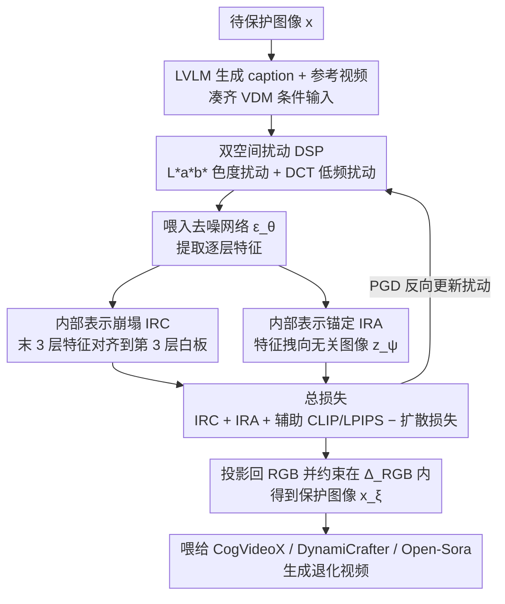

# Anti-I2V: Safeguarding your photos from malicious image-to-video generation

**会议**: CVPR 2026  
**arXiv**: [2603.24570](https://arxiv.org/abs/2603.24570)  
**代码**: 无  
**领域**: 视频生成  
**关键词**: 对抗攻击, 视频扩散模型, 图像保护, 双空间扰动, 深度特征崩塌

## 一句话总结
Anti-I2V 提出了一种针对恶意图像到视频生成的防御方法，通过在 L\*a\*b\* 和频域双空间优化扰动，并设计内部表示崩塌（IRC）和锚定（IRA）损失破坏去噪网络的语义特征传播，在 CogVideoX、DynamiCrafter 和 Open-Sora 三种不同架构上实现 SOTA 防护效果。

## 研究背景与动机
**领域现状**：视频扩散模型（VDM）快速发展，CogVideoX、Open-Sora 等模型可从单张照片+文本生成逼真视频，带来深度伪造的严重滥用风险。

**现有痛点**：
   - 现有防御主要针对文图生成或特定架构（SVD），对 DiT/MMDiT 架构的大模型效果未验证；
   - RGB 空间扰动容易被去噪过程消除，鲁棒性不足；
   - 大多数方法仅攻击最终输出（VAE 编码或去噪网络末端），忽视了中间层特征传播。

**核心矛盾**：视频扩散模型容量更大、时序建模更强，传统扰动方法难以有效干扰——如何设计更深层次的干扰策略？

**本文切入角度**：双管齐下——在更鲁棒的非 RGB 空间优化扰动 + 在网络内部识别语义丰富层并针对性破坏特征传播。

**核心 idea**：L\*a\*b\* + 频域双空间扰动 + 深层→浅层特征崩塌 + 跨层语义锚定 = 有效攻击大规模 VDM。

## 方法详解

### 整体框架
Anti-I2V 要做的是给一张照片加上一层人眼几乎看不出来、却能让图像到视频模型"翻车"的保护性扰动。整条流水线围绕一张待保护图像 $x$ 展开：先用 LVLM 给它生成一段 caption、配上一段参考视频，凑齐 VDM 推理需要的条件输入；随后进入核心的扰动优化循环——不在 RGB 像素上直接改，而是在 L\*a\*b\* 色彩空间和 DCT 频域这两个更"耐洗"的空间里反复迭代噪声。优化的目标由两类内部损失主导：IRC 把去噪网络深层的语义特征往浅层退化，IRA 再把这些特征主动拽向一张无关图像；再叠加 CLIP/LPIPS 辅助损失和一个被取负的扩散损失，最终把扰动投影回 RGB 得到保护图像 $x_\xi$。这样产出的照片肉眼看几乎没变，喂给 CogVideoX、DynamiCrafter、Open-Sora 等模型后却会生成严重退化的视频。

### 关键设计

**1. 双空间扰动（DSP）：让扰动不被去噪过程"洗掉"**

RGB 像素级的对抗噪声有个老毛病——扩散模型多步去噪本身就是个降噪器，逐像素加的高频扰动很容易在反复采样中被磨平，鲁棒性不足。Anti-I2V 的对策是干脆不在 RGB 里改，而是分两个阶段在更结实的空间里下手。L\*a\*b\* 阶段只动色度通道 $a^*$ 和 $b^*$、不碰亮度 $L^*$：因为 L\*a\*b\* 的感知更均匀，色度上的扰动既对人眼更不可见、又能避开纯亮度去噪的削弱。DCT 阶段则把噪声注入低频系数——低频承载的是图像的结构和纹理这类"骨架"信息，扰动它比扰动高频细节更持久，也更能波及网络深层的表示。两个阶段交替更新，最后统一投影回 RGB 空间并约束在 $\Delta_{RGB}$ 范围内，保证扰动幅度可控。

**2. 内部表示崩塌损失（IRC）：把深层语义砸回浅层的"白板"状态**

多数已有防御只攻击最终输出（VAE 编码或去噪网络末端），却放过了中间层的特征传播——而恰恰是中间深层在悄悄重建有意义的结构。作者用 PCA 可视化去噪网络各层特征，发现语义是分层涌现的：OpenSora 要到第 19 层之后、CogVideoX 要到第 27 层之后才出现高级语义，而第 3 层几乎是张"白板"、没什么语义。IRC 顺势而为，把最后几层的特征强行对齐到这块低语义的第 3 层：

$$\mathcal{L}_{IRC}^{i,j} = \mathbb{E}\big\|\epsilon_\theta^j(z_t, z_\xi, t, y) - \epsilon_\theta^i(z_t, z_\xi, t, y)\big\|_2^2$$

其中 $i$ 取第 3 层、$j$ 取末尾 3 层。深层语义一旦被拉平，去噪过程就丧失了重建有意义结构的能力；而且 VDM 的注意力机制会把这种崩塌沿时序级联传播开，污染到生成视频的所有帧，而不只是首帧。

**3. 内部表示锚定损失（IRA）：不光打碎语义，还把它拽向错误目标**

IRC 只是"破坏"——把语义抹平；IRA 进一步"误导"——主动给特征指一个错误方向。具体做法是在去噪模块和 VAE 的每一层，把保护图像 $z_\xi$ 的特征锚定到一张无关目标图像 $z_\psi$ 的对应特征上，两条路径相加：

$$\mathcal{L}_{IRA} = \underbrace{\big\|\epsilon_\theta^m(z_t, z_\xi, t, y) - \epsilon_\theta^m(z_t, z_\psi, t, y)\big\|_2^2}_{\text{去噪模块逐层}} + \underbrace{\big\|E^n(z_\xi) - E^n(z_\psi)\big\|_2^2}_{\text{VAE 逐层}}$$

"抹平 + 误导"双管齐下，比单纯崩塌语义更难被模型恢复：去噪网络既找不回原本的结构，又被持续往无关内容上带偏，最终输出自然彻底退化。

### 最终目标函数
四项损失合成最终目标：

$$\mathcal{L}_{Anti-I2V} = \mathcal{L}_{IRC} + \mathcal{L}_{IRA} + \mathcal{L}_{auxiliary} - \mathcal{L}_{DM}$$

其中辅助损失 $\mathcal{L}_{auxiliary}$ 最大化 CLIP 特征距离与 LPIPS 感知距离，进一步拉开保护图像与原图的高层语义与感知表现；末项以负号叠加的扩散损失 $\mathcal{L}_{DM}$ 相当于反向优化去噪目标，让扰动朝"越难正确去噪"的方向走。整套损失用 PGD 风格的迭代优化求解扰动。

## 实验关键数据

### 主实验（CelebV-Text 数据集）

| 模型 | 方法 | ISM↓ | C-FIQA↓ | Q-A(F)↓ | Q-A(V)↓ | DINO↓ |
|------|------|------|---------|---------|---------|-------|
| CogVideoX | Clean | 0.721 | 0.522 | 0.746 | 0.802 | 0.828 |
| CogVideoX | MIST | 0.561 | 0.463 | 0.476 | 0.577 | 0.750 |
| CogVideoX | **Anti-I2V** | **0.448** | **0.433** | **0.447** | **0.532** | **0.722** |
| DynamiCrafter | Clean | 0.528 | 0.467 | 0.724 | 0.794 | 0.622 |
| DynamiCrafter | AdvDM | 0.269 | 0.370 | 0.167 | 0.207 | 0.397 |
| DynamiCrafter | **Anti-I2V** | **0.151** | **0.303** | **0.032** | **0.047** | **0.167** |

### 消融实验

| 配置 | ISM↓ | Q-A(V)↓ | 说明 |
|------|------|---------|------|
| 仅 RGB 扰动 | 0.583 | 0.543 | 基线（类似 AdvDM） |
| + L\*a\*b\* | 0.521 | 0.511 | 色彩空间扰动更有效 |
| + DCT | 0.498 | 0.496 | 频域进一步提升 |
| + IRC | 0.472 | 0.558 | 语义崩塌有效 |
| + IRA | 0.460 | 0.540 | 锚定损失补充 |
| 完整 Anti-I2V | **0.448** | **0.532** | 所有组件协同最优 |

### 关键发现
- 对 DynamiCrafter（UNet 架构）效果最为显著，Q-A(V) 从 0.794 降至 0.047
- 对 CogVideoX（DiT 架构）同样有效，验证了跨架构泛化能力
- 简单的层选择策略（最后 3 层→第 3 层）在不同架构上通用

## 亮点与洞察
- **首次系统研究非 RGB 空间的对抗扰动优化**，L\*a\*b\* + 频域组合是有效的新方向
- IRC 损失基于对去噪网络层特征的 PCA 分析，有理论支撑
- 适用于 UNet、DiT、MMDiT 三种主流架构，实用性强

## 局限与展望
- 扰动优化仍需对目标模型白盒访问，黑盒迁移性未充分验证
- 面对图像预处理（JPEG 压缩、模糊）后的鲁棒性有待更多分析
- 运行效率：PGD 迭代优化扰动的计算开销较高

## 相关工作与启发
- 与 MIST 的文本损失类似但扩展到层级别
- DSP 思路可推广到其他对抗攻击/防御场景

## 评分
- 新颖性: ⭐⭐⭐⭐ 双空间扰动+层级特征崩塌的组合设计新颖
- 实验充分度: ⭐⭐⭐⭐ 三种VDM架构×两个数据集，消融充分
- 写作质量: ⭐⭐⭐⭐ 技术细节详尽，PCA分析直观
- 价值: ⭐⭐⭐⭐ 对AI安全和隐私保护有重要现实意义

<!-- RELATED:START -->

## 相关论文

- [\[CVPR 2026\] Let Your Image Move with Your Motion! – Implicit Multi-Object Multi-Motion Transfer](let_your_image_move_with_your_motion_--_implicit_multi-object_multi-motion_trans.md)
- [\[CVPR 2026\] Attention Surgery: An Efficient Recipe to Linearize Your Video Diffusion Transformer](attention_surgery_an_efficient_recipe_to_linearize_your_video_diffusion_transfor.md)
- [\[ICCV 2025\] TIP-I2V: A Million-Scale Real Text and Image Prompt Dataset for Image-to-Video Generation](../../ICCV2025/video_generation/tip-i2v_a_million-scale_real_text_and_image_prompt_dataset_for_image-to-video_ge.md)
- [\[ICCV 2025\] RealCam-I2V: Real-World Image-to-Video Generation with Interactive Complex Camera Control](../../ICCV2025/video_generation/realcam-i2v_real-world_image-to-video_generation_with_interactive_complex_camera.md)
- [\[CVPR 2026\] Are Image-to-Video Models Good Zero-Shot Image Editors?](are_image-to-video_models_good_zero-shot_image_editors.md)

<!-- RELATED:END -->
