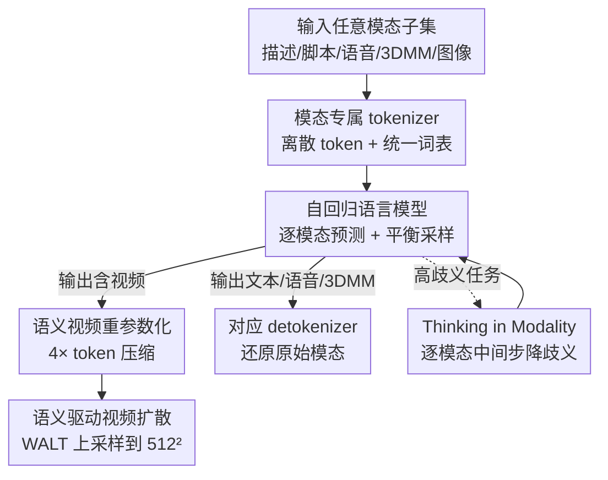

# Archon: A Unified Multimodal Model for Holistic Digital Human Generation

**会议**: CVPR 2026  
**arXiv**: [2605.30311](https://arxiv.org/abs/2605.30311)  
**代码**: 项目页 https://zju3dv.github.io/archon/ （未见开源代码）  
**领域**: 视频生成 / 多模态VLM / 数字人  
**关键词**: 数字人生成、统一多模态模型、自回归、语义视频、Thinking in Modality

## 一句话总结
Archon 把数字人涉及的 7 种模态（描述、文本脚本、语音、3DMM 动画、语义视频、图像、视频）各自离散化成 token，用一个自回归大模型在 72 个任务上预训练，实现任意模态到任意模态的生成/理解/编辑；并通过「语义视频 4× 压缩 token + 语义驱动扩散解码」解决高帧率说话视频的 token 爆炸，通过「Thinking in Modality」把语音→视频这类高歧义任务拆成逐模态中间步以稳住质量。

## 研究背景与动机
**领域现状**：数字人系统（说话头、语音驱动视频、人脸重演等）目前主流是「专家模型」路线——每个子任务/单模态各训一个专门模型，比如语音驱动视频、图像条件 TTS 各自独立。

**现有痛点**：专家模型路线有两个根本缺陷。一是碎片化与低效：不同模态用各自的数据集训练，分布不匹配，把多个专家拼成系统在新任务上很脆；每个专家都要独立学本可共享的任务知识，容量冗余、扩展性差。二是新模态成本高：每引入一个新模态就得从头训新模型或非平凡地微调。

**核心矛盾**：现有「统一多模态模型」在数字人场景里并不真正 holistic——MLLM（Flamingo/Kosmos 等）输出只限文本；统一生成模型能出文本/图像/视频，却普遍不支持语音、或只能出音乐/环境音这类非语音音频；而数字人最关键的「解析语音 + 3DMM 动画 + 跨时间保身份」几乎没人在多模态模型框架里研究。

**本文目标**：造一个 any-to-any 的人本统一生成框架，覆盖数字人全部感知模态，靠共享表示复用知识、无需为新任务单独预训练。子问题包括：(1) 异构模态怎么塞进一个 token 空间；(2) 高帧率说话视频 token 爆炸怎么办；(3) 高歧义跨模态任务（如语音→视频）质量怎么稳。

**切入角度**：既然离散 token + 自回归 transformer 已被证明能在共享 token 空间里统一感知与生成，那就把它「下沉」到数字人这个 domain，给每种数字人模态配专属 tokenizer，再用一个自回归模型建模它们的联合分布。

**核心 idea**：把 7 种数字人模态统一成离散 token，用一个原生自回归多模态模型在 72 个同步任务上预训练联合分布；并用「语义视频替代 RGB 视频」压 token、用「逐模态思考链」降歧义。

## 方法详解
### 整体框架
Archon 的输入输出都可以是任意模态子集。整条流水线是：先用一组模态专属 tokenizer 把描述、脚本、语音、3DMM 动画、图像、语义视频各自编码成离散整数 token，并入一个统一词表（550K）；这些 token 按结构化的「自然语言键值序列化」格式拼成 prompt，喂给 PaLM2 自回归 backbone 做跨模态推理，逐个模态地预测输出 token；输出 token 再用对应 detokenizer 还原成原始模态。其中视频这一支特殊：模型不直接生成 RGB 视频 token（会爆 context window），而是生成低成本的「语义视频」token，最后交给一个语义驱动的视频扩散模型（WALT）上采样成高清视频。推理时还可启用 Thinking in Modality，把高歧义任务拆成「先生成易控的中间模态、再生成目标模态」的链路。

### 关键设计

**1. 模态专属 tokenizer + 统一词表：把 7 种异构信号塞进一个 token 空间**

数字人涉及的信号天差地别——连续音频、3D 网格参数、像素视频、自然语言，没法直接放进同一个自回归序列。Archon 给每种模态配一个 tokenizer，权衡「重建保真」与「序列长度」后离散成整数 token，再合并进一个统一词表，不同模态占据词表里连续不重叠的索引区间（如文本占 0–256127、视频占 256128–518272），每个 token 有独立可学习 embedding。具体：图像用预训练 MAGVIT-v2（lookup-free，码本 $2^{18}$）把 $256\times256$ 图压成 $16\times16$ token；语音用 SoundStream RVQ（25 fps、保留前 4 个残差层、每层 1024 码）；动画用 3DMM 参数（形状/表情/姿态）各训一个残差 VQVAE（形状 8 层×512、表情 8 层×2048、姿态 6 层×512）；文本沿用 T5 tokenizer 以保留语言先验。这样异构模态被统一成「整数序列」，自回归模型才能一视同仁地建模它们的联合分布

**2. 语义视频重参数化 + 语义驱动扩散解码：用 4× 压缩绕开 token 爆炸**

高帧率说话视频是最大的 token 黑洞：5 秒、30 fps、$256\times256$ 的视频用现成 tokenizer 要 9K token，已超出 TPUv6 上 ~8K 的 context window；而同长度语音才 940 token，视频 token 会压倒性主导数据、造成训练偏置；直接换更高压缩比的 tokenizer 又要重训一个码本超 $2^{18}$ 的网络、瓶颈严重。Archon 的解法是把视频拆成「一张参考图（通常首帧）+ 一段语义视频」。语义视频由现成人脸分割模型给出 21 个离散语义类别（眼睑、眉、鼻……），保留结构与运动、丢弃纹理，信息密度大降但仍是像素域信号；离散语义标签在空间上分布平滑，天然契合自回归推理。语义视频 tokenizer（微调 MAGVIT-v2、码本仅 $2^{10}$）把 $L\times128\times128$ 压成 $(\frac{L-1}{4}+1)\times8\times8$ token，实现 4× 缩减。最后一个语义驱动的视频扩散模型（WALT 改造，$\mathbf{v}$-prediction + MSE loss）以语义 mask、参考图、文本描述为条件，把语义视频上采样成 $512\times512$ 高清视频——语义在这里充当「结构桥」，把参考图的外观传到生成视频里

**3. 递归式任务重构 + 难度平衡采样：让一个自回归模型驾驭 72 个任务**

任意模态子集做条件、生成剩余模态，组合数会爆炸——若像旧工作那样给每个任务配一个 special task token，模态一多就组合爆炸、模型学不动。Archon 把生成过程重写成递归式：第 1 步用条件模态 $\mathcal{D}_{\mathrm{cond}}$ 生成 $d_1$，之后每步 $T_j$ 把「条件 + 已生成的 $d_1,\dots,d_{j-1}$」一起作为条件来生成 $d_j$，即一次只预测一个模态。这在保持原联合分布表达力的同时大幅简化任务空间。prompt 不用 special token，而用「自然语言键值的结构化序列化」（类似 JSON/HTML）显式标出模态类型、状态、输入、期望输出，既减轻对稀疏特殊 token 的依赖，又能借力预训练语言模型的知识。训练覆盖 72 个任务、8K context、用 AGD 范式每步动态填充；针对随机采样的三种偏置（模型偏置、分布偏置、难度方差），每步采样多个任务并用采样权重 $S(i)=\frac{\log(p_i)}{N_{m(i)}}$ 平衡——$p_i$ 是用均匀采样基线模型估的任务困惑度（衡量难度），$N_{m(i)}$ 是输出模态为 $m(i)$ 的任务总数，从而同时校正「模态间任务数不均」和「任务难度差异」

**4. Thinking in Modality：把高歧义跨模态任务拆成逐模态思考链**

有些跨模态转换歧义巨大，比如直接语音→视频，既要抽显式信息（性别）又要凭空合成缺失细节（外观、表情），困惑度远高于 3DMM→视频，违背专家模型「scale 即质量」的假设。Archon 利用统一模型可条件于多模态的灵活性，在推理期引入 Thinking in Modality：不直接从源跳到目标，而是让模型先生成一串语义粒度平滑过渡的中间模态。例如语音→视频不写成 $\{d_{\mathrm{sph}},d_{\mathrm{img}}\}\rightarrow[d_{\mathrm{vid}}]$，而是走完整链 $\{d_{\mathrm{sph}},d_{\mathrm{img}}\}\rightarrow[d_{\mathrm{shp}},d_{\mathrm{exp}},d_{\mathrm{sem}},d_{\mathrm{dsc}},d_{\mathrm{vid}}]$，先生成 3DMM 形状/表情、语义视频、描述这些更可控可解释的中间表示，再生成视频。这相当于让模型「换个模态思考一步」逐步降低不确定性，且无需任何重训，纯靠模型已具备的多模态条件能力

## 实验关键数据

### 主实验
训练用 6000 小时公网独白视频（含同步语音与脚本，Gemini 2.5 Pro 加字幕、拟合 3DMM、DinoV2 分割），在 256 张 TPUv6 上训语言模型 20 天、128 张 TPUv6 训扩散 10 天。评测用 CelebV-HQ 与 HDTF 两个与训练集不相交的基准，各随机抽 200 条；注意 Archon **未在 benchmark 上微调**，直接零样本上阵。

语音驱动视频生成（Table 1，↓越小越好 / ↑越大越好；带 ∗ 表示该方法在该 benchmark 上训练过）：

| 数据集 | 方法 | FID↓ | FVD↓ | Sync-C↑ | Sync-D↓ | IQA↑ |
|--------|------|------|------|---------|---------|------|
| CelebV-HQ | AniPortrait∗ | 39.73 | 160.7 | 3.493 | 10.982 | 3.833 |
| CelebV-HQ | EchoMimic∗ | 56.81 | 236.9 | 4.463 | 9.575 | 3.601 |
| CelebV-HQ | Hallo3 | 15.67 | 105.5 | **5.429** | 9.158 | 3.722 |
| CelebV-HQ | **Archon** | **6.818** | **93.81** | 5.210 | **8.998** | 3.794 |
| HDTF | AniPortrait | 42.03 | 162.8 | 2.879 | 10.889 | 3.813 |
| HDTF | EchoMimic∗ | 45.90 | 241.6 | 5.467 | 9.36 | 3.743 |
| HDTF | Hallo3∗ | 12.78 | 96.51 | **6.376** | 9.131 | 3.83 |
| HDTF | **Archon** | **5.779** | **81.64** | 6.198 | **8.822** | **3.94** |

Archon 在两库的 FID/FVD/Sync-D 全面领先，视频质量与口型同步距离最优；Sync-C 略低于 Hallo3，但论文指出 Hallo3 靠在重音处夸张表情刷高 Sync-C，表情常显不自然。

图像条件 TTS（Table 2）：Archon 在 C-SIM（声音身份一致）与 Identity Accuracy 上两库均超 FaceTTS（如 CelebV-HQ C-SIM 0.9117 vs 0.9048、Id. Acc. 0.6223 vs 0.6032），但 MCD-DTW 略逊（8.918 vs 7.9383）——因 Archon 用轻量通用 detokenizer，而 FaceTTS 用专门的重型音频扩散。

### 消融实验
在 CelebV-HQ / HDTF 的语音驱动视频生成上消融（Table 3，Full Model 即完整 Thinking 链）：

| 数据集 | 配置 | FID↓ | FVD↓ | Sync-C↑ | Sync-D↓ | IQA↑ |
|--------|------|------|------|---------|---------|------|
| CelebV-HQ | w/o Unified Model | 7.279 | 170 | 3.209 | 10.143 | 3.695 |
| CelebV-HQ | w/o Thinking | 13.76 | 128.1 | 3.088 | 10.209 | 3.593 |
| CelebV-HQ | Full Model | **6.818** | **93.81** | **5.210** | **8.998** | **3.794** |
| HDTF | w/o Unified Model | 6.353 | 199.5 | 3.991 | 9.97 | 3.892 |
| HDTF | w/o Thinking | 13.43 | 110.3 | 4.478 | 9.597 | 3.809 |
| HDTF | Full Model | **5.779** | **81.64** | **6.198** | **8.822** | **3.94** |

- **w/o Unified Model**：用一组参数总量相同的专家模型（每个只出一种模态、同数据同架构同设置）替代统一模型，所有指标都掉——证明共享架构下联合学习的表示比孤立专家更强（如 HDTF FVD 81.64→199.5）。
- **w/o Thinking**：直接 $\{d_{\mathrm{sph}},d_{\mathrm{img}}\}\rightarrow[d_{\mathrm{vid}}]$ 而不走 3DMM/语义/描述中间链，FID 从 5.779 暴涨到 13.43、Sync-C 从 6.198 跌到 4.478——中间模态对稳住视频质量与口型同步至关重要。

### 关键发现
- 去掉 Thinking in Modality 对 FID 的伤害最大（CelebV-HQ 6.818→13.76），说明把高歧义任务拆成逐模态链是质量的主要保障，而非锦上添花。
- 统一模型在等参数预算下全面胜过专家集成，验证了「共享 token 空间联合训练」的容量效率优势。
- 零样本上阵就能与在 benchmark 上专门训练的 EchoMimic∗/Hallo3∗ 打平甚至超过，体现统一框架的泛化力。

## 亮点与洞察
- **「语义视频」是全篇最巧的一手**：把 token 爆炸问题从「压缩算法」层面转移到「表示选择」层面——既然 RGB 纹理对自回归推理是冗余且有害的，干脆只让 LM 推理离散语义结构（21 类标签），纹理交给下游扩散补，4× 压缩同时让信号分布更平滑、更契合自回归。这个「LM 管结构、diffusion 管外观」的分工可迁移到任何 token 受限的视频生成任务。
- **递归式任务重构**把指数级的「任意子集→任意子集」组合压成线性的「每步预测一个模态」，并用结构化自然语言 prompt 替代 special token——这让加新模态几乎零成本，是「holistic」能成立的工程基石。
- **Thinking in Modality 是 CoT 在多模态生成里的优雅类比**：文本 CoT 是「想中间推理步」，这里是「生成中间模态」，都在用更可控的中间表示降低端到端的不确定性，且都无需重训。
- 难度平衡采样 $S(i)=\log(p_i)/N_{m(i)}$ 把「模态任务数不均」与「任务难度」一次性纳入，思路简单但直击多任务多模态预训练的训练偏置。

## 局限与展望
- **依赖现成组件且偏特化**：语义视频靠现成人脸分割（21 类、面向人脸），意味着 Archon 强绑定「正脸说话头」场景，扩展到全身、手势、多人交互时语义类别体系需要重设计。
- **音频保真度有短板**：MCD-DTW 落后 FaceTTS，作者归因于轻量通用 detokenizer——通用性与单模态极致质量之间存在 trade-off，重型专用解码器没上。
- **算力门槛极高**：256+128 张 TPUv6 训 20+10 天，复现成本对学术界几乎不可行；且未见开源代码，可复现性存疑。
- **Thinking 链是手工设计的**：语音→视频走哪条中间模态链由人指定，论文未给出自动选链/学习最优链的机制，换任务可能要重新调链路。
- 评测仅 CelebV-HQ/HDTF 各 200 条、聚焦语音驱动视频与图像条件 TTS，72 个任务里大多数只有定性展示，缺乏对 any-to-any 全谱的定量评估。

## 相关工作与启发
- **vs 专家模型路线（AniPortrait / EchoMimic / Hallo3 / FaceTTS）**：它们各自只解一个子任务、需在目标 benchmark 上训练；Archon 用一个统一模型零样本覆盖多任务，等参数下消融证明联合训练表示更强，代价是单模态极致质量（如音频 MCD-DTW）略逊。
- **vs 人本基础模型（Sapiens / OmniHuman / promptHMR）**：它们走大规模表示预训练、联合捕捉姿态/几何/语义或加语言可控，但输入输出多仍是模态特定、难做 any-to-any 翻译；Archon 用离散 token 统一接口实现任意模态互转。
- **vs 统一多模态 LM（VideoPoet / Gemini / SpeechGPT / AudioLM）**：它们证明单 transformer 能在共享 token 空间做感知+生成，但要么输出限文本、要么不支持语音或只出非语音音频；Archon 把这套范式下沉到数字人，补上了语音+3DMM 动画+跨时间身份保持这些数字人专属能力。

## 评分
- 新颖性: ⭐⭐⭐⭐⭐ 首个把 7 种数字人模态统一进自回归框架，语义视频与 Thinking in Modality 两个设计都很巧
- 实验充分度: ⭐⭐⭐⭐ 主任务对比+消融扎实且零样本对打专门训练的 baseline，但 72 任务多数仅定性、音频指标有短板
- 写作质量: ⭐⭐⭐⭐ 动机层层递进、方法四模块清晰，符号与任务定义略密集
- 价值: ⭐⭐⭐⭐⭐ 为数字人提供了真正 holistic 的 any-to-any 范式，语义视频压 token 的思路有广泛迁移价值

<!-- RELATED:START -->

## 相关论文

- [\[CVPR 2026\] Soul: Breathe Life into Digital Human for High-fidelity Long-term Multimodal Animation](soul_breathe_life_into_digital_human_for_high-fidelity_long-term_multimodal_anim.md)
- [\[CVPR 2026\] U-Mind: A Unified Framework for Real-Time Multimodal Interaction with Audiovisual Generation](u-mind_a_unified_framework_for_real-time_multimodal_interaction_with_audiovisual.md)
- [\[CVPR 2026\] VGA-Bench: A Unified Benchmark and Multi-Model Framework for Video Aesthetics and Generation Quality Evaluation](vga-bench_a_unified_benchmark_and_multi-model_framework_for_video_aesthetics_and.md)
- [\[ICLR 2026\] Lumos-1: On Autoregressive Video Generation with Discrete Diffusion from a Unified Model Perspective](../../ICLR2026/video_generation/lumos-1_on_autoregressive_video_generation_with_discrete_diffusion_from_a_unifie.md)
- [\[CVPR 2026\] HoloCine: Holistic Generation of Cinematic Multi-Shot Long Video Narratives](holocine_holistic_generation_of_cinematic_multi-shot_long_video_narratives.md)

<!-- RELATED:END -->
