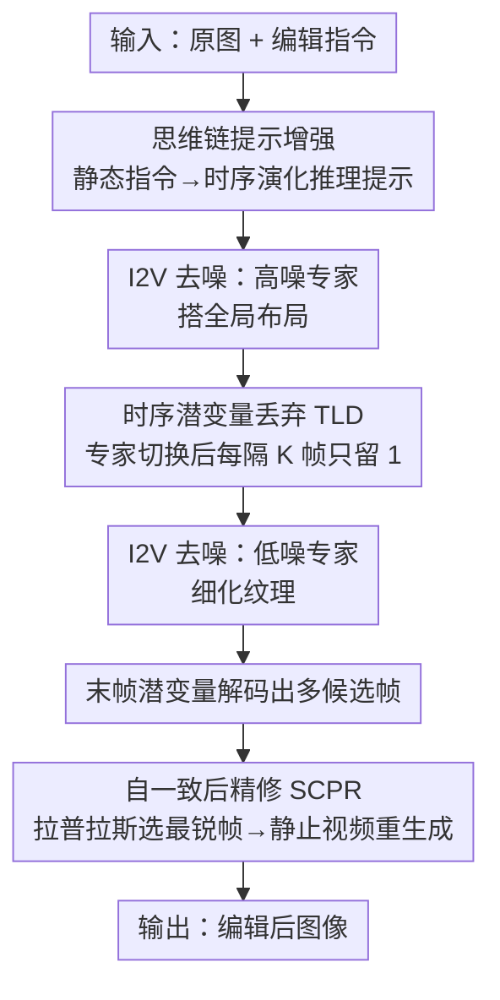

# Are Image-to-Video Models Good Zero-Shot Image Editors?

**会议**: CVPR 2026  
**论文**: [CVF Open Access](https://openaccess.thecvf.com/content/CVPR2026/html/Zhang_Are_Image-to-Video_Models_Good_Zero-Shot_Image_Editors_CVPR_2026_paper.html)  
**代码**: 未在论文中给出  
**领域**: 视频生成 / 图像编辑 / 扩散模型  
**关键词**: 图像编辑, 图生视频扩散, 免训练, 时序先验, 思维链提示

## 一句话总结
本文提出 IF-Edit，一个**免训练**框架，把预训练的图生视频（I2V）扩散模型直接当成零样本图像编辑器：用思维链提示把静态编辑指令改写成"随时间演化"的描述，用时序潜变量丢弃（TLD）砍掉冗余帧加速去噪，再用自一致后精修（SCPR）挑最清晰帧并用模型自身重生成一段"静止视频"提清晰度，在非刚性形变与推理类编辑上表现强劲。

## 研究背景与动机
**领域现状**：主流文本指令图像编辑把任务建模成 image-to-image 翻译，要么训练自由（靠 inversion + 注意力操控），要么大规模成对数据微调（如 Step1X-Edit、UltraEdit）。GPT-Image、Nano-Banana 这类多模态系统能做一些推理类编辑，但要么闭源、要么依赖昂贵微调。

**现有痛点**：这些方法都困在**单帧表示**里——没有显式的时序或因果先验，难以处理大视角变化、长程物理推理、以及大几何形变下的自一致性（比如"一小时后变成什么样""被锤子砸碎后"）。

**核心矛盾**：另一边，大规模视频扩散模型（如 Wan 2.2）已经展现出很强的**世界模拟**能力——能生成符合物理、物体一致的连贯帧序列，甚至有"chain-of-frames"的逐帧推理特性。但把它们当图像编辑器用，存在三个障碍：(1) **冗余计算**——视频模型一口气生成几十帧，而编辑只要一帧，算力大量浪费；(2) **低效选帧**——很多帧都满足指令，现有方法（F2F）靠反复调 VLM 或人工挑帧，引入延迟与工程复杂度；(3) **缺乏系统认识**——现成 I2V 模型究竟在通用编辑和推理类编辑上表现如何，没人系统评测过。

**本文目标**：能不能在**完全不微调**的前提下，直接把现成 I2V 扩散模型变成一个高效、通用的零样本图像编辑器？

**切入角度**：作者观察到 Wan 2.2 的 MoE 双专家有明确分工——高噪专家在早期快速搭好全局布局、低噪专家在后期细化纹理；而且只保留首帧 + 少数中间帧就足以维持全局一致与细节（图 3）。这说明**时序推理和全局布局主要发生在早期去噪阶段，大部分中间时序潜变量是冗余的**。

**核心 idea**：不设计新编辑器，而是"重访编辑流水线"——用三个轻量模块分别治掉提示错位、冗余时序潜变量、晚期帧模糊这三个病，把视频先验榨成一个免训练的图像编辑器。

## 方法详解

### 整体框架
IF-Edit 的输入是一张待编辑图像 + 一条文本指令，输出是一张编辑后的图像。中间它把"编辑"重新表述为"用 I2V 模型生成一段从原图出发的短视频，再取其末态作为编辑结果"。整条流水线串起三个轻量组件，全部复用同一个 Wan 2.2 模型、零额外训练：

先用 VLM 把静态指令改写成**带时序的思维链推理提示**（解决"提示错位"），喂给 I2V 模型生成；生成过程中在专家切换点后做一次**时序潜变量丢弃**，只留每隔 K 帧的关键潜变量（解决"冗余计算"）；最后从末帧潜变量解码出的若干候选帧里，用拉普拉斯清晰度分挑出最锐利的一帧，再把它送回同一个模型跑一段"静止视频"做**自一致后精修**（解决"晚期帧模糊"），取精修片段中最清晰帧为最终输出。

### 关键设计

**1. 思维链提示增强：把"改成什么"翻译成"怎么随时间变成那样"**

痛点直白：视频扩散模型是被"带时序的字幕"训出来的，而标准编辑指令（如"把纸从她手里拿走"）是静态、含糊的，喂进去与模型的世界模拟先验对不上。作者用一个 VLM（Qwen3-VL-30B-A3B）同时看输入图和指令，把它改写成一条**思维链式的时序推理提示**：显式描述场景如何一步步演化——哪些元素移动/出现/消失、同时保持身份与风格不变、末帧应该长什么样。例如"她松开手 → 卡片飘落出画面 → 双手空了，光照与姿态不变"。

与直接重写 caption（F2F 的做法）不同，这里不是换个说法，而是把"随时间发生了什么"这条因果链外化出来，让视频模型把编辑当成一次**平滑的视觉演化**而非单帧修改。消融显示去掉它 CLIP-T 从 0.65 掉到 0.59，说明时序化的推理提示对对齐世界模拟先验确实关键。

**2. 时序潜变量丢弃 TLD：早期布局定好后，砍掉冗余中间帧**

痛点是视频模型生成几十帧但编辑只要末态一帧，算力浪费。基于"时序推理与全局布局主要发生在早期高噪阶段"的观察，TLD 在去噪过程跨过专家切换点（即进入低噪专家、$t \le T_{th}$）后，做**一次性时序下采样**：设第 $t$ 步潜变量 $z_t \in \mathbb{R}^{C\times F\times H\times W}$（$F$ 为时序长度），

$$\tilde{z}_t = D_K(z_t) = z_t[:,\{0, K, 2K, \dots, F-1\},:,:]$$

只保留首帧 + 每隔 $K$ 帧一个潜变量，丢掉中间冗余时序 token，再喂给后续去噪。这样把时序维度的计算量从 $O(F)$ 降到约 $O(F/K)$。作者取 $K=3$、阈值 $T_{th}$ 设在专家切换点附近（实现里 dropout threshold = 0.9）。关键是**丢弃发生在全局布局已建立之后**，所以语义一致性几乎不掉——消融里 $K=1$（不丢弃）到 $K=3$ 推理时间从 21s 降到 12s，质量几乎不变；$K=4$ 过激则开始伤时序一致性。虽然是针对 Wan 2.2 的 MoE 设计提出，但调整阈值即可推广到其他视频模型（早期去噪同样负责全局时序结构）。

**3. 自一致后精修 SCPR：用模型自己当"去模糊器"，免掉 VLM 选帧**

痛点是末帧潜变量经 3D VAE 解码仍是多帧，且视频扩散的固有特性让这些帧运动模糊程度不一，直接挑到模糊帧会拉低质量；而现有方法靠反复调 VLM 打分选帧，开销大。SCPR 改成两步、确定性且自一致：先对解码帧 $\{x_i\}$ 算**拉普拉斯清晰度分** $s_i = \frac{1}{HW}\sum_{u,v}\nabla^2 x_i(u,v)$，确定性地选最锐利那帧 $x^* = \arg\max_i s_i$；然后**不调外部去模糊模型**，而是把 $x^*$ 重新喂回同一个 I2V 模型，配一条"静止视频"提示（如"一段完美静止、增强清晰度与细节的视频，相机固定…"），生成一小段精修片段，取其中最清晰帧为最终输出 $\hat{x}$。

这一步借模型自身的时序先验做"自对齐增强"，提纹理保真与清晰度而不改语义。消融显示去掉精修清晰度从 983 掉到 840；而换成 VLM 选帧虽精度相当，但运行时间从 12s 飙到 37s——SCPR 在质量与效率间取得了更实用的平衡。

### 损失函数 / 训练策略
**无训练**。全程复用预训练 Wan2.2-A14B I2V 模型（27B MoE、每步激活 14B）+ Lightning-LoRA 加速；提示增强用 Qwen3-VL-30B-A3B-Instruct。生成 32 帧、8 步去噪、dropout 阈值 0.9、时序步长 $K=3$。单张 H100 80GB 上每次编辑约 12 秒。

## 实验关键数据

### 主实验
在四个公开 benchmark 上评测：TEdBench / ByteMorph（非刚性与运动）、RISEBench（推理）、ImgEdit（通用编辑）。

TEdBench（非刚性形变，CLIP-I/CLIP-T 越高越好、LPIPS 越低越好）：

| 方法 | 出处 | LPIPS↓ | CLIP-I↑ | CLIP-T↑ |
|------|------|--------|---------|---------|
| LEDITS++ | CVPR24 | 0.23 | 0.87 | 0.63 |
| F2F | CVPR25 | 0.22 | 0.89 | 0.63 |
| FlowEdit | ICCV25 | 0.22 | 0.89 | 0.61 |
| **IF-Edit (ours)** | - | **0.19** | **0.96** | **0.65** |

CLIP-I 从此前最佳 0.89 大幅提到 0.96，图文对齐与图像一致性都最好。

RISEBench（推理类，GPT-4.1 按类别打准确率 %）：

| 模型 | 时序 | 因果 | 空间 | 逻辑 | 总体 |
|------|------|------|------|------|------|
| Nano-Banana（商用） | 25.9 | 47.8 | 37.0 | 18.8 | 32.8 |
| GPT-Image-1（商用） | 34.1 | 32.2 | 37.0 | 10.6 | 28.9 |
| Qwen-Image-Edit | 4.7 | 10.0 | 17.0 | 2.4 | 8.9 |
| Step1X-Edit | 0.0 | 2.2 | 2.0 | 3.5 | 1.9 |
| **IF-Edit (ours)** | 5.8 | **21.1** | 12.0 | 4.7 | **11.1** |

在**开源**模型里总体最高（11.1），尤其时序/因果推理领先，得益于视频扩散的逐帧演化先验；但与闭源商用模型（GPT-Image、Nano-Banana）仍有差距。

ByteMorph（运动/非刚性，Claude-3.7 VLM 打分）：IF-Edit 在 Camera Zoom（67.89）、Human Motion（67.04）、Interaction（69.05）上均居首，验证视频模型天然擅长捕捉运动动态与世界一致的变化。

### 消融实验（TEdBench，Tab. 5）

| 配置 | CLIP-T↑ | CLIP-I↑ | LPIPS↓ | 清晰度↑ | 时间(s)↓ |
|------|---------|---------|--------|---------|----------|
| w/o 提示增强（朴素提示） | 0.59 | 0.95 | 0.20 | 981 | 10 |
| w/o 后精修（no-refine） | 0.63 | 0.94 | 0.23 | 840 | 7 |
| K=1（不丢弃） | 0.65 | 0.96 | 0.17 | 983 | 21 |
| **K=3（Ours）** | **0.65** | **0.96** | 0.19 | 983 | **12** |
| K=4（过激丢弃） | 0.62 | 0.92 | 0.22 | 927 | 11 |
| 换 VLM 选帧 | 0.64 | 0.95 | 0.21 | 895 | 37 |

### 关键发现
- **提示增强管对齐**：去掉它 CLIP-T 掉 0.06（0.65→0.59），时序化推理提示是把视频先验对齐到目标编辑的关键。
- **TLD 管效率**：$K=1\to3$ 时间几乎减半（21s→12s）而质量不变，证明全局布局定好后大部分时序潜变量确实冗余；$K=4$ 开始伤一致性。
- **SCPR 性价比高**：去掉精修清晰度 983→840；换 VLM 选帧精度相近但耗时翻三倍（12s→37s），自一致精修才是质量/效率的甜点。
- **强项 vs 短板分明**：非刚性 + 推理类编辑强，但通用属性/风格编辑（ImgEdit 总体 2.19）明显落后专用编辑器（GPT-Image 4.20），因为 I2V 模型有"整体动态"的归纳偏置，会把局部编辑误当全局场景更新。

## 亮点与洞察
- **把"编辑"重新定义为"生成一段微世界演化的末态"**——这个视角让模型把大形变/物理变化当成连贯过程来生成，而非单帧硬改，是非刚性编辑做得好的根本原因。
- **TLD 的洞察很可迁移**：MoE 视频模型"早期定全局布局、后期补细节"的分工被量化利用，丢弃时机卡在专家切换点而非随意截断——这条"在结构确定后再稀疏化时序 token"的思路可用到任何需要给视频扩散提速的场景。
- **用模型自己当后处理器**：SCPR 不引入额外去模糊网络，而是用"静止视频"提示让同一模型自精修，是一个零额外依赖的自一致 trick。
- **系统性"诊断报告"价值**：论文不只给方法，还系统回答了"现成 I2V 模型当编辑器，哪类任务行、哪类不行"，对后续做视频-图像统一编辑的人是有用的路标。

## 局限与展望
- **通用指令编辑偏弱**（作者承认）：没有任务微调时，区域性或高度抽象的编辑（如"把白兔换成菠萝""把木板换深棕色"）容易失败，因为视频先验偏好物理合理、时序平滑的变换，对不真实的插入/替换不擅长（图 9）。区域感知控制或微调可缓解。
- **显存开销大**：尽管 TLD 加速，多帧处理仍需 >40GB 显存，需靠量化/剪枝压缩（但会牺牲速度）。
- **自己发现的局限**：评测多用 VLM/GPT-4.1 打分（ByteMorph 用 Claude-3.7、RISEBench/ImgEdit 用 GPT-4.1），不同 benchmark 评分器不同，横向比较需谨慎；且 RISEBench 上即便最好的开源模型总体也只有 11.1%，整体推理类编辑离实用还远。⚠️ 单次固定种子运行，未报方差。

## 相关工作与启发
- **vs F2F (CVPR25)**：同样免训练、用预训练视频模型，但 F2F 重度依赖 VLM 后选帧（高延迟）；IF-Edit 用 TLD 减候选 + SCPR 确定性选帧，去掉了 VLM 过滤，效率高得多。
- **vs ChronoEdit**：ChronoEdit 走相反路线——微调视频模型缩短轨迹、提编辑精度，但要大规模训练；IF-Edit 占据"中间地带"：像 F2F 一样完全免训练，又能在不微调下与 ChronoEdit 竞争，给视频先验做编辑器开辟了一条高效新路。
- **vs 专用图像编辑器（Step1X-Edit / GPT-Image 等）**：它们在通用/区域编辑上更强但需微调或闭源；IF-Edit 在非刚性与推理编辑上反超，代价是通用编辑落后——本质是"整体动态先验" vs "局部精确编辑"的取舍。

## 评分
- 新颖性: ⭐⭐⭐⭐ 把 I2V 世界模拟先验系统性重用为免训练图像编辑器，TLD/SCPR 两个轻量 trick 切中视频模型当编辑器的真实痛点。
- 实验充分度: ⭐⭐⭐⭐ 四个 benchmark 覆盖非刚性/推理/通用三维度，消融清晰；但单次运行无方差、通用编辑短板也如实暴露。
- 写作质量: ⭐⭐⭐⭐ 三障碍→三模块结构干净，图 2/3 直观说明动机，诚实交代强项与短板。
- 价值: ⭐⭐⭐⭐ 给"视频-图像统一生成推理"提供了简单可复现的配方与系统认识，对非刚性/物理推理编辑尤其有用。

<!-- RELATED:START -->

## 相关论文

- [\[CVPR 2025\] Zero-1-to-A: Zero-Shot One Image to Animatable Head Avatars Using Video Diffusion](../../CVPR2025/video_generation/zero-1-to-a_zero-shot_one_image_to_animatable_head_avatars_using_video_diffusion.md)
- [\[CVPR 2026\] Improving Motion in Image-to-Video Models via Adaptive Low-Pass Guidance](improving_motion_in_image-to-video_models_via_adaptive_low-pass_guidance.md)
- [\[CVPR 2026\] StoryTailor: A Zero-Shot Pipeline for Action-Rich Multi-Subject Visual Narratives](storytailora_zero-shot_pipeline_for_action-rich_multi-subject_visual_narratives.md)
- [\[CVPR 2026\] VidPrism: Heterogeneous Mixture of Experts for Image-to-Video Transfer](vidprism_heterogeneous_mixture_of_experts_for_image-to-video_transfer.md)
- [\[CVPR 2026\] MultiAnimate: Pose-Guided Image Animation Made Extensible](multianimate_pose-guided_image_animation_made_extensible.md)

<!-- RELATED:END -->
