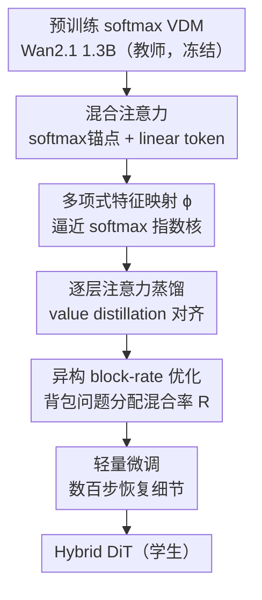

# Attention Surgery: An Efficient Recipe to Linearize Your Video Diffusion Transformer

**会议**: CVPR 2026  
**论文**: [CVF Open Access](https://openaccess.thecvf.com/content/CVPR2026/html/Ghafoorian_Attention_Surgery_An_Efficient_Recipe_to_Linearize_Your_Video_Diffusion_CVPR_2026_paper.html)  
**代码**: 无（Qualcomm AI Research，未公开）  
**领域**: 视频生成 / 扩散模型效率  
**关键词**: 视频扩散模型, 线性注意力, 混合注意力, 注意力蒸馏, 移动端加速

## 一句话总结
把预训练视频扩散 Transformer（Wan2.1）里昂贵的 softmax 自注意力，用「少量 softmax 锚点 token + 多数 linear token」的混合注意力替换掉，再配一套逐层蒸馏 + 背包式 block-rate 选择 + 轻量微调的「手术」流程，**只花不到 0.4k GPU 小时**就把模型线性化到接近原画质，同时长视频上单块注意力推理快约 6×。

## 研究背景与动机
**领域现状**：当前 SOTA 视频生成几乎都是 Diffusion Transformer（DiT）架构——Wan2.1、CogVideoX、HunyuanVideo 等在时空 patch 上做全局自注意力，画质和时序一致性都碾压早期 U-Net。

**现有痛点**：自注意力对序列长度是二次复杂度（时间 $O(N^2d)$、显存 $O(N^2)$）。视频的 token 数 = 空间 patch × 帧数，轻松上万。作者 profiling 发现，在 Wan2.1 1.3B 里 **超过 76% 的 Transformer 块算力都耗在自注意力上**；即使用了 FlashAttention，二次缩放依然是高分辨率、长时长、多镜头视频的硬墙。

**核心矛盾**：线性注意力（sub-quadratic）早就有了，但很少被用到视频扩散上，原因有三：① 从头训一个 SOTA 视频模型要几十万到上百万 GPU 小时 + 海量数据，根本训不起；② 没有现成方法能在合理算力内把 softmax 注意力**蒸馏**成线性注意力——softmax 背后的指数核需要无限维特征映射才能精确表示，近似很难；③ 线性注意力表达力弱，直接换会明显掉画质，尤其是时序动态复杂的视频。

**本文目标**：在**不从头训练**的前提下，把一个预训练好的 softmax VDM「就地改造」成线性/混合注意力版本，画质几乎不掉，算力大幅下降。

**切入角度**：借鉴语言模型最近的做法——如果让**一小撮 token 保留完整 softmax 注意力当全局锚点**，其余 token 走线性注意力，模型就能在需要的地方保住全局结构和细粒度依赖，其它地方高效缩放。

**核心 idea**：用「混合注意力 + 逐层蒸馏 + 预算约束下的 block-rate 优化 + 轻量微调」这套外科手术式流程，低成本地把现成 VDM 线性化。

## 方法详解

### 整体框架
输入是一个**冻结权重的预训练 softmax VDM 教师**（Wan2.1 1.3B，30 个 DiT 块），输出是一个**混合注意力学生模型（Hybrid DiT）**。整条「Attention Surgery」管线把改造拆成三步串行：先逐块把每层 softmax 注意力**蒸馏**进新的混合注意力模块（只训练新加的特征映射 $\phi$，其余冻结）；再在给定算力预算下用**背包优化**为每个块挑一个混合率 $R$，决定哪些块更激进、哪些块保守；最后对整网做**几百步轻量微调**把细节找回来。混合注意力模块本身又由两个零件构成——token 分离（softmax 锚点 vs linear）和可学习多项式特征映射 $\phi$。

### 关键设计

**1. 混合注意力：少量 softmax 锚点托住全局，多数 token 走线性**

直接把所有 token 换成线性注意力会掉画质（指数核表达力丢失），但全保留 softmax 又省不下算力。本文把一层的全部 token 集合 $T=\{1\dots N\}$ 解耦成 softmax token 子集 $T_S$ 与线性 token $T_L = T \setminus T_S$，对每个查询 token $i$ 的输出做加权融合：

$$\hat{y}_i = \frac{\sum_{j\in T_S}\exp\!\big(q_ik_j^\top/\sqrt{D}-c_i\big)v_j \;+\; \phi_q(q_i)\sum_{j\in T_L}\phi_k(k_j)^\top v_j}{\sum_{j\in T_S}\exp\!\big(q_ik_j^\top/\sqrt{D}-c_i\big) \;+\; \phi_q(q_i)\sum_{j\in T_L}\phi_k(k_j)^\top}$$

其中 $c_i$ 是数值稳定用的最大指数项。关键区别在 $T_S$ 怎么选：不像语言模型那样取查询 token 周围的**局部窗口**，本文按混合率 $R$ **均匀子采样**——$T_S = \{i \in T \mid i \bmod R = 1\}$。这样高质量的 softmax token 会均匀撒在整个时空跨度上，充当全局锚点，保住运动连贯性、防止局部窗口常见的时序漂移。$R$ 是核心的 trade-off 旋钮：$R=2$ 时一半 token 仍走二次复杂度、重建最接近原 softmax；$R=8$ 时只有 1/8 token 做二次注意力，算力降得最多但保真度更低。注意只有 $T_S$ 内部那一项保留 $O(|T_S|^2)$ 开销，线性项可缓存复用。

**2. 多项式特征映射 $\phi$：用多项式展开逼近指数核的大动态范围**

线性注意力的核心是把相似度 $\text{sim}(q_i,k_j)=e^{q_ik_j^\top}$ 换成可分解的 $\phi(q_i)\phi(k_j)^\top$，从而把求和提到外面、做到线性复杂度：

$$y_i = \frac{\phi(q_i)\sum_{j=1}^N \phi(k_j)^\top v_j}{\phi(q_i)\sum_{j=1}^N \phi(k_j)^\top}$$

经典做法用 $\phi(x)=1+\mathrm{elu}(x)$，但它和真正的指数核相似度差距太大，要么补不回画质、要么得花大量算力重训。本文给查询、键分别设计**独立可学习**的特征映射 $\phi_q,\phi_k: \mathbb{R}^D \to \mathbb{R}^{P\times D'}$：先过一个轻量 per-head 嵌入网络（分组 $1\times1$ 卷积 + 非线性），输出切成 $P$ 份，第 $i$ 份升到第 $i$ 次幂再拼接：$\phi(x)=[(\psi_1(x))^1,(\psi_2(x))^2,\dots,(\psi_P(x))^P]^\top$。这种**多项式展开**能比固定的 ELU 映射更准地逼近指数核 $e^{q_ik_j^\top}$ 的大动态范围。实验发现一个 2 层 MLP + 2 阶多项式就够用，每个改造块只多加约 2.4M 参数。

**3. 逐层注意力蒸馏：用 value distillation 低成本把老师对齐进学生**

这是省算力的关键。Attention Surgery 把蒸馏**按块独立**做（每个块单独蒸，简单且可并行），只需要冻结教师、训练学生新加的 $\phi$，而且**只需一组 prompt** 就能训。最直接的目标是匹配注意力分数：

$$L_{ad} = \log\!\Big(1 + \big\|e^{q_ik_j^\top} - \phi_q(q_i)\phi_k(k_j)^\top\big\|_2^2\Big)$$

外面的 $\log$ 是为了抑制大 logit/大梯度带来的数值不稳。但匹配注意力分数只是代理目标，真正想对齐的是注意力**加权后的隐状态**，所以作者更推荐 **value distillation loss**——直接在输出上做 L1：

$$L_{vd} = \big\|y - \hat{y}\big\|_1$$

其中 $y$ 是教师 softmax 输出、$\hat{y}$ 是学生混合注意力输出。消融显示 value distillation 出来的视频运动幅度明显更大（Dyn. Deg. 66.1 vs 注意力分数蒸馏的 37.5）；而注意力分数蒸馏倾向生成「卡通风」画面。整套蒸馏（连同后续）最贵的变体也不到 0.4k GPU 小时。

**4. 异构 block-rate 优化：把「每块选多大 R」建模成背包问题**

不同 DiT 块对线性化的敏感度不同——有的块在 $R=8$ 下重建误差就很小，有的块必须低 $R$ 甚至保留 softmax。在指数级的组合里怎么挑？本文把它形式化为：模型有 $B$ 个块，候选混合率集合 $R=\{1,2,4,8\}$（1 = 全 softmax）。蒸馏阶段已经能预先估出每个块 $i$ 在每个率 $r$ 下的算力 $c_{ir}$ 和相对 softmax 的误差 $e_{ir}$。用二元变量 $z_{ir}\in\{0,1\}$（块 $i$ 选率 $r$ 时为 1）求解：

$$\min_{\{z_{ir}\}}\ \sum_{i=1}^{B}\sum_{r\in R} e_{ir}z_{ir} \quad \text{s.t.}\ \sum_{i=1}^{B}\sum_{r\in R} c_{ir}z_{ir}\le\beta,\ \ \sum_{r\in R}z_{ir}=1\ \forall i$$

这是一个**多选背包问题**——在总算力预算 $\beta$ 下，给每块选一个率，使全网累计误差最小，可高效精确求解。解出来就是一套**异构**（各块率不同）的最优配置。相比「按蒸馏误差从低到高同构地转固定比例块」的简单基线，这个优化在各种预算下都能稳定（虽然幅度不大）提升 VBench 总分。

### 损失函数 / 训练策略
- **蒸馏阶段**：逐块独立，冻结教师，只训 $\phi_q,\phi_k$，默认用 value distillation loss（Eq. 7）。Algorithm 1 里先缓存教师轨迹再对同一 batch 做多次学生更新（update repeats $U$）。
- **轻量微调阶段**：蒸馏 + block-rate 选定后，逐块独立蒸出来的模型场景结构对、但细节差；对整网在一小批 prompt/video 对上微调**几百步**即可把丢失的画质找回来。低分辨率消融用 Open-Sora Plan 的 350K 子集，高分辨率用 Wan2.1 14B 合成的 22K 样本。

## 实验关键数据

实验都基于 **Wan2.1 1.3B**（30 个 DiT 块），在 VBench、VBench-2.0 上评测，并在 Snapdragon8-Gen4 上实测移动端延迟，另做了 562 对盲测人类偏好。

### 主实验：与 SOTA 高效视频扩散模型对比（VBench，81×480×832）

| 模型 | 参数量 | Total↑ | Quality↑ | Semantic↑ |
|------|--------|--------|----------|-----------|
| CogVideoX 5B | 5B | 81.91 | 83.05 | 77.33 |
| SANA-Video | ≤2B | 83.71 | 84.35 | 81.35 |
| Wan2.1 1.3B（原版） | 1.3B | 83.31 | 85.23 | 75.65 |
| Wan2.1 1.3B\*（本文复现） | 1.3B | 83.10 | 85.10 | 75.12 |
| **+ Attention Surgery (15×R2)** | 1.3B | **83.21** | **85.19** | **75.25** |

15×R2 变体（15 个块转混合、率 2）几乎**追平了它所基于的 Wan2.1\* 原版**，VBench 总分仅差 ~0.1。VBench-2.0 上 15×R2 拿 55.1（原版 56.0），各维度（人体保真、创意、可控性、物理）都贴得很近，且超过 CogVideoX-1.5 5B（53.4）。

### 效率收益

| 指标 | 结果 |
|------|------|
| Transformer 块内自注意力占算力 | >76%（Wan2.1 1.3B） |
| 单 DiT 块推理加速（7.5s 视频，320×480） | ~6× faster |
| 整套手术训练成本 | <0.4k GPU 小时（vs 从头训需 10⁵–10⁶ GPU 小时） |
| 每个改造块新增参数 | ~2.4M（2 层 MLP + 2 阶多项式） |
| 移动端长视频 | 原版 Wan2.1 在更长时长直接 OOM，本文可继续缩放 |

视频越长、分辨率越高，token 越多，二次项越占主导，本文相对原版的加速比只会更大。

### 消融：注意力蒸馏的必要性（VBench）

| 转换块 | 注意力类型 | 蒸馏 | Total↑ | Quality↑ | Semantic↑ |
|--------|-----------|------|--------|----------|-----------|
| 15 | Linear | ✗ | 59.7 | 69.7 | 20.0 |
| 15 | Linear | ✓ | 78.9 | 82.2 | 65.9 |
| 20 | Hybrid R=8 | ✗ | 77.3 | 80.2 | 65.9 |
| 20 | Hybrid R=8 | ✓ | 80.0 | 81.7 | 73.2 |

不做蒸馏，纯线性 15 块直接崩到 59.7（Semantic 仅 20.0）；加上蒸馏拉回 78.9。混合注意力（R=8）即便不蒸馏也有 77.3，说明 softmax 锚点本身就托住了基本盘，但蒸馏仍能再补 ~2.7 分。

### 消融：异构 block-rate vs 同构基线（VBench Total）

| 配置 | 同构 | 异构（本文） |
|------|------|-------------|
| 15×R4 | 81.0 | **81.9** |
| 20×R8 | 80.0 | **80.9** |
| 25×R4 | 79.9 | **80.2** |

背包式异构选择在所有预算下都稳定优于同构基线（每块转同一比例），幅度虽小但一致。

### 关键发现
- **蒸馏是命门**：纯线性化不蒸馏几乎不可用（59.7），蒸馏是低算力下保画质的核心。混合注意力比纯线性更鲁棒（不蒸馏也有 77+），因为均匀分布的 softmax 锚点提供了全局结构。
- **value distillation > 注意力分数蒸馏**：前者生成的视频动态度（Dyn. Deg.）66.1 远高于后者的 37.5，且后者偏「卡通风」。说明对齐**输出隐状态**比对齐**注意力图**更贴近最终目标。
- **$\phi$ 不用很大**：2 层 MLP + 2 阶多项式（1.2M 参 / 30 GFLOPs）就和 6 阶 3 层（15.4M / 387 GFLOPs）打平甚至更好（Tab. 7），是性价比最优点。
- **可线性化一半以上的块**：把 ≥50% 的块换成混合注意力，画质几乎不掉。

## 亮点与洞察
- **「均匀子采样」而非「局部窗口」选锚点**：把 softmax token 撒满整个时空跨度，是专为视频时序连贯性做的设计——局部窗口在视频里容易时序漂移。这是把语言模型的混合注意力迁到视频的关键改动。
- **把架构搜索变成可解的背包问题**：用蒸馏阶段「免费」算出的每块误差/算力做约束优化，避免在指数级组合里盲搜，是一个干净、可复用的「按层异构配置」范式，能迁到量化位宽分配、剪枝率分配等场景。
- **逐块独立蒸馏 + 整网轻量微调**的两段式，把昂贵的对齐拆成可并行的小问题，是「<0.4k GPU 小时改造 SOTA 模型」的工程核心。
- **value vs attention-map 蒸馏的对比很有启发**：匹配注意力图只是代理目标，直接匹配输出 value 反而保住了运动幅度——提醒做蒸馏时要盯住真正下游关心的量。

## 局限与展望
- 只在 **Wan2.1 1.3B 单一模型**上验证，是否能推广到更大模型（14B）、其它 DiT（CogVideoX/HunyuanVideo）只是「原则上适用」，未实测。
- 15×R2 这个「追平原版」的变体其实只转了一半块、且用最保守的 $R=2$，加速主要来自更激进配置；而更激进配置（如 25×R4）画质会掉到 80.2，**画质-加速 trade-off 仍真实存在**，论文标题的「linearize」在最佳画质点上更接近「部分混合化」。
- 人类偏好研究里 Total 行 Ours 31.0% / No pref 39.7% / Wan2.1 29.3%，「无偏好」占比最高 ⚠️ 说明两者差距小但也并非全面超越；个别维度（Scene、Subject consistency）原版更受偏好。
- 评测分辨率/时长偏短（消融用 320×480），更长更高分辨率下的画质保真未充分展示。
- 改进方向：把 block-rate 优化和微调联合训练（而非先选后微调）、对超大模型做验证、探索更激进 $R$ 下保画质的 $\phi$ 设计。

## 相关工作与启发
- **vs SANA / SANA-Video / LinGen（图像/视频高效注意力）**：它们多需从头训或大规模训练；本文主打**对预训练 softmax 模型做轻量蒸馏微调**，不重训，更省。
- **vs M4V（蒸馏进 Mamba）/ SSM、RWKV 类**：这些改了块结构（Transformer→SSM），蒸馏要大量训练；本文**保留原块结构**，只换注意力内部，蒸馏成本低得多。
- **vs token merging / 下采样 / tiling / sparsity 加速**：稀疏/tiling 是「跳过大多数 token 的注意力」；本文混合注意力**仍关注所有 token**（softmax 锚点 + 线性全局项），更利于长程依赖建模。
- **vs Zhang et al.（语言模型混合注意力）**：本文最大改动是把 $T_S$ 从「局部窗口」改成「均匀子采样」，专门解决视频的时序漂移问题。

## 评分
- 新颖性: ⭐⭐⭐⭐ 把混合注意力 + 背包式 block-rate + 逐块蒸馏组合成「不重训就线性化 VDM」的完整 recipe，均匀采样锚点是针对视频的有效改动。
- 实验充分度: ⭐⭐⭐⭐ VBench/VBench-2.0/人类偏好/移动端延迟齐全，消融到位；但只在单一模型上验证，激进配置画质权衡披露可更充分。
- 写作质量: ⭐⭐⭐⭐ 动机清晰、公式完整、图表配合好，三阶段流程讲得明白。
- 价值: ⭐⭐⭐⭐ 「<0.4k GPU 小时改造 SOTA 视频模型 + 移动端可跑长视频」对工业部署很实在。

<!-- RELATED:START -->

## 相关论文

- [\[CVPR 2026\] FrameDiT: Diffusion Transformer with Matrix Attention for Efficient Video Generation](framedit_diffusion_transformer_with_matrix_attention_for_efficient_video_generat.md)
- [\[CVPR 2026\] VMonarch: Efficient Video Diffusion Transformers with Structured Attention](vmonarch_efficient_video_diffusion_transformers_with_structured_attention.md)
- [\[CVPR 2026\] Let Your Image Move with Your Motion! – Implicit Multi-Object Multi-Motion Transfer](let_your_image_move_with_your_motion_--_implicit_multi-object_multi-motion_trans.md)
- [\[CVPR 2026\] RAPID: Reusing Attention Sparsity with Inter-step Adaptation for Efficient Video Diffusion](rapid_reusing_attention_sparsity_with_inter-step_adaptation_for_efficient_video_.md)
- [\[CVPR 2026\] STCDiT: Spatio-Temporally Consistent Diffusion Transformer for High-Quality Video Super-Resolution](stcdit_spatio-temporally_consistent_diffusion_transformer_for_high-quality_video.md)

<!-- RELATED:END -->
