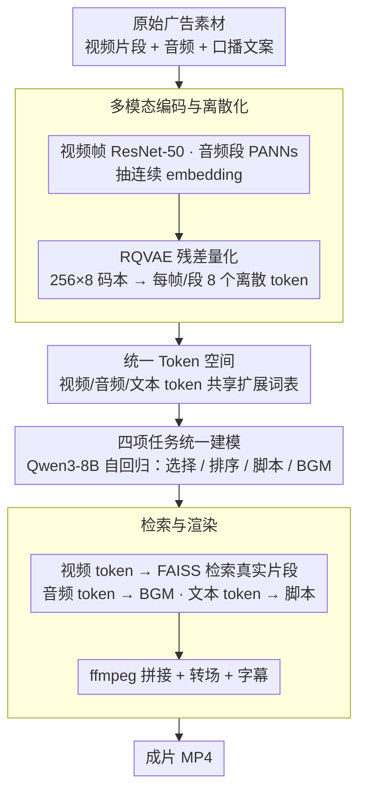

# AutoCut: End-to-end Advertisement Video Editing Based on Multimodal Discretization and Controllable Generation

**会议**: CVPR 2026  
**arXiv**: [2603.28366](https://arxiv.org/abs/2603.28366)  
**代码**: [https://github.com/AdAutoCut/Autocut](https://github.com/AdAutoCut/Autocut)  
**领域**: 视频理解 / 视频编辑  
**关键词**: video editing, Multimodal LLM, Residual VQ, Advertisement, Controllable Generation

## 一句话总结
AutoCut 提出了一个端到端的广告视频编辑框架，通过残差向量量化（RQVAE）将视频、音频和文本统一到共享的离散 token 空间中，在 Qwen3-8B 上进行多模态对齐和监督微调，实现了视频选择、排序、脚本生成和背景音乐选择四项任务的统一处理，在多项指标上超越 GPT-4o 基线。

## 研究背景与动机

**领域现状**：短视频已成为数字广告的主要载体，但制作流程涉及脚本编写、素材拍摄、剪辑和后期，成本高、门槛高。

**现有方法的三大障碍**：
   - **松散的多模态耦合**：视频、音频、文本的表征弱对齐，无法进行统一推理
   - **缺乏可解释控制**：模型不提供结构化或离散表示，难以调整叙事节奏和内容重点
   - **割裂的理解与生成**：多模态理解和生成被视为独立过程，优化不一致

**MLLM 的机遇与限制**：多模态大语言模型有潜力统一感知、理解和创作，但**受限于上下文窗口长度**，难以直接处理大规模视频检索和编辑。

**核心 idea**：将视频和音频特征通过 RQVAE 离散化为 token 后与文本 token 统一，构建共享词表，让 LLM 在统一的 token 空间中进行多模态推理和生成。

## 方法详解

### 整体框架
AutoCut 要解决的是把一堆原始广告素材（视频片段、音频、口播文案）自动剪成一条成片，难点在于视频、音频、文本三种模态各说各话、弱对齐，而 LLM 的上下文窗口又装不下海量待检索素材。它的破题思路是把所有模态都"压成 token"：视频帧和音频段先各自编码成连续 embedding，再经 RQVAE 量化成离散 token，和文本 token 一起塞进同一张扩展词表。这样一来，"选片段、排顺序、写脚本、配 BGM"四件事全部退化成 LLM 在一条统一 token 序列上的 next-token prediction。

训练分两步走：先冻住 Qwen3-8B 骨干、只训新加的多模态 embedding 层做对齐（~700K 样本），再全参数 SFT 学具体任务行为（~100K 策划样本）。推理时 LLM 吐出一串混合 token，视频 token 拿去最近邻检索真实片段、音频 token 解码成 BGM、文本 token 直接当脚本，最后用 ffmpeg 把它们拼成 MP4。

### 关键设计

**1. 多模态编码与离散化：把连续的视频/音频压成 LLM 能消化的离散 token**

视频帧用对比学习预训练的 ResNet-50 抽帧级语义 embedding，音频段用 AudioSet 上预训练的 PANNs（Wavegram-Logmel-CNN）抽特征——但这些连续 embedding 没法直接喂进 LLM 的离散词表。RQVAE（残差向量量化）在这里负责"翻译"：它用 $256\times8$ 的码本，逐级用残差去逼近原始 embedding，把每帧/每段音频编码成 8 个离散 token。逐级残差的好处是粗码本先抓主结构、后续码本再补细节，所以 8 个 token 就能把重建余弦相似度做到视频 0.89、音频 0.96，重建损失用 $\mathcal{L}_{rec} = 1 - \cos(\hat{f}, f)$。8 这个数字是重建质量和序列长度之间的折中——token 再多重建更准但拖长 LLM 上下文，再少则丢信息。

**2. 统一 Token 空间：让跨模态推理退化成序列建模**

视频 token、音频 token、文本 token 共享一张扩展词表，对 LLM 来说它们没有本质区别，都是词表里的离散符号。对齐阶段用标准 NTP 损失训练：

$$\mathcal{L}_{NTP} = -\sum_t \log P(x_t \mid x_{<t})$$

关键在于这一阶段只更新新引入的多模态 embedding 层、冻住 LLM 骨干——这样新模态的 embedding 能慢慢对齐到 LLM 已有的语义空间，又不会因为它们初始是随机的就把预训练好的骨干带崩。统一词表之后，"看视频→写脚本→配乐"这类跨模态任务不再需要为每对模态单独设计 fusion 模块，全部变成一条 token 序列上的自回归生成。

**3. 四项任务的统一建模：一个模型、一套 token 串起整条剪辑流水线**

广告剪辑被拆成四个子任务，但它们共用同一条 token 序列、同一个模型：视频选择从候选池里挑相关片段（用 CSA 衡量）、视频排序把片段排成连贯时序（CRA）、脚本生成产出和画面对齐的文案（SQ 质量 + WCD 时间一致性）、背景音乐选择检索匹配整段上下文的 BGM（MSS）。因为所有任务的输入输出都是同一词表里的 token，模型在排片段时能"看到"脚本和音乐的 token、写脚本时能"看到"已选片段的视觉 token——四个任务互相提供上下文，而不是各跑各的独立 pipeline。

**4. 检索与渲染：把生成的 token 还原成真实素材和成片**

LLM 生成的视频 token 只是离散符号、不能直接播放，所以要回到真实素材库：用 FAISS 对生成的视频 token 做最近邻搜索，匹配出库里真实的片段；音频 token 则解码或检索成真实 BGM；文本 token 直接当字幕/脚本。最后 ffmpeg 把检索到的片段按 LLM 给的顺序拼接、加转场、叠字幕，输出最终 MP4。这一步是"token→成片"的落地，也顺带解释了为什么视频用低帧率 token 推理、却用高帧率帧做检索：token 短利于 LLM 处理，检索时再用细粒度帧来保证匹配精度。

### 训练数据
对齐阶段用 ~700K 筛选后的广告视频（偏好高互动量、带人声的样本），让多模态 embedding 层先吃饱跨模态对应关系；SFT 阶段则换成 ~100K 高质量策划样本（时长 <120s、片段 2-60s，并由 Qwen-VL 评估筛掉视觉-文本相关性低的）。数据预处理上，ASR 负责提取对齐时间戳、视频按 1fps 采帧、音频用 pydub 分离——质量优先于数量，这也呼应了后面消融里"多加一个预训练阶段反而变差"的结论。

## 实验关键数据

### 主实验（364 测试视频）

| 方法 | CSA↑ | CRA↑ | VSC↑ | SQ↑ | WCD↓ | MSS↑ |
|------|------|------|------|-----|------|------|
| Qwen3-8B (Caption) | 0.137 | 0.016 | 0.931 | 80.0 | 5.26 | – |
| Qwen3-8B (Caption+SFT) | 0.569 | 0.030 | 1.123 | 59.2 | 6.82 | – |
| Qwen2.5-VL-32B | 0.665 | 0.025 | **0.998** | 78.3 | 12.51 | – |
| GPT-4o + MGSV | 0.269 | 0.078 | 1.136 | 83.0 | 7.75 | 0.266 |
| **AutoCut** | **0.659** | **0.107** | 1.036 | **84.6** | **3.02** | **0.348** |

### 消融实验

| 配置 | CSA↑ | CRA↑ | VSC↑ | SQ↑ | WCD↓ |
|------|------|------|------|-----|------|
| SFT only | 0.478 | 0.082 | 1.004 | 83.2 | 4.43 |
| emb+full+sft | **0.717** | 0.058 | 0.967 | 79.0 | 4.50 |
| **emb+sft (ours)** | 0.659 | **0.107** | **1.036** | **84.6** | **3.02** |

### 关键发现
- AutoCut 的 CRA（片段排序准确率）大幅领先所有基线（0.107 vs 0.078），说明 token 化多模态表征能更好地捕捉时序结构
- WCD（脚本-视频时间一致性）3.02 远优于 GPT-4o 的 7.75，体现了联合多模态建模的时间对齐优势
- 人类评估中 AutoCut 在所有 5 个维度上优于 GPT-4o（88% 总体胜率）
- 额外预训练阶段（emb+full+sft）反而降低了 CRA 和 SQ，说明有限质量的预训练语料会引入噪声
- 成本优势显著：处理 100 个视频 AutoCut ~$0.015 vs GPT-4o ~$2.5

## 亮点与洞察
- **"离散化即统一"的思路**：通过 RQVAE 将所有模态统一到 token 空间后，问题简化为 NTP，简洁优雅
- **两阶段训练策略（对齐 + SFT）**比三阶段（对齐 + 预训练 + SFT）更好，说明数据质量 > 数据量
- 低帧率 token 用于推理 + 高帧率帧用于检索的双轨设计兼顾效率和精度
- BGM 选择任务的引入是亮点——视频编辑中音频选择长期被忽视

## 局限与展望
- 视频动作和音频节奏的细粒度同步仍有不足（偶尔出现不同步）
- 控制粒度仅达到片段级别，不支持帧级或情感级编辑
- RQVAE 的重建虽然余弦相似度高，但信息丢失的影响在下游任务中可能被放大
- 评测依赖 GPT-4o 作为 judge（VSC, SQ 指标），存在评估偏差的风险

## 相关工作与启发
- VC-LLM 也用 MLLM 做广告视频生成，但依赖多分辨率时空推理
- MGSV 是唯一具有音频匹配能力的基线
- 与 NExT-GPT 等"任意模态"LLM 相比，AutoCut 更专注于编辑场景的实际约束
- 离散化 + 检索的方式可推广到其他视频创作场景（短剧、Vlog 等）

## 评分
- 新颖性: ⭐⭐⭐⭐ 多模态离散化统一框架在广告编辑领域是新方案，但核心组件相对成熟
- 实验充分度: ⭐⭐⭐⭐ 自动指标 + 人工评估 + 消融，但测试集仅 364 视频
- 写作质量: ⭐⭐⭐⭐ 框架描述清晰，但 evaluation metrics 的定义较分散
- 价值: ⭐⭐⭐⭐ 对广告视频自动化生产有直接实用价值，成本优势显著

<!-- RELATED:START -->

## 相关论文

- [\[CVPR 2026\] STARFlow-V: End-to-End Video Generative Modeling with Autoregressive Normalizing Flows](starflow-v_end-to-end_video_generative_modeling_with_autoregressive_normalizing_.md)
- [\[CVPR 2026\] MoCha: End-to-End Video Character Replacement without Structural Guidance](mocha_end-to-end_video_character_replacement_without_structural_guidance.md)
- [\[CVPR 2026\] M4V: Multimodal Mamba for Efficient Text-to-Video Generation](m4v_multimodal_mamba_for_efficient_text-to-video_generation.md)
- [\[CVPR 2026\] Thinking with Video: Video Generation as a Promising Multimodal Reasoning Paradigm](thinking_with_video_video_generation_as_a_promising_multimodal_reasoning_paradig.md)
- [\[CVPR 2026\] Archon: A Unified Multimodal Model for Holistic Digital Human Generation](archon_a_unified_multimodal_model_for_holistic_digital_human_generation.md)

<!-- RELATED:END -->
