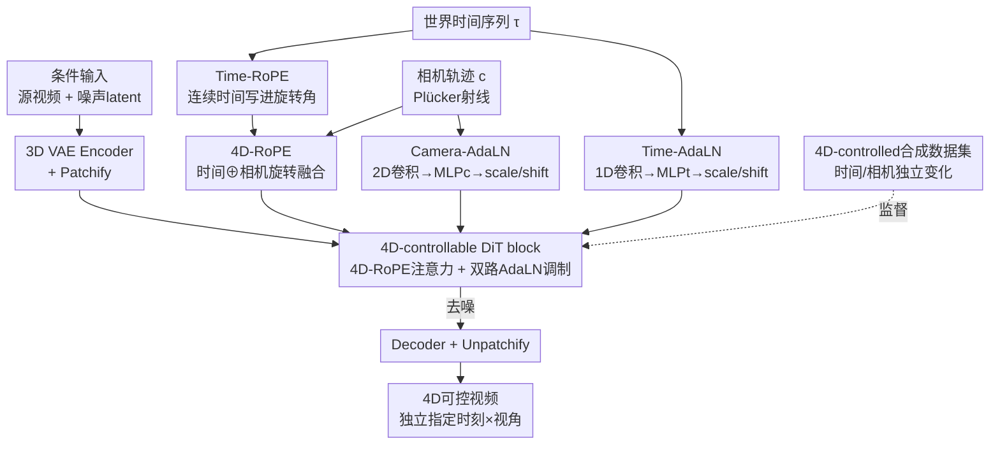

# BulletTime: Decoupled Control of Time and Camera Pose for Video Generation

**会议**: CVPR 2026  
**论文**: [CVF Open Access](https://openaccess.thecvf.com/content/CVPR2026/html/Wang_BulletTime_Decoupled_Control_of_Time_and_Camera_Pose_for_Video_CVPR_2026_paper.html)  
**代码**: https://19reborn.github.io/Bullet4D/ （项目页，代码/数据/模型作者承诺开源，暂未释出）  
**领域**: 视频生成 / 可控视频生成 / 扩散模型  
**关键词**: 4D 可控生成, 时间-相机解耦, Time-RoPE, AdaLN, 视频扩散  

## 一句话总结
针对视频扩散模型把"场景动态"和"相机运动"混在同一条 video-time 轴上、无法独立控制的问题，BulletTime 把它拆成正交的「世界时间 $\tau_{world}$」和「相机位姿 $c$」两路条件，用 Time-RoPE + AdaLN 注入连续时间、用 4D-RoPE + Camera-AdaLN 注入视角，并配一套时间/相机独立变化的合成数据集来监督解耦，从而支持子弹时间（相机动、时间冻）这类自由的 4D 控制，在合成与真实视频上控制精度全面超过把相机方法硬接时间重映射的两段式 baseline。

## 研究背景与动机

**领域现状**：当前视频扩散模型（CogVideoX、Wan、SVD 等）已经能生成逼真视频，时间维度通常用「video time」表示——即由帧序号和帧率隐式决定的离散时间轴。相机可控的工作（ReCamMaster、CameraCtrl 等）进一步通过 6-DoF 外参或 Plücker 射线把相机轨迹作为条件注入。

**现有痛点**：问题在于这些模型把两件本质不同的事强行绑在了 video time 上——**世界时间**（world time，决定场景里事件如何演化的绝对时间坐标）和**相机位姿**（决定从哪个视角观察）。一旦把帧序号当成场景的物理时间，世界时间就被钉死成"随帧均匀前进"，于是没法独立地放慢、暂停或倒放场景动态。想用文本 prompt 控时间太粗糙；想用"先做时间重映射、再做相机可控生成"的两段式管线，又会因为输入视频自己跟着时间设置变来变去，导致 4D 一致性很差（子弹时间时后半段视频甚至被暂停裁掉）。多视角视频扩散（如 Cat4D）则要额外跑一遍 4D 重建（4D Gaussian Splatting），需要海量采样，根本谈不上交互式 4D 世界建模。

**核心矛盾**：场景动态与相机运动在生成式视频里被耦合进同一条 video-time 轴，而真正可控的 4D 世界要求这两个维度是正交、可分别指定的连续信号。

**本文目标**：给视频扩散模型装上对「世界时间」和「相机位姿」的解耦控制能力，让用户能独立指定"在什么时刻、从什么视角"观察一个动态 4D 世界，且端到端一步生成、不依赖后处理重建。

**切入角度**：作者把"沿 video time 的视觉变化"显式分解为「连续世界时间 $\tau_{world}$」+「相机位姿 $c$」两个正交条件，并观察到：时间是一个影响整个场景、平滑的全局标量，适合用 AdaLN 这种全局调制；而把连续时间直接写进 RoPE 的旋转角里，可以不加任何可学习参数就让注意力感知到任意时间间隔。

**核心 idea**：用"连续时间 RoPE（Time-RoPE）+ 时间/相机 AdaLN + 统一 4D-RoPE"把时间和相机做成两路可独立指定的条件信号，再用一套时间/相机独立变化的合成数据集监督解耦学习。

## 方法详解

### 整体框架

BulletTime 建在预训练的 Diffusion Transformer（DiT，基座是 CogVideoX-5B）上，做 video-to-video 生成：把源视频和目标视频的 token 沿帧维拼接喂进去（沿用 ReCamMaster 的条件方式），让模型在给定**世界时间序列** $\{\tau_i\}_{i=0}^{F-1}$ 和**相机轨迹** $c$ 的条件下，重生成一段满足这两路控制的新视频。改变相邻时间间隔 $\tau_{i+1}-\tau_i$ 就能实现慢动作、加速、暂停乃至倒放。

整套框架围绕一个「4D-controllable DiT block」展开，时间和相机各走一条互补的调制通路，最后在注意力层汇合：

- **时间通路**：连续时间序列一边经 Time-RoPE 写进注意力的旋转角，一边经一个 1D 卷积编码后由 MLP$_t$ 预测仿射 scale/shift，通过 Time-AdaLN 在特征层做调制；
- **相机通路**：相机几何用 Plücker 射线编码、经 2D 卷积聚合，一边构造相机感知的旋转变换（与 Time-RoPE 融成统一 4D-RoPE），一边经 MLP$_c$ 做 Camera-AdaLN 调制；
- 两路 RoPE 的输出**融合成一个统一的 4D 位置编码**注入注意力，让连续时间差和视角相关的几何关系同时进入 attention logits。

模型在一套自建的、时间与相机各自独立变化的合成数据集上微调监督。

### 关键设计

**1. Time-RoPE：把连续世界时间直接写进注意力旋转角，零新增参数地解锁任意时间重参数化**

痛点是常规视频 DiT 的位置编码绑定离散帧序号，天然假设时间均匀、对细粒度时间控制毫无响应。作者把标准 RoPE 推广到直接吃连续时间：定义时间旋转算子为分块对角矩阵 $D_{\text{Time}}(\tau)=\mathrm{diag}\big(R(\tau\omega_1),R(\tau\omega_2),\dots,R(\tau\omega_{d'/2})\big)$，其中频率 $\omega_k=b^{-2(k-1)/(d'/2)}$，$R(\theta)$ 是标准 $2\times2$ 旋转矩阵。给时间戳为 $\tau_i,\tau_j$ 的 query/key 分别乘上该算子后，注意力 logit 自然化简为

$$Q_i^{\text{Time}}(K_j^{\text{Time}})^{\top}=Q_i^{\top}\,D_{\text{Time}}(\tau_i-\tau_j)\,K_j,$$

即注意力只依赖**连续时间差** $\tau_i-\tau_j$。这一步漂亮在于：它把"时间控制先验"直接灌进 attention logits，且不引入任何可学习参数；消融里单独的 Time-RoPE（PSNR 30.45）就已超过所有用标准 RoPE 的可学习条件方案（≤25.31），说明在注意力里编码连续时间偏移比在特征上加 token 更对路。

**2. Time-AdaLN：用平滑全局时间标量做特征级 AdaLN 调制，补回 patch 下采样丢掉的逐帧时序**

光有 Time-RoPE 还不够——DiT 在 patch 化后时间分辨率相对原帧序列被下采样，注意力层捕捉不到逐帧级的精细 timing。作者加一条可学习通路：用 1D 卷积 $f_{\text{time}}(\cdot)$ 把逐帧时间戳编码成 embedding，再经 AdaLN 以仿射方式注入特征：

$$\tilde z'_{i,n}=\mathrm{LN}(\tilde z_{i,n})\odot f_{\gamma}\big(f_{\text{time}}(\tau_i)\big)+f_{\beta}\big(f_{\text{time}}(\tau_i)\big),$$

其中 $f_\gamma,f_\beta$ 是预测 scale/shift 的轻量 MLP，$\odot$ 为逐元素相乘。选 AdaLN 而不是 cross-attention 或 channel addition 的理由很具体：世界时间是一个影响**整个场景**的平滑全局标量，用单一全局信号去调制整层激活，比往 token 级注入扰动（容易破坏空间对齐、产生不稳定时序响应）更稳。消融印证：同样配 Time-RoPE，加 AdaLN（PSNR 32.15）明显优于加 CrossAttention（30.51）或 ChannelAddition（30.40）。Time-RoPE 与 Time-AdaLN 一起构成时间骨干，分别在注意力级和特征级提供时间控制。

**3. 4D-RoPE + Camera-AdaLN：把相机视角并进同一套位置编码与调制，做到时间×相机的完全解耦**

要做完整 4D 控制，需要在时间之外再正交地加入相机视角。作者把 Time-RoPE 扩成 4D-RoPE：沿用相对相机射线/位姿关系构造一个相机感知的旋转变换，与时间旋转融成统一的 4D 算子，于是**连续时间差和视角相关的几何关系被同时注入注意力**，让时间演化和相机运动在生成时既解耦又协同一致。与之并行的是 Camera-AdaLN 分支——把逐像素相机几何用 Plücker 射线编码、经 2D 卷积聚合成 token 级特征，再由轻量 MLP$_c$ 预测仿射参数调制激活。这套"统一位置编码 + 双路 AdaLN"的对称设计，是相对两段式 baseline 的关键区别：所有相机/时间设置都条件在**同一个输入视频**上，监督稳定、内容一致；而两段式管线会让条件视频本身随时间设置变化，造成 4D 不一致甚至内容丢失。消融（表 5）显示 4D-RoPE 和 Camera/Time AdaLN 去掉任一都掉点，去掉 4D-RoPE 掉得更狠（PSNR 23.45→21.98）。

**4. 4D-controlled 合成数据集：让时间与相机在同一场景内独立变化，提供解耦监督**

解耦学习需要"沿时间和沿相机的变化彼此独立"的数据，但现有数据集做不到——单相机数据集每段只有一个固定/缓慢移动的视角，时空天然耦合；多相机数据集又多是同步、均匀时间采样，所有相机在同一时刻看同样的动态。作者在 Blender 里用 PointOdyssey 框架自建数据：对每个场景，先对运动物体施加时间重映射函数（慢动作、暂停、随机变速）生成多个时间变体，再把每个时间变体在不同相机轨迹下渲染，得到物理一致、相机/光照/角色运动可控的动态场景，并为所有视频标注相机参数与世界时间标签。这套数据正是模型能从纯合成、以人为主的训练集泛化到真实场景（动物、复杂物理动态）和未见时间/相机控制的根基。

### 损失函数 / 训练策略

标准扩散去噪损失，在 CogVideoX-5B-T2V 上微调。空间分辨率 $384\times640$、每段 81 帧；采用渐进式训练——先半分辨率训、再全分辨率微调；最终模型 batch size 64、共训 40K 迭代。video-to-video 时把源/目标 token 沿帧维拼接（同 ReCamMaster）。

## 实验关键数据

评测覆盖合成与真实两类视频。合成端用 PointOdyssey 生成 500 段（未见角色/场景），有 GT 可算 PSNR/SSIM/LPIPS；真实端取 ViPE 的 100 段，随机采未见相机轨迹与时间模式，用 VBench、FVD、KVD 评质量，并用 MegaSAM 从生成视频估相机位姿、对 GT 算旋转/平移误差。baseline 是把相机可控方法（ReCamMaster、TrajectoryCrafter）通过对输入做时间重映射硬扩成 4D 控制（标 *）。

### 主实验

合成数据集（联合相机+时间控制，像素级精度）：

| 方法 | PSNR↑ | SSIM↑ | LPIPS↓ |
|------|-------|-------|--------|
| TrajectoryCrafter* | 17.72 | 0.4917 | 0.3431 |
| ReCamMaster* | 21.86 | 0.5852 | 0.1846 |
| **Ours** | **24.57** | **0.6905** | **0.1265** |

真实视频（相机精度 + 视觉质量，节选关键列）：

| 方法 | RotErr↓ | TransErr↓ | 时序闪烁↑ | 运动平滑↑ | FVD↓ | KVD↓ |
|------|---------|-----------|-----------|-----------|------|------|
| TrajectoryCrafter* | 5.44 | 3.31 | 0.9659 | 0.9881 | 2399 | 150.2 |
| ReCamMaster* | 2.98 | 1.85 | 0.9755 | 0.9911 | 2325 | 146.1 |
| **Ours** | **1.47** | **1.32** | **0.9780** | **0.9923** | **2292** | **139.1** |

本文相机旋转/平移误差最低（1.47/1.32，约为 ReCamMaster* 的一半），时序稳定与主体-背景一致性更好，FVD/KVD 也最低。TrajectoryCrafter 的 VBench 图像质量略高，但相机控制明显更不可靠（作者强调质量分高不等于可控）。

### 消融实验

世界时间条件方式（固定相机、只控时间；表 4）：

| 配置 | PSNR↑ | SSIM↑ | LPIPS↓ | 说明 |
|------|-------|-------|--------|------|
| RoPE + CrossAttention | 23.86 | 0.8274 | 0.1753 | 标准 RoPE + 交叉注意力注入时间 |
| RoPE + ChannelAddition | 25.31 | 0.8438 | 0.1456 | 时间 embedding 直接加到通道 |
| RoPE + AdaLN | 29.83 | 0.8821 | 0.0742 | 仅换成 AdaLN 调制 |
| Time-RoPE | 30.45 | 0.8807 | 0.0753 | 仅连续时间 RoPE |
| Time-RoPE + CrossAttention | 30.51 | 0.8816 | 0.0753 | — |
| Time-RoPE + ChannelAddition | 30.40 | 0.8813 | 0.0730 | — |
| **Time-RoPE + AdaLN** | **32.15** | **0.8962** | **0.0631** | 本文时间骨干 |

4D 条件消融（batch 4、训 20k 迭代；表 5）：

| 配置 | PSNR↑ | SSIM↑ | LPIPS↓ | 说明 |
|------|-------|-------|--------|------|
| Full Model | 23.45 | 0.6283 | 0.1309 | 完整模型 |
| w/o 4D-RoPE | 21.98 | 0.6099 | 0.1785 | 去掉 4D 位置编码，掉最多 |
| w/o Camera/Time AdaLN | 22.74 | 0.6197 | 0.1493 | 去掉双路 AdaLN |

解耦专项（同相机轨迹、变时间下的背景一致性，masked 指标；表 3）：本文 mPSNR 28.29 / mSSIM 0.9096 / mLPIPS 0.1119，全面优于 ReCamMaster* 的 25.80 / 0.8789 / 0.1527，量化了更强的相机-时间解耦。

### 关键发现
- **贡献最大的是 Time-RoPE / 4D-RoPE 这条"把控制写进注意力旋转角"的路线**：仅 Time-RoPE（30.45）就超过所有标准-RoPE 的可学习条件方案；4D 消融里去掉 4D-RoPE 掉点最狠。说明在 attention logits 里编码连续时间/视角偏移，比在特征上 token 级注入更本质。
- **AdaLN 之所以适合时间**，是因为世界时间是平滑全局标量、影响整个场景，用单一信号调制整层比 cross-attention/channel-add 的局部扰动更稳——这也解释了为何 Time-RoPE+AdaLN 是最优组合。
- **解耦的最大收益来自"端到端条件在同一输入视频上"**：两段式 baseline 在子弹时间（相机动、时间冻）这类极端设置下会因输入被时间重映射而裁掉内容、产生几何畸变；本文在 Fig.7 的"固定相机变时间"测试里能保持相机一致，baseline 则相机漂移。
- **泛化**：仅在以人为主的合成集上微调，却能迁移到动物、复杂物理动态的真实场景，并处理大量未见时间重映射模式（Fig.6）。

## 亮点与洞察
- **把"连续物理时间"塞进 RoPE 旋转角是点睛之笔**：化简后注意力只看时间差 $\tau_i-\tau_j$，零新增参数就让模型对任意慢动作/暂停/倒放有反应——这个"时间差即旋转角"的思路可迁移到任何需要连续标量条件的 DiT。
- **时间用 AdaLN、相机也用 AdaLN，但视角额外走 4D-RoPE**——作者按"信号是全局平滑还是带几何结构"来选注入方式，而不是一刀切，这种"条件物理性质决定注入机制"的判断值得借鉴。
- **数据集即解耦的钥匙**：用渲染引擎人工制造"同场景内时间和相机各自独立变化"的监督信号，绕开了真实数据里二者天然耦合的死结；想做任何解耦任务时，"能不能合成出正交变化的监督"往往是成败关键。

## 局限性 / 可改进方向
- 解耦监督依赖合成数据集，可能覆盖不了真实世界的复杂物理、光照与大基线、长时程场景动态（作者承认）。
- 推理仍是并行（非自回归）扩散，难以建模超长视频或持久世界；作者建议探索自回归/循环式 4D 扩散做无界生成与在线轨迹控制。
- 仅在以人为主的合成集微调，虽展示了向动物/复杂场景的泛化，但缺乏对极端视角变化下几何稳定性的系统量化；⚠️ 真实端的相机误差由 MegaSAM 估计，存在估计器本身误差，绝对值需谨慎解读。
- 可进一步把解耦学习与真实视频语料联合训练，或引入物理感知的时间推理来扩宽适用面。

## 相关工作与启发
- **vs 相机可控视频扩散（ReCamMaster / TrajectoryCrafter / CameraCtrl）**：它们只控视角、把帧序号当物理时间，时间仍被钉死成均匀前进；本文把世界时间显式拆出来连续控制，相机精度（RotErr 1.47 vs 2.98）与解耦一致性都更优。
- **vs 两段式（时间重映射 + 相机可控生成）**：两段式让条件视频随时间设置变化，导致 4D 不一致、内容丢失；本文端到端条件在同一输入视频上，监督稳定、子弹时间也不裁内容。
- **vs Cat4D / 4DiM**：Cat4D 要额外 4D 重建（海量多视采样）才能拿到完整相机+时间控制，难做交互式 4D 建模；4DiM 是图像级、出不了高质 4D 视频。本文在单一视频扩散框架里一步出 4D 可控视频，且兼容现有架构。

## 评分
- 新颖性: ⭐⭐⭐⭐⭐ 把 video time 显式分解为世界时间+相机位姿，用"时间差写进 RoPE 旋转角"+双路 AdaLN 实现端到端 4D 解耦控制，视角清晰且机制干净。
- 实验充分度: ⭐⭐⭐⭐ 合成/真实双评测 + 三组消融 + 解耦专项指标，证据链完整；但定量对比的 4D baseline 都是"硬扩"而来，缺少同类原生 4D 方法的直接横评。
- 写作质量: ⭐⭐⭐⭐⭐ 公式与图示清楚，把"为什么选 RoPE/AdaLN、为什么两段式不行"讲得很到位。
- 价值: ⭐⭐⭐⭐⭐ 子弹时间/自由视点/XR/世界模型等场景刚需，且方案兼容现有视频 DiT，落地潜力大。

<!-- RELATED:START -->

## 相关论文

- [\[CVPR 2026\] SymphoMotion: Joint Control of Camera Motion and Object Dynamics for Coherent Video Generation](symphomotion_joint_control_of_camera_motion_and_object_dynamics_for_coherent_vid.md)
- [\[CVPR 2026\] FaceCam: Portrait Video Camera Control via Scale-Aware Conditioning](facecam_portrait_video_camera_control_via_scale-aware_conditioning.md)
- [\[CVPR 2026\] 3D-Aware Implicit Motion Control for View-Adaptive Human Video Generation](3d-aware_implicit_motion_control_for_view-adaptive_human_video_generation.md)
- [\[CVPR 2026\] ExPose: Reinforcing Video Generation Models for Extreme Pose Estimation](expose_reinforcing_video_generation_models_for_extreme_pose_estimation.md)
- [\[CVPR 2026\] Unified Camera Positional Encoding for Controlled Video Generation](unified_camera_positional_encoding_for_controlled_video_generation.md)

<!-- RELATED:END -->
