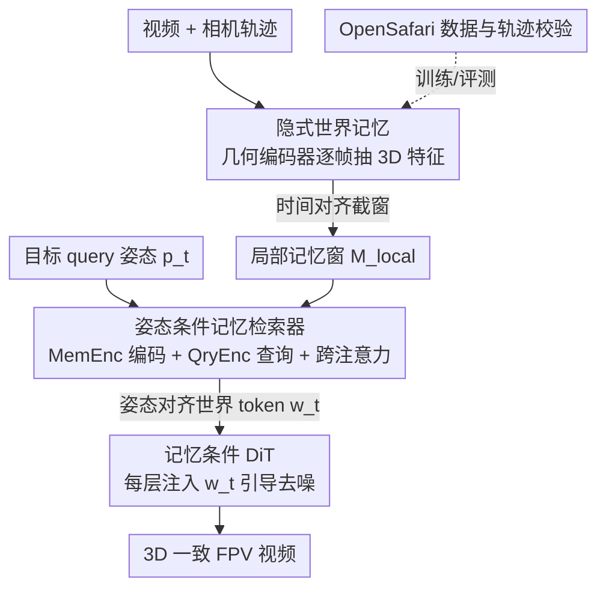

# Captain Safari: A World Engine with Pose-Aligned 3D Memory

**会议**: CVPR 2026  
**论文**: [CVF Open Access](https://openaccess.thecvf.com/content/CVPR2026/html/Chou_Captain_Safari_A_World_Engine_with_Pose-Aligned_3D_Memory_CVPR_2026_paper.html)  
**代码**: https://johnson111788.github.io/open-safari/ （项目页）  
**领域**: 视频生成 / 世界模型  
**关键词**: 世界引擎, 相机控制视频生成, 姿态对齐记忆, 长时程3D一致性, FPV无人机数据集

## 一句话总结
Captain Safari 是一个"世界引擎"：维护一份隐式的世界几何记忆，给定任意相机轨迹时按姿态检索出与目标视角对齐的世界 token，再用它去 condition DiT 视频生成，从而在剧烈 6-DoF 运动下既精确跟随轨迹又保持长时程 3D 一致性，并配套发布了野外 FPV 无人机数据集 OpenSafari。

## 研究背景与动机
**领域现状**：用可控视频生成去"模拟一个连贯的 3D 世界"（world engine）是 AR、具身智能、虚拟 agent 的基础能力。传统游戏引擎/物理仿真有显式几何和精确控制，但需要大量人工建模、算力昂贵，且很难覆盖真实自然场景的丰富性；现代视频扩散模型能从文本/图像生成高保真多样视频，但本质是前馈式 clip 生成器，**没有持久的世界状态**。

**现有痛点**：当代视频世界模型同时被三个问题缠住。其一，长时程一致性受限于 context 帧的时间窗口，模型会"忘掉"远处景物、违反空间连贯性，导致画面突变。其二，在严格 3D 一致性约束下完成复杂相机机动很难——现有 pose/轨迹条件方法通常只在缓慢、近似前向的运动下работает，一旦遇到快速 6-DoF 运动、强视差或急转弯，就陷入一个 trade-off：要么压制运动、限制视角变化来保几何，要么硬跟轨迹但代价是扭曲、闪烁、结构漂移。其三，现有方法多在结构化受限场景（室内漫游、驾驶、房产视频）上训练评测，很少在相机绕着建筑、植被、地形穿梭、视差巨大的野外 FPV 场景下做压力测试。

**核心矛盾**：本质是"严格 3D 一致性"与"精确跟随激进轨迹"之间的冲突——存全量长时世界状态算力上不可行，但只给短时上下文又记不住远处几何。

**本文目标**：让模型显式持有一份持久的世界状态，在强视差下维持长时程 3D 一致性，同时精确执行激进相机机动；并补上"复杂户外布局 + 激进相机运动"这块缺失的数据。

**切入角度**：作者观察到——并不需要把整段长时世界状态都搬进生成器，只要在**当前目标姿态**下，挑出并聚合最相关的那一小撮场景线索，就能给出足够强的几何引导。关键是这个检索必须是**姿态感知**的：给定目标相机姿态，组装出一份与该视角对齐的世界先验去 steer 生成。

**核心 idea**：用"姿态条件的世界记忆检索"代替"塞更长的上下文帧"——维护隐式世界记忆，按 query 姿态检索出固定大小、视角对齐的世界 token 去 condition 视频扩散，从而以恒定开销同时拿到一致性和可控性。

## 方法详解

### 整体框架
Captain Safari 把"沿轨迹生成视频"拆成三件事：先用预训练几何编码器把整段视频压成一份逐帧的 3D-aware **世界记忆库** $M=\{m_t\}$；对每个待生成的 5 秒 clip，从记忆库里截一个与之时间对齐的**局部记忆窗** $\mathcal{M}_{local}$；再用一个**姿态条件检索器**，针对目标 query 姿态从局部窗里"读"出一组姿态对齐的世界 token $w_t$；最后把 $w_t$ 注入一个 **DiT 生成器**的每一层 cross-attention，去引导去噪。这样所有帧不再通过原始时间索引、而是通过"姿态查询"去访问记忆，把多视角观测绑定到同一个静态 3D 世界上。

输入是文本 prompt、首帧、整条相机轨迹（外参 $(R_t,T_t)$）；输出是沿该轨迹的 3D 一致视频段 $\hat V_{\mathcal{T}}$。

### 关键设计

**1. 隐式世界记忆 + 动态 clip 对齐局部窗：用固定大小的局部窗驯服"全量长时状态算力爆炸"**

直接对整段记忆库 $M$ 做条件既贵又会被时间上很远的观测主导。作者用预训练几何编码器（StreamVGGT）把每帧抽成 3D-aware 记忆特征 $m_t$，组成全局记忆库；但对每个目标 clip 时间段 $\mathcal{T}=[t_0,t_1]$，只取一个**局部窗** $\mathcal{M}_{local}=\{m_\omega\mid \omega\in[k_s,k_e]\}$，端点受约束 $t_0-L\le k_s\le t_0,\ \max(k_s,t_0)+1\le k_e\le \min(k_s+L,t_1)$。这三条约束保证：窗口起点最多比 clip 入口 $t_0$ 早 $L$ 秒（绑定到邻近观测）、窗长不超过 $L$（保持条件集紧凑）、终点 $k_e$ 始终触及或盖过 $t_0$（每个 clip 都有时间上兼容的世界先验）。因为所有局部窗都从同一份共享记忆库里切，相邻 clip 自然共享重叠记忆条目，从而既限制了计算量，又让相邻 clip 的生成耦合到同一个 3D 一致的底层世界。实现里 $L=5$ 秒，记忆特征按 4 fps 采样。

**2. 姿态条件记忆检索器：把"按时间取上下文"换成"按视角软路由检索"**

这是全文核心。把局部记忆看成一张**隐式世界表**：每个时间步 $\omega$ 提供姿态 token $p_\omega$（由 $(R_\omega,T_\omega)$ 导出，"相机在哪观测过场景"）和一组 3D-aware 记忆 token $m_{\omega,1:M}$（"从那些配置看世界长什么样"）。检索器要做两件事：把 pose–memory 对联合编码成连贯的世界表示，并对任意 query 姿态抽出一小撮对齐 token。具体先把姿态与记忆嵌入同一空间拼成序列 $\hat X_\omega=[\varepsilon_p(p_\omega),\varepsilon_m(m_{\omega,1}),\dots,\varepsilon_m(m_{\omega,M})]$，过一堆带 3D RoPE 的 transformer 块（MemEnc）得到 $\tilde X_\omega$，再拼成 encoded memory $\tilde X_{mem}=[\tilde X_{k_s},\dots,\tilde X_{k_e}]$。

对目标时间步 $t$，取其 query 姿态 token $q_t=\varepsilon_p(p_t)$，与 $M$ 个可学习 query token 拼成 $\hat Q_t=[q_t,r_1,\dots,r_M]$，过与 MemEnc 同构的 QryEnc 得到姿态感知查询 $Q_t$，再对 encoded memory 做 cross-attention：

$$Y_t = Q_t + \mathrm{CrossAttn}(Q_t,\tilde X_{mem})$$

取 $Y_t$ 中对应可学习 query 的子集作为检索出的世界 token $w_t=[w_{t,1},\dots,w_{t,M}]$（即式 $w_t=\mathrm{Agg}(\mathrm{CrossAttn}(Q_t,\tilde X_{mem}))$）。训练时一个线性头把 $w_t$ 映回原记忆空间、重建 query 姿态处的目标记忆 token 作为监督。堆叠多个检索块迭代精化 query 与检索 token，使模型能把每个 query 姿态**软路由**到最相关的历史观测子集，而不是靠刚性的时间邻域或单个最近帧。一个工程取舍：作者用轨迹终点姿态 $p_{t_1}$ 作 query，因为最远视角处漂移累积最严重，拿它当约束能加强整条轨迹的几何约束。

**3. 记忆条件 DiT：把姿态对齐世界 token 当成贯穿所有层的稳定几何先验**

检索器对每个 clip 输出固定大小的 $w_t\in\mathbb{R}^{M\times d_m}$，先用记忆嵌入 MLP 映进 DiT 隐空间 $W_{\mathcal{T}}=\varepsilon_w(w_t)\in\mathbb{R}^{M\times D}$。clip 的 latent 被 patchify 成时空 token 序列 $Z$，在每个 DiT 层 $l$ 先对全序列做 self-attention，再通过一个**专用的记忆 cross-attention** 注入世界 token：

$$Z^{(l+1)} = Z^l + \mathrm{CrossAttn}(Z^l, W_{\mathcal{T}}, W_{\mathcal{T}})$$

同一份 clip 级世界 token $W_{\mathcal{T}}$ 在所有层里复用作 key/value，给每个时空 token 的去噪提供一个稳定、3D 一致的先验。因为检索与去噪解耦、输出固定大小 $w_t$，记忆开销随时间**恒定**（不随轨迹变长而膨胀），这正是它能"长时程"的工程根基。base DiT 用 Wan2.2-Fun-5B-Control-Camera（$D=3072$），记忆 cross-attention 由对应的 context cross-attention 权重初始化。

**4. OpenSafari 数据集 + 多级轨迹校验：补上"野外激进 6-DoF"这块缺失的训练/评测地基**

现有相机条件数据集（RealEstate10K 偏慢速室内、Minecraft 是合成体素世界）都不匹配本文的强视差激进飞行场景。作者从 AirVuz/YouTube 收集 FPV 无人机视频，先做视频清洗管线：按分辨率过滤、归一化到 720p/24fps/16:9 中心裁剪、场景检测切单镜头、均匀切成定长 $T$ 段，再用 RAFT 光流幅度过滤掉运动太少的片段，保留视差丰富的轨迹。然后用 hloc + COLMAP 增量 SfM（Simple Radial 相机模型）按 4 fps 估出初始轨迹，并施加**三级校验-修复**：数据库检查（用 SfM 内点数/比例标记可疑过渡）→ 几何检查（对可疑 pair 重算本质矩阵、阈值化对称对极误差）→ 运动学检查（用基于 MAD 的鲁棒分数检测平移突跳、旋转跳变、前向翻转、高阶平滑性违例）。三者融成一个二值 bad-index 驱动严格策略：若坏过渡稀疏局部，就做定向修复——线性插值相机中心、对旋转做带角度上限的 SLERP，并在边界处可选外推，修完再用同样标准复验；若 bad-index 太密或违例太重、修完仍不过，则整段视频丢弃。最终得到 51,997 个候选 clip，经多样性轨迹过滤剩 11,481 个训练 clip 与 787 个非重叠测试 clip，每个 clip 用 Qwen2.5-VL-7B 生成描述作文本条件。

### 训练策略
两阶段：先用姿态对齐记忆 token $m_t$ **预热**姿态条件检索器（1 epoch）；再把检索器与 DiT 端到端联合训练（5 epoch），DiT 用 LoRA 更新，记忆 cross-attention 从对应 context cross-attention 权重初始化、其余新层标准初始化。clip 时长 $T=5$s（从 15s 视频中取），姿态与记忆特征按 4fps 采样。记忆特征取 StreamVGGT 的第 {4,11,17,23} 层、每层 782 token，跨四层拼成 $M=4\times782$、$d_m=1024$。⚠️ 推理时检索器仍参与，且为简化复现，记忆库 $M$ 由 GT 视频构建（以原文为准）。

## 实验关键数据

### 主实验
在 OpenSafari 的 787 clip 测试集上，沿视频质量、3D 一致性、轨迹跟随三轴评测，对比代表性相机可控生成模型：

| 模型 | FVD ↓ | LPIPS ↓ | MEt3R ↓ | Recon.率 ↑ | AUC@30 ↑ | AUC@15 ↑ | CosSim ↑ |
|------|-------|---------|---------|-----------|----------|----------|----------|
| Geometry Forcing | 2662.75 | 0.667 | 0.4834 | 0.877 | 0.168 | 0.056 | 0.429 |
| Real-CamI2V | 1585.61 | 0.513 | 0.3703 | 0.923 | 0.174 | 0.051 | 0.296 |
| Wan2.2-5B-Control-Camera | 1387.75 | 0.545 | 0.3932 | 0.767 | 0.181 | 0.054 | 0.420 |
| Captain Safari **w/o Mem.** | 998.47 | 0.504 | 0.3720 | 0.912 | 0.193 | 0.068 | 0.508 |
| **Captain Safari** | 1023.46 | 0.512 | **0.3690** | **0.968** | **0.200** | **0.068** | **0.563** |

Captain Safari 在 3D 一致性（MEt3R 0.3690、重建率 0.968）与轨迹跟随（AUC@30 0.200、CosSim 0.563）上全面第一，FVD 也比 SOTA baseline（1387.75）大幅更低。MEt3R 相对最强 baseline 仅降 0.0013，但作者报告其方差相对降低 10%（Levene $p=0.0439$），即更稳定。

人类偏好研究（50 人 × 10 case × 3 准则 = 1500 票，五路匿名对比）：

| 模型 | 视频质量 | 3D一致性 | 轨迹跟随 | 平均 |
|------|---------|---------|---------|------|
| Geometry Forcing | 0.20% | 0.00% | 0.20% | 0.13% |
| Real-CamI2V | 4.20% | 6.40% | 4.40% | 5.00% |
| Wan2.2-5B-Control-Camera | 3.20% | 3.80% | 6.40% | 4.47% |
| Captain Safari w/o Mem. | 25.00% | 24.20% | 20.00% | 23.07% |
| **Captain Safari** | **67.40%** | **65.60%** | **69.00%** | **67.33%** |

三准则下都有约 67% 的票投给完整模型，说明提升在感知上很显著，且记忆移除版稳居第二、三个 baseline 都只有个位数偏好。

### 消融实验
| 配置 | MEt3R ↓ | Recon.率 ↑ | AUC@30 ↑ | CosSim ↑ | FVD ↓ | 说明 |
|------|---------|-----------|----------|----------|-------|------|
| Captain Safari（Full） | 0.3690 | 0.968 | 0.200 | 0.563 | 1023.46 | 完整模型 |
| w/o Mem.（去姿态记忆） | 0.3720 | 0.912 | 0.193 | 0.508 | 998.47 | 一致性/轨迹明显掉、FVD 略好 |

### 关键发现
- **姿态条件记忆是关键贡献**：加上记忆后，3D 一致性（重建率 0.912→0.968）与轨迹跟随（CosSim 0.508→0.563）都明显提升，说明在目标帧检索姿态对齐世界 token 给了模型"场景应该长什么样"的显式理解。
- **存在质量-一致性 trade-off**：去掉记忆反而让 FVD/LPIPS 略好，但严重损害 3D 一致性与轨迹跟随——记忆充当了强几何先验，以略微牺牲外观自由度为代价换取 3D 稳定性。这与定性图一致：有记忆时全局结构、跨视角几何保持稳定，去掉后常漂移、出现几何不一致。
- **开销恒定**：因检索与 DiT 去噪循环解耦、输出固定大小 $w_t$，计算开销随轨迹增长基本恒定（见原文补充 Table 4），这是它能做"长时程"的工程前提。

## 亮点与洞察
- **把"长时记忆"重构成"按姿态检索固定大小 token"**：既绕开了存全量长时状态的算力爆炸，又比堆显式点云/clip-bound 隐式记忆更紧凑——检索器与去噪解耦，开销恒定。这套"姿态作 key、世界外观作 value、可学习 query 软路由"的检索范式，是很可迁移的设计。
- **用轨迹终点姿态当 query 很巧**：最远视角处漂移最大，拿它做 query 等于在最难的地方上约束，反过来收紧整条轨迹的几何，是个低成本但有效的取舍。
- **数据侧的几何+运动学双重校验**：把 SfM 统计、对极几何、基于 MAD 的运动学异常检测融成 bad-index，并用 SLERP 定向修复而非一刀切丢弃，是构建可靠 FPV 轨迹数据集的可复用工程。

## 局限与展望
- **记忆库依赖 GT 视频构建**：作者明言推理时为简化复现，记忆库 $M$ 由 GT 视频构建——这意味着真正"从零探索一个未见世界"的纯生成式 rollout 能力还没在主实验里验证，实用部署需要一个不依赖 GT 的记忆来源。⚠️ 以原文为准。
- **MEt3R 绝对提升很小**：0.3703→0.3690 的绝对差极小，主要靠方差降低和人类偏好佐证；这类指标的区分度本身有限，结论更多依赖感知评测。
- **基座与规模受限**：基于 Wan2.2-Fun-5B + LoRA，clip 仅 5s、记忆窗 $L=5$s，更长时程（分钟级）的累积一致性仍待验证。
- **改进思路**：把记忆库改为生成式在线累积（边生成边写记忆）、引入显式不确定性以决定何时信任检索、把姿态检索扩展到动态物体（当前世界假设偏静态）。

## 相关工作与启发
- **vs Real-CamI2V / Wan2.2-Control-Camera（相机参数条件）**：它们把相机外参/轨迹当显式条件直接喂生成器，缺乏持久世界状态，快速运动下要么短跟（Real-CamI2V 只走一小段）要么大运动下崩塌（Wan2.2）。本文多了一份姿态索引的持久记忆，跨轨迹共享，轨迹跟随与一致性都更强。
- **vs Geometry Forcing / Memory Forcing（几何/记忆监督）**：它们把几何监督或时空记忆耦合进训练，但记忆仍是隐式 clip-bound 或显式重点云。本文用解耦检索器保持条件紧凑、开销恒定。
- **vs 显式 3D（3D Gaussian / 重建驱动）锚定几何的方法**：这类方法通常构建一次性 3D 场景；本文则用持久、姿态索引、跨轨迹共享的世界记忆，把长时程相机控制统一起来。

## 评分
- 新颖性: ⭐⭐⭐⭐⭐ 把长时世界记忆重构成"姿态条件、固定大小、可软路由检索"的世界 token，是相机控制视频生成里很新的机制。
- 实验充分度: ⭐⭐⭐⭐ 三轴指标 + 1500 票人类研究 + 关键消融都到位，但 MEt3R 绝对提升小、且记忆库依赖 GT 构建削弱了"纯探索"说服力。
- 写作质量: ⭐⭐⭐⭐ 动机—方法—数据三段清晰，公式完整；个别符号密集处需对照图才好理解。
- 价值: ⭐⭐⭐⭐⭐ 同时给出新机制和高质量野外 FPV 基准 OpenSafari，对 world engine 方向有持续价值。

<!-- RELATED:START -->

## 相关论文

- [\[CVPR 2026\] PAM: A Pose-Appearance-Motion Engine for Sim-to-Real HOI Video Generation](pam_a_pose-appearance-motion_engine_for_sim-to-real_hoi_video_generation.md)
- [\[CVPR 2026\] Spatia: Video Generation with Updatable Spatial Memory](spatia_video_generation_with_updatable_spatial_memory.md)
- [\[CVPR 2026\] Dual-Granularity Memory for Efficient Video Generation](dual-granularity_memory_for_efficient_video_generation.md)
- [\[CVPR 2026\] Endless World: Real-Time 3D-Aware Long Video Generation](endless_world_real-time_3d-aware_long_video_generation.md)
- [\[CVPR 2026\] OneStory: Coherent Multi-Shot Video Generation with Adaptive Memory](onestory_coherent_multi-shot_video_generation_with_adaptive_memory.md)

<!-- RELATED:END -->
