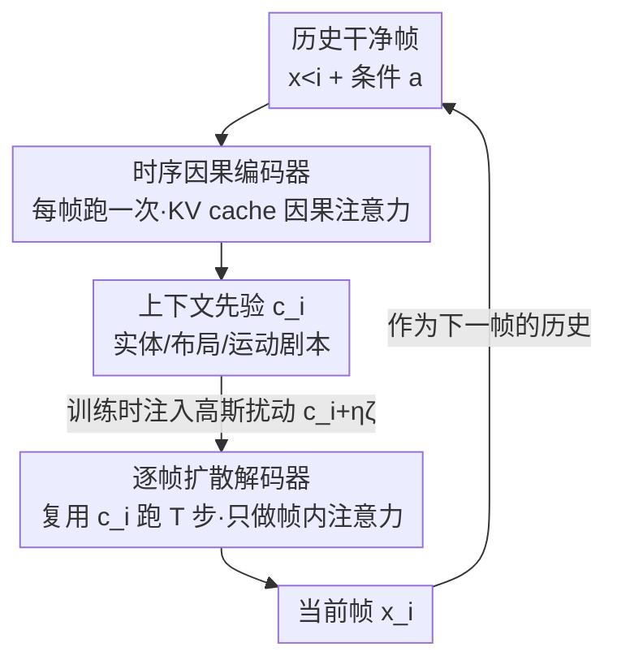

# Causality in Video Diffusers is Separable from Denoising

**会议**: CVPR 2026  
**论文**: [CVF Open Access](https://openaccess.thecvf.com/content/CVPR2026/html/Bai_Causality_in_Video_Diffusers_is_Separable_from_Denoising_CVPR_2026_paper.html)  
**代码**: 无  
**领域**: 视频生成 / 扩散模型  
**关键词**: 自回归视频扩散, 因果注意力, 时序推理解耦, 编码器-解码器, 推理加速

## 一句话总结
作者通过探针实验发现自回归视频扩散模型里的"时序因果推理"和"逐步去噪"其实是可分离的——浅层在去噪步间高度冗余、深层几乎只做帧内渲染，据此提出 SCD 架构：用一个每帧只跑一次的因果 Transformer 编码器做时序推理、用一个轻量逐帧扩散解码器做多步渲染，在保持生成质量的同时把每帧延迟降低 2–4×。

## 研究背景与动机

**领域现状**：要让视频扩散模型支持自回归（AR）生成、实现长视频实时流式输出，主流做法是把去噪器里的双向全注意力换成"因果注意力"——帧内双向、跨帧只看过去（借鉴 LLM）。这样每帧只依赖历史帧，还能用 KV cache 加速。

**现有痛点**：但这种做法是把 LLM 的因果注意力"原样移植"过来，忽略了扩散模型和 LLM 的一个关键区别——**扩散模型对每一帧要做多步迭代精修，而不是一次生成**。结果是因果注意力被施加在**所有去噪步 × 所有层 × 整个上下文**上：每个 token 在每一步、每一层都要重复算一遍帧内和跨帧注意力。

**核心矛盾**：时序推理（这帧该出现什么实体、布局、运动）本质上是一个"想清楚就行"的事，但它被死死绑在了"反复擦噪点"的多步迭代里。一个自然的问题浮出水面：**多步精修真的需要重复做时序推理吗？** 如果时序推理在一步里就基本定型，那后面几十步反复算跨帧注意力就是纯浪费。

**本文目标**：(1) 用探针实验定位"因果推理到底发生在网络的哪里"；(2) 若推理确实和去噪可分离，就设计一个把两者拆开的高效架构。

**切入角度**：作者直接对一个能跑的 AR 视频扩散器（WAN-2.1 T2V-1.3B 转成逐帧 AR）做逐层、逐步的激活与注意力可视化，去看冗余和稀疏到底存不存在。

**核心 idea**：把"每帧只算一次的时序因果推理"从"每帧多步的逐帧渲染"里解耦出来——前者交给因果编码器产出一个上下文先验 $c_i$，后者交给轻量扩散解码器复用这个先验做多步去噪。

## 方法详解

本文方法分两部分：先是**两个探针发现**（§4，构成动机的实证基础），再是据此设计的 **SCD 架构**（§5）。两个发现直接对应 SCD 的两个组件，所以这里先把发现讲透，再讲架构如何把发现"翻译"成结构。

### 整体框架

标准因果扩散把联合分布按时间因式分解 $p_\theta(x_{1:N}\mid a_{1:N})=\prod_{i=1}^{N}p_\theta\!\big(x_i\mid C_i=(x_{<i},a_{\le i})\big)$，每个条件概率由一个"在整条去噪轨迹上都要查上下文 $C_i$"的扩散渲染器实现。损失对去噪时间 $t\in[0,1]$ 积分 $L(\theta)=\mathbb{E}_{x,i,t,\epsilon}\big[w(t)\,\|u(x_i^t,t\mid x_i)-v_\theta(x_i^t,t,C_i)\|^2\big]$，因此因果推理被摊到了整条反向轨迹的每一步每一层上——这就是冗余的来源。

SCD 把这套流程拆成一条清晰的两段式管线：**历史帧 → 因果编码器（每帧跑一次）→ 上下文先验 $c_i$ → 逐帧扩散解码器（每帧跑 T 步去噪，复用同一个 $c_i$）→ 当前帧**。直觉上 $c_i$ 编码了"下一帧预期出现的实体、布局、运动线索"，相当于一份"剧本"；解码器拿着这份固定剧本把当前帧从高斯噪声渲染清楚，全程不再做任何跨帧计算。整套设计对应 LLM 的 next-token prediction，只不过这里是 next-frame prediction 后接连续渲染。

### 关键设计

**1. 探针发现：浅层去噪步间高度冗余、深层跨帧注意力稀疏**

这是整篇文章的实证地基，没有它后面的架构就是拍脑袋。作者在固定 prompt/seed 下抓 WAN-2.1 的逐层逐步激活，发现两条规律。其一，**去噪步间冗余**：同一帧在 50 个去噪步里，中间层（第 15 层 / 共 30 层）特征的余弦相似度持续高于 0.95，考虑到特征是 1536 维，这意味着不同去噪步的特征几乎完全一样；PCA 可视化进一步显示第 1 步的主成分就已经抓住了物体的全局形状、姿态甚至细节（如最后一帧勾状的尾巴），说明内容和运动在**单步内就基本确立**，后续几十步只是在精修低级像素。其二，**深层跨帧稀疏**：对每层统计 query token 分配给历史帧 key 的注意力质量，发现越深的层分给过去帧的质量越少，深层基本只做帧内精修——尽管训练用的是允许稠密跨帧的标准因果 mask，长程稀疏仍作为学到模型的内在性质自发涌现。

作者还用两个"减法手术"验证这两条规律不是观测假象：(a) 让去噪器除前几步外跳过第 8–22 层（15 个中间层、用残差直连），短暂微调后视频质量、身份、布局、运动全部保住，说明跳层没有跑到新的生成流形上；(b) 把最后 5 层从 frame-causal mask 换成 frame-diagonal mask（彻底切断对上下文 KV 的访问），仅 5K 步微调就恢复了基线质量。两个发现分别直接催生了下面编码器和解码器的设计。

**2. 时序因果编码器：把"每帧只需一次"的推理从去噪循环里拎出来**

针对发现一（浅层步间冗余），既然时序推理在单步内就定型，就没必要在每个去噪步重算。编码器 $E_\phi$ 是一个**在扩散过程之外、每生成一帧只跑一次**的因果 Transformer，对历史（存为 KV cache）做因果注意力，产出紧凑上下文 $c_i=\mathrm{Encoder}(x_{<i},a_{\le i})$。$c_i$ 是一串和帧 token 同空间尺寸（$H/p\times W/p$ 个 patch）的 latent token，由编码器最后一层产出，承载"下一帧预期的实体、布局、运动"。注意编码器内部对帧内空间 token 用双向注意力、跨帧才用因果注意力。这个 $c_i$ 算一次后，会被解码器在该帧的**所有去噪步里反复复用**——这正是把发现一里"重复计算"那部分省下来的地方。

**3. 逐帧扩散解码器：把跨帧依赖砍掉，只留帧内多步渲染**

针对发现二（深层跨帧稀疏），解码器 $D_\theta$ 是个轻量模块，只对当前帧的噪声 token 在固定 $c_i$ 条件下做去噪，预测速度场 $\hat{v}^t_i=\mathrm{Decoder}(x_i^t,t,c_i)$，迭代地把高斯噪声还原成干净 latent $x_i$。关键在于 **$c_i$ 和噪声帧 $x_i^t$ 沿序列维做逐帧 token 拼接（frame-wise concatenation）**，解码器对这个拼接序列只做**帧内双向自注意力、不跨帧传播任何信息**——所有历史信息都已被编码器压进 $c_i$ 了。由此摊到每帧的复杂度是 $\underbrace{\mathcal{O}(E_\phi)}_{\text{每帧一次}}+\underbrace{T\cdot\mathcal{O}(D_\theta)}_{\text{每去噪步}}$，且 $\mathcal{O}(E_\phi)\gg\mathcal{O}(D_\theta)$（编码器做带 KV cache 的跨帧因果注意力，解码器对每帧独立操作）。额外好处：这种 next-frame 范式天然不需要像旧 AR 模型那样在生成完一帧后再多跑一遍网络去缓存内容。

**4. 上下文扰动：在解耦出来的"接口"上注入噪声做鲁棒化**

Teacher Forcing 训练用干净历史、推理却要看自己生成的不完美历史，存在 train–test mismatch（误差累积）；Diffusion Forcing 给上下文加噪缓解，但又引入另一种 mismatch。SCD 的巧处在于：既然时序推理和逐帧去噪已经被拆开，它们的**接口就是 $c_i$**，于是直接在这个接口上做高斯扰动 $\tilde{c}_i=c_i+\eta\,\zeta,\ \zeta\sim\mathcal{N}(0,I)$。训练时它是减小 exposure bias 的数据增强，推理时还能当 negative guidance 信号。相比给帧 token 加噪，扰动 $c_i$ **不需要额外跑一遍网络**，因而非常高效，实测适度噪声能提升鲁棒性和上下文跟随能力。

### 训练策略

编码器和解码器**端到端联合训练**，目标是 next-frame prediction（Teacher Forcing 范式）：编码器吃 ground-truth 帧 token、并行因果处理产出 $\{c_i\}$，解码器吃噪声帧 token $\{x_i^t\}$ 加 $\{c_i\}$ 预测速度，用条件流匹配损失（式 4）监督。由于解码器对每帧独立，训练时可把每个帧 latent 重复多次、采样多个噪声尺度，提升 token 利用率。

**微调预训练 T2V 的两个适配技巧**：(1) 编码器输入是上一帧 $x_{i-1}$，而标准 T2V 要的是当前噪声帧 $x_i^t$，这个输入分布不匹配会让预训练能力转不过来——解法是训练时给编码器喂高噪声（top 20%）的当前帧、推理时喂纯高斯噪声，对齐 teacher 的输入分布。(2) 简单按"前段层=编码器、后段层=解码器"切会引入大 domain gap；通过 leave-one-out 分析发现**最早和最晚的层最重要、中间层去掉影响小**，于是把预训练 30 层模型的前 25 层designate 为因果编码器、把首 5 层 + 末 5 层组成扩散解码器（共 35 层）。最后用 self-forcing 式蒸馏对齐双向 teacher 的样本分布，得到少步解码器。

## 实验关键数据

### 主实验：从零训练（小数据集）

在 TECO–Minecraft 128×128 和 UCF-101 64×64 上从零训练，Sec/F 是单 H100 上每帧 wall-clock 秒数（越低越快）：

| 数据集 | 模型 | Sec/F↓ | LPIPS↓ | SSIM↑ | PSNR↑ | FVD↓ |
|--------|------|--------|--------|-------|-------|------|
| TECO-Minecraft | FAR-M-Long | 2.2 | 0.251 | 0.448 | 16.9 | 39 |
| TECO-Minecraft | Causal DiT-M | 2.4 | 0.196 | 0.512 | 18.9 | 38.7 |
| TECO-Minecraft | **SCD-M** | **0.52** | 0.179 | 0.524 | 19.3 | 37.6 |
| UCF-101 | FAR-B | 3.2 | 0.037 | 0.818 | 25.64 | 194.1 |
| UCF-101 | Causal DiT-B | 3.9 | 0.038 | 0.827 | 25.85 | 187.6 |
| UCF-101 | **SCD-B** | **1.1** | 0.038 | 0.824 | 25.78 | 174.7 |

SCD-M 在 TECO 上四项质量指标全面超过先前方法，同时延迟降低 **>4×**（0.52 vs 2.4）；SCD-B 在 UCF-101 上质量持平或更优、提速 **>2×**。

### 主实验：微调预训练 T2V（VBench, 1×H100 80GB, bs=1）

| 模型 | #Params | 吞吐(FPS)↑ | 延迟(s)↓ | Total↑ | Quality↑ | Semantic↑ |
|------|---------|-----------|---------|--------|----------|-----------|
| Wan2.1（非因果） | 1.3B | 0.78 | 103 | 84.26 | 85.30 | 80.09 |
| Pyramid Flow | 2B | 6.7 | 2.5 | 81.72 | 84.74 | 69.62 |
| Self Forcing | 1.3B | 8.9 | 0.45 | 84.26 | 85.25 | 80.30 |
| **SCD (Ours)** | 1.6B | **11.1** | **0.29** | 84.03 | 85.14 | 79.60 |

SCD 比逐帧 Self Forcing 基线快 ~1.3×（11.1 vs 8.9 FPS）、延迟低 ~35%（0.29 vs 0.45s），VBench 总分基本持平（84.03 vs 84.26）；比 Wan2.1 非因果模型快 **>10×** 而质量可比。

### 消融与关键发现

| 变体 | 含义 | 结果 |
|------|------|------|
| SCD-M | 基础解耦架构 | 质量最强 + 4× 提速 |
| SCD-ME | 加深编码器 | 质量稳步提升，延迟微增（仍 0.52 Sec/F）|
| SCD-MD | 加深解码器 | 质量再升但提速大幅缩水（1.6 Sec/F）|
| frame-wise vs channel-wise 拼接 | $c_i$ 与 $x_i$ 融合方式 | frame-wise 拼接一致更好（Appx Table 1）|
| w/ vs w/o 上下文加噪（式 7）| 鲁棒化 | 注入噪声提升鲁棒性与质量（Appx Table 3）|

- **加深编码器（E）几乎免费提质**：因为编码器每帧只跑一次，多加几层只带来微小延迟、却稳步提升质量；而加深解码器（D）每帧要跑 T 次，质量虽升但严重拖慢——这条结论直接指导了"算力该往哪放"。
- **算力重分配是提速主因**："每帧一次编码 + 多步去噪"的摊销显著加速训练（Appx Table 2 / Fig 5），rollout 蒸馏训练里 SCD 比 Self Forcing 训练效率高 20%。
- **分离不是完美的**：去噪轨迹末段（最后 10 步）中间层特征与前 40 步的相似度从 0.95 掉到约 0.8，说明单次因果 pass 无法完全替代演化中的中层动态；深层也保留一小撮非零跨帧注意力——这些残余耦合解释了高分辨率下相对全因果基线的轻微质量差距。

## 亮点与洞察
- **"先做实证再做架构"的范式很扎实**：不是先有架构再找理由，而是先用探针 + 减法手术（跳层、换 mask）把"哪里冗余、哪里稀疏"量化坐实，架构的两个组件分别一一对应两个发现，可信度高。
- **在"接口"上加噪是解耦的红利**：因为时序推理和去噪被拆开，它们之间出现了一个明确的接口 $c_i$，扰动它既能当训练增强又能当推理 negative guidance，且无需额外前向——这是单体架构里做不到的。
- **"加深编码器近乎免费、加深解码器很贵"的非对称性**可迁移：任何"一次性推理 + 多步渲染"的解耦结构都该把容量优先堆在一次性那一侧。
- **leave-one-out 决定层划分**：微调时不是机械地"前段=编码器、后段=解码器"，而是用逐层重要性分析发现首尾层最关键，于是把首 5 + 末 5 层组成解码器——这个"哪些层重要就保哪些"的工程细节很实用。

## 局限与展望
- 作者承认解耦基于两个近似：步间不变性在轨迹末段会减弱（相似度掉到 ~0.8），深层仍有少量跨帧注意力质量；这些残余耦合导致高分辨率下与全因果基线有轻微质量差距（VBench Semantic 79.60 vs 80.30）。
- 微调预训练 T2V 时存在固有的"单体 → 解耦"架构 mismatch，作者也把略低的语义对齐归因于此；要彻底闭合这个 gap 可能需要更复杂的架构去补回缺失的依赖、同时保住效率。⚠️ 不少关键消融（上下文加噪、拼接方式、不同模型族验证）都放在 Appendix，正文只给结论，复现时需查附录。
- 展望：探索 next-frame 去噪编码器相对 LLM 的 scaling law、把 SCD 用于 rollout 训练框架、以及整合处在不同 latent 空间的预训练 reasoner 与 denoiser。

## 相关工作与启发
- **vs Self Forcing / 全因果 AR 扩散（Causal-DiT, FAR）**：它们在所有去噪步 × 所有层上施加稠密因果注意力，把时序推理和去噪绑死；SCD 把时序推理摊销成"每帧一次"，因而在质量持平时拿到 2–4× 提速、更适合 rollout 训练。
- **vs AR-Diffusion 混合模型（MarDini, VideoMAR, VideoPoet）**：这类工作也是"AR 模块产上下文 + 扩散模块出像素"，但 SCD 的差异在于它是**从探针发现的可分离性出发**严格论证为什么能拆、并在解码器里彻底切断跨帧注意力 + 在接口 $c_i$ 上做扰动；VideoPoet 用单 pass 离散 token 解码、无扩散精修，质量偏低。
- **vs 视频扩散加速（利用 3D 注意力稀疏性的方法）**：本文可看作"视频模型可分离性/稀疏性"这条线在**时序因果视频扩散**场景下的延续，把空间-时间分解的老思想用到了 AR 因果设定里。

## 评分
- 新颖性: ⭐⭐⭐⭐⭐ "因果推理可与去噪分离"是一个干净且反直觉的观察，并被探针实验扎实坐实，架构顺理成章。
- 实验充分度: ⭐⭐⭐⭐ 覆盖从零训练 + 微调两种设定、合成与真实数据、含速度/质量双维度；但多数关键消融压在附录，正文略显单薄。
- 写作质量: ⭐⭐⭐⭐⭐ "发现 → 验证手术 → 架构对应"的叙事逻辑清晰，公式与可视化配合到位。
- 价值: ⭐⭐⭐⭐⭐ 直击实时/流式视频生成的延迟瓶颈，2–4× 提速且质量持平，对交互式视频生成落地很有意义。

<!-- RELATED:START -->

## 相关论文

- [\[CVPR 2026\] Accelerating Diffusion-based Video Editing via Heterogeneous Caching: Beyond Full Computing at Sampled Denoising Timestep](accelerating_diffusion-based_video_editing_via_heterogeneous_caching_beyond_full.md)
- [\[CVPR 2026\] Accelerating Autoregressive Video Diffusion via History-Guided Cache and Residual Correction](accelerating_autoregressive_video_diffusion_via_history-guided_cache_and_residua.md)
- [\[CVPR 2026\] RAPID: Reusing Attention Sparsity with Inter-step Adaptation for Efficient Video Diffusion](rapid_reusing_attention_sparsity_with_inter-step_adaptation_for_efficient_video_.md)
- [\[CVPR 2026\] Video-as-Answer: Predict and Generate Next Video Event with Joint-GRPO](video-as-answer_predict_and_generate_next_video_event_with_joint-grpo.md)
- [\[CVPR 2026\] PhysVid: Physics Aware Local Conditioning for Generative Video](physvid_physics_aware_local_conditioning_for_generative_video_models.md)

<!-- RELATED:END -->
