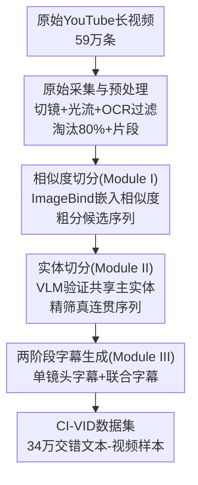

# CI-VID: A Coherent Interleaved Text-Video Dataset

**会议**: CVPR 2026  
**论文**: [CVF Open Access](https://openaccess.thecvf.com/content/CVPR2026/html/Ju_CI-VID_A_Coherent_Interleaved_Text-Video_Dataset_CVPR_2026_paper.html)  
**代码**: https://github.com/ymju-BAAI/CI-VID  
**领域**: 视频生成  
**关键词**: 文本-视频数据集, 多镜头视频生成, 交错文本视频, 数据构建pipeline, T&V2V

## 一句话总结
CI-VID 构建了一个 34 万样本的「交错文本-视频」数据集——每个样本是一段语义连贯的多镜头视频序列，配上既描述单镜头又描述相邻镜头之间「延续/变化」的交错字幕，让模型从「孤立的文本→视频」走向「文本+前序视频→后续视频」，从而能生成有故事性、转场平滑、角色与风格一致的多镜头视频。

## 研究背景与动机
**领域现状**：文本到视频（T2V）这两年靠 Sora、CogVideoX、Emu3 等模型快速进步，而这些模型的训练高度依赖高质量文本-视频数据集，于是出现了 OpenVid-1M、InternVid、Panda-70M、Koala-36M、ShareGPT4Video 等一批资源。

**现有痛点**：这些公开数据集几乎都是「孤立的文本-视频对」（isolated T–V pairs）——把视频在镜头边界处切开，每个镜头独立标注一条字幕，彼此之间一对一、互不关联。但真实世界的视频（教程、电影、新闻、故事）很少是一镜到底，而是由多个语义相连的镜头共同拼出一个完整场景。

**核心矛盾**：一对一配对范式带来两个根本缺陷。其一，只在孤立 T–V 对上训练的模型，生成多镜头视频时无法维持角色、视觉风格和场景转场的连贯——因为训练数据里根本就没有「镜头之间该如何衔接」这层监督信号。其二，它不支持「文本+视频→视频」（T&V2V）的外推生成：视频续写若只用前序帧做条件，容易输出重复内容、语义不可控，必须同时引入文本条件，而孤立 T–V 对天生没有「以前序视频片段为条件」的成对结构。

**本文目标**：造一个能显式建模「镜头间关系（inter-clip relationship）」的数据集，让模型既能学 T2V，也能学 T&V2V，从而支持故事生成、视频续写等超越单镜头的复杂任务。

**切入角度**：借鉴图文领域「交错数据（interleaved data）」的成功经验——Flamingo、KOSMOS-1 证明在交错图文上训练比孤立图文对更强，MMC4、OBELICS、CoMM 则把交错图文做成了规模化资源。但视频生成里这条路几乎空白。

**核心 idea**：把「交错」范式第一次搬到视频生成——用「相似度切分 + 实体切分」两阶段流水线，从原始长视频里筛出「语义连贯但视觉多样」的多镜头序列，再为每个镜头生成单镜头字幕、为相邻镜头生成「延续/变化」联合字幕，二者交错排列，得到第一个大规模交错文本-视频数据集 CI-VID。

## 方法详解
CI-VID 是一篇数据集论文，方法的核心不在模型而在「如何从噪声极大的 YouTube 原始视频里，自动构造出既连贯又多样的多镜头序列，并配上结构化的交错字幕」。整条流水线分三步：先做相似度切分（Module I）得到候选序列，再用 VLM 做实体切分（Module II）保证语义真连贯，最后用 GPT-4o 做两阶段字幕生成（Module III）。

### 整体框架
输入是从 4,068 个精选 YouTube 频道下载的 59 万条原始长视频；输出是 34 万个交错文本-视频样本，每个样本 = 一串语义连贯的镜头序列 + 交错的「单镜头字幕（橙色）」与「联合字幕（绿色）」。中间要解决的核心难题是：直接取连续镜头无法同时满足「语义连贯」和「视觉多样」——连续镜头往往要么是同一画面的冗余重复（缺多样性），要么跨越了场景切换（缺连贯性）。因此需要相似度和实体双重筛选。

### 关键设计

**1. 原始采集与严格预处理：在频道层把质量门槛拉满**

数据集论文最怕的是「源头脏」，所以 CI-VID 不复用现成的 Panda-70M / HDVILA-100M 这类二手切片，而是直接采原始长视频，且把质量控制提前到频道层级。作者从 Emu3 训练数据里抽出对应的 YouTube 频道，由 6 名标注员按分辨率、色彩保真度、运动强度、有无水印人工筛出 4,068 个高质量频道（且每天做专家抽检，标注一致率低于 80% 当天作废重做），再下载这些频道的全部公开视频得到 592,429 条原始视频。预处理阶段用 PySceneDetect（阈值设为很严格的 3）把视频切成单镜头片段，超过 10 秒的均匀再切、短于 1 秒的丢弃；每 0.5 秒算一次光流，按短边归一化的平均光流幅度低于 70 的（运动太弱）淘汰；再用 PaddleOCR 检测，画面文字覆盖超过 10% 的丢弃。这套过滤极其激进，超过 80% 的候选片段被砍掉——作者明确说「宁缺毋滥」，质量优先于数量。

**2. Module I 相似度切分：用拼帧嵌入相似度做粗分，配距离约束防跳跃**

这一步要解决的痛点是：怎么把一堆零散片段粗略地组织成「场景一致」的候选序列。策略是测相邻片段的视觉相似度——若相似度低于下阈值 $T_l$，判为场景切换、切断成不同序列（红色虚线）；若与前一片段过于相似（高于上阈值 $T_h$），判为缺乏视觉多样性、直接剔除（红叉）。实现上有个值得注意的细节：作者从每个片段均匀采 3 帧、水平拼接成一张图再送进 ImageBind 提嵌入、用余弦相似度比较，而不是用常见的中间帧/关键帧——他们发现拼接多帧的空间编码携带了更丰富的时序与上下文信息，检测场景切换显著更准。阈值经验性设为 $(T_l, T_h)=(0.6, 0.8)$，只含单个片段的序列丢弃。此外还加了**距离约束**：由于前面的层层过滤，序列里所谓「相邻」的片段在原视频里可能已经隔得很远，index 间隔越大语义越容易断裂，因此规定相邻片段在原视频里的索引差不能超过 3，否则强制切断。

**3. Module II 实体切分：用 VLM 验证「共享主实体」作为语义连贯的代理**

光靠视觉嵌入相似度还不够——视觉相似不等于语义连贯。这一步借 VLM 的推理能力把关：核心假设是「一个序列里所有片段若共享同一个主实体（main entity），即便有视觉多样性和时间跳跃，也大概率语义连贯」，于是用「是否共享主实体」当作语义连贯的代理指标。具体用 Qwen2.5-VL-72B-Instruct 和 GPT-4o 交互，分四步：①**主实体提取**——把序列拼成 3×n 网格图（每行是一个片段的 3 帧）喂给 Qwen，提示词要求只返回出现在 >60% 图像中的、最主要的同一实体（人物则返回发型衣着等特征、不猜名字），提不出主实体的序列丢弃；②**逐片段实体核查**——对每个片段单独采 3 帧，验证主实体是否出现（至少一帧出现即通过），不通过的片段移除，若通过率低于 70% 则整条序列丢弃；③**同人核验**——针对「不同人却穿着相似导致误判」的失败案例，每片段取一张代表帧拼成一张图，让 Qwen 判断是否始终是同一个人，否则整条丢弃；④**交叉验证**——前三步都依赖 Qwen，为避免单模型偏差，再用 GPT-4o 按同样的输入和要求复核一遍、过滤不合格序列。

**4. Module III 两阶段字幕生成：单镜头字幕重细节、联合字幕重关系**

这是「交错」字幕的核心，要同时刻画「每个镜头讲了什么」和「相邻镜头之间延续/变化了什么」。作者观察到两种喂帧方式各有所长：**顺序帧输入**（逐帧送入）产出更细的细节描述（复杂背景、细粒度物体特征），**联合帧输入**（多帧拼成一张图）更擅长捕捉高层场景关系（人物转换、视角切换）。于是先用顺序帧生成单镜头字幕（按时长每片段采 4–8 帧，结构化覆盖 video content / camera angle / camera movement / video background 四个方面），再以单镜头字幕为文本引导、用联合帧（x×2 网格，x 取 3–5）生成联合字幕，覆盖六个方面：内容延续、内容变化、背景延续、背景变化、相机角度变化、相机运动变化。最终一个样本里，字幕和视频按 `[单镜头字幕#1 → 视频#1 + (单镜头字幕#2, 联合字幕#1) → 视频#2 → ...]` 的交错结构排列，天然支持「文本+前序视频→后续视频」的训练。

### 数据集统计
- **规模**：341,550 个样本，源自 63,807 条原始 YouTube 视频；包含约 100 万条 T–V 对，足够微调 T2V 模型。
- **画质与时长**：98%+ 视频在 1080p 或以上；因 PySceneDetect 阈值严格（3），平均单镜头时长仅 4.7 秒（对比 MiraData/InternVid/Panda-70M 用 25–27 的高阈值，会产生更长但夹带转场噪声的片段）。
- **字幕长度**：结构化字幕平均超 200 词；按交错样本计平均文本长度高达 1071.6 词，远超其他数据集。
- **序列长度**：平均每样本 3.1 个镜头；超过 30% 的样本（10 万+）含 4 个以上镜头，既适合成对学习也适合序列级学习。
- **多样性**：大多数源视频只贡献少于 5 个样本，避免少数视频过度代表；主题覆盖影视动画、how-to、娱乐、游戏、户外等开放域；主实体约一半是人物，其余涵盖动物、车辆、工具、场景等。

## 实验关键数据
为验证数据集有效性，作者基于 NOVA-0.6B（一个顺序预测时序帧的 T2V 模型，含时序编码器/空间编码器/解码器各 16 层、隐藏维 1024，约 0.6B 参数）处理交错文本-视频数据，并用 NOVA 权重初始化加速收敛，在 A100 40GB 上训练。评测构造了 1,000 条测试 prompt（每条 6 个语义相连的场景，源自 VBench 种子关键词扩展），并设计了「人工 + VLM + 相似度」三维基准。基线是仅在 Emu3 上预训练、未在 CI-VID 微调的同款模型。

### 主实验

人工评测（成对比较，三名全职评测员，评分者一致率含平局 91%、不含平局 97%）：

| 维度 | Win | Tie | Loss |
|------|-----|-----|------|
| 一致性 Consistency | 90.0% | 6.5% | 3.6% |
| 叙事性 Narrativity | 80.9% | 15.0% | 4.1% |
| 事实正确性 Correctness | 78.3% | 9.8% | 11.9% |

VLM 评测（Qwen2.5-VL-72B-Instruct 打 0–5 分，每样本取「1 整段 + 5 对相邻片段」共 6 次评估的平均，前四维考查镜头间连贯）：

| 维度 | Baseline | +CI-VID |
|------|----------|---------|
| 风格一致性 | 2.93 | 3.83 |
| 实体一致性 | 2.84 | 3.73 |
| 背景一致性 | 2.80 | 3.75 |
| 视角转换 | 3.02 | 3.81 |
| Prompt 对齐 | 3.99 | 4.07 |
| 视觉合理性 | 3.25 | 3.62 |

### 相似度评测
构造 1,103 个相似度评测样本（为防数据泄漏，只选在数据集中仅贡献单一样本的原视频）。给定首个片段，模型按 CI-VID 字幕生成续写片段，与真值续写比较；实体级用 YOLO-World-L 检测物体、人工标注主实体，取生成-真值实体对的最高相似度。三指标：CLIP 相似度（ViT-H/14，LAION-2B 预训练）、$1-\text{LPIPS}$、SSIM，均越高越好。

| 指标 | Baseline (Overall) | +CI-VID (Overall) | Baseline (Entity) | +CI-VID (Entity) |
|------|------|------|------|------|
| CLIP ↑ | 0.512 | 0.670 | 0.601 | 0.702 |
| 1 − LPIPS ↑ | 0.309 | 0.381 | 0.360 | 0.412 |
| SSIM ↑ | 0.199 | 0.272 | 0.278 | 0.391 |

### 关键发现
- **连贯类维度提升最显著**：VLM 评测里前四个「镜头间连贯」维度（风格/实体/背景一致性、视角转换）从 2.8–3.0 段跳到 3.7–3.8 段，而 prompt 对齐（4.07 vs 3.99）几乎持平——说明 CI-VID 是在「不牺牲文本忠实度和视觉质量」的前提下增强了多镜头连贯，连贯能力的提升不是靠损害其他维度换来的。
- **一致性维度人工 Win 率最高（90%）**：这正是孤立 T–V 对数据集最缺的能力，印证了「交错字幕显式建模镜头间关系」的价值。
- **实体级相似度涨幅大于整体级**（如 SSIM 实体级 0.278→0.391）：说明数据集对「保持关键实体身份/外观跨镜头一致」尤其有效，这与 Module II 围绕「共享主实体」构造序列的设计直接呼应。

## 亮点与洞察
- **把图文领域的「交错数据」范式第一次系统搬到视频生成**：不是简单堆数据，而是补上了「镜头间关系」这层此前公开数据集集体缺失的监督信号，从 T2V 拓展到 T&V2V。
- **「共享主实体」作为语义连贯的可计算代理**：视觉相似度会被「相似但不连贯」骗过，作者用 VLM 验证主实体一致性来兜底，还专门处理了「不同人穿相似衣服」的误判，这个由粗（嵌入相似度）到细（实体核验）再到双模型交叉验证的漏斗很值得复用。
- **拼帧 > 关键帧的工程观察**：把多帧水平拼成一张图喂 ImageBind/VLM，比用单关键帧更能捕捉时序与场景关系——这是一个可迁移到其他视频理解/检索任务的实用 trick。
- **单镜头字幕重细节、联合字幕重关系的「两种喂帧方式互补」观察**：顺序帧擅长细节、拼接帧擅长高层关系，按需选择喂帧方式来榨取 VLM 不同能力，是很实在的标注工程经验。

## 局限与展望
- **平均序列仅 3.1 个镜头、单镜头仅 4.7 秒**：偏短，对需要长程叙事（几十个镜头的完整故事/电影级生成）的任务覆盖有限。⚠️ 论文未给出长序列上的专门评测。
- **验证模型偏小**：只在 0.6B 的 NOVA 上做了验证，数据集对更大规模 SOTA 视频模型的增益是否同样显著、是否会饱和，尚不清楚。
- **构造重度依赖闭源/大模型**（Qwen2.5-VL-72B + GPT-4o 做实体核验和字幕生成），成本高且字幕质量受这些模型偏差影响；评测里 VLM 评分也用 Qwen，存在「同源模型自评」的潜在偏置（作者用固定参考样本做校准来缓解）。
- **数据来源单一**：全部来自 YouTube 精选频道，主题虽广但仍可能带平台/频道选择偏差，且约一半样本主实体是人物，非人实体相对偏少。

## 相关工作与启发
- **vs OpenVid-1M / InternVid / Panda-70M 等主流 T–V 数据集**：它们提供高质量的孤立文本-视频对（一对一），不建模镜头间关系；CI-VID 用交错序列 + 联合字幕显式刻画延续与变化，是它们在「多镜头连贯」维度上的补集，可直接用于微调以补强连贯生成能力。
- **vs MMC4 / OBELICS / CoMM（图文交错数据集）**：它们证明了交错数据在图文模态的有效性；CI-VID 把这套范式迁移到视频，是「交错数据」在视频生成方向上的首个大规模实例。
- **vs 纯视觉续写方法**：传统视频外推只用前序帧做条件，易重复、语义不可控；CI-VID 的交错结构天然支持「文本+前序视频→后续视频」（T&V2V），让文本成为可控的引导信号。

## 评分
- 新颖性: ⭐⭐⭐⭐⭐ 首个大规模交错文本-视频数据集，把图文交错范式迁移到视频生成并打通 T&V2V，切入点清晰。
- 实验充分度: ⭐⭐⭐⭐ 人工/VLM/相似度三维基准齐全且结论一致，但仅在单个 0.6B 模型上验证，缺大模型与长序列实验。
- 写作质量: ⭐⭐⭐⭐ 数据构建流水线讲得清楚、动机充分、统计详实，三个模块层次分明。
- 价值: ⭐⭐⭐⭐⭐ 开源数据集 + 构造与评测代码，直接填补多镜头连贯生成的数据空白，可复用性强。

<!-- RELATED:START -->

## 相关论文

- [\[CVPR 2026\] TV2TV: A Unified Framework for Interleaved Language and Video Generation](tv2tv_a_unified_framework_for_interleaved_language_and_video_generation.md)
- [\[CVPR 2026\] OneStory: Coherent Multi-Shot Video Generation with Adaptive Memory](onestory_coherent_multi-shot_video_generation_with_adaptive_memory.md)
- [\[CVPR 2026\] SymphoMotion: Joint Control of Camera Motion and Object Dynamics for Coherent Video Generation](symphomotion_joint_control_of_camera_motion_and_object_dynamics_for_coherent_vid.md)
- [\[CVPR 2026\] EgoEdit: Dataset, Real-Time Streaming Model, and Benchmark for Egocentric Video Editing](egoedit_dataset_real-time_streaming_model_and_benchmark_for_egocentric_video_edi.md)
- [\[CVPR 2026\] CineBrain: A Large-Scale Multi-Modal Audiovisual Brain Dataset for Brain-Conditioned Video Generation](cinebrain_a_large-scale_multi-modal_audiovisual_brain_dataset_for_brain-conditio.md)

<!-- RELATED:END -->
