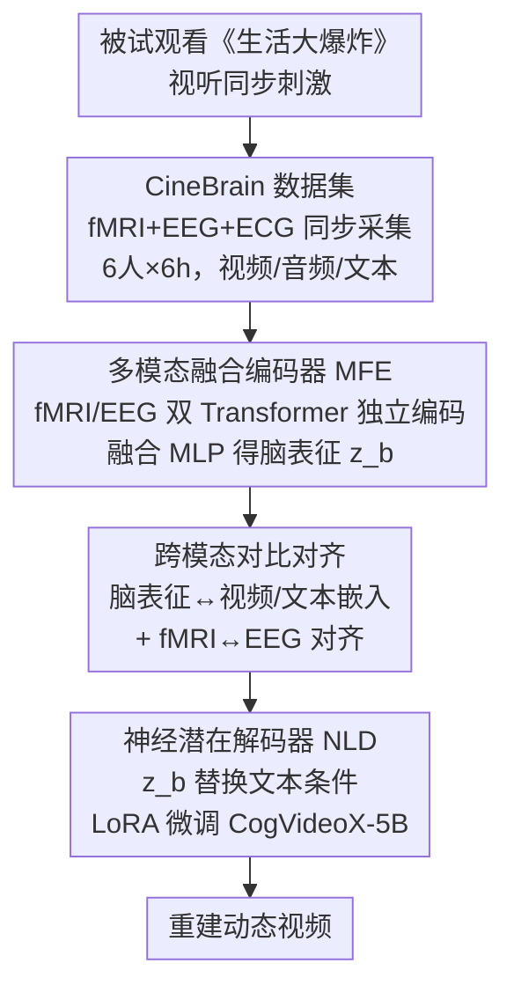

# CineBrain: A Large-Scale Multi-Modal Audiovisual Brain Dataset for Brain-Conditioned Video Generation

**会议**: CVPR 2026  
**论文**: [CVF Open Access](https://openaccess.thecvf.com/content/CVPR2026/html/Gao_CineBrain_A_Large-Scale_Multi-Modal_Audiovisual_Brain_Dataset_for_Brain-Conditioned_Video_CVPR_2026_paper.html)  
**代码**: https://jianxgao.github.io/CineBrain (项目页)  
**领域**: 视频生成 / 脑信号解码  
**关键词**: 脑解码, fMRI-EEG融合, 视听刺激, 视频重建, 多模态数据集  

## 一句话总结
本文构建了首个把 fMRI 与 EEG 同步采集、且在自然视听（看《生活大爆炸》）条件下记录的大规模脑信号数据集 CineBrain，并提出 CineSync 框架——用双 Transformer 融合编码器对齐脑信号与视觉/文本语义、再用 LoRA 微调的视频扩散模型把脑信号解码成动态视频，在动态视频重建上达到 SOTA，并发现听觉皮层激活能提升视觉解码精度。

## 研究背景与动机

**领域现状**：脑信号解码（把 fMRI/EEG 还原成图像、视频甚至 3D）这几年很热，主流做法是把神经信号当作 prior 去 condition 一个生成模型。但绝大多数工作只重建**视觉内容**，且只用**单一神经模态**（要么 fMRI，要么 EEG）、刺激也是**纯视觉**的。

**现有痛点**：这种设定忽略了大脑感知的两个本质特征。其一，人脑天生是**视听一体**地感知世界的——声音会强烈调制视觉处理（McGurk 效应就是冲突的听觉/视觉语音线索合成出第三种幻觉知觉），只看视觉等于砍掉了真实感知的一半。其二，fMRI 和 EEG 是**互补**的：fMRI 空间分辨率高（能定位到哪个脑区），EEG 时间分辨率高（毫秒级动态）；只用一个模态就丢掉了另一半信息。

**核心矛盾**：要研究"听觉如何影响视觉感知"以及"如何融合 fMRI/EEG"，前提是要有一个**同步采集 fMRI+EEG、且在自然动态视听刺激下**的数据集——而这样的数据集此前根本不存在（现有数据集要么只有 fMRI、要么只有 EEG，刺激也多为静态/纯视觉）。

**本文目标**：(1) 提出一个新任务——从自然视听刺激下记录的多模态脑信号重建连续视频；(2) 造一个能支撑该任务的数据集；(3) 给出第一个系统性融合 fMRI+EEG 做视频重建的框架。

**核心 idea**：用叙事性长视频（《生活大爆炸》）作为视听刺激同时录 fMRI 和 EEG，先探明"两个模态该怎么融合"，再把融合后的脑表征通过对比学习对齐到视觉/文本语义，最后塞进视频扩散模型当条件，把脑活动直接"放映"成视频。

## 方法详解

本文有两个层面的贡献：**数据集 CineBrain**（采集协议 + 任务 + 统计）和**框架 CineSync**（怎么把多模态脑信号解码成视频）。下面先讲数据集，再讲框架。

### 整体框架

CineBrain 的采集逻辑是：让 6 名被试在 3T MRI 中观看《生活大爆炸》剧集（视听同步），同时用 MRI 兼容的非磁性耳机放音、用 MRI 兼容 EEG 帽采脑电、并记 ECG。最终得到**同步对齐**的 fMRI + EEG 信号流，配上视频/音频刺激以及自动生成的文本描述。

CineSync 在此数据上把"脑信号 → 视频"拆成两步：**多模态融合编码器（MFE）**先用两个独立 Transformer 分别编码 fMRI 和 EEG，经一个融合 MLP 合成统一脑表征 $z_b$，训练时用对比损失把脑表征锚定到视频/文本嵌入上做语义对齐；**神经潜在解码器（NLD）**则拿一个预训练视频扩散模型（CogVideoX-5B），把它原本的"文本条件"替换成脑表征 $z_b$，用 LoRA 微调 DiT 模块，从脑信号生成视频。

### 关键设计

**1. CineBrain 数据集：首个 fMRI–EEG 同步的自然视听脑信号库**

痛点在于：要研究听觉对视觉的调制、要融合 fMRI/EEG，却没有"同步采两种模态、且自然动态视听刺激"的数据。本文从神经电影学（neurocinematics）出发——叙事性内容能自然维持注意力、激发复杂脑动态——选了 6 集共约 6 小时的《生活大爆炸》作为视听刺激。6 名被试（2 男 4 女，21–26 岁）在 3T MRI 下观看，视频降到 720p 适配 in-bore LCD（8°×8° 视野，被试盯中央红点固视）。采集协议上：fMRI 用梯度回波 EPI、全脑 2mm 各向同性、TR=800ms、多频带因子 8，每个 run 1350 帧；EEG 用 MRI 兼容 64 通道帽、1000Hz，同时记 ECG，靠记录 fMRI 的 TR 时序做精确同步。预处理用 fMRIPrep，并**额外选了听觉 ROI**（视觉 ROI 8405 体素、听觉 ROI 10541 体素），这点和以往只取视觉 ROI 的工作不同，是后面验证"听觉提升视觉解码"的基础。EEG 侧用带通（0.1–30Hz）+ 50Hz 陷波 + QRS/ICA 去除扫描仪和心电伪迹。视频切成 4 秒片段（33 帧），每个被试 5400 个片段（4860 训练 / 540 测试），音频同步切片，并用 Qwen2.5-VL 给视频、Whisper-large-v3 给音频生成文本描述。相比 Wen、fMRI-Video、SEED-DV 等只有单模态信号/单模态刺激的数据集，CineBrain 是唯一**Audio+Video 刺激 + EEG&fMRI 双信号**的库（见下表），还能支撑听觉解码、EEG→fMRI 翻译、刺激→脑建模等扩展任务。

**2. 多模态融合编码器（MFE）：先用实验证明"分开编码 > 早融合"，再据此设计双 Transformer**

怎么融合 fMRI 和 EEG 并不显然，所以作者先在同等参数预算下对比了 5 种融合架构：(a) Joint Transformer（直接拼接喂统一 Transformer）、(b) Two-Stage Fusion（各自编码后再过联合 Transformer）、(c) Cross-Attention Fusion（模态各一塔、块内交叉注意力）、(d) Spatial Concatenation（不同 token 数 + 维度翻倍再空间拼接）、(e) Dual Transformer Fusion（两塔独立编码、最后才聚合）。结果是 (e) 显著最好（FVD 51.53 vs 其他 100+）。这揭示了一个关键发现：**fMRI 与 EEG 的表征差异很大，过早的全共享自注意力反而有害**，越减少早期交互越好。据此 MFE 采用双 Transformer：以 ViT 为骨干、各带一个 class token，把 fMRI/EEG 信号 $x_f, x_e$ 编成隐表征和 class token：$z_f, z_e, c_f, c_e = E(x_f, x_e)$，再用融合 MLP $\psi$ 合成统一脑表征 $z_b = \psi(z_f, z_e)$ 供下游重建。消融还发现：在总 token 数固定为 226 时，适当**增加 EEG 的 token 数**能提升重建质量，说明 EEG 在捕捉快速神经动态上很关键。

**3. 跨模态对比对齐：把脑表征锚到视觉+文本语义，并对齐 fMRI↔EEG**

脑信号本身没有"语义坐标系"，直接拿去生成会跑偏。MFE 因此用对比学习把 class token 对齐到预训练的视觉/文本编码器嵌入上。给一段 $n$ 帧视频 $V=\{I_1,\dots,I_n\}$，用视觉编码器 $E_v$ 逐帧编码再经时序聚合模块 $\varphi$ 得视频级表征 $c_v$，文本直接用 $E_t$ 编 caption 得 $c_t$。然后对 fMRI 的 $c_f$ 和 EEG 的 $c_e$ 分别与视频/文本做 CLIP 式对比：$\mathcal{L}_{fv}, \mathcal{L}_{ft}, \mathcal{L}_{ev}, \mathcal{L}_{et}$，并额外加一项 fMRI↔EEG 的跨模态对比 $\mathcal{L}_{fe} = \mathcal{L}_{\text{clip}}(c_f, c_e)$ 让两种脑模态自身也对齐，总目标为

$$\mathcal{L}_{c} = \mathcal{L}_{fv} + \mathcal{L}_{ft} + \mathcal{L}_{ev} + \mathcal{L}_{et} + \mathcal{L}_{fe}.$$

训练时只更新 MFE、融合 MLP $\psi$、聚合模块 $\varphi$，视觉/文本编码器 $E_v, E_t$（实现用 SigLIP）冻结。这套多级对齐是把"脑活动"翻译成"扩散模型听得懂的条件"的桥梁，消融显示它对最终性能贡献显著。

**4. 神经潜在解码器（NLD）：用 LoRA 把视频扩散模型改造成脑条件生成器**

有了语义对齐的脑表征 $z_b$，还需要一个强生成器把它放映成视频。NLD 直接复用并改装 CogVideoX-5B（8fps、480×720、原本文本条件），核心改动是**把原始文本条件换成脑表征 $z_b$**。训练时视频先经 3D Causal VAE 编码到潜空间 $x_0=\mathcal{E}(V)$，按前向扩散加噪 $x_t=\sqrt{\bar\alpha_t}\,x_0+\sqrt{1-\bar\alpha_t}\,\epsilon$（$t$ 从 1…1000 均匀采样），把噪声潜变量 $x_t$ 与脑特征 $z_b$ 拼接喂进扩散模型。为了高效适配脑输入而不破坏预训练能力，只在 DiT 块的注意力和前馈层上做 LoRA 微调（rank=64，$\alpha=64$），目标是标准扩散去噪损失

$$\mathcal{L} = \mathbb{E}_{V,\epsilon,t}\left[\left\|\epsilon - \epsilon_\theta(x_t, z_b, t)\right\|^2\right].$$

LoRA 的好处是 NLD 可即插即用地接到任意视频扩散模型上，且不需要从零训练大模型。

### 损失函数 / 训练策略
两阶段目标：MFE 阶段用多级对比损失 $\mathcal{L}_c$（式 6）对齐脑↔视觉/文本及 fMRI↔EEG；NLD 阶段用扩散去噪损失 $\mathcal{L}$（式 8）。优化器 AdamW（$\beta=(0.9,0.95)$，初始 lr $1\times10^{-4}$）。fMRI/EEG Transformer 各 12 层、隐维 2048、token 长 227（226 空间 token + 1 class token）。每个样本是 4 秒多模态脑信号（$5\times8405$ fMRI 体素 + $64\times4000$ EEG 点）。

## 实验关键数据

### 主实验：与 baseline 对比（跨被试平均）

CineSync 在语义级和感知级指标上全面超过 EEG2Video、GLFA、NeuroClips 等代表性方法；即便单模态变体也已大幅领先 baseline，融合后进一步提升。带星号的 CineSync⋆ 额外加入听觉 ROI（共 18946 体素/帧），性能再涨。

| 方法 | 2-way(video)↑ | 50-way(video)↑ | FVD↓ | SSIM↑ | PSNR↑ |
|------|------|------|------|------|------|
| EEG2Video | 0.786 | 0.162 | 146.23 | 0.109 | 6.218 |
| GLFA | 0.801 | 0.167 | 128.76 | 0.123 | 7.526 |
| NeuroClips | 0.816 | 0.183 | 116.36 | 0.087 | 6.854 |
| CineSync-EEG | 0.891 | 0.304 | 53.75 | 0.231 | 11.75 |
| CineSync-fMRI | 0.893 | 0.307 | 57.47 | 0.240 | 11.92 |
| **CineSync** | **0.909** | **0.319** | **52.78** | **0.262** | **11.99** |
| **CineSync⋆（+听觉ROI）** | **0.926** | **0.336** | **44.77** | **0.297** | **12.18** |

### 消融：5 种融合架构对比（video-level 语义 + frame-level 感知）

证明"两塔独立编码 + 末端聚合"远优于早融合：Dual Transformer Fusion 的 FVD 51.53，比其他变体（106–128）低一大截。

| 编码器结构 | 50-way↑ | FVD↓ | SSIM↑ | PSNR↑ |
|------|------|------|------|------|
| (a) Joint Transformer | 0.274 | 128.0 | 0.232 | 9.30 |
| (b) Two-Stage Fusion | 0.278 | 120.0 | 0.242 | 9.60 |
| (c) Cross-Attn Fusion | 0.292 | 110.0 | 0.249 | 9.90 |
| (d) SpatialCat (f34-e192) | 0.311 | 106.0 | 0.250 | 10.10 |
| **(e) Dual Trans. Fusion** | **0.324** | **51.53** | 0.249 | **12.03** |

### 数据集对比

| 数据集 | 刺激类型 | 被试 | 时长 | EEG | fMRI |
|------|------|------|------|------|------|
| Wen | Video | 3 | 3.07h | ✘ | ✓ |
| fMRI-Video-WebVid | Video | 5 | 2.67h | ✘ | ✓ |
| SEED-DV | Video | 20 | 0.76h | ✓ | ✘ |
| **CineBrain (Ours)** | **Audio+Video** | 6 | **6h** | ✓ | ✓ |

### 关键发现
- **早融合有害**：fMRI 与 EEG 表征差异大，全共享自注意力（早融合）反而掉点；越减少早期交互越好，故采用双塔独立编码。
- **听觉 ROI 帮视觉解码**：把听觉皮层体素加入 fMRI 输入后，视频重建全面提升（FVD 52.78→44.77，SSIM 0.262→0.297），印证了"声音调制视觉感知"的神经基础，也是本文最核心的科学发现。
- **EEG token 数更重要**：固定总 token 数时，提升 EEG 表征容量（多给 EEG token）比单纯扩特征维度更有效，凸显 EEG 在捕捉快速动态上的价值。
- **融合 > 单模态**：完整 CineSync 稳超 fMRI-only / EEG-only 变体，验证 fMRI（空间）与 EEG（时间）互补。

## 亮点与洞察
- **"先做架构搜索再定方法"**：作者没有拍脑袋选融合方式，而是用 5 种架构的可控对比得出"分开编码更好"，再据此设计 MFE——结论本身（早融合有害）对后续做多模态脑解码很有参考价值。
- **把听觉拉进视觉解码**：额外标注听觉 ROI 并实验证明其提升视觉重建，从工程数据集升华出一个认知神经科学结论（cross-modal facilitation），这是数据集论文少见的"既给数据又给洞见"。
- **NLD 即插即用**：用 LoRA 把任意视频扩散模型的文本条件替换成脑条件，迁移性强——换更强的视频扩散底座理论上能直接受益。
- **同步 fMRI+EEG 采集工程**：在强磁噪声 MRI 环境里用非磁性耳机+MRI 兼容 EEG 帽+TR 时序对齐，把两种本来难以共存的模态同步采下来，本身就是有复用价值的实验范式。

## 局限与展望
- **被试规模小**：仅 6 人、刺激单一来自一部美剧，跨被试/跨内容泛化性存疑；模型多为 per-subject 评估，未充分验证跨被试解码。
- **重建仍偏语义而非像素级精确**：PSNR ~12、SSIM ~0.3，定量看离"逐帧高保真"还远，更多是语义/动态层面的还原（这也是当前脑解码视频的共性瓶颈）。
- **消融披露不全** ⚠️：对比对齐的消融结果放在补充材料，正文只给定性结论，读者无法从正文核对各对比项（$\mathcal{L}_{fe}$ 等）各自的增益。
- **听觉提升的机制未深究**：听觉 ROI 提升视觉解码是相关性证据，未进一步剥离是"听觉真带来视觉信息"还是"更多体素=更多容量"；可设计控制实验（如打乱听觉/视觉对齐）进一步验证。
- **扩展任务只是设想**：听觉解码、EEG→fMRI 翻译、刺激→脑建模等在文中仅作为 CineBrain 的潜在用途提及，尚无实验。

## 相关工作与启发
- **vs 纯视觉 fMRI 解码（如 NeuroClips、GLFA）**：他们只用 fMRI、只重建视觉、刺激也是纯视觉；本文加入 EEG 与听觉刺激，并证明听觉 ROI 能提升视觉解码，把"单模态视觉解码"扩展到"视听一体的多模态解码"。
- **vs EEG 视频解码（EEG2Video）**：EEG2Video 单用 EEG，时间分辨率高但空间信息弱；CineSync-EEG 变体已大幅超过它，完整模型再用 fMRI 补空间信息，互补优势明显。
- **vs 单模态脑数据集（Wen / SEED-DV）**：现有库要么只有 fMRI、要么只有 EEG，刺激多为纯视觉；CineBrain 是首个 fMRI+EEG 同步、Audio+Video 刺激的库，且支持多种下游脑解码任务。

## 评分
- 新颖性: ⭐⭐⭐⭐⭐ 首个 fMRI–EEG 同步的自然视听脑数据集 + 首个系统融合二者做视频重建的框架，任务本身是新的。
- 实验充分度: ⭐⭐⭐⭐ 架构搜索、baseline 对比、听觉 ROI 验证都到位，但被试少、关键对齐消融压到补充材料。
- 写作质量: ⭐⭐⭐⭐ 动机清晰、从数据到框架到洞见逻辑顺，符号与公式规范。
- 价值: ⭐⭐⭐⭐⭐ 数据集 + 框架 + "听觉助视觉"的认知发现三重贡献，对脑解码与跨学科研究都有奠基价值。

<!-- RELATED:START -->

## 相关论文

- [\[CVPR 2026\] SemVideo: Reconstructs What You Watch from Brain Activity via Hierarchical Semantic Guidance](semvideo_reconstructs_what_you_watch_from_brain_activity_via_hierarchical_semant.md)
- [\[CVPR 2026\] UnityVideo: Unified Multi-Modal Multi-Task Learning for Enhancing World-Aware Video Generation](unityvideo_unified_multi-modal_multi-task_learning_for_enhancing_world-aware_vid.md)
- [\[CVPR 2025\] HOIGen-1M: A Large-Scale Dataset for Human-Object Interaction Video Generation](../../CVPR2025/video_generation/hoigen-1m_a_large-scale_dataset_for_human-object_interaction_video_generation.md)
- [\[ICCV 2025\] DH-FaceVid-1K: A Large-Scale High-Quality Dataset for Face Video Generation](../../ICCV2025/video_generation/dh-facevid-1k_a_large-scale_high-quality_dataset_for_face_video_generation.md)
- [\[CVPR 2026\] MoVieDrive: Urban Scene Synthesis with Multi-Modal Multi-View Video Diffusion Transformer](moviedrive_urban_scene_synthesis_with_multi-modal_multi-view_video_diffusion_tra.md)

<!-- RELATED:END -->
