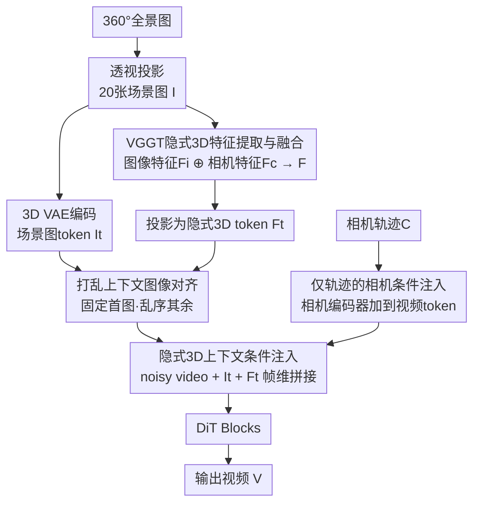

# CineScene: Implicit 3D as Effective Scene Representation for Cinematic Video Generation

**会议**: CVPR 2026  
**论文**: [CVF Open Access](https://openaccess.thecvf.com/content/CVPR2026/html/Huang_CineScene_Implicit_3D_as_Effective_Scene_Representation_for_Cinematic_Video_CVPR_2026_paper.html)  
**代码**: 无（仅项目页，未开源）  
**领域**: 视频生成  
**关键词**: 电影级视频生成, 隐式3D, VGGT, 上下文条件注入, 场景一致性  

## 一句话总结
给定一组静态场景图、一段文字 prompt 和一条用户指定的相机轨迹，CineScene 用 VGGT 提取的「隐式 3D 特征」作为上下文条件注入预训练 T2V 扩散模型，从而在大幅度视角变化下生成场景一致、带新动态主体的电影级视频，场景一致性与相机精度都达到 SOTA。

## 研究背景与动机

**领域现状**：电影级视频生产需要同时控制「场景—主体构图」和「相机运动」，但实拍要搭建物理布景，成本高、复现难。于是一个自然的诉求是：把静态场景和动态主体解耦——只给几张场景图，就能在里面「放进」一个新主体，并按指定相机轨迹拍出来。

**现有痛点**：现有电影级视频生成在「生成灵活性」和「场景一致性」之间存在根本性 trade-off。① 纯 2D 上下文方法（如 FramePack、Context-as-Memory）直接在图像空间操作，灵活但缺乏空间理解，**大视角变化时场景就崩**；② 显式 3D 方法（如 Gen3C 用深度图 / 点云）能强约束一致性，但从稀疏输入重建准确 3D/4D 本身就难，重建几何一旦不准就拖累生成质量，且推理慢（论文实测 Gen3C 比本文慢约 10.17×）。

**核心矛盾**：要场景一致就得有 3D 空间理解，但「显式重建 3D 几何」既难又脆。能不能拿到 3D 信息，又**不做显式重建**？

**切入角度**：VGGT 这类 3D 基础模型已经证明，可以从 2D 图像直接编码出富含空间信息的「3D-aware 特征」，无需显式几何重建。已有工作 Geometry Forcing 用 VGGT 特征构造一个监督 **loss** 去约束扩散过程——但这个 loss 是为「静态重建」服务的，会隐式惩罚动态内容，导致它只能生成静态场景、放不进新主体。

**核心 idea**：把隐式 3D 表征从「监督 loss」改成「上下文条件（context conditioning）」直接注入扩散过程。条件注入天然把「静态背景（条件输入）」和「动态前景（生成目标）」解耦，从而在保证场景一致的同时生成鲜活的动态主体——这正是 loss-guided 方案做不到的。

## 方法详解

### 整体框架

输入是一组静态场景图 $I\in\mathbb{R}^{c\times h\times w}$、prompt $P$、相机轨迹 $C\in\mathbb{R}^{f\times3\times4}$，输出是带动态主体、遵循指定相机轨迹、且与 $I$ 场景一致的视频 $V\in\mathbb{R}^{f\times c\times h\times w}$。整条管线分三步走：先把全景图投成 20 张透视场景图并用 VGGT 抽出隐式 3D 特征；再把「场景图 token」「隐式 3D token」和「噪声视频 token」沿帧维拼接，作为上下文条件喂进预训练 T2V 的 DiT，相机轨迹则单独编码注入；训练时对场景图做打乱以强迫模型真正学隐式 3D 而非抄像素。整个过程**不改 T2V 架构**，只在 transformer block 前做条件拼接。

### 关键设计

**1. 隐式 3D 场景表征的上下文条件注入：用条件代替 loss 来解耦静背景与动前景**

这是全文的核心创新，针对的是 loss-guided 方案「只能生成静态场景」的痛点。Geometry Forcing 把 VGGT 特征做成监督信号，去最小化「VGGT 特征」与「扩散模型 latent」的差异；但这个目标是为静态重建优化的，会惩罚一切偏离静态场景的内容，于是动态主体被压制、出现明显 artifact。CineScene 反其道而行：把隐式 3D 特征 token $F_t$、场景图 token $I_t$、和噪声视频 token 沿**帧维度拼接**成一条序列送进 DiT，让条件（静态场景）和生成目标（动态内容）在注意力里联合建模。这样做有两个好处：一是条件注入本身把「静态背景=输入、动态前景=输出」结构性地分开了，生成动态主体时不再被静态重建目标束缚；二是它更贴合扩散范式——VGGT 特征是「引导上下文」而非一个独立的训练目标，不像 loss-guided 那样 VGGT 监督和扩散 loss 各干各的、互相打架。消融里 Loss-Guided 的 CLIP-V 0.8552 / PSNR 14.00，而本文 0.8633 / 14.51，且定性上动态主体不再有撕裂感。

**2. VGGT 隐式 3D 特征提取与图像—相机融合：把空间布局和视角信息揉进一张特征**

要让模型「看懂」场景的 3D 结构，先得有 3D-aware 表征。CineScene 先用 equirectangular-to-perspective 投影，从 360° 全景图沿水平面每 18° 采一个视角、共生成 20 张 90° FoV 的透视场景图 $I$，覆盖整圈场景。再用 VGGT 的 transformer backbone 取最后一层特征，这层特征天然解耦成两部分：图像特征 $F_i\in\mathbb{R}^{20\times k\times2048}$（含深度、点云结构、tracking 等空间线索）和相机特征 $F_c\in\mathbb{R}^{20\times1\times2048}$（含相机位姿，$k$ 是随分辨率变的 token 数）。融合方式很轻：把 $F_c$ 沿空间维 expand 到与 $F_i$ 对齐，再做逐元素相加得到最终隐式特征 $F\in\mathbb{R}^{20\times k\times2048}$，

$$F = F_i + \text{expand}(F_c)$$

这一步把「场景内容」和「相机视角」信息合到一起，作者称这个简单操作既有效又高效。注入前 $F$ 还要 reshape+插值到 $\mathbb{R}^{20\times h/8\times w/8\times2048}$ 做空间对齐，再经一个卷积+LayerNorm patchify 投到隐藏维，得到 $F_t\in\mathbb{R}^{20\times h/16\times w/16\times d}$。消融表明，只用图像特征或只用相机特征都不如二者融合（Ours 全面最优）。

**3. 仅轨迹的相机条件注入：绕开「估不准的源相机内外参」**

以往用上下文图像的方法（如 Context-as-Memory）需要从场景图里估出相机位姿，但即便用 SOTA 的 SfM，稀疏图像的位姿也常常不准，误差会传导到一致性上。CineScene 只用**目标相机轨迹** $C\in\mathbb{R}^{f\times3\times4}$（每帧的朝向+平移）作为输入，不要源图内参。具体做法：用一个可学习的相机编码器把 $C$ 投到和视频 token 同通道，加到「对应噪声视频的视觉特征」上；而对应 $I_t$、$F_t$ 的 token 位置则注入零作为占位符。作者也不引入相机内参（用户通常拿不到源图内参），实验里固定上下文图与生成视频的 FoV 关系，但框架可轻松扩展为把变化内参当额外条件。prompt 则按常规走 cross-attention 注入。这一设计让相机控制既精确（RotErr 2.68 / TransErr 5.15，优于 RecamMaster、Traj-Attn 等专门做相机控制的方法）又不依赖脆弱的位姿估计。

**4. 打乱上下文图像对齐：逼模型学隐式 3D，而非抄首尾图的像素**

直接用「按 18° 顺序排列」的场景图训练会出问题：模型被像素信息主导，尤其会**直接复制第一张和最后一张图的内容**，从而忽略隐式 3D 表征（作者归因于视频模型位置编码带来的 position-aware prior）。一个看似可行的解法是 progressive training（先训隐式条件、再加场景图），但它会破坏「场景图与其隐式 3D 表征的联合对齐」，不适合本任务。CineScene 的做法很轻：训练时**固定第一张上下文图的位置**（它对应目标视频的起始视角），把其余图的顺序随机打乱。这样模型无法靠「固定输入顺序的相关性」偷懒，被迫去学「像素级上下文 ↔ 隐式 3D 场景」的真正对应。消融里 Shuffled 在 CLIP-V、PSNR、LPIPS、CamMC 上均优于 Ordered 和 Progressive。

### 损失函数 / 训练策略

基于一个内部 T2V 扩散模型在 Scene-Decoupled 数据集上微调：10K 步、batch size 16、学习率 $5\times10^{-5}$、timestep shift 15，用 20 张场景图 + 目标相机位姿 + 目标 prompt 为输入。推理分辨率 $384\times672$、77 帧、50 步。训练目标即标准扩散去噪 loss（无额外 VGGT loss，这正是与 loss-guided 路线的本质区别）。

**数据集（Scene-Decoupled Video Dataset）**：现实数据没有完美分离的静背景/动前景，也缺精确多样的相机轨迹，作者用 Unreal Engine 5 渲染。优势是：① 同一场景能给出「带主体视频」和「不带主体视频」的完美配对，利于学解耦表征；② 相机轨迹精确可定制、支持大视角变化（如 pan 运动 77 帧转 75°）。每个场景渲染带/不带动态人物的视频、从共同起始视角拍的 360° 全景图（投到 equirectangular 表示）、以及基于 dolly/pan/tilt/tracking × 6 方向的相机轨迹。共 35 个高质量 3D 环境、46K 视频—场景图对、46K 条轨迹。

## 实验关键数据

### 主实验

10 个指标覆盖四方面：场景一致性、相机精度、文本对齐、视频质量。所有 context-based 基线都在同一 base model + 数据集上以相同设置复现。

| 方法 | 类型 | Mat.Pix.(K)↑ | CLIP-V↑ | PSNR↑ | LPIPS↓ | RotErr↓ | TransErr↓ | VBench↑ |
|------|------|------|------|------|------|------|------|------|
| FramePack | 2D 上下文 | 4107.45 | 0.8421 | 11.89 | 0.5505 | - | - | 0.7999 |
| Context-as-Memory | 2D 上下文 | 4581.15 | 0.8542 | 13.81 | 0.4486 | 2.7106 | 5.2194 | 0.8018 |
| Gen3C | 显式 3D | 4541.25 | 0.8292 | 11.63 | 0.6711 | 2.9670 | 10.1578 | 0.7585 |
| RecamMaster | 相机控制 | - | - | - | - | 3.0854 | 7.3714 | 0.7950 |
| **CineScene（本文）** | 隐式 3D | **4617.51** | **0.8633** | **14.51** | **0.4241** | **2.6825** | **5.1460** | **0.8053** |

CineScene 在场景一致性（Mat.Pix./CLIP-V/PSNR/SSIM/LPIPS）和相机精度（RotErr/TransErr/CamMC）上全面领先。FramePack 因依赖压缩的纯 2D 像素信息，一致性最差；Context-as-Memory 依赖高重叠上下文图和估计位姿，大视角下崩；Gen3C 因显式 3D 在大视角下不准而失一致，且推理慢约 10.17×。本文文本对齐（CLIP-T 0.3212）略低于 FramePack，作者解释为 CineScene 的相机运动幅度大得多、帧间变化大，拉低了逐帧 CLIP-T。

### 消融实验

**隐式 3D 表征的消融（Table 2，评场景一致性）**

| 配置 | Mat.Pix.(K)↑ | CLIP-V↑ | PSNR↑ | LPIPS↓ | 说明 |
|------|------|------|------|------|------|
| Loss-Guided | 4509.46 | 0.8552 | 14.00 | 0.4458 | 改用监督 loss，动态主体出 artifact |
| W/o Implicit | 4527.46 | 0.8456 | 13.76 | 0.4506 | 不注隐式 3D，一致性最差 |
| W/ Image feature | 4519.11 | 0.8518 | 13.96 | 0.4474 | 只用图像特征 $F_i$ |
| W/ Camera feature | 4498.83 | 0.8544 | 14.11 | 0.4467 | 只用相机特征 $F_c$ |
| **Ours（$F_i$+$F_c$）** | **4617.51** | **0.8633** | **14.51** | **0.4241** | 内容+视角融合最优 |

**打乱上下文图像的消融（Table 3）**

| 配置 | CLIP-V↑ | PSNR↑ | LPIPS↓ | CamMC↓ | 说明 |
|------|------|------|------|------|------|
| Ordered | 0.8592 | 14.02 | 0.4316 | 6.9152 | 顺序输入，模型抄末图像素 |
| Progressive | 0.8608 | 14.20 | 0.4378 | 7.0612 | 渐进训练，破坏联合对齐 |
| **Shuffled（Ours）** | **0.8633** | **14.51** | **0.4241** | **6.8819** | 固定首图+乱序其余 |

### 关键发现
- **条件注入 > loss 引导**：同样用 VGGT 隐式 3D，把它当上下文条件比当监督 loss 在场景一致性上全面更好，且根本上解决了 loss-guided「压制动态主体」的硬伤——这是本文最核心的对照实验。
- **图像+相机特征必须一起用**：单用 $F_i$ 或 $F_c$ 都不如融合；尤其 W/o Implicit 一致性最差，证明隐式 3D 注入确实在起作用。
- **顺序会被模型钻空子**：Ordered 训练让模型复制末图像素（Figure 6 红框），打乱后被迫学真正的隐式 3D 对齐。
- **效率优势**：隐式 3D 免去显式重建，推理比 Gen3C 快约 10.17×。
- **泛化**：在 DiT360 的 50 个真实场景样本上做了 OOD 测试，并展示了虚拟摄影棚制作等应用。

## 亮点与洞察
- **「注入方式」本身就是贡献**：同一份 VGGT 特征，换成上下文条件而非监督 loss，就把「只能生成静态」变成「能放进动态主体」。这说明对扩散模型而言，3D 信息「以什么形式进来」可能比「信息本身」更关键——条件注入天然实现了静/动解耦。
- **隐式 3D 绕开重建脆弱性**：不重建显式几何，直接用基础模型的 3D-aware 特征，既躲开稀疏视图重建不准的坑，又省掉显式 3D 的推理开销，是「3D 基础模型 → 下游生成」的一条干净路径。
- **打乱首尾防抄袭的小 trick 很可迁移**：「固定关键帧位置、打乱其余」这个对抗位置编码先验的做法，可推广到任何「多参考图条件、但模型倾向复制固定位置参考」的生成任务。
- **不改架构、只加条件 token**：整套方法对预训练 T2V 零侵入，工程上易接入。

## 局限与展望
- **训练数据全是合成的**：核心训练数据来自 Unreal Engine 5 渲染，真实世界只做了小规模 OOD 测试，sim-to-real 差距和真实场景泛化仍是问号。⚠️ 论文主表是 held-out 合成测试集（300 样本），真实数据定量结果放在附录。
- **依赖 VGGT 的特征质量**：隐式 3D 完全建立在 VGGT 表征上，若场景超出 VGGT 能力范围（极端光照、强反射、动态场景图），空间先验可能失效。
- **相机内参被固定**：当前固定上下文图与生成视频的 FoV 关系、不输入内参，虽然作者说可扩展，但变焦/不同内参的真实拍摄尚未验证。
- **文本对齐被相机运动拖累**：CLIP-T 受大幅相机运动影响而偏低，说明「强相机控制」与「逐帧文本一致」之间还有张力。
- **改进思路**：引入真实场景数据做混合训练、把变化内参纳入条件、用更鲁棒的 3D 基础模型替换 VGGT。

## 相关工作与启发
- **vs Geometry Forcing（loss-guided 隐式 3D）**：都用 VGGT 隐式 3D，但 Geometry Forcing 把它当监督 loss，只能生成静态场景；本文当上下文条件，能解耦静/动、生成动态主体，且一致性更好。
- **vs Gen3C（显式 3D）**：Gen3C 靠预测点云/深度的 2D 投影做显式 3D 引导，重建不准时大视角下失一致、推理慢约 10×；本文用隐式特征免重建，更稳更快。
- **vs Context-as-Memory（2D 上下文+位姿选图）**：CaM 需要上下文图的相机位姿（用 VGGT 估），依赖高重叠图和位姿精度，大视角崩；本文只用目标轨迹、不估源位姿，更鲁棒。
- **vs FramePack（2D 上下文压缩）**：FramePack 把上下文压成帧、纯 2D，缺空间理解，大视角一致性最差；本文注入 3D-aware 特征补上空间先验。

## 评分
- 新颖性: ⭐⭐⭐⭐⭐ 「上下文条件注入隐式 3D」首次让隐式 3D 视频生成支持动态主体，是清晰的范式切换
- 实验充分度: ⭐⭐⭐⭐ 10 指标、5 个基线、两组关键消融都到位，但真实数据评测偏弱、主表全合成
- 写作质量: ⭐⭐⭐⭐⭐ 动机—对照逻辑（条件 vs loss）讲得非常透，图文对照清晰
- 价值: ⭐⭐⭐⭐ 解耦场景的电影级视频生成有明确应用（虚拟摄影棚），方法对预训练 T2V 零侵入易落地

<!-- RELATED:START -->

## 相关论文

- [\[CVPR 2026\] 3D-Aware Implicit Motion Control for View-Adaptive Human Video Generation](3d-aware_implicit_motion_control_for_view-adaptive_human_video_generation.md)
- [\[CVPR 2026\] Geometry-as-context: Modulating Explicit 3D in Scene-consistent Video Generation to Geometry Context](geometry-as-context_modulating_explicit_3d_in_scene-consistent_video_generation_.md)
- [\[CVPR 2026\] STAGE: Storyboard-Anchored Generation for Cinematic Multi-shot Narrative](stage_storyboard-anchored_generation_for_cinematic_multi-shot_narrative.md)
- [\[CVPR 2026\] HoloCine: Holistic Generation of Cinematic Multi-Shot Long Video Narratives](holocine_holistic_generation_of_cinematic_multi-shot_long_video_narratives.md)
- [\[CVPR 2026\] Diff4Splat: Repurposing Video Diffusion Models for Dynamic Scene Generation](diff4splat_controllable_4d_scene_generation_with_latent_dynamic_reconstruction_m.md)

<!-- RELATED:END -->
