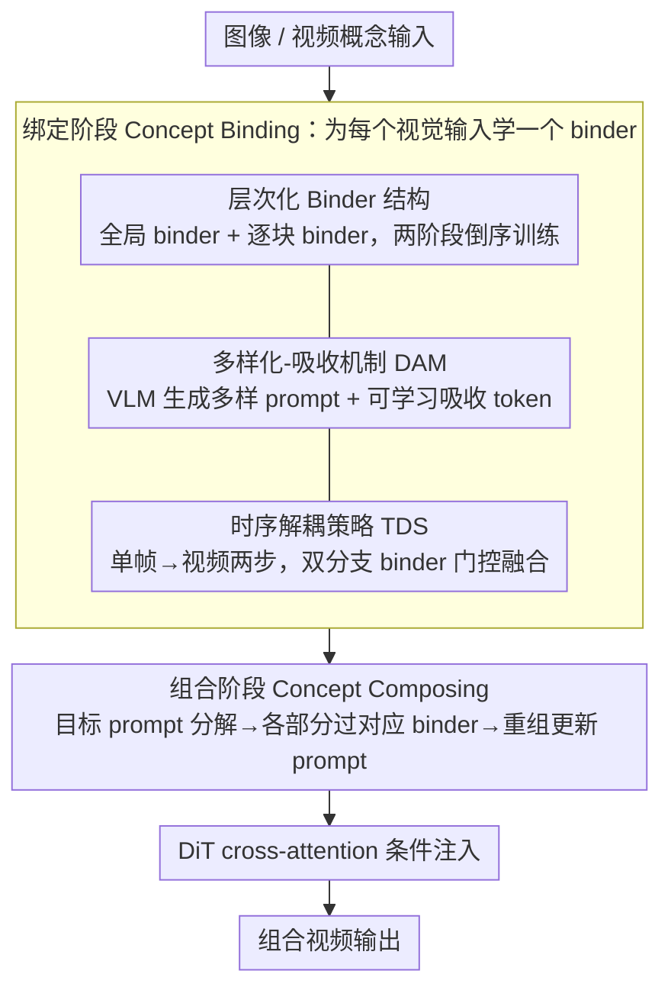

# Composing Concepts from Images and Videos via Concept-prompt Binding

**会议**: CVPR 2026  
**arXiv**: [2512.09824](https://arxiv.org/abs/2512.09824)  
**代码**: [项目页面](https://refkxh.github.io/BiCo_Webpage)  
**领域**: 视频生成  
**关键词**: 视觉概念组合, 扩散 Transformer, 视频个性化, 概念绑定, 时序解耦

## 一句话总结
提出 Bind & Compose (BiCo)，一种one-shot方法，通过层次化binder结构将视觉概念绑定到prompt token，并通过token组合实现图像-视频概念的灵活组合，在概念一致性、prompt保真度和运动质量上全面超越前作。

## 研究背景与动机
**领域现状**：视觉概念组合旨在将不同图像和视频中的元素整合为一个连贯输出，是视觉创作和电影制作的基础能力。随着DiT架构T2V扩散模型（Wan2.1等）的发展，概念定位和定制化能力显著提升。

**现有痛点**：(i) 概念提取精度不足——现有方法（LoRA/可学习embedding+掩码）难以解耦有遮挡和时序变化的复杂概念，且无法提取非物体概念（如风格）；(ii) 图像-视频概念组合灵活性不足——已有工作仅限于用图像中的主体+视频中的运动，未能灵活组合任意属性（视觉风格、光照变化等）。

**核心矛盾**：需要同时解决精确概念分解（不需要掩码输入）和跨模态概念组合（图像+视频）两个相互耦合的挑战。

**本文目标** 实现从图像和视频中灵活提取并组合任意视觉概念（包括非物体概念如风格、运动）。

**切入角度**：利用T2V扩散模型的概念定位能力，将文本token与对应视觉概念绑定（one-shot训练），然后通过token级别的组合实现概念合成。

**核心 idea**：先将视觉概念绑定到prompt token上（Bind），再从不同来源选择绑定token组合成目标prompt（Compose），整个过程通过层次化binder结构+多样化吸收机制+时序解耦策略实现。

## 方法详解

### 整体框架
BiCo 要做的事是：从图像和视频里把任意视觉概念（包括风格、运动这类非物体概念）灵活地提取出来再组合到一起，而且不需要掩码输入。它基于 Wan2.1-T2V-1.3B，把整个流程拆成「先绑定、再组合」两步——绑定阶段（Concept Binding）给每个视觉输入学一个轻量 binder 模块，把文本 token 和对应的视觉概念映射起来；组合阶段（Concept Composing）把目标 prompt 里不同部分各自过对应的 binder，拼成一个携带多来源视觉信息的更新 prompt。所有操作都挂在 DiT 的 cross-attention 条件注入上：

$$\mathbf{x}_{out} = \text{cross\_attention}(\mathbf{x}_{in}, \mathbf{p}, \mathbf{p})$$

绑定阶段的三个核心设计——层次化 Binder 结构、多样化-吸收机制、时序解耦策略——共同把视觉概念稳定、干净地绑到 prompt token 上；组合阶段再把不同来源的绑定 token 拼成更新后的 prompt，注入 DiT 生成最终视频：

### 关键设计

**1. 层次化 Binder 结构：用全局+逐块两层 binder 适配 DiT 各块的不同行为**

DiT 各块在去噪过程中行为差异很大，单个全局 binder 没法兼顾。作者设计了全局 binder $f_g(\cdot)$ 加逐块 binder $f_l^i(\cdot)$ 的两层结构，每个 binder 都是带零初始化缩放因子的残差 MLP：$f(\mathbf{p}) = \mathbf{p} + \gamma \cdot \text{MLP}(\mathbf{p})$，零初始化保证训练起点不破坏原模型。配套用**两阶段倒序训练**——先在高噪声水平（$\geq \alpha$，$\alpha=0.875$）只强化全局 binder 抓全局关联，再联合训练全部 binder 做针对性微调。消融里这个倒序策略一去掉，Overall 直接从 4.40 暴跌到 2.58，说明先全局后局部的顺序不可替代。

**2. 多样化-吸收机制（DAM）：在 one-shot 下把「概念」和「无关细节」分开**

one-shot 只有一个样本，binder 很容易把概念无关的视觉细节也一起绑死。DAM 先用 VLM（Qwen2.5-VL）提取空间和时序的关键概念，生成一批多样化 prompt（关键概念词保持不变、其余措辞变化），逼 binder 只认真正稳定的概念；同时引入一个可学习的**吸收 token** $p_a^j$，训练时专门吸收那些与概念无关的视觉细节，推理时直接把它丢掉，从而抑制不想要的细节泄漏。

**3. 时序解耦策略（TDS）：化解图像概念和视频概念的时序异质性**

图像是单帧、视频带时序，直接混在一起训练会打架。TDS 把视频概念训练拆成两步：Stage 1 先在单帧上训练，和图像概念的设置对齐；Stage 2 再到完整视频上训练，并引入双分支 binder：

$$\text{MLP}(\mathbf{p}) \leftarrow (1-g(\mathbf{p})) \cdot \text{MLP}_s(\mathbf{p}) + g(\mathbf{p}) \cdot \text{MLP}_t(\mathbf{p})$$

其中空间分支 $\text{MLP}_s$ 的权重直接继承自 Stage 1，门控 $g(\cdot)$ 零初始化保证良好的初始状态，时序分支 $\text{MLP}_t$ 再渐进地把视频特有的运动信息补进来。这样图像和视频概念就能在同一框架里兼容组合。

### 损失函数 / 训练策略
使用标准扩散模型去噪损失训练 binder。每阶段训练2400次迭代，学习率 $1.0 \times 10^{-4}$。推理时生成81帧视频。实验在NVIDIA RTX 4090上进行。

## 实验关键数据

### 主实验：与前作定量对比

| 方法 | CLIP-T↑ | DINO-I↑ | Concept↑ | Prompt↑ | Motion↑ | Overall↑ |
|------|---------|---------|----------|---------|---------|----------|
| Textual Inversion† | 25.96 | 20.47 | 2.14 | 2.17 | 2.94 | 2.42 |
| DB-LoRA† | 30.25 | 27.74 | 2.76 | 2.76 | 2.51 | 2.68 |
| DreamVideo | 27.43 | 24.15 | 1.90 | 1.82 | 1.66 | 1.79 |
| DualReal | 31.60 | 32.78 | 3.10 | 3.11 | 2.78 | 3.00 |
| **BiCo (Ours)** | **32.66** | **38.04** | **4.71** | **4.76** | **4.46** | **4.64** |

BiCo在主观Overall Quality上比前作DualReal提升 **+54.67%**（3.00→4.64）。

### 消融实验：各组件贡献（人工评估5分制）

| 配置 | Concept↑ | Prompt↑ | Motion↑ | Overall↑ |
|------|----------|---------|---------|----------|
| Baseline (仅全局binder) | 2.16 | 2.60 | 2.26 | 2.34 |
| +层次化Binder | 2.63 | 2.88 | 2.93 | 2.81 |
| +Prompt多样化 | 3.40 | 3.34 | 3.04 | 3.26 |
| +吸收Token | 3.55 | 3.43 | 3.43 | 3.47 |
| +TDS (无吸收) | 3.80 | 3.97 | 3.70 | 3.82 |
| ▲ 无倒序训练策略 | 2.60 | 2.70 | 2.43 | 2.58 |
| **Full Model** | **4.43** | **4.47** | **4.32** | **4.40** |

### 关键发现
- 层次化binder对概念保持和运动质量提升显著（2.26→2.93的Motion）
- 吸收token有效抑制不需要的细节（消融可视化显示去除后出现不相关元素）
- TDS对图像-视频兼容性至关重要（Overall从3.47→3.82）
- 两阶段倒序训练不可替代——去除后Overall从4.40暴跌至2.58

## 亮点与洞察
- **统一框架**：首次实现图像+视频任意概念的灵活组合，支持非物体概念（风格、运动）
- **无需掩码**：通过文本条件的概念组合实现隐式分解，降低用户门槛
- **设计上的可扩展性**：binder是轻量模块，不同概念来源的binder独立训练，可按需组合
- **衍生应用丰富**：图像/视频分解（只保留部分token）、文本引导编辑

## 局限与展望
- 将所有token等同对待，但token对T2V生成的重要性分布不均匀——表示主体/运动的token远比功能词重要
- 基于1.3B模型，scaling到更大T2V模型（如CogVideoX、Sora级别）的效果未验证
- 定量评估中自动指标（CLIP-T、DINO-I）与人工评估的一致性有待进一步确认
- 计算开销：每个概念来源需独立训练binder（2400 iterations x 2 stages）

## 相关工作与启发
- Textual Inversion/DreamBooth-LoRA是视频个性化的基础方法但概念控制粒度粗
- DreamVideo/DualReal支持主体+运动的组合但限制输入类型和数量
- TokenVerse实现了prompt控制的图像概念组合，但依赖文本条件调制架构，不适用于现代T2V模型
- Break-A-Scene依赖显式掩码输入，无法提取非物体概念
- BiCo通过binder+token组合范式统一了概念分解与组合
- Set-and-Sequence和Grid-LoRA在LoRA空间实现外观/运动学习，但无法精确指定概念和组合方式

## 方法细节补充
- **VLM提取关键概念**：用Qwen2.5-VL提取空间概念（物体、风格、光照等）和时序概念（运动模式、速度变化等），分别组合为spatial-only和spatiotemporal prompts
- **推理过程**：将目标prompt $\mathbf{p}_d$ 按概念对应关系分解，各部分通过对应binder更新后重新组合为 $\mathbf{p}_u^i$
- **衍生应用**：图像/视频分解（仅保留dog相关token丢弃cat相关token）、文本引导编辑（未改变部分过binder，编辑部分直接用原始token）

## 评分 ⭐
- 新颖性: ⭐⭐⭐⭐⭐ — 首次实现图像-视频任意概念的统一灵活组合
- 实验充分度: ⭐⭐⭐⭐⭐ — 定量自动+人工评估+详细消融+可视化案例全面
- 写作质量: ⭐⭐⭐⭐ — 概念清晰，DAM/TDS设计动机阐述充分
- 价值: ⭐⭐⭐⭐⭐ — 对视觉内容创作具有直接和广泛的应用前景

<!-- RELATED:START -->

## 相关论文

- [\[ICML 2026\] Where Concept Erasure Should Occur: Concept-Layer Alignment in Text-to-Video Diffusion Models](../../ICML2026/video_generation/where_concept_erasure_should_occur_concept-layer_alignment_in_text-to-video_diff.md)
- [\[CVPR 2026\] I'm a Map! Interpretable Motion-Attentive Maps: Spatio-Temporally Localizing Concepts in Video Diffusion Transformers](interpretable_motion-attentive_maps_spatio-temporally_localizing_concepts_in_vid.md)
- [\[CVPR 2026\] ActivityForensics: A Comprehensive Benchmark for Localizing Manipulated Activity in Videos](activityforensics_a_comprehensive_benchmark_for_localizing_manipulated_activity_.md)
- [\[ICCV 2025\] Prompt-A-Video: Prompt Your Video Diffusion Model via Preference-Aligned LLM](../../ICCV2025/video_generation/prompt-a-video_prompt_your_video_diffusion_model_via_preference-aligned_llm.md)
- [\[CVPR 2026\] Ego-InBetween: Generating Object State Transitions in Ego-Centric Videos](ego-inbetween_generating_object_state_transitions_in_ego-centric_videos.md)

<!-- RELATED:END -->
