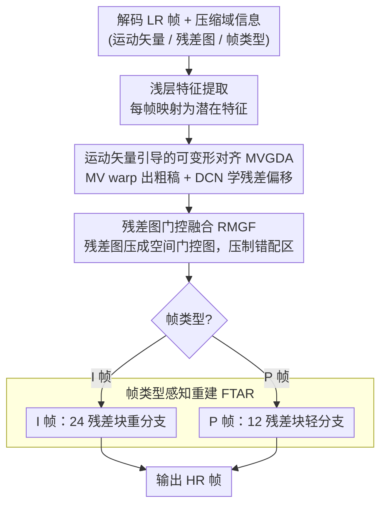

# Compressed-Domain-Aware Online Video Super-Resolution

**会议**: CVPR 2026  
**arXiv**: [2603.07694](https://arxiv.org/abs/2603.07694)  
**代码**: [https://github.com/sspBIT/CDA-VSR](https://github.com/sspBIT/CDA-VSR)  
**领域**: 视频生成  
**关键词**: 在线视频超分, 压缩域信息, 运动矢量, 可变形对齐, 帧类型感知

## 一句话总结
CDA-VSR 提出利用视频压缩域信息（运动矢量、残差图、帧类型）指导在线视频超分辨率的三个关键环节：运动矢量引导的可变形对齐实现高效精准配准、残差图门控融合抑制错配区域、帧类型感知重建自适应分配计算资源，在 REDS4 上以 93 FPS（>2倍于SOTA速度）达到最优 PSNR。

## 研究背景与动机

1. **领域现状**：在线视频超分辨率（Online VSR）要求在视频播放过程中实时重建当前帧，只能使用已有帧和当前帧信息。近年来的方法（如 TMP、DAP、MMVSR）通过改进对齐和融合模块提高了性能，但在更高分辨率（如 2K）下仍然难以满足实时要求。

2. **现有痛点**：(1) **运动估计计算密集**：基于光流的对齐方法（如 BasicVSR）精度高但计算开销大；隐式对齐方法（如 RRN）效率高但大运动下质量下降。(2) **连续帧冗余处理**：现有方法对所有帧使用相同的计算预算，导致对频繁出现的 P 帧产生不必要的冗余计算。(3) **信息浪费**：解码得到的压缩域信息（运动矢量、残差图、帧类型）白白丢弃，未被利用。

3. **核心矛盾**：在带宽受限的在线视频流中，视频经过下采样和压缩传输。解码端已有丰富的压缩域先验信息可以"免费"获取，但现有方法只使用解码后的低分辨率帧，忽视了这些有价值的辅助信息。

4. **本文目标** 如何为运动矢量、残差图、帧类型这三种不同特性的压缩域信息分别定制专用模块，在提升超分质量的同时大幅加速推理速度。

5. **切入角度**：在视频编解码的比特流中，运动矢量描述块级帧间运动（可替代光流的粗配准）、残差图反映运动补偿失败的区域（天然标记不可靠区域）、帧类型决定帧间参考关系（I帧需要高质量重建，P帧可轻量处理）。三者各有独特用途。

6. **核心 idea**：将压缩域的三类信息（运动矢量做粗对齐 → 残差图做质量门控 → 帧类型做计算分配）作为在线 VSR 的天然先验，让"免费"信息带来质量和速度的双重提升。

## 方法详解

### 整体框架
CDA-VSR 采用递归结构，接受解码后的低分辨率帧及压缩域信息（MV、残差图、帧类型）作为输入，输出高分辨率帧。流程为：(1) 浅层特征提取网络将每帧映射到潜在特征；(2) **MVGDA 模块**用运动矢量引导可变形卷积实现帧间对齐；(3) **RMGF 模块**用残差图生成空间权重进行选择性融合；(4) **FTAR 模块**根据帧类型选择不同深度的重建分支。整个管线保持因果约束（只用过去和当前帧）并满足实时处理需求。三类压缩域信息各喂给一个专用模块：运动矢量进 MVGDA、残差图进 RMGF、帧类型进 FTAR。

### 关键设计

**1. 运动矢量引导的可变形对齐（MVGDA）：让 MV 出粗稿、DCN 改细节，省掉光流估计这道昂贵工序**

对齐是 VSR 速度瓶颈所在：光流精度高但太慢，隐式对齐快却在大运动下崩。MVGDA 的取巧之处是把解码时本就拿得到的运动矢量当成"免费的粗稿"。第一步直接用 MV 把前帧特征 warp 过来做粗配准 $\bar{h}_{t-1} = \mathcal{W}(h_{t-1}; MV_{t-1 \to t})$，一举补偿掉大尺度的帧间位移。但 MV 是块级的——同一编码块内所有像素共享一个向量，物体边界和复杂运动处必然对不准。于是第二步把 MV 当作可变形卷积偏移量的初值 $o_{MV}$，只让一个轻量卷积网络去预测**局部残差偏移** $\Delta o$ 和调制掩码 $m$，最终对齐为

$$\hat{h}_{t-1} = \mathcal{D}(h_{t-1}; o_{MV} + \Delta o, m)$$

关键就在"残差"二字：DCN 不必从零估计完整运动，只需微调 MV 给的初值，偏移学习因此简单得多也稳得多。对齐同时作用在两种互补特征上——编码器的粗特征 $h^L$ 提供结构先验、重建模块的精细特征 $h^H$ 提供纹理细节，二者共用同一套 MV 引导。消融能看出这套分工的价值：只用 MV（OnlyMV）就比只用 DCN（OnlyDCN）高 0.24dB，可见压缩域运动先验本身已经很强；两者合起来再提 0.17dB，残差偏移补上了 MV 块级粒度的不足。

**2. 残差图门控融合（RMGF）：用编码器已经算好的残差图当"哪里别信前帧"的掩码**

对齐再准也有失败的地方——遮挡、旋转、复杂运动处前帧特征是错的，直接拼进来只会把错误传下去。RMGF 的观察是：编码器算出的残差图 $Res_t$ 恰好就是这张"不可靠地图"，它本来就是当前帧与其运动补偿预测之间的像素级差异，残差大的地方正是运动补偿失败的地方。方法只需一个轻量网络把残差图压成 $[0,1]$ 的空间门控图 $M_t = \sigma(\mathcal{F}_{res}(Res_t))$，再拿它去加权对齐后的前帧特征，可靠区放行、错配区压制：

$$h_t^f = \mathcal{C}^f([M_t \odot \hat{h}_{t-1}^L,\; M_t \odot \hat{h}_{t-1}^H,\; h_t^L])$$

门控热力图把这层意思画得很直白：稳定的车身拿到高权重，旋转的车轮被压下去。代价几乎可以忽略——只多了 0.02M 参数，却比无门控（NoGate）稳定高出 0.13dB。

**3. 帧类型感知重建（FTAR）：让占比 97% 的 P 帧走轻量分支，把算力省给真正关键的 I 帧**

在线 VSR 对每一帧一视同仁地花同样算力其实很浪费：P 帧只存增量更新、出现又频繁，重算一遍纯属冗余；I 帧承载完整空间信息、还是后续整段帧的参考，算少了会拖累整条序列。FTAR 干脆按帧类型分流——I 帧交给 24 个残差块的高容量分支 $\mathcal{R}_I$ 处理编码器特征 $h_t^L$，P 帧交给 12 个残差块的轻量分支 $\mathcal{R}_P$ 处理融合特征 $h_t^f$，推理时只激活当前帧类型对应的那一支。消融把这笔账算得很清楚：全用轻量（I=P=12）比 FTAR 低 0.16dB 却几乎不省时间（10.7ms vs 10.8ms），全用重量（I=P=24）只多 0.04dB 却让延迟暴涨 57%（16.8ms）；FTAR 的 I=24/P=12 恰好卡在拐点上，多花 0.1ms 就拿到了全重量方案约八成的质量收益。

### 损失函数 / 训练策略
使用 Charbonnier Loss：$\mathcal{L} = \frac{1}{T}\sum_{t=1}^T \sqrt{(I_t^{SR} - I_t^{GT})^2 + \epsilon^2}$。输入为 H.264 编码的低分辨率视频帧（CRF 18/23/28），采用 4 倍上采样。训练 300K 迭代，batch size 8，15帧clips，64×64 随机裁剪。Adam 优化器，初始学习率 $2 \times 10^{-4}$，余弦退火调度。单卡 RTX 3090 训练。

## 实验关键数据

### 主实验

| 数据集/方法 | PSNR(CRF18) | PSNR(CRF28) | FPS | MACs(G) | 实时性 |
|------------|-------------|-------------|-----|---------|--------|
| CDA-VSR | **27.76** | **25.30** | **93** | **78** | 游戏实时 ✓ |
| TMP | 27.68 | 25.17 | 45 | 176 | 电影实时 ✓ |
| BasicVSR* | 27.63 | 25.13 | 29 | 254 | 电影实时 ✓ |
| KSNet-uni | 27.58 | 25.12 | 34 | 148 | 电影实时 ✓ |
| RRN | 27.10 | 24.96 | 59 | 193 | 电影实时 ✓ |

Inter4K 2K分辨率：CDA-VSR 29.98dB / 25.1 FPS（唯一超过24 FPS的方法），TMP 29.76dB / 11.4 FPS。

### 消融实验

| 配置 | PSNR(CRF18) | 运行时间(ms) | 说明 |
|------|------------|-------------|------|
| OnlyMV | 27.59 | 10.2 | 仅运动矢量粗配准 |
| OnlyDCN | 27.35 | 10.6 | 仅可变形卷积 |
| OnlyGL (光流) | 27.73 | 15.5 | 仅光流对齐，1.4倍延迟 |
| **MVGDA** | **27.76** | **10.8** | 质量最优且高效 |
| NoGate | 27.63 | 10.8 | 无残差图门控 |
| **RMGF** | **27.76** | **10.8** | 门控融合提升0.13dB |
| I=12, P=12 | 27.60 | 10.7 | 统一轻量重建 |
| I=24, P=24 | 27.80 | 16.8 | 统一重量重建 |
| **I=24, P=12 (FTAR)** | **27.76** | **10.8** | 自适应分配 |

### 关键发现
- **MV引导远优于纯DCN**：OnlyMV 比 OnlyDCN 高 0.24dB，说明压缩域运动矢量提供了强大的运动先验，特别是对大运动场景。MVGDA 结合两者进一步提升 0.17dB，说明残差偏移学习可以修正 MV 的块级不精确性
- **残差图是天然的可靠性指标**：RMGF 相比 NoGate 在三个 CRF 下一致提升 0.08-0.13dB，且几乎零额外开销（仅增加 0.02M 参数）
- **FTAR 是效率的关键**：I=24,P=12 的 FTAR 配置几乎零延迟代价（+0.1ms）获取了统一重量方案约80%的质量提升。这说明对 P 帧的冗余计算确实可以安全移除
- **2K分辨率优势放大**：CDA-VSR 是 Inter4K 2K 上唯一达到电影实时（>24 FPS）的方法（25.1 vs TMP 11.4），效率优势随分辨率增加而放大
- **压缩强度敏感性**：CDA-VSR 在所有 CRF 级别（18/23/28）下都保持最优，但高压缩（CRF28）下绝对提升更大（+0.13dB vs TMP），说明压缩域信息在高压缩率下更有价值

## 亮点与洞察
- **"免费午餐"的设计哲学**：运动矢量、残差图、帧类型都是解码比特流时的"副产品"，零额外计算即可获取。将这些信息重新利用而非丢弃，是一种优雅的系统级思维。这个思路可以迁移到视频编辑、视频分析等其他需要处理压缩视频的任务
- **MV+DCN的互补设计**：用 MV 处理大尺度全局运动（粗配准），DCN 只负责局部残差修正——这种分工让 DCN 的偏移学习变得更简单、更稳定。热力图可视化清晰展示了 MVGDA 最干净的对齐效果
- **帧类型感知的差异化处理**：I/P 帧的不同计算预算分配是一个简单但有效的思路。97%的帧（P帧）走轻量路径带来了巨大的整体加速，而3%的 I 帧走重量路径保证了参考质量

## 局限与展望
- **仅支持 H.264**：论文仅在 H.264 编码的视频上验证，未测试 H.265/VVC/AV1 等现代编解码器的运动矢量质量差异
- **GOP结构固定**：假设标准的 I-P 帧结构，未涉及 B 帧处理（虽然在线场景不需要B帧）
- **运动矢量质量依赖**：MV 在低码率下精度下降，可能影响对齐质量。论文未分析极低码率场景
- **未利用量化参数（QP）信息**：比特流中还有 QP map 等信息未被利用，可作为压缩质量的额外先验
- **两分支结构增加参数量**：虽然推理时仅激活一个分支，但参数总量（3.3M）略高于部分对比方法

## 相关工作与启发
- **vs TMP**: TMP 利用帧间运动连续性传播偏移量，但仍基于纯 LR 帧估计运动。CDA-VSR 直接使用比特流中的 MV 作为粗运动先验，减少了运动估计的计算负担，同时在所有 CRF 下一致超越 TMP
- **vs CDVSR/CIAF**: 先前的压缩域 VSR 方法虽然也使用 MV 和残差图，但并非为在线场景设计，推理速度不满足实时要求。CDA-VSR 专门针对在线约束设计了帧类型感知的差异化处理策略
- **vs BasicVSR***: BasicVSR* 是去掉反向传播分支的 BasicVSR，满足在线因果约束但仍偏慢（29 FPS）。CDA-VSR 速度是其3倍以上同时 PSNR 还高 0.13dB

## 评分
- 新颖性: ⭐⭐⭐ 利用压缩域信息的思路不算全新，但三种信息的定制化模块设计有工程创新
- 实验充分度: ⭐⭐⭐⭐ 多CRF级别、多分辨率、多方法对比完整，消融和可视化充分
- 写作质量: ⭐⭐⭐⭐ 结构清晰，动机和方法对应良好
- 价值: ⭐⭐⭐⭐ 对实际在线视频流超分有直接工程价值，2K实时是显著突破

<!-- RELATED:START -->

## 相关论文

- [\[CVPR 2026\] STCDiT: Spatio-Temporally Consistent Diffusion Transformer for High-Quality Video Super-Resolution](stcdit_spatio-temporally_consistent_diffusion_transformer_for_high-quality_video.md)
- [\[ICCV 2025\] VSRM: A Robust Mamba-Based Framework for Video Super-Resolution](../../ICCV2025/video_generation/vsrm_a_robust_mamba-based_framework_for_video_super-resolution.md)
- [\[CVPR 2026\] Latent-Compressed Variational Autoencoder for Video Diffusion Models](latent-compressed_variational_autoencoder_for_video_diffusion_models.md)
- [\[CVPR 2025\] VideoGigaGAN: Towards Detail-rich Video Super-Resolution](../../CVPR2025/video_generation/videogigagan_towards_detail-rich_video_super-resolution.md)
- [\[CVPR 2025\] PatchVSR: Breaking Video Diffusion Resolution Limits with Patch-Wise Video Super-Resolution](../../CVPR2025/video_generation/patchvsr_breaking_video_diffusion_resolution_limits_with_patch-wise_video_super-.md)

<!-- RELATED:END -->
