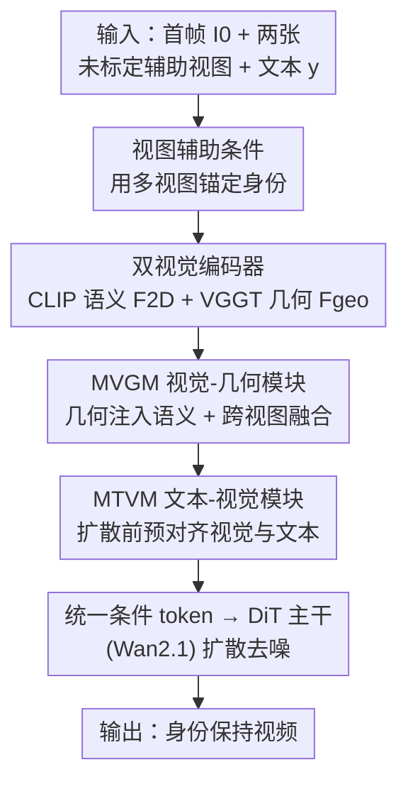

# ConsID-Gen: View-Consistent and Identity-Preserving Image-to-Video Generation

**会议**: CVPR 2026  
**论文**: [CVF Open Access](https://openaccess.thecvf.com/content/CVPR2026/html/Wu_ConsID-Gen_View-Consistent_and_Identity-Preserving_Image-to-Video_Generation_CVPR_2026_paper.html)  
**代码**: https://myangwu.github.io/ConsID-Gen （项目页）  
**领域**: 图像到视频生成 / 扩散模型  
**关键词**: 图像到视频生成, 身份保持, 多视图一致性, 几何编码, 扩散Transformer  

## 一句话总结
针对图像到视频（I2V）生成中刚性物体在视角变化下出现的外观漂移与几何畸变，ConsID-Gen 从数据与模型两端入手：构建大规模物体中心数据集 ConsIDVid 与多视图一致性评测 ConsIDVid-Bench，并提出一个"视图辅助"框架——给首帧补两张未标定辅助视图、用 2D 语义 + VGGT 几何双流编码、在扩散前把视觉与文本预对齐，从而在身份保真度和几何稳定性上超过 Wan2.1/Wan2.2/HunyuanVideo。

## 研究背景与动机
**领域现状**：基于扩散 Transformer（DiT）的视频生成已经能从文本、图像或两者合成高分辨率、时序连贯的视频。其中 I2V（给一张参考图 + 一句文本指令，把静帧动画化）对电商、产品广告等场景特别有价值——一张商品目录照就能转成多段展示视频，前提是"长得必须一模一样"。

**现有痛点**：现有 I2V 系统（Wan2.1、ConsistI2V、CogVideoX-I2V 等）在视角变化下频繁出现外观漂移和几何畸变：身份偏移、形状扭曲、部件融合或消失、材质纹理逐帧悄悄变化。论文图 1 里玻璃制品会逐渐失去刚性"糊"在一起，这种实例级一致性的崩坏在电商、产品广告等高风险场景里是致命的。

**核心矛盾**：作者把病根归结为两点——**单视图 2D 观测太稀疏**（CLIP 这类 2D 编码器擅长高层识别，但欠表达细粒度结构，时序合成时模型只能"脑补"缺失的空间细节，误差逐帧累积）；以及**跨模态对齐太弱**（主流管线把文本和图像分开编码，到网络很后期才简单拼接融合）。一个有力的旁证：T2V 模型在身份保持上反而稳过 I2V（Wan2.1 的 T2V→I2V 身份分从 96.72 掉到 91.84），因为 T2V 不需要在稀疏视觉与文本表示之间做对齐。

**本文目标**：在视角/物体运动下，让生成视频既保住物体的几何，又保住外观纹理；同时给这件事提供一个能量化"细微几何漂移"的评测。

**切入角度**：既然单视图欠约束，就用同一物体的**未标定多视图**把形状和外观锚住；既然后期融合对齐弱，就把文本-视觉的对齐**提前到扩散之前**做细粒度交互。

**核心 idea**：用"多视图几何先验 + 扩散前预对齐的统一条件表示"替代"单视图 + 后期拼接"，从数据和模型两端同时治外观漂移。

## 方法详解

### 整体框架
ConsID-Gen 的输入是三件套：首帧 $I_0$、两张同一物体的未标定辅助视图 $V=\{V_1,V_2\}$、文本指令 $y$；输出是时序连贯、身份保持的视频 $X=\{X_t\}_{t=1}^{T}$。整条管线在 Wan2.1-Fun-1.3B-InP 基础上搭建，核心是把"视觉条件"做厚做对齐：先用**双视觉编码器**分别抽 2D 语义和多视图几何，再用**统一文本-视觉交互投影器**（含 MVGM + MTVM 两个 MMDiT 风格模块）把几何注入语义、再把视觉与文本对齐，产出统一的条件 token 喂给 DiT 主干做扩散。数据侧则由 ConsIDVid 数据集与 ConsIDVid-Bench 评测托底。

### 关键设计

**1. 视图辅助条件：用未标定多视图把单帧"补厚"**

针对"单视图 2D 观测稀疏、模型只能脑补缺失结构"这个根因，ConsID-Gen 不再只喂一张首帧，而是额外给同一物体的两张**未标定（unposed）辅助视图** $V=\{V_1,V_2\}$。这些视图不需要相机位姿标注，却能提供首帧看不到的侧面/背面结构线索，让模型对物体几何与外观建立一个更稳的"身份表示"，从而约束住后续帧不漂移。这一步是几何稳定性的源头——消融里单加几何编码器几乎没用（见下），但**叠加多视图辅助图后身份分明显上去**，说明真正起作用的是"多视图带来的结构约束"，而非编码器本身。数据侧能这么做，靠的是 ConsIDVid 里大量自带未标定多视图的电商 UGC 与 MVImgNet2.0 合成序列。

**2. 双视觉编码器：2D 语义流 + VGGT 几何流并行**

外观漂移的另一半是"2D 特征欠表达结构"。ConsID-Gen 用两条互补的视觉流解决：语义流用 CLIP 风格的 2D 编码器 $E_{2D}$ 从首帧抽外观 token

$$F_{2D}=E_{2D}(I_0),\quad F_{2D}\in\mathbb{R}^{\lfloor H/p_{2D}\rfloor\times\lfloor W/p_{2D}\rfloor\times d_{2D}}$$

提供高层外观先验；几何流用预训练的 VGGT 作为几何骨干 $E_{geo}$，对包含首帧在内的视图集 $\tilde V=\{I_0,V_1,V_2\}$ 做逐帧与全局自注意力交替，抽出稠密的几何感知 token

$$F_{geo}=E_{geo}(\tilde V),\quad F_{geo}\in\mathbb{R}^{3\times\lfloor H/p_{geo}\rfloor\times\lfloor W/p_{geo}\rfloor\times d_{geo}}$$

注意几何流处理的是 3 张图（首帧 + 两辅助视图），这样 $F_{geo}$ 天然携带了跨视图的结构信息，与设计 1 的多视图思路在编码层面闭环。两路 token 都保留稠密形式，留给下游融合。

**3. 统一文本-视觉交互投影器：把对齐提前到扩散之前**

针对"跨模态后期拼接、对齐太弱"，作者设计连接器 $g_\phi$，用两个 MMDiT 风格的双流注意力模块把对齐做在扩散前。先是 **MVGM（Multi-Modal Visual–Geometric Module）**：借鉴 MMDiT 在视觉-文本上的双流对齐范式，把它迁到"视觉-几何"域——通过双流注意力让外观 token $F_{2D}$ 与几何 token $F_{geo}$ 双向交互（几何把结构注入语义），同时两张辅助视图 $V$ 的几何特征再以**交叉注意力**并入 MVGM 输出，强化空间与几何一致性。随后是 **MTVM（Multi-Modal Text–Visual Module）**：在已融合的视觉-几何表示之上，用双流注意力做视觉与语言的细粒度对齐——文本特征动态调制视觉流（控制全局动态/相机运动），视觉表示反过来给文本补充线索。这套"先预对齐再投影"正是论文图 2 里区别于单流（T2V，仅文本）和普通双流（I2V，文本+2D 弱交互）的"混合表示（Hybrid）"，最终产出统一条件 token 喂给 DiT 主干 $f_\theta$。

**4. ConsIDVid 数据集 + ConsIDVid-Bench 多视图一致性评测：把"身份漂移"变成可度量的问题**

模型再好也需要数据和评测托底。先前的外观保持方法只在 ~600 段最小整理的视频上训练、且用偏语义质量的 benchmark（如 VBench）评估，看不出几何/身份是否守住。ConsIDVid 从三类来源汇集：现成物体中心数据集（Co3D / OmniObject3D / Objectron）、80+ 小时电商单品 UGC（很多自带未标定多视图）、以及由 MVImgNet2.0 多视图取首尾帧插值合成的序列；再经一条可扩展的自动管线过滤——时长/分辨率（≥81 帧、≥320p）、亮度与模糊（剪掉 luminance 与 Laplacian 方差分布的上下 5%）、语义感知切分（先检测镜头边界再按帧嵌入相似度缝合，纠正过切）、美学（LAION-5B 美学分 <3.0 丢弃），图像侧还做 MD5 去重、OCR 抑制（检测到 >30 字符丢弃）、CLIP+DBSCAN 离群剔除。配套的**分层字幕**用 Qwen2.5-VL 两阶段产出：阶段一只描述主物体可见属性（类别/颜色/材质/形状/尺寸/部件/磨损/文字，禁止写相机和背景），阶段二在此之上融合相机运动、人物-物体交互等动态。评测侧 ConsIDVid-Bench 把视频评价**重构成多视图一致性问题**，用四个对几何/外观敏感的指标：Chamfer Distance（输入与合成视图重建的 3D 点集间的倒角距离，测全局形状对齐与几何稳定）、MEt3R（用 DUSt3R 做稠密成对重建、投影后测跨视图特征相似度）、Video Similarity（CLIP，测全局真实感与内容一致）、Object Similarity（在分割物体上用 DINO 特征测身份保持）。

### 损失函数 / 训练策略
基座为 Wan2.1-Fun-1.3B-InP（输出 81 帧、832×480）。AdamW，学习率 $10^{-4}$，per-GPU batch=1、梯度累积 4 步（等效 batch=4），训练 33K 步，全程 NVIDIA A100(80GB)。推理用 50 步采样、CFG=5。

## 实验关键数据

### 主实验
评测集 ConsIDVid-Bench 分两子集：proprietary（241 段电商商品视频）与 public（370 段，来自现成物体中心数据集 + 合成）。指标取自 VBench-I2V 套件加几何感知指标。下表为 proprietary 子集主结果（CD、MEt3R 越低越好）：

| 方法 | Subject Cons. | Background Cons. | Video Sim. | Object Sim. | Chamfer Dist.↓ | MEt3R↓ |
|------|------|------|------|------|------|------|
| Wan2.1-1.3B | 91.03 | 94.57 | 87.15 | 66.9 | 0.1064 | 0.1401 |
| Wan2.2-5B | 91.99 | 94.82 | **88.69** | 68.6 | 0.0921 | 0.1826 |
| HunyuanVideo | 90.40 | 93.27 | 86.59 | 64.3 | 0.1017 | 0.2270 |
| Wan2.1-14B | 90.37 | 94.14 | 87.33 | 67.9 | **0.0866** | 0.1572 |
| **ConsID-Gen (1.3B)** | **95.30** | **96.10** | 88.65 | **69.2** | 0.0996 | **0.0978** |

ConsID-Gen 在身份/几何相关指标上几乎全面领先：Subject Consistency 比强基线 Wan2.2 高约 3.6%，几何感知的 MEt3R 大幅最低（论文称相对 +30.2%），仅 Video Similarity 略输 Wan2.2、Chamfer 略输 Wan2.1-14B（注意它只有 1.3B 参数，对手是 5B/14B）。public 子集上 ConsID-Gen 拿下 Chamfer 与 Video Similarity 最优，但 I2V Subject/Background 略逊——作者归因于一个具体伪影：输入含干扰结构（如网格纸）时生成偶尔会退化/坍塌（⚠️ 细节在补充材料，正文未展开）。

### 消融实验
消融受算力限制，用 50% 训练数据微调、在随机 60 段子集上评测：

| 配置 | I2V-Subj | I2V-Back | Subj-Cons. | Back-Cons. | Video-Sim. |
|------|------|------|------|------|------|
| Baseline | 96.30 | 97.16 | 90.83 | 94.97 | 87.75 |
| + Geo Enc. | 96.29 | 97.37 | 89.65 | 93.44 | 86.19 |
| + View-Asst. | 96.97 | 97.85 | 91.87 | 94.33 | 87.35 |
| ConsID-Gen (full) | **98.48** | **98.85** | **95.13** | **96.20** | **88.25** |

### 关键发现
- **单加几何编码器几乎没用**：`+ Geo Enc.` 相比 Baseline 多数指标甚至略降（Subj-Cons. 90.83→89.65、Video-Sim. 87.75→86.19），说明几何骨干本身不是银弹。
- **多视图辅助图才是关键拐点**：叠加 `+ View-Asst.` 后各项明显回升，印证了"真正起约束作用的是多视图带来的结构先验"。
- **文本-视觉融合保住长程身份**：图 7 显示直接微调 Wan2.1 在视频早期帧就身份漂移，加几何+多视图能缓解，但只有完整模型（含 MTVM 文本-视觉融合）才能在第 60 帧仍保持一致——对长时序身份稳定贡献最大的是完整的预对齐投影器。

## 亮点与洞察
- **用 T2V vs I2V 的反直觉差距定位病根**：表 1 显示 T2V 身份分反而高于 I2V，作者据此推断"对齐是瓶颈"，再用"扩散前预对齐"对症下药——这种"用对照实验反推架构缺陷"的论证方式很有说服力。
- **未标定多视图是低成本强先验**：不需要相机位姿标注就能把单视图欠约束补上，且数据侧电商 UGC 天然自带多视图，方法与数据闭环，工程上可落地。
- **把视频质量评测重构成多视图一致性问题**：用 Chamfer/MEt3R 这类 3D 重建指标量化"细微几何漂移"，比 VBench 的语义分更能戳中身份保持，这套评测思路可迁移到任何"实例级一致性"的生成任务。
- **几何编码器要配多视图才有效**：消融揭示"加了 VGGT 但不给多视图等于白加"，提醒做几何增强时别只换骨干、要给它真正能用上的多视图输入。

## 局限性 / 可改进方向
- **对干扰结构脆弱**：输入含网格纸等干扰背景时生成会退化/坍塌，public 子集 I2V Subject/Background 因此逊于对手，鲁棒性有待加强。
- **仅限刚性物体**：方法围绕"刚性物体在视角变化下的身份保持"设计，对可形变物体（布料、人物动作）能否成立未验证。
- **依赖额外多视图输入**：推理时需要同物体的两张辅助视图，纯单图场景（用户只有一张图）不直接适用，可考虑用生成式补视图来放宽这一约束。
- **消融用半量数据**：因算力受限，消融在 50% 数据 + 60 段子集上做，结论的统计稳健性有折扣（⚠️ 以原文为准）。

## 相关工作与启发
- **vs Wan2.1 / Wan2.2（基座 I2V）**: 它们用 mask 引导条件 + 解耦交叉注意力注入图像 embedding，文本与图像后期融合；ConsID-Gen 在 Wan2.1 上加双视觉编码 + 扩散前预对齐，几何一致性（MEt3R）大幅领先，且只用 1.3B 就胜过 5B/14B。
- **vs ConsistI2V**: ConsistI2V 靠首帧时空注意力 + 频率感知噪声初始化提升时序连贯，仍是单视图 2D 路线；ConsID-Gen 引入多视图几何先验，专攻视角变化下的身份/几何，几何指标显著更优。
- **vs 早期外观保持方法**（如 ~600 段小数据集训练）: 它们数据规模小、评测偏语义质量；ConsID-Gen 用大规模 ConsIDVid + 几何感知 benchmark 把问题做实，泛化到真实电商场景。

## 评分
- 新颖性: ⭐⭐⭐⭐ 多视图几何先验 + 扩散前预对齐的组合切中 I2V 身份漂移痛点，配套数据集与几何评测成体系
- 实验充分度: ⭐⭐⭐⭐ 双子集对比 7 个基线 + 几何指标 + 消融 + 人评，较全面；消融受算力限制用半量数据略减分
- 写作质量: ⭐⭐⭐⭐ 病因诊断（稀疏 2D + 弱对齐）到方法对应清晰，图 2 范式对比直观
- 价值: ⭐⭐⭐⭐ 直击电商/产品视频的身份保持刚需，1.3B 胜大模型，工程落地性强

<!-- RELATED:START -->

## 相关论文

- [\[CVPR 2026\] Identity-Preserving Image-to-Video Generation via Reward-Guided Optimization](identity-preserving_image-to-video_generation_via_reward-guided_optimization.md)
- [\[CVPR 2026\] EvoID: Reinforced Evolution for Identity-Preserving Video Generation](evoid_reinforced_evolution_for_identity-preserving_video_generation.md)
- [\[CVPR 2026\] PLACID: Identity-Preserving Multi-Object Compositing via Video Diffusion with Synthetic Trajectories](placid_identity-preserving_multi-object_compositing_via_video_diffusion_with_syn.md)
- [\[CVPR 2026\] Stand-In: A Lightweight and Plug-and-Play Identity Control for Video Generation](stand-in_a_lightweight_and_plug-and-play_identity_control_for_video_generation.md)
- [\[CVPR 2026\] Towards Realistic and Consistent Orbital Video Generation via 3D Foundation Priors](orbital_video_3d_foundation_priors.md)

<!-- RELATED:END -->
