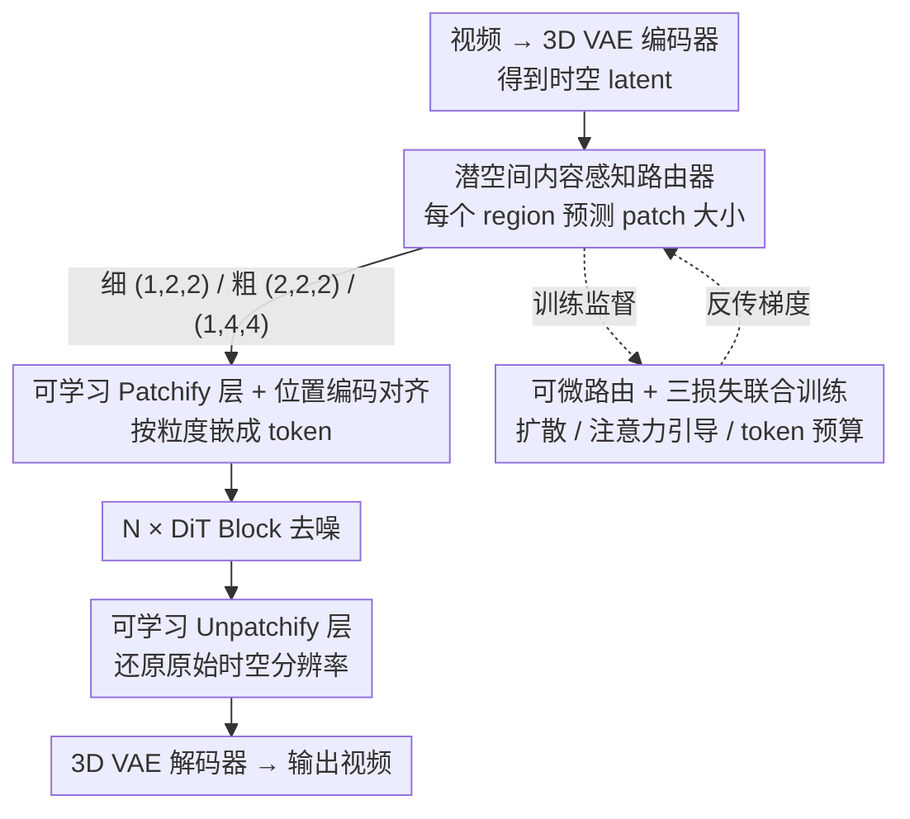

# Content-Aware Dynamic Patchification for Efficient Video Diffusion

**会议**: CVPR 2026  
**论文**: [CVF Open Access](https://openaccess.thecvf.com/content/CVPR2026/html/Li_Content-Aware_Dynamic_Patchification_for_Efficient_Video_Diffusion_CVPR_2026_paper.html)  
**代码**: https://shengli99.github.io/DynaPatch/ (项目页)  
**领域**: 视频生成 / 扩散模型效率  
**关键词**: 动态分块, 视频扩散, DiT 加速, 路由器, Token 削减

## 一句话总结
DynaPatch 在 3D VAE 潜空间里用一个轻量路由器为每个时空区域**自适应选 patch 大小**（细节区给小 patch、静态区给大 patch），并与扩散模型联合端到端训练，从 token 创建阶段就削减冗余计算，在 VBench 上以 30% token 削减拿到 83.42 总分、实现 1.3–1.8× 加速且画质几乎无损。

## 研究背景与动机
**领域现状**：基于 Diffusion Transformer (DiT) 的视频生成模型（如 HunyuanVideo）质量很强，但要把 3D VAE 编码出的时空 latent 切成 token 喂给 DiT。主流做法是**均匀分块（uniform patchification）**——不管内容是什么，全图全帧都用同一个固定 patch 大小（如 (1,2,2)）切成等密度 token。

**现有痛点**：真实视频里静态背景、平滑区域、低运动区和高动态、语义丰富区被一视同仁地用同样的细粒度 token 表示，产生大量冗余 token。而 DiT 的自注意力是 token 数的二次复杂度，生成一段 5 秒 720p 视频在 8×A100 上要 300 秒以上，token 冗余直接转化为算力浪费。

**核心矛盾**：小 patch 保细节但 token 多、算力高；大 patch 省算力但丢细节——细节与效率之间存在 trade-off。已有的省 token 方法多是在 **token 创建之后**做 merging/pruning，而真正的源头——分块本身却是 content-agnostic 的。

**已有自适应方法的不足**：Lumina-Video、FlexiDiT 按**扩散 timestep** 调 patch 大小；CAT 用 LLM 估计文本 prompt 复杂度后给**整段视频**定一个全局 patch 大小——这些都是给「一整帧 / 一个 timestep」分配单一 patch，忽略了帧内空间和帧间时间的细粒度差异。APT/D2iT 进一步做到 region 级，但靠 image-space **熵（entropy）** 这种启发式信号；D2iT 虽然训了个 router，却完全用熵 map 当监督标签，**没和生成目标联合优化**，路由决策未必对扩散有利。

**核心 idea**：直接在 3D VAE 的时空 latent 上做**细粒度、内容感知**的 region-wise 动态分块，用一个轻量路由器预测每块的 patch 大小，并让它和扩散模型**端到端联合训练**（被扩散 loss 直接监督），让「省哪里、留哪里」由生成质量本身说了算，而不是靠熵这类代理信号。

## 方法详解

### 整体框架
DynaPatch 在标准 DiT 视频生成管线里插入一个「路由 + 可学习分块」的旁路，输入是 3D VAE 编码出的带噪时空 latent，输出是 DiT 去噪后、再被还原回原始分辨率的 latent，整体不改 DiT backbone 结构。

推理时的数据流是：3D VAE 编码器把视频压成时空 latent → 路由器把 latent 划成固定大小的时空 region，为每个 region 预测一个 patch 大小（三选一）→ 对应的 **patchify 层**按路由结果把每个 region 嵌成不同粒度的 token → token 序列进 N 个 DiT block 去噪 → 对应的 **unpatchify 层**把 token 还原回原始时空分辨率的 latent → 3D VAE 解码器重建出视频。关键在于：复杂/运动区域走细 patch (1,2,2) 保分辨率，冗余/静态区域走粗 patch (2,2,2) 或 (1,4,4) 省 token，而最终 latent 分辨率必须复原，才能让下游 VAE 解码器正常工作。

训练时在这条推理链上再挂三个 loss（扩散 loss + 注意力引导 loss + token 预算 loss）共同优化路由器、patchify/unpatchify 层和 DiT。

### 关键设计

**1. 潜空间内容感知路由器：让"省哪里"由生成目标决定，而非熵启发式**

针对「现有 region 级方法靠熵 map 监督、与扩散目标脱节」的痛点，DynaPatch 用一个**三层 MLP（隐藏维 1024）** 当路由器，直接吃 3D VAE 编出的时空 latent。选 MLP 而非单层线性是为了有足够容量建模区域语义，又比注意力路由便宜（避免 token 间二次复杂度）。路由器把 latent map 切成固定大小的时空 region，region 尺寸由**最粗的候选 patch 决定**——例如候选集 $\{(1,2,2),(2,2,2),(1,4,4)\}$ 下，region 形状取 $(2,4,4)$，保证每个 region 都能被灵活路由到任意候选 patch。

一个巧妙之处是路由器**不显式吃 timestep**：因为它处理的是带噪 latent，而噪声水平本身就与 timestep 相关、已隐含在输入里，所以路由器会自然地在高噪早期选粗 patch、随去噪推进逐渐转向细 patch（论文 Fig.3 显示 token 削减率随去噪步递减），不需要额外的 timestep embedding。输出空间被刻意限制为三个 patch 大小：更大的如 (2,8,8) 会过粗、伤时间一致性，即便加进候选也几乎不被选——小而精的候选集让路由稳定高效。

**2. 可学习 patchify/unpatchify 层 + 位置编码平均对齐：让变粒度 token 不丢时空关系**

不同 region 的 patch 大小不同，意味着每个 token 对应的 latent 像素数不一样，直接套固定 patch embedding 会破坏 token 间的时空对应。DynaPatch 给每个候选 patch 大小配一对**单层线性的 patchify / unpatchify 层**：patchify 按路由结果把 latent region 嵌成 token，DiT 处理完后 unpatchify 再把 token 投影回 latent 并复原到原始时空分辨率。这些层完全可学习，和路由器、DiT backbone 一起训练，因此能无缝接进现成 DiT 而不改其结构。

位置编码的处理是另一个关键细节：PE 先在**最细粒度 (1,2,2)** 上、覆盖整个时空网格生成；粗 patch 的 PE 由它内部所有细粒度 patch 的 PE **平均**得到：

$$\text{PE}_{\text{coarse}} = \frac{1}{N}\sum_{i=1}^{N}\text{PE}_{\text{fine},i}$$

其中 $N$ 是该粗 patch 内最细 patch 的个数（如一个 (1,4,4) patch 由 4 个 (1,2,2) patch 平均）。这样不同粒度的 token 共享一致的位置空间，又保留了相对时空位置，DiT 才能生成连贯结果。

**3. 直通 Gumbel-Softmax 可微路由：让离散的"选哪个 patch"能被扩散 loss 反传**

路由决策是离散的（三选一），不可导，扩散 loss 没法直接传到路由器。DynaPatch 用 **Straight-Through Gumbel-Softmax** 做可微松弛。路由器对每个 region 先输出 $K$ 个 patch 候选的 logits $S\in\mathbb{R}^K$，加 Gumbel 噪声后过带温度的 softmax 得到软概率：

$$y_{\text{soft}} = \text{Softmax}\!\left(\frac{S+g}{\tau}\right)$$

前向用 $\text{argmax}(y_{\text{soft}})$ 取 one-hot 硬决策 $y_{\text{hard}}$，再用直通估计器（STE）让梯度绕过离散操作：

$$y_{\text{STE}} = y_{\text{hard}} - (y_{\text{soft}})_{\text{detached}} + y_{\text{soft}}$$

前向时 $y_{\text{STE}}$ 数值上等于 $y_{\text{hard}}$（被选 patch 处为 1，保证 token embedding 信号不被缩放），反传时梯度沿未 detach 的 $y_{\text{soft}}$ 流回路由器。温度 $\tau$ 按训练进度线性退火，$\tau_{\text{current}} = \max(\tau_{\min}, \tau_{\text{initial}}\times(1-\frac{\text{step}}{\text{total steps}}))$，其中 $\tau_{\text{initial}}=1$、$\tau_{\min}=0.2$——早期高温多探索、后期低温趋确定，让路由决策逐步收敛。

**4. 三损失联合训练：扩散 + 注意力引导 + token 预算，三者各管一件事**

路由器的训练由三个 loss 加权组成：

$$\mathcal{L}_{\text{total}} = \mathcal{L}_{\text{diffusion}} + \lambda_{\text{attn}}\mathcal{L}_{\text{attn-guided}} + \lambda_{\text{budget}}\mathcal{L}_{\text{budget}}$$

**扩散 loss** 让路由决策服务于生成质量（通过设计 3 的可微路由反传）。**注意力引导 loss** 给路由注入语义先验：把路由器选最细 patch (1,2,2) 的软概率，与 DiT 注意力图聚合出的 region 级显著图对齐，用余弦相似度度量 $\mathcal{L}_{\text{attn-guided}} = 1 - \text{Cosine}(y^{(1,2,2)}_{\text{soft}}, \text{attention map})$，鼓励高显著区域拿细 patch。这里有两个细节：① 该 loss **只更新路由器、不更新 DiT**，避免扭曲 DiT 原生注意力；② 为避免「所有层头平均注意力有时噪声大」的问题，作者用 U2-Net 显著检测器在 100 个采样视频上做**数据驱动的 layer–head 筛选**，挑出与显著图最相似的 top-4 层、再在层内挑 top-4 头，用这些层头对构造监督；③ 高 timestep 噪声大、注意力不可靠，所以注意力引导只在低 timestep（如 $t<500$，训练 $T=1000$）启用。**token 预算 loss** 防止路由器只选粗或只选细，用可微的软概率近似 token 数：

$$\mathcal{L}_{\text{budget}} = \left(\frac{1}{N}\sum_{i=1}^{N}\sum_{k}\big(y^{(k)}_{\text{soft},i}\cdot C_k\big) - r_{\text{target}}\right)^2$$

其中 $C_k$ 是 patch 大小 $k$ 相对 baseline (1,2,2) 的代价比（如 (1,4,4) 的 $C_k=\frac14$），$r_{\text{target}}$ 是目标 token 预算比。这是**软约束**——不硬卡固定比例，给路由器按内容复杂度自由调 token 数的余地。论文中 $\lambda_{\text{attn}}=\lambda_{\text{budget}}=0.5$。

## 实验关键数据

### 主实验
基座为 Adobe 内部 2B 参数、28 层 DiT 视频模型（50 步采样），在 19M 视频-文本对上训 20000 步，默认 360p 分辨率，8×A100 (80GB)，按 VBench 标准协议评测。Baseline 是全用最细 patch (1,2,2)。对比 FlexiDiT（timestep 级路由）、D2iT（熵 map 路由）、SPViT（注意力 token pruning，T2V 下只跳过计算不物理删 token）。

| Token 削减率 | 方法 | Total Score ↑ | Quality ↑ | Semantic ↑ | 加速 ↑ |
|------|------|------|------|------|------|
| — | Baseline | 83.61 | 84.87 | 78.59 | 1.0× |
| 20% | FlexiDiT | 81.80 | 83.22 | 76.10 | 1.3× |
| 20% | D2iT | 81.84 | 83.42 | 75.51 | 1.2× |
| 20% | SPViT | 81.23 | 82.95 | 74.36 | 1.3× |
| 20% | **DynaPatch** | **83.56** | **84.79** | **78.62** | 1.3× |
| 30% | FlexiDiT | 80.25 | 82.02 | 73.19 | 1.5× |
| 30% | D2iT | 81.08 | 82.85 | 74.02 | 1.4× |
| 30% | SPViT | 79.20 | 81.21 | 71.18 | 1.5× |
| 30% | **DynaPatch** | **83.42** | **84.68** | **78.36** | 1.5× |
| 40% | FlexiDiT | 79.67 | 81.94 | 70.60 | 1.8× |
| 40% | D2iT | 78.38 | 80.12 | 71.44 | 1.7× |
| 40% | SPViT | 78.34 | 80.30 | 70.51 | 1.7× |
| 40% | **DynaPatch** | **82.19** | **83.92** | **75.29** | 1.8× |

在所有削减率下 DynaPatch 全面领先三个对手，且差距随削减率增大而拉开：40% 削减时 DynaPatch 82.19，比次优的 D2iT (78.38) 高近 4 分，而 Semantic Score（语义对齐）领先更明显（75.29 vs 71.44）。30% 削减时总分仅比 baseline 掉 0.19（83.42 vs 83.61）却换来 1.5× 加速。

### 消融实验（注意力引导 loss）

| Token 削减率 | 配置 | Total Score ↑ | 加速 ↑ |
|------|------|------|------|
| — | Baseline | 83.61 | 1.0× |
| 20% | w/o Attn-guide | 82.28 | 1.3× |
| 20% | w/ Attn-guide | **83.56** | 1.3× |
| 30% | w/o Attn-guide | 82.05 | 1.5× |
| 30% | w/ Attn-guide | **83.42** | 1.5× |
| 40% | w/o Attn-guide | 80.54 | 1.8× |
| 40% | w/ Attn-guide | **82.19** | 1.8× |

### 关键发现
- **注意力引导贡献随削减率放大**：去掉它在 20% 削减只掉 1.28 分，到 40% 削减掉 1.65 分（82.19→80.54）。越激进地削 token，越需要语义信号告诉路由器「哪些区域必须留细 patch」，否则路由器在紧预算下容易误删重要区域。
- **路由器能捕捉时间动态**：可视化（Fig.6）显示 DynaPatch 可靠地给前景语义区分配最细 patch；蜥蜴例子里头部上移时，对应 (1,2,2) 的细 patch 区域也跟着上移——说明路由不只感知空间重要性，还响应跨帧运动。
- **为什么赢过对手**：FlexiDiT 只按 timestep 调、管不了帧内空间差异；D2iT 的熵来自静态 VAE 统计、不反映去噪时的生成重要性；SPViT 逐帧独立做 token 决策、同一空间区域跨帧更新不一致、伤时间连贯。DynaPatch 的细粒度时空 + 内容感知联合训练同时解决了这三点。

## 亮点与洞察
- **从源头省 token，而非事后裁剪**：大多数高效化工作在 token 创建后做 merge/prune，DynaPatch 把优化前移到分块阶段本身，从根上减少冗余 token，这个切入点更彻底也更省。
- **"不显式喂 timestep" 是个聪明的省事**：因为带噪 latent 已编码了噪声水平，路由器自动学到「高噪选粗、低噪选细」，省掉一套 timestep 调度逻辑——这是把先验交给数据自己学的典型范例，可迁移到其他需要 timestep-aware 决策的扩散模块。
- **可微路由 + 软预算的组合很实用**：ST Gumbel-Softmax 让离散选择可被生成 loss 监督，软 token 预算又给路由器按内容自由分配的弹性，二者配合是「想让一个离散控制器被端到端训练」的通用配方。
- **数据驱动挑 layer–head 当监督**：用 U2-Net 显著图筛出最可靠的注意力层头，而非简单全平均——这种「用外部信号校准内部信号」的 trick 在注意力即监督的场景里很值得借鉴。

## 局限与展望
- 主实验基座是 **Adobe 内部 2B 模型 + 内部 19M 数据集**，可复现性受限；虽然补充材料称在公开 Wan2.1 上也验证过，但正文主结果难以独立复现。⚠️ 公开模型上的具体数字需查补充材料。
- 默认评测在 **360p** 低分辨率；高分辨率（更长视频、更大 token 量）下加速比和质量损失如何变化，正文未充分展开，而高分辨率恰恰是 token 冗余最严重、最该受益的场景。
- 候选 patch 集只有 3 个且手工选定（更大如 (2,8,8) 被排除）；这限制了粒度的灵活度，更丰富的候选集与稳定性的 trade-off 仅在补充材料消融。
- 路由器、patchify/unpatchify 层需要**和 DiT 一起重新训练 20000 步**，对已有大模型不是即插即用，迁移成本不低。
- 加速比 1.3–1.8× 与 token 削减率基本线性对应，说明收益主要来自 token 数下降；注意力的二次项虽受益，但未见对超长视频（token 数极大、二次项主导）的专门验证。

## 相关工作与启发
- **vs FlexiDiT / Lumina-Video**：它们做 timestep 级路由（早期粗、后期细），DynaPatch 做时空 region 级路由。区别在于前者管不了同一帧内的空间差异；DynaPatch 优势是细粒度，代价是需要训路由器。
- **vs CAT**：CAT 用 LLM 估文本复杂度给整段视频定一个全局 patch，DynaPatch 是 region 级且不依赖外部 LLM。优势是细粒度且内容（非 prompt）驱动。
- **vs D2iT / APT**：同为 region 级，但它们用 image-space 熵当路由信号/监督，D2iT 的 router 只被熵 map 监督、与生成目标脱节。DynaPatch 的核心区别是路由器被**扩散 loss 端到端联合训练**，决策直接对齐生成重要性而非熵代理。
- **vs SPViT（token pruning）**：SPViT 按注意力分数裁低重要性 token，DynaPatch 不删 token 而是变粗（保持 latent 分辨率以便 VAE 解码）。优势是逐帧独立裁剪会破坏时间一致性，而 DynaPatch 的时空区域路由天然更连贯。

## 评分
- 新颖性: ⭐⭐⭐⭐ 把动态分块从「熵启发式/timestep 级/prompt 级」推进到「时空 region 级 + 与扩散联合训练」，切入点清晰且填补了已有方法的具体空白。
- 实验充分度: ⭐⭐⭐⭐ 三个代表性对手 + 多削减率 + 注意力消融 + 可视化齐全，但主基座/数据闭源、默认仅 360p，公开复现性打折。
- 写作质量: ⭐⭐⭐⭐ 动机层层递进、损失与可微路由讲得清楚，公式与设计对应明确。
- 价值: ⭐⭐⭐⭐ 视频 DiT 效率是真痛点，从分块源头省 token 的思路通用、可接现成 DiT，实用价值高。

<!-- RELATED:START -->

## 相关论文

- [\[CVPR 2026\] FrameDiT: Diffusion Transformer with Matrix Attention for Efficient Video Generation](framedit_diffusion_transformer_with_matrix_attention_for_efficient_video_generat.md)
- [\[CVPR 2026\] Diff4Splat: Repurposing Video Diffusion Models for Dynamic Scene Generation](diff4splat_controllable_4d_scene_generation_with_latent_dynamic_reconstruction_m.md)
- [\[CVPR 2026\] First Frame Is the Place to Go for Video Content Customization](first_frame_is_the_place_to_go_for_video_content_customization.md)
- [\[CVPR 2026\] Gloria: Consistent Character Video Generation via Content Anchors](gloria_consistent_character_video_generation_via_content_anchors.md)
- [\[CVPR 2026\] Pantheon360: Taming Digital Twin Generation via 3D-Aware 360° Video Diffusion](pantheon360_taming_digital_twin_generation_via_3d-aware_360_video_diffusion.md)

<!-- RELATED:END -->
