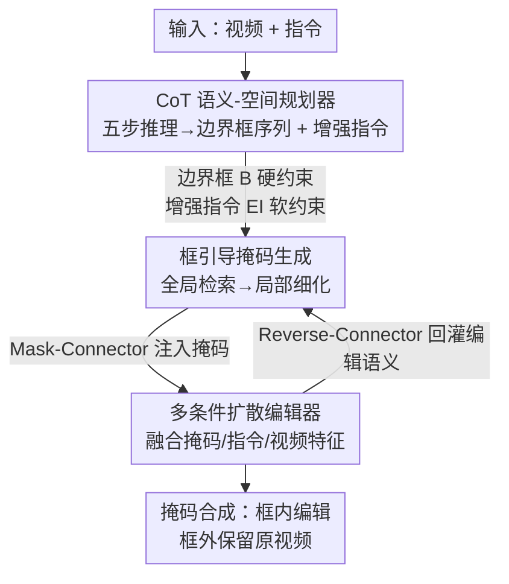

# CoT-Edit: Let CoT Guide Instruction Video Editing

**会议**: CVPR 2026  
**论文**: [CVF Open Access](https://openaccess.thecvf.com/content/CVPR2026/html/Liang_CoT-Edit_Let_CoT_Guide_Instruction_Video_Editing_CVPR_2026_paper.html)  
**代码**: https://github.com/flying-sky999/CoTEdit  
**领域**: 视频生成 / 指令视频编辑  
**关键词**: 指令视频编辑, Chain-of-Thought, MLLM 规划器, 框引导掩码, 扩散编辑  

## 一句话总结
针对纯文本指令视频编辑在复杂场景里"找不准目标、加物体不合物理"的问题，本文提出 Plan–Guide–Edit 三段式框架——先用带 CoT 的多模态大模型把指令"翻译"成一串关键帧边界框 + 增强指令，再用框约束的掩码分支把空间先验落成时序一致的掩码，最后由扩散编辑器融合掩码、增强指令和视频特征完成编辑，在物理合理性、空间关系等维度全面超过现有开源 baseline。

## 研究背景与动机
**领域现状**：指令式视频编辑（instruction-based video editing）让用户只给原视频 + 一句自然语言指令就能改视频，是 InstructPix2Pix 范式在视频上的延伸。主流做法（InsViE、Lucy-1.1、InstructX 等）是端到端：让一个扩散/多模态模型同时完成"理解跨帧语义、定位目标、执行编辑"三件事。

**现有痛点**：在多个相似物体共存、动态交互的复杂真实场景里，纯文本驱动频繁失控——指令"把黄狗变成橘猫"会改错那只狗，"加一个走椭圆轨迹的 UFO"会违反运动轨迹。原因是文本信号本身有歧义，模型缺乏显式的空间 grounding 和物理约束，导致定位漂移、错误编辑和时序抖动；为了硬扛这些，这类方法只能堆大规模对齐数据和大容量模型。

**核心矛盾**："改什么（what）"和"在哪改（where）"被纠缠在同一个文本→像素的映射里。一个直接的缓解办法是引入掩码作为空间条件，把全局检索变成局部可控编辑。但如果掩码**只从原始文本指令**生成，文本层的语义歧义和空间不确定性会原封不动传到掩码层；更要命的是物体添加任务里，文本派生的掩码给不出任何可执行的物理先验（新物体合理的位置、尺度、运动逻辑），模型等于没有落脚点。

**本文目标**：搭一座从高层语义到低层像素的可靠桥梁——既保留语言的表达力，又提供细粒度空间/物理约束，同时避免重度依赖大量对齐标注。

**核心 idea**：把隐式的"理解→编辑"拆成显式的 **Plan→Guide→Edit** 三段：用一个 CoT 增强的 MLLM 当规划器，**先**把指令推理成"边界框序列 + 增强指令"这种可解释的结构化中间产物，再用它显式引导掩码生成和扩散编辑，把空间定位的负担从扩散模型里解耦出去。

## 方法详解

### 整体框架
给定原视频 $S$ 和一句指令 $I$，CoT-Edit 走三个核心模块串成的流水线：**Planner（规划器）** 把高层语义意图翻译成可执行的空间约束，**Guide（掩码分支）** 在显式空间先验下生成时空一致的掩码，**Editor（扩散编辑器）** 融合多条件完成外观修改与内容生成。三者并非单向串联——Guide 与 Editor 通过 Reverse-Connector / Mask-Connector **双向耦合**，让低层掩码引导与高层编辑语义互相纠正。

具体地，后两个分支以 Wan2.2 5B 扩散模型为骨干：原视频经 3D VAE 得到低维潜表示 $y_0$，扩散过程注入噪声得 $y_{\text{noise}}$，二者沿通道拼接

$$y_{\text{input}} = \text{ChannelConcat}(y_{\text{noise}}, y_0)$$

并把 tokenizer 的输入通道扩到 32（输出维度不变），以免破坏 Wan2.2 5B 原始分布。

### 关键设计

**1. CoT 语义-空间规划器：把歧义指令推理成可执行的框 + 增强指令**

这是全框架解决"文本歧义"的源头。规划器是一个显式嵌入 Chain-of-Thought 的 MLLM，输入是时序排列的关键帧 $\{I_t\}_{t=1}^{T}$ 加用户指令，输出两路结构化结果：一路是与关键帧对齐的归一化边界框序列 $\{b_t\}_{t=1}^{T}$，每个框写成 $[t, x_1, y_1, x_2, y_2]$，明确"在哪改"；另一路是**增强指令**，在原文基础上补上目标属性、相对空间关系、接触模式、相机一致性提示等语义先验。对风格化这类非空间任务，规划器输出空框序列。

它之所以用多步 CoT 而非一次性直出，作者给了三个具体理由：顺序分解复杂指令显著降低任务难度；提前建模物理/电影学约束，能阻止定位误差在后续生成阶段被放大；以及一个专门阶段能为下游产出可解释的结构化引导。推理被组织成三个紧耦合阶段：(i) **任务解析 + 跨帧感知**——解析任务类型（添加/替换等）和主体，视觉侧估计相机运动（与物体运动区分）并做跨帧实例识别与跟踪，把模糊的语言指代锚定到具体视频实例；(ii) **物理与时序一致性建模**（作者强调是规划器的关键环节）——跨帧推理目标的位移、尺度变化和可见性以生成平滑定位轨迹，并用 MLLM 的世界知识嵌入重力、接触、遮挡等物理规则，配合最后的自检与反思，缓解纯文本编辑常见的定位不准/物理不合理；(iii) **生成空间与语义引导**——产出上述边界框序列和增强指令。这种双通道把**刚性空间约束（框）**和**柔性语义控制（增强指令）**解耦：前者给可验证的空间锚点，后者给可迁移的语义/物理先验。

**2. 框引导掩码生成 + Reverse-Connector：从全局检索退化为局部细化**

规划器把空间定位的活干完后，掩码分支（Guide）就不必再解"又要定位又要生成"的难题，只需在指定区域内推断编辑所需的精确形状。它把边界框序列 $B=\{b_t\}$ 当**硬约束**，把视频特征和增强指令 $EI$ 当**软约束**，生成二值掩码 $M$；其第 $l$ 层时空特征 $C_M^l$ 作为下游编辑的隐式空间引导。Guide 与 Editor 共享同一套层级架构，自注意力在时间维和相邻尺度间传播，交叉注意力接两类条件：补充上下文的全局视频特征，以及注入语义约束和精确空间位置先验的规划器输出（$EI$ 和 $B$）。

但只靠边界框 + 局部特征生成的掩码，对细长结构或严重遮挡区域会不稳。为此作者引入从 Editor 回流到 Guide 的 **Reverse-Connector**：

$$C_M^l = C_M^l + \text{ReverseConnector}(Q_E^l)$$

其中 $Q_E^l$ 是第 $l$ 层编辑器特征。直觉是：编辑器对"要编辑什么"的语义理解，能帮掩码分支补回那些容易漏掉的细节；这个连接是多层、可重复的。最后用一个 Mask-Connector 把细化后的时空特征映射成与输入帧同分辨率的逐帧掩码 $\{M_t\}$，保留时序顺序以维持帧间连续性，这些掩码可被直接监督，也能在训练时参与联合优化、稳定骨干学习。

**3. 多条件扩散编辑器 + Mask-Connector 双向耦合：把语义/掩码/视频特征灌进扩散生成**

Editor 拿到精确时空掩码 $\{M_t\}$ 和增强指令 $EI$ 后执行外观修改和内容生成，目标是注入条件的同时保留未编辑区域、产出自然平滑的结果。它把掩码特征以加性调制方式回注到多个编辑层：

$$Q_E^l = Q_E^l + \text{MaskConnector}(C_M^l)$$

让不同深度的编辑特征都保持对低层空间引导的感知，这与设计 2 的 Reverse-Connector 一起构成 Guide↔Editor 的**双向协作**——掩码不是只喂一次，而是多层交互，从而在边界、遮挡、光照上更稳，尤其利于细粒度局部编辑。

语义侧，Editor 用一个专门的 Qwen-VL 交叉注意力消化增强指令：取 Qwen-VL 末层视觉-语言特征 $V$ 的前 1024 个 token，用 MLP 把通道从 3584 降到 Wan2.2 5B 的 3072，再做交叉注意力

$$Q_E^l = Q_E^l + \text{QVLcrossattn}(\text{MLP}(V),\, C_M^l)$$

这样编辑器既拿到原视频的视觉先验，又充分利用了规划阶段 MLLM 已经组织好的语义与世界知识。最终一个掩码引导的合成策略在掩码区域内贴编辑内容、区域外保留原视频，保证时序连贯、语义忠实、物理兼容的输出。

### 损失函数 / 训练策略
采用两阶段训练。**第一阶段模块化分别训练**：Mask（Guide）分支在图像分割（ADE20K、PhraseCut）+ 视频分割（YouTube-VOS、OVIS）混合数据上训；Editor 分支在开源图像/视频编辑数据（AnyEdit、UltraEdit、SEED-Data-Edit、EditWorld）+ 开源视频指令编辑数据（Señorita-2M、Ditto）+ 自建数据上训。**第二阶段联合训练**两分支于自建内部数据集（约 10 万对带精确掩码标注的高质量前后编辑对）。分辨率 720×1280，一阶段 20k 步、二阶段 10k 步，batch size 均为 64；Reverse-Connector 和 Mask-Connector 均零初始化。作者称这种解耦 + 分阶段训练明确了每个模块的学习目标，降低了对大规模对齐数据的依赖。

## 实验关键数据

### 主实验
评测从两类视角：视觉质量用 FVD 和 VBench 指标（背景一致性 BC、时序一致性 TC、运动平滑 MS、美学 AES）；指令遵循用 CLIPScore，并用 Gemini 给物理合理性、空间关系、指令遵循、整体编辑质量打分。协议是从 Koala-36M 随机采 100 个视频配多样指令（添加/删除/属性修改/风格化/抛物线等物理合理运动）。

| 模型 | BC ↑ | CLIPScore ↑ | FVD ↓ | MS ↑ | AES ↑ | 物理规则 ↑ | 空间关系 ↑ | 指令遵循 ↑ | 编辑质量 ↑ |
|------|------|-------------|-------|------|-------|-----------|-----------|-----------|-----------|
| InsV2V | 0.921 | 0.129 | 4095.42 | 0.95 | 0.57 | 0.367 | 0.291 | 0.401 | 0.326 |
| StableV2V | 0.942 | 0.263 | 3222.18 | 0.99 | 0.46 | 0.305 | 0.341 | 0.381 | 0.319 |
| InsViE | 0.936 | 0.395 | 2397.65 | 1.10 | 0.48 | 0.389 | 0.285 | 0.355 | 0.369 |
| AnyV2V | 0.927 | 0.251 | 2942.77 | 0.95 | 0.41 | 0.313 | 0.373 | 0.265 | 0.394 |
| OmniVideo | 0.972 | 0.382 | 1076.44 | 1.04 | 0.44 | 0.590 | 0.641 | 0.526 | 0.604 |
| Lucy-1.1 | 0.931 | 0.376 | 1488.12 | 0.98 | 0.52 | 0.488 | 0.769 | 0.562 | 0.589 |
| **CoT-Edit (本文)** | **0.974** | **0.445** | **1015.67** | **1.18** | **0.62** | **0.741** | **0.841** | **0.629** | **0.648** |

CoT-Edit 在绝大多数维度领先，尤其物理规则（0.741 vs 次优 0.590）和空间关系（0.841 vs 0.769）这两个"空间/物理推理"维度涨幅最大，正好对应其显式空间规划的设计初衷。（TC 上本文 0.945 略低于若干 baseline，未取得全维度第一。）

### 消融实验
消融用物理合理性 PR、空间关系 SR、指令遵循 IF、整体编辑质量 OEQ 四项打分。

| 配置 | PR | SR | IF | OEQ | 说明 |
|------|-----|-----|-----|-----|------|
| E w/o MLLM | 0.501 | 0.754 | 0.575 | 0.598 | 仅 Editor，不加 Qwen3-VL 指令增强 |
| E w/ MLLM | 0.674 | 0.758 | 0.598 | 0.631 | Editor + Qwen3-VL 特征 |
| E + M w/ Mc | 0.643 | 0.807 | 0.586 | 0.638 | 再加 Mask 分支（仅 Mask-Connector） |
| E + M w/ Mc & Rc | **0.681** | **0.815** | **0.609** | **0.647** | 完整模型（Mask-Connector + Reverse-Connector） |

另有 CoT 消融：对比 Qwen3-VL-32B、Gemini 2.5 Pro 各自加/不加 CoT 四个变体，定性显示**没有 CoT 时乒乓球无法呈现物理合理运动，加了 CoT 后两个变体都能生成"先抛物线下落→撞桌→反弹"的合规轨迹**，说明 CoT 不只提升定位，还驱动物理一致的运动生成。

### 关键发现
- Qwen3-VL 指令增强（E w/o→w/ MLLM）把物理合理性从 0.501 拉到 0.674，是 PR 维度最大的单步增益，说明 MLLM 语义先验对"物理对不对"贡献突出。
- Mask 分支主要吃在空间关系（SR 0.758→0.807），印证它的职责是"在哪改"的空间定位。
- Reverse-Connector 在已有 Mask-Connector 基础上把 PR 从 0.643 补回 0.681、四项全涨，验证了编辑器→掩码的反向回流对细长/遮挡结构的稳定作用。

## 亮点与洞察
- **把"空间定位"从扩散模型里显式剥离**：用 CoT 规划器先产出边界框这种可验证的硬锚点，让扩散模型只管局部生成——这是它能用更少数据打过堆数据的端到端方法的根因，也是"结构化中间表示降低任务难度"的一个干净例子。
- **双通道引导（框 vs 增强指令）的解耦很巧**：刚性框给可验证空间锚点、柔性增强指令给可迁移语义/物理先验，二者各管一摊又互补，比"全塞进一段文本"鲁棒。
- **Reverse-Connector 的反向耦合可迁移**：让下游高层语义回灌上游低层模块纠错（编辑器→掩码），这种双向 connector 思路可借鉴到任何"定位模块 + 生成模块"串联的 pipeline，缓解上游一旦错下游救不回的问题。
- **CoT 不止于文本任务**：本文把 CoT 用在"语义→空间坐标"的翻译上，乒乓球抛物线的例子直观说明显式推理物理规则能落到生成轨迹上。

## 局限与展望
- **重度依赖规划器质量**：整条链路的空间锚点都来自 MLLM 产出的框，若规划器在拥挤/快速运动场景框错，下游掩码和编辑会被误差带偏；论文未量化规划器单独的框预测精度（如 IoU），这一环的可靠性是隐忧。⚠️ 论文正文未给规划器定位的独立定量指标。
- **评测依赖 Gemini 打分**：物理规则、空间关系等核心结论由 Gemini 评分得出，存在评判模型自身偏置；评测集仅 100 个视频，规模偏小。
- **自建 10 万对数据 + 内部数据集**：第二阶段联合训练用的高质量带掩码标注数据是自建的，复现门槛较高，"减少数据依赖"主要相对于百万级蒸馏数据集而言。
- **TC 未占优**：时序一致性指标本文略低于部分 baseline，多模块串联是否引入额外时序不稳，值得进一步分析。

## 相关工作与启发
- **vs Lucy-1.1 / InsViE（端到端纯扩散）**：它们直接用扩散模型吃视频-指令，指令注入机制弱，对小目标/歧义指令空间定位不足；本文把定位显式外包给 CoT 规划器 + 框引导掩码，空间关系（0.841 vs Lucy 0.769）和物理规则（0.741 vs 0.488）大幅领先。
- **vs InstructX（MLLM 增强语义）**：InstructX 用多模态大模型提升语义泛化，但仍靠隐式注意力施加空间约束；本文把空间约束做成**显式**边界框 + 掩码，而非依赖注意力自发学到。
- **vs OmniVideo（MLLM + 扩散统一框架）**：OmniVideo 是当前 baseline 里最强的（FVD 1076），但本文在物理规则、空间关系、编辑质量上仍全面更高，差距主要来自显式空间/物理先验的注入而非更大模型。
- **vs StableV2V / 几何一致性方法**：那类方法靠外部对齐模块提升跨帧一致，但并非天然指令驱动；本文把指令解析、空间 grounding、细粒度编辑统一进一个指令驱动框架。

## 评分
- 新颖性: ⭐⭐⭐⭐ Plan–Guide–Edit + CoT 把空间定位显式外包给规划器，框/掩码双向耦合是干净有效的组合创新，但单个组件多为已有思路的拼装。
- 实验充分度: ⭐⭐⭐⭐ 6 个强 baseline + 多维指标 + CoT/掩码双消融 + 用户研究，较扎实；但评测集仅 100 视频、依赖 Gemini 打分、缺规划器定位的独立量化。
- 写作质量: ⭐⭐⭐⭐ 动机推导清晰、模块职责分明、公式给到位，三段式 pipeline 易懂。
- 价值: ⭐⭐⭐⭐ 复杂场景指令视频编辑的实用性强，"显式空间规划解耦扩散"的思路对相关任务有迁移价值。

<!-- RELATED:START -->

## 相关论文

- [\[CVPR 2026\] VIVA: VLM-Guided Instruction-Based Video Editing with Reward Optimization](viva_vlm-guided_instruction-based_video_editing_with_reward_optimization.md)
- [\[CVPR 2026\] Let Your Image Move with Your Motion! – Implicit Multi-Object Multi-Motion Transfer](let_your_image_move_with_your_motion_--_implicit_multi-object_multi-motion_trans.md)
- [\[ICLR 2026\] LoRA-Edit: Controllable First-Frame-Guided Video Editing via Mask-Aware LoRA Fine-Tuning](../../ICLR2026/video_generation/lora-edit_controllable_first-frame-guided_video_editing_via_mask-aware_lora_fine.md)
- [\[CVPR 2026\] VideoCoF: Unified Video Editing with Temporal Reasoner](videocof_unified_video_editing_with_temporal_reasoner.md)
- [\[CVPR 2026\] V-RGBX: Video Editing with Accurate Controls over Intrinsic Properties](v-rgbx_video_editing_with_accurate_controls_over_intrinsic_properties.md)

<!-- RELATED:END -->
