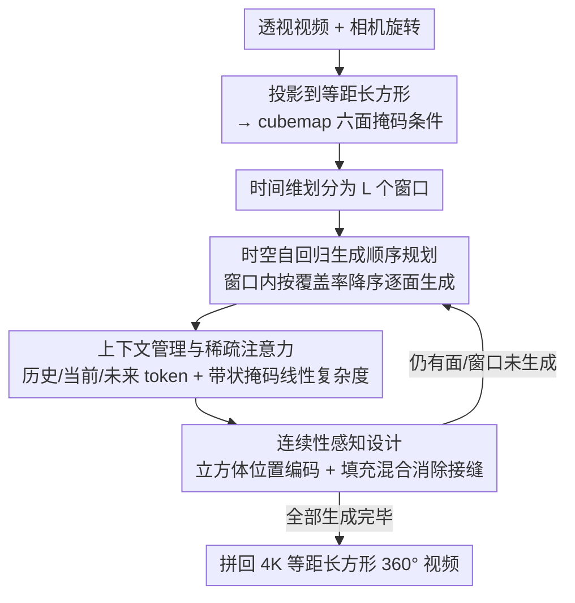

# CubeComposer: Spatio-Temporal Autoregressive 4K 360° Video Generation from Perspective Video

**会议**: CVPR 2026  
**arXiv**: [2603.04291](https://arxiv.org/abs/2603.04291)  
**代码**: [项目主页](https://lg-li.github.io/project/cubecomposer)  
**领域**: 视频生成 / 360°全景视频  
**关键词**: 360°视频生成, 立方体映射, 时空自回归, 扩散模型, 4K原生生成

## 一句话总结

提出 CubeComposer，将360°视频分解为 cubemap 六面表示并按时空自回归方式逐面生成，首次实现从透视视频原生生成4K（3840×1920）分辨率的360°全景视频，无需后处理超分辨率。

## 研究背景与动机

沉浸式VR应用需要高质量360°全景视频，但现有360°视频生成方法受限于vanilla扩散模型的计算开销：
- 现有方法原生分辨率最高仅 ≤1K（约1024×512），依赖外部超分辨率模块提升分辨率
- 外部上采样缺乏内在生成推理能力，常引入错误级联，导致分辨率高但细节不足
- 全注意力扩散模型的显存和计算开销使原生高分辨率生成不可行

核心问题：如何在可控的显存开销下实现原生4K分辨率的360°视频生成？

## 方法详解

### 整体框架

CubeComposer 要解决的核心矛盾是：全注意力扩散模型直接生成 4K 360° 视频显存扁不住，但靠外部超分又会丢细节、级联出错。它的破法是把 360° 视频拆成 cubemap 六个面（F/R/B/L/U/D），化成一个**时空自回归**问题逐面、逐窗口地生成。输入透视视频 $\{I_t^{\mathrm{pers}}\}_{t=1}^N$（带相机旋转）先投影到等距长方形、再转成 cubemap 六面表示得到掩码条件；时间维划成 $L$ 个窗口（每窗口长 $T_{\mathrm{win}}$），每个窗口内按覆盖率降序逐面生成，每步只生成一个面的一段视频，最后拼回 4K 等距长方形。整套基于 Wan 2.2 5B 训练。

### 关键设计

**1. 时空自回归生成顺序规划：先生成信息最足的面，把线索往后传**

逐面生成最怕的是早期面没条件信息、瞎猜出错然后误差累积。作者让时间维按因果顺序生成，空间维则按透视视频在各面上的覆盖率排序——覆盖率 $c_{f,w} = \frac{1}{T_{\mathrm{win}}} \sum_{t=s_w}^{e_w-1} \langle M_{f,t} \rangle_{(i,j)}$ 越高、说明这个面被透视视频覆盖得越多、条件越充分，就越先生成。先把确定性最高的面定下来，几何/外观/运动线索就能自然地传播到后续不确定的面，避免早期瞎猜导致的误差累积。

**2. 上下文管理与稀疏注意力：动态选上下文，再把它的自注意力压成线性**

每生成一个面，需要看哪些历史？作者设计的上下文 $\mathbf{u}_{w,f}$ 含三部分：(a) 历史 token——前 $H$ 个窗口已生成内容；(b) 当前窗口 token——已生成面和未生成面的透视条件；(c) 未来片段 token——从空间相邻的未来面里动态挑出覆盖率超过阈值 $r$ 的最近时间片段。这么长的上下文若全做自注意力代价太高，于是设计稀疏上下文注意力：生成序列（长度 $G$）做完整自注意力，上下文序列（长度 $C$）对生成序列完整注意、但对自身只用带宽 $K$ 的对角带状局部掩码，把上下文自注意力从 $O(C^2)$ 降到 $O(C \cdot K)$ 线性复杂度。消融显示这种选择性上下文甚至比全 token 上下文 FVD 更好（4.26 vs 5.23），长上下文也因此变得可行。

**3. 连续性感知设计：消除 cubemap 各面拼接时的接缝**

各面独立自回归生成，拼起来很容易出现接缝伪影。作者从位置编码和混合两头下手：一是**立方体感知位置编码**，把 RoPE 的空间索引按展开后的 cubemap 拓扑重映射（U 面顶部从 0 开始、F 面从 $R$、D 面从 $2R$），让模型显式知道面与面的拓扑关系；二是**立方体感知填充与混合**，生成时用相邻面的条带对当前面的 latent 做拓扑对齐填充，生成后再在像素空间对重叠区域加权平均混合，确保跨面过渡平滑。消融里这两个设计去掉任一都会出现严重接缝伪影，缺一不可。

### 损失函数 / 训练策略

- 使用 flow-matching 目标训练速度场预测：$\mathcal{L} = \mathbb{E}_{t,\mathbf{z}_0}\left[\|\mathbf{v}_\theta(\mathbf{z}_t, t; \mathbf{u}_{w,f}, y) - \mathbf{v}_t\|^2\right]$
- 训练时在ground-truth 360°视频上模拟自回归过程，随机采样窗口和面进行训练
- 支持全局prompt和可选的逐面prompt条件，训练时随机使用逐面caption
- 数据集 4K360Vid 包含11,832个高质量4K 360°视频片段，由 Qwen3-VL 生成caption并过滤低质量内容

## 实验关键数据

### 主实验

| 方法 | 分辨率 | LPIPS↓ | CLIP↑ | FID↓ | FVD↓ | 美学质量↑ | 成像质量↑ |
|------|--------|--------|-------|------|------|----------|----------|
| Argus | 1K | 0.407 | 0.886 | 141.2 | 4.08 | 0.372 | 0.427 |
| Argus+VEnhancer | 2K | 0.469 | 0.858 | 169.0 | 6.13 | 0.360 | 0.429 |
| CubeComposer | 2K | **0.370** | **0.923** | **119.1** | 3.90 | 0.398 | **0.521** |
| CubeComposer | 4K | 0.383 | 0.911 | 130.9 | **2.22** | **0.405** | **0.562** |

4K360Vid 和 ODV360 两个数据集上均显著优于所有基线方法，且不依赖超分辨率后处理。

### 消融实验

| 配置 | FVD↓ | FID↓ | LPIPS↓ | CLIP↑ |
|------|------|------|--------|-------|
| 完整模型 | **4.26** | **125.6** | **0.425** | **0.891** |
| 无未来token | 6.04 | 128.3 | 0.452 | 0.888 |
| 全token上下文 | 5.23 | 116.6 | 0.416 | 0.896 |
| 无cube位置编码 | 4.47 | 201.4 | 0.550 | 0.855 |
| 无填充混合 | 4.37 | 190.3 | 0.560 | 0.841 |

### 关键发现

- 未来片段token对时间一致性至关重要（FVD从4.26→6.04）
- 完整模型在FVD上甚至优于全token模型（4.26 vs 5.23），说明选择性上下文比全量更有效
- 两种连续性设计缺一不可，去掉任一都导致严重接缝伪影

## 亮点与洞察

- 将360°视频生成问题巧妙建模为cubemap面上的时空自回归问题，化解了原生高分辨率生成的显存瓶颈
- 覆盖率引导的空间顺序规划是核心创新——先生成确定性最高的面，自然地将信息传播到后续面
- 稀疏上下文注意力设计简洁高效，线性复杂度使长上下文可行
- 4K360Vid数据集本身也是贡献（11K+视频带caption）

## 局限与展望

- 自回归逐面生成的总推理延迟较高，可探索减少扩散步数或流式生成
- cubemap表示在极点附近仍有一定失真
- 对快速运动场景的时间一致性可能不够理想
- 当前依赖已知相机旋转，无旋转估计的场景需额外处理

## 相关工作与启发

- 与 Argus/Imagine360/ViewPoint 等360°视频生成方法对比，CubeComposer 首次突破1K分辨率限制
- 与时间自回归视频生成（如 StreamDiffusion）相比，新增了空间维度的自回归设计
- 稀疏注意力设计可迁移到其他需要长上下文的视频生成任务

## 评分

- 新颖性: ⭐⭐⭐⭐ cubemap时空自回归框架新颖，覆盖率引导顺序+稀疏注意力设计巧妙
- 实验充分度: ⭐⭐⭐⭐ 两个数据集，详细消融，与多个基线比较
- 写作质量: ⭐⭐⭐⭐ 图表清晰，方法描述系统且形式化
- 价值: ⭐⭐⭐⭐ 首次原生4K 360°视频生成，对VR内容创作有实际应用价值
- 价值: 待评

<!-- RELATED:START -->

## 相关论文

- [\[CVPR 2026\] Pantheon360: Taming Digital Twin Generation via 3D-Aware 360° Video Diffusion](pantheon360_taming_digital_twin_generation_via_3d-aware_360deg_video_diffusion.md)
- [\[ICLR 2026\] Lumos-1: On Autoregressive Video Generation with Discrete Diffusion from a Unified Model Perspective](../../ICLR2026/video_generation/lumos-1_on_autoregressive_video_generation_with_discrete_diffusion_from_a_unifie.md)
- [\[ICLR 2026\] JavisDiT: Joint Audio-Video Diffusion Transformer with Hierarchical Spatio-Temporal Prior Synchronization](../../ICLR2026/video_generation/javisdit_joint_audio-video_diffusion_transformer_with_hierarchical_spatio-tempor.md)
- [\[CVPR 2026\] VideoCoF: Unified Video Editing with Temporal Reasoner](videocof_unified_video_editing_with_temporal_reasoner.md)
- [\[CVPR 2026\] LottieGPT: Tokenizing Vector Animation for Autoregressive Generation](lottiegpt_vector_animation_generation.md)

<!-- RELATED:END -->
