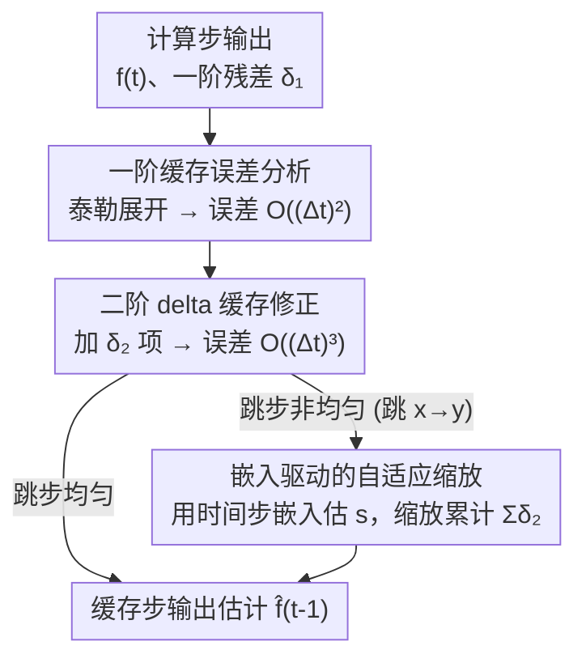

# D2Cache: Second-Order Delta Caching for Higher Video Diffusion Acceleration

**会议**: CVPR 2026  
**论文**: [CVF Open Access](https://openaccess.thecvf.com/content/CVPR2026/html/Liu_D2Cache_Second-Order_Delta_Caching_for_Higher_Video_Diffusion_Acceleration_CVPR_2026_paper.html)  
**代码**: https://github.com/VG-Huai/D2Cache  
**领域**: 视频扩散加速  
**关键词**: 视频扩散, 缓存加速, 二阶残差, 免训练, DiT  

## 一句话总结
D2Cache 是一个免训练、即插即用的视频扩散缓存加速方法：它发现相邻时间步输出的"二阶差分"（一阶残差的残差）比一阶残差光滑得多，于是在复用一阶残差的基础上再加一个二阶修正项，把缓存预测误差从 $O((\Delta t)^2)$ 降到 $O((\Delta t)^3)$，并用时间步嵌入估出的缩放因子适配非均匀跳步，在相同加速比下 VBench 比 SOTA 的 TeaCache 高 0.4%–2.5%。

## 研究背景与动机
**领域现状**：视频扩散模型（Latte、Open-Sora、LTX-video、Wan2.1 等基于 DiT 的模型）画质惊人，但要做几十上百步顺序去噪，单卡生成一段短视频往往要数分钟，无法实时。免训练的缓存加速（caching）因此成为热门方向：它利用相邻时间步模型输出高度相似的特性，跨步复用中间结果，跳过冗余计算，常见提速 1.5×–4×。

**现有痛点**：当前几乎所有缓存方法（TeaCache、DiCache、FasterCache、PAB、EasyCache 等）本质都是**一阶残差复用**——把上一计算步算出的一阶残差 $\delta_1$ 直接拿来估计下一步输出。这类方法的误差是 $O((\Delta t)^2)$ 量级，在跨多个缓存步时会**累积**，跳得越多误差越大，于是只能在"提速"和"画质"之间权衡：要快就得多缓存，但画质（VBench）就会掉，表现为细节模糊、运动不连贯。论文指出，一阶方法的误差建模已经做到接近理论极限，再怎么优化阈值也突破不了这个天花板。

**核心矛盾**：一阶缓存只用到了输出曲线的"一阶导数"信息（相邻输出之差），忽略了曲率（二阶项），导致每跳一步就丢掉一个 $\frac{1}{2}f''(t)$ 的二阶误差，这些误差在长序列、复杂动态场景里被时空依赖进一步放大。

**切入角度**：作者把离散去噪过程看成连续函数 $f(t)=\epsilon_\theta(x_t,t)$，做泰勒展开后发现——一阶残差 $\delta_1$ 本来就高度相似，而**二阶差分** $\delta_2$（相邻一阶残差之差）更加光滑：幅值更小、波动更平缓，实验里方差比一阶低约 90%，而且这种光滑性在不同跳步间隔下都成立。这意味着 $\delta_2$ 可以被稳定地预测和复用，从而补回一阶方法丢掉的曲率项。

**核心 idea**：在一阶残差复用的基础上，再加一个"二阶 delta 缓存"修正项，把预测误差阶数提高一阶（$O((\Delta t)^2)\to O((\Delta t)^3)$），并用时间步嵌入估出的缩放因子让它适配真实的非均匀跳步——一个不改任何模型、不增训练、几乎零额外开销的即插即用插件。

## 方法详解

### 整体框架
D2Cache 接在已有缓存策略（如 TeaCache、EasyCache）之上：原本的一阶分支照常在"计算步"算出真实输出、缓存一阶残差 $\delta_1$，在"缓存步"用 $\delta_1$ 外推；D2Cache 额外开一条"二阶分支"，同时维护二阶差分 $\delta_2$ 的缓存，在外推时把累计的 $\delta_2$（经缩放因子 $s$ 调节后）加进去做曲率修正。整个方法不改变底层的 compute/cache 调度策略，只是把每一步的"估计公式"从一阶换成二阶，因此提速比与原方法几乎一致，但误差更小。

整条 pipeline 可拆成三段：先从泰勒分析看清一阶缓存为何会累积 $O((\Delta t)^2)$ 误差（动机的形式化），再用二阶修正把误差压到 $O((\Delta t)^3)$（连续步场景），最后用嵌入驱动的缩放因子把二阶修正推广到真实的非均匀跳步。

### 关键设计

**1. 一阶缓存的泰勒误差分析：把"为什么会掉点"算成 $O((\Delta t)^2)$**

这一步是后面所有改进的地基：它要回答"一阶缓存到底丢了什么"。作者把模型输出记为连续函数 $f(t)=\epsilon_\theta(x_t,t)$，一阶后向差分定义为 $\delta_1(t)=f(t)-f(t+1)$，一阶缓存假设 $\delta_1$ 光滑（$\delta_1(t)\approx\delta_1(t-1)$），于是用 $\hat f^{(1)}(t-1)=f(t)+\delta_1(t)$ 来外推。把 $f(t-1)$、$f(t+1)$ 在 $t$ 处做泰勒展开：

$$f(t-1)=f(t)-f'(t)+\tfrac{1}{2}f''(t)+O((\Delta t)^3),\quad f(t+1)=f(t)+f'(t)+\tfrac{1}{2}f''(t)+O((\Delta t)^3)$$

代入可得 $\delta_1(t)=-f'(t)-\tfrac{1}{2}f''(t)+O((\Delta t)^3)$，于是一阶预测的局部误差正好是

$$e_1(t)=f(t-1)-\hat f^{(1)}(t-1)=f''(t)+O((\Delta t)^3)=O((\Delta t)^2)$$

也就是说，一阶缓存每跳一步就漏掉了一个二阶曲率项 $f''(t)$，这就是误差的来源。把误差写成显式形式后，"补一个二阶项就能消掉它"这条路就顺理成章了——这是论文第一份对扩散 delta 缓存的理论分析。

**2. 二阶 delta 缓存：补回曲率项，把误差降一阶到 $O((\Delta t)^3)$**

既然漏的是二阶项，那就把它估出来补回去。作者定义**二阶差分** $\delta_2(t)=\delta_1(t)-\delta_1(t+1)$，它度量一阶残差自身的变化。关键观察（Figure 3）：$\delta_2$ 的幅值显著小于 $\delta_1$、波动也更平缓（方差低约 90%），所以"$\delta_2$ 随时间步缓慢变化"（$\delta_2(t)\approx\delta_2(t-1)$）是个比一阶假设更可靠的前提。基于此提出二阶预测器：

$$\hat f^{(2)}(t-1)=f(t)+\delta_1(t)+\delta_2(t)$$

论文的 Theorem 1 证明：在二阶光滑假设下，该预测器的局部截断误差 $e_2(t)=f(t-1)-\hat f^{(2)}(t-1)=O((\Delta t)^3)$，比一阶的 $O((\Delta t)^2)$ 高一阶，且当 $\Delta t$ 足够小时 $\|e_2(t)\|\le c\,\Delta t\,\|e_1(t)\|$。直观理解：一阶缓存只对齐了曲线的斜率，二阶缓存连曲率一起对齐，所以外推轨迹（Figure 5 的 L2 轨迹）能更贴合无缓存的真实去噪路径，累积误差被有效压制。

**3. 嵌入驱动的自适应缩放：让二阶修正在非均匀跳步下也站得住**

前两点都假设是连续整步外推，但真实加速里 compute 步是**不规则间隔**的：假设计算步在 $t$ 和 $t-x$，缓存步在 $t-y$（$x<y$），那已知的累计和 $\sum_{k=1}^{x}\delta_2(t-k)$ 要去估计未知的 $\sum_{k=1}^{y-x}\delta_2(t-x-k)$。$\delta_2$ 平均光滑但仍有局部抖动，跳得越长这些抖动越被放大，直接照搬累计和会失真，所以需要一个缩放机制来补偿间隔差异。

作者沿用 TeaCache 的思路：观察到二阶 delta 的幅值同样与时间步嵌入强相关（Figure 4 验证）。定义调制输入 $F_t=\mathrm{Modulate}(x_t,t)$，算相对 L1 距离 $\mathrm{L1rel}(F,t)=\|F_t-F_{t+1}\|_1/\|F_{t+1}\|_1$ 作为 $\delta_2(t)$ 尺度的原始代理，再经多项式拟合 $p(\cdot)$ 得到误差代理 $e_t=p(\mathrm{L1rel}(F,t))$。缩放因子取两段区间上 $e_t$ 累计和之比：

$$s=\frac{\sum_{k=1}^{y-x}e_{t-x-k}}{\sum_{k=1}^{x}e_{t-k}}$$

最终的非均匀跳步估计为

$$\hat f(t-y)=f(t-y+1)+\delta_1(t-x)+s\cdot\sum_{k=1}^{x}\delta_2(t-k)$$

即用 $s$ 把"已知区间累计的二阶量"放缩到"目标区间应有的量级"，从而在任意跳步长度下保住二阶精度。消融显示这个 $s$ 是高加速档下不掉点的关键——去掉它 VBench 直接掉 1.72%。

### 损失函数 / 训练策略
无训练。D2Cache 完全是推理期的免训练插件：不改模型权重、不改训练流程、不改底层缓存调度（compute/cache 步的选择与阈值都沿用被增强的基线，如 TeaCache 的 slow/fast/superfast 阈值），只替换每一步的输出估计公式并维护一份 $\delta_2$ 缓存，额外开销 < 0.3s。

## 实验关键数据

### 主实验
在 4 个视频扩散模型上、以 TeaCache 同等策略与阈值做对照（D2Cache 仅替换估计公式），下表摘取每模型最激进的 superfast 档（误差累积最严重、最能看出差距）。VBench 越高越好，加速比与延迟基本持平。

| 模型 (superfast) | 加速比 | 延迟(s) | VBench | Quality | Image | Aesthetic |
|------------------|--------|---------|--------|---------|-------|-----------|
| Latte / TeaCache | 3.62× | 9.33 | 75.61% | 77.88% | 54.97% | 57.36% |
| Latte / **D2Cache** | 3.61× | 9.35 | **76.03%** | **78.26%** | **58.64%** | **59.15%** |
| Open-Sora 1.2 / TeaCache | 2.86× | 20.55 | 77.07% | 77.88% | 54.16% | 54.48% |
| Open-Sora 1.2 / **D2Cache** | 2.82× | 20.85 | **77.47%** | **78.26%** | **58.26%** | **54.85%** |
| LTX-video / TeaCache | 3.54× | 23.45 | 70.92% | 76.50% | 43.79% | 47.40% |
| LTX-video / **D2Cache** | 3.52× | 23.58 | **73.42%** | **78.85%** | **50.83%** | **50.06%** |
| Wan2.1 / TeaCache | 3.63× | 73.71 | 79.70% | 83.35% | 67.18% | 62.00% |
| Wan2.1 / **D2Cache** | 3.63× | 73.75 | **80.12%** | **83.93%** | **67.62%** | **63.18%** |

在几乎相同的加速比与延迟下（额外开销 < 0.3s），D2Cache 的 VBench 全面占优：提升 0.4%–2.5%，其中 LTX-video（161 帧长序列）涨幅最大（+2.5%），印证"序列越长、误差累积越严重，二阶修正收益越大"。增益主要来自 Image（帧级清晰度，+1.7%–7.04%）和 Aesthetic（+0.77%–2.66%），说明二阶修正主要救回了被一阶缓存模糊掉的细节。

### 消融实验
在 Latte / superfast 下消融缩放因子 $s$（其余设计保留）：

| 配置 | 延迟(s) | VBench | Quality | Semantic | 说明 |
|------|---------|--------|---------|----------|------|
| D2Cache (full) | 9.35 | 76.03% | 78.26% | 67.10% | 完整模型 |
| D2Cache (w/o $s$) | 9.35 | 74.31% | 76.93% | 63.84% | 去掉自适应缩放 |
| 退回一阶 (≈TeaCache) | 9.33 | 75.61% | 77.88% | — | 无二阶修正 |

### 关键发现
- **缩放因子 $s$ 是高加速档的命门**：去掉 $s$ 后 VBench 掉 1.72%（76.03%→74.31%），Semantic 更是掉 3.26%——非均匀跳步下不缩放的二阶累计和反而会放大抖动，比退回一阶（75.61%）还差，说明二阶修正必须配上间隔补偿才能成立。
- **加速比越高，优势越明显**：在 slow 档 D2Cache 与 TeaCache 几乎打平（误差本就小），但到 superfast 档差距拉开，符合"二阶项专治长间隔累积误差"的定位。
- **VBench 低估了真实差距**：作者用清晰度指标（Laplacian variance / Tenengrad / Brenner）在 Wan2.1 复杂提示上额外测了 50 段视频。D2Cache 的 LV=746.39，与无缓存的 734.21 仅差 +1.7%；而 TeaCache-superfast 的 LV 掉 15.4%、Tenengrad 掉 33.3%、Brenner 掉 22.5%，量化了肉眼可见的"发糊"伪影——在复杂动态场景里 D2Cache 的优势比 VBench 数字体现的更大。

## 亮点与洞察
- **"残差的残差更光滑"是个干净且可迁移的观察**：把缓存从一阶推到二阶，本质是借了数值微分里"高阶差分更平滑"的直觉，并用泰勒展开把误差阶数算得明明白白。这个思路天然可以再往三阶推（作者也把这列为 future work）。
- **理论与工程对齐得很漂亮**：先把一阶误差形式化成 $O((\Delta t)^2)$、点明漏掉的就是 $f''(t)$，再用 $\delta_2$ 精确补这一项——动机不是"我们想更准"，而是"我们知道漏了哪一项、怎么补"。
- **复用 TeaCache 的嵌入代理来缩放 $\delta_2$**：没有为二阶项另起炉灶，而是发现"$\delta_2$ 的幅值同样与时间步嵌入相关"，直接借 TeaCache 已验证的 L1rel + 多项式拟合机制，工程上几乎零成本接入。
- **真正即插即用**：不动调度、不动权重、不增训练，额外延迟 < 0.3s，可以直接套在 TeaCache/EasyCache 上当"画质增强补丁"，这种"只改估计公式"的低侵入设计很容易被现有 pipeline 采纳。

## 局限性 / 可改进方向
- **画质的绝对上限仍受底层缓存策略约束**：D2Cache 只改估计公式、不改 compute/cache 调度，所以加速比天花板和缓存步数仍由被增强的基线决定，它做的是"同等提速下少掉点"，而非"提速更高"。
- **二阶光滑假设的边界没充分探讨**：$\delta_2$ 在论文展示的模型/任务上方差低 90%，但在更剧烈的运动、镜头切换或极端 prompt 下是否仍光滑、何时会失效，缺少压力测试。⚠️ 收益主要在 superfast 这类高加速档体现，slow 档与 TeaCache 几乎打平，低加速场景下二阶修正的边际价值有限。
- **缩放因子 $s$ 依赖多项式拟合的代理**：$s$ 的可靠性建立在"$\delta_2$ 幅值与时间步嵌入强相关 + 多项式拟合准确"之上，这套代理在不同模型上需不需要重新拟合、对拟合误差有多敏感，论文未展开。
- **复杂场景的量化只用了锐度指标**：作者自己也承认 VBench 对模糊不敏感，转而用 LV/Tenengrad/Brenner 佐证，但这些是无参考的清晰度代理，不能完全等同于"语义/运动正确"。

## 相关工作与启发
- **vs TeaCache**：TeaCache 用时间步嵌入做非均匀一阶残差估计，是当前 SOTA；D2Cache 在它之上加二阶修正，同加速比下 VBench 更高，且直接复用了 TeaCache 的嵌入误差代理——是"增强"而非"替代"的关系。
- **vs ∆-DiT / PAB / EasyCache**：这些都是一阶或结构层面的缓存（按 DiT 块、按金字塔注意力、按运行时模式），误差阶数仍是 $O((\Delta t)^2)$；D2Cache 是首个在**残差阶数**上做文章的缓存方法，理论上高它们一阶。
- **vs 采样缩减 / 知识蒸馏 / 稀疏注意力**：DDIM 等减步法会在步数过低时引入伪影；AccVideo 等蒸馏要额外训练资源；Sparse VideoGen 等稀疏注意力是正交优化、整体提速有限。D2Cache 免训练、与这些方向互补，可叠加使用。

## 评分
- 新颖性: ⭐⭐⭐⭐⭐ 首个把扩散缓存从一阶推到二阶残差、并给出阶数证明的工作，观察干净、思路可继续往高阶延伸。
- 实验充分度: ⭐⭐⭐⭐ 覆盖 4 个模型 × 3 个加速档、VBench + 锐度指标双重验证，消融到位；但二阶光滑假设的失效边界与 $s$ 的鲁棒性测试偏少。
- 写作质量: ⭐⭐⭐⭐⭐ 从泰勒误差分析一路推到二阶修正再到非均匀缩放，动机—理论—方法环环相扣，公式与图示配合清晰。
- 价值: ⭐⭐⭐⭐⭐ 免训练、即插即用、几乎零开销就能给现有缓存方法当画质补丁，对视频扩散实时化有直接落地价值。

<!-- RELATED:START -->

## 相关论文

- [\[ICCV 2025\] D3: Training-Free AI-Generated Video Detection Using Second-Order Features](../../ICCV2025/video_generation/d3_training-free_ai-generated_video_detection_using_second-order_features.md)
- [\[CVPR 2026\] DisCa: Accelerating Video Diffusion Transformers with Distillation-Compatible Learnable Feature Caching](disca_accelerating_video_diffusion_transformers_wi.md)
- [\[CVPR 2026\] FrameDiT: Diffusion Transformer with Matrix Attention for Efficient Video Generation](framedit_diffusion_transformer_with_matrix_attention_for_efficient_video_generat.md)
- [\[CVPR 2026\] Accelerating Diffusion-based Video Editing via Heterogeneous Caching: Beyond Full Computing at Sampled Denoising Timestep](accelerating_diffusion-based_video_editing_via_heterogeneous_caching_beyond_full.md)
- [\[CVPR 2026\] A Frame is Worth One Token: Efficient Generative World Modeling with Delta Tokens](a_frame_is_worth_one_token_efficient_generative_world_modeling_with_delta_tokens.md)

<!-- RELATED:END -->
