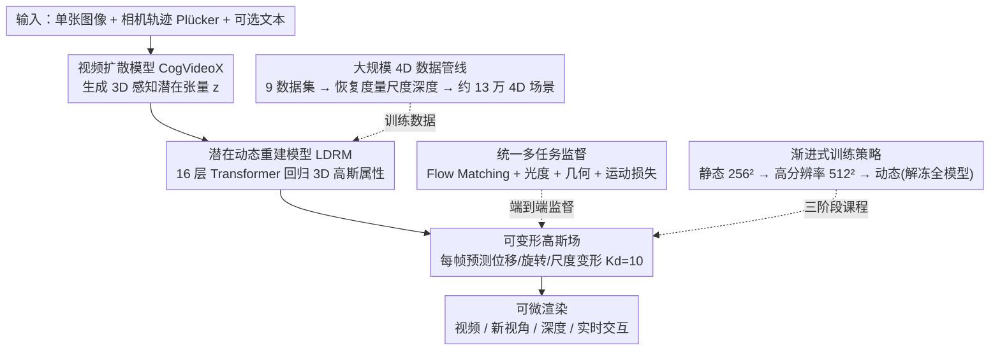

# Diff4Splat: Repurposing Video Diffusion Models for Dynamic Scene Generation

**会议**: CVPR 2026  
**arXiv**: [2511.00503](https://arxiv.org/abs/2511.00503)  
**代码**: [项目页面](https://paulpanwang.github.io/Diff4Splat)  
**领域**: 视频生成  
**关键词**: 4D生成, 3D高斯溅射, 视频扩散模型, 可变形高斯场, 前馈式生成

## 一句话总结

提出 Diff4Splat，一个前馈式框架，将视频扩散模型与可变形3D高斯场统一到端到端可训练的模型中，从单张图像在约30秒内直接生成动态4D场景表示，比优化方法快60倍。

## 研究背景与动机

动态3D场景生成（4D生成）是计算机视觉的核心挑战，在沉浸式内容创建、机器人和仿真领域有广泛应用。当前方法存在根本困境：

**多阶段流水线方法**：先用视频扩散模型生成视频，再进行3D重建。这些方法速度慢、容易出错，且缺乏端到端控制。例如 DimensionX 需要数个GPU小时，Mosca 需要半小时

**前馈生成方法**：虽然高效，但大多局限于生成2D视频帧或静态3D场景，无法捕获显式的动态3D几何

**核心空白**：缺少一个能够直接、高效地合成显式可控场景表示的统一框架

Diff4Splat 的动机是填补这一空白——将生成和表示统一到单次前向传播中，实现前馈效率与显式3D表示的兼顾。

## 方法详解

### 整体框架

Diff4Splat 要填的空白是：多阶段流水线（先生成视频再重建）慢又容易出错、缺端到端控制，而已有前馈方法又只能出 2D 帧或静态 3D、抓不住显式的动态几何。它的做法是把「生成」和「显式 3D 表示」压进单次前向传播：给一张输入图像 $\mathbf{I}_0$、相机轨迹 $\mathcal{P}$（Plücker 坐标）和可选文本提示 $\mathbf{C}_{ctx}$，直接预测一个可变形 3D 高斯场。推理时是四步串行——视频扩散模型（CogVideoX）先生成 3D 感知潜在张量，潜在动态重建模型（LDRM）把潜在特征解成 3D 高斯属性，可变形高斯场用逐帧变形表达动态，最后经可微渲染输出视频/新视角/深度。要训得动这条链路，还离不开三件训练侧支撑：用大规模 4D 数据管线凑出带度量尺度的训练数据、用统一的多任务监督（Flow Matching+光度+几何+运动损失）端到端约束、再用渐进式训练策略（静态→高分辨率→动态）稳住收敛。

### 关键设计

**1. 大规模 4D 数据管线：补齐真实数据缺度量尺度标注的短板**

4D 训练最缺的就是带度量尺度的动态数据。作者整合 7 个合成数据集（TartanAir、MatrixCity、PointOdyssey 等）和 2 个真实数据集（RealEstate10K、Stereo4D），凑出约 13 万个高质量 4D 场景。真实数据没有度量尺度标注，就用 VideoDepthAnything 和 MegaSaM 恢复度量尺度深度，再通过最小二乘法把相对深度对齐到度量深度，解决了真实场景训练数据尺度不一致的问题。

**2. 潜在动态重建模型（LDRM）：借扩散先验直接回归高斯，绕开逐场景优化**

逐场景优化是慢的根源。前置的视频扩散模型（CogVideoX）已生成 3D 感知潜在张量 $\mathbf{z} \in \mathbb{R}^{n \times h \times w \times c}$；LDRM 本体是 16 层标准 Transformer 块，把等长的潜在 token 和相机位姿 token 拼接后处理，再过一个轻量解码器回归 3D 高斯属性（最后用一个 3D 反卷积层把属性映射回源视频像素）。这样就用扩散模型的生成先验一次性预测出 3D 结构，而不是对每个场景从头优化。

**3. 可变形高斯场：在静态 3DGS 上加帧间变形来表达动态**

静态 3DGS 表示不了运动，于是在它基础上引入帧间变形模型：对每个高斯在时间步 $t$ 预测位移 $\Delta\boldsymbol{\mu}_p^t$、旋转调整 $\Delta\mathbf{q}_p^t$ 和尺度修改 $\Delta\mathbf{s}_p^t$，变形参数维度 $K_d=10$。LDRM 同时输出高斯特征图和变形图，训练和推理都按不透明度阈值（$\tau=0.005$）剪枝。消融显示这个可变形场对消除动态场景里的鬼影伪影至关重要。

**4. 渐进式训练策略：从静态低分辨率逐步解冻到动态全模型**

直接上动态全模型训练既贵又难收敛，作者分三阶段渐进：阶段一（40K 迭代）冻结变形模块，在静态场景上以低分辨率（256×256）预训练 LDRM，只用光度和几何损失；阶段二（40K 迭代）仍冻结变形模块，换高分辨率（512×512）精化重建保真度；阶段三（20K 迭代）解冻全模型，在动态数据集上用包含运动损失的完整损失微调。这套「静态→高分辨率→动态」的顺序比直接动态训练省约 3 倍训练时间，效果还更好。

### 损失函数 / 训练策略

总损失为四项加权和：

$$\mathcal{L} = \mathcal{L}_{FM} + \lambda_{photo}\mathcal{L}_{photo} + \lambda_{geo}\mathcal{L}_{geo} + \lambda_{motion}\mathcal{L}_{motion}$$

- **Flow Matching损失** $\mathcal{L}_{FM}$：仅应用于视频扩散模型参数，在4D标注数据上微调使潜在空间对齐
- **光度损失** $\mathcal{L}_{photo}$：MSE + LPIPS（$\lambda_p=0.5$），优化渲染图像与真实图像的外观一致性
- **几何损失** $\mathcal{L}_{geo}$：深度的Pearson相关损失 + 总变分平滑损失，权重 $\lambda_{geo}=0.5$
- **运动损失** $\mathcal{L}_{motion}$：基于3D点跟踪数据（合成数据直接可用，真实数据用CoTracker获取），L2 + L1正则，权重 $\lambda_{motion}=2.0$

训练使用 AdamW，学习率 $10^{-5}$，在32张A100上训练约7天。

## 实验关键数据

### 主实验

| 方法 | FVD↓ | KVD↓ | CLIP-Score↑ | 重建时间 |
|------|------|------|-------------|----------|
| CameraCtrl | 478.2 | 8.11 | 19.37 | 20s |
| AC3D | 339.4 | 6.34 | 20.67 | 28s |
| AC3D + Mosca† | 236.0 | 2.01 | 20.21 | **45min** |
| **Diff4Splat** | **210.2** | **2.32** | **23.12** | **30s** |

| 方法 | Avg Matches↑ | Subj. Consist.↑ | Bg. Consist.↑ | 时间↓ |
|------|-------------|----------------|---------------|-------|
| AC3D + Mosca† | 4500.7 | 86.23 | 90.43 | 45min |
| **Diff4Splat** | **5114.2** | **88.32** | **89.89** | **30s** |

| 方法 | RPE(Translation)↓ | RPE(Rotation)↓ | NVS | 深度 | 实时交互 |
|------|-------------------|----------------|-----|------|----------|
| AC3D | 3.001 | 0.810 | ✓ | ✗ | ✗ |
| **Ours** | **0.012** | **0.008** | ✓ | ✓ | ✓ |

### 消融实验

| 配置 | FVD↓ | KVD↓ | Avg Matches↑ | 说明 |
|------|------|------|-------------|------|
| w/o motion loss | 351.4 | 3.35 | 4821.6 | 移除运动损失性能大幅下降 |
| Full model | **210.2** | **2.32** | **5114.2** | 完整模型最优 |

### 关键发现

1. 前馈生成仅需30秒，比优化方法（Mosca 45分钟）快约**90倍**
2. 在视频质量（FVD）和几何一致性（Avg Matches）上均超越优化方法
3. 显式3DGS表示使相机位姿误差降低了250倍（RPE Translation: 3.001→0.012）
4. 可变形高斯场对消除动态场景中的鬼影伪影至关重要
5. 渐进式训练策略比直接动态训练节省3倍训练时间且效果更优

## 亮点与洞察

- **范式创新**：首次将视频扩散模型与可变形3DGS统一到前馈框架中，彻底消除逐场景优化
- **效率飞跃**：30秒 vs 45分钟，使动态3D场景生成首次达到实用级别
- **数据管线**：构建了13万场景的大规模4D数据集，含度量尺度标注，计划开源
- **多功能性**：一个模型同时支持视频生成、新视角合成、深度提取和实时交互
- **生物学类比**：空间关系头的工作机制类似于胚胎发育中的分子梯度引导细胞分化

## 局限与展望

1. 训练代价仍然较高（32×A100，7天），难以快速迭代
2. 依赖CogVideoX的潜在空间设计，对更高分辨率或更长序列的扩展性有待验证
3. 真实数据的度量深度依赖于VideoDepthAnything和MegaSaM的精度，存在误差传播风险
4. 当前仅支持从单张图像生成，多视角输入条件的扩展值得探索
5. 运动表示为简单的位移+旋转+缩放变形，对于拓扑变化（如物体出现/消失）可能不够

## 相关工作与启发

- CogVideoX 作为视频扩散骨干，展示了视频生成先验对3D理解的潜力
- 3DGS + 变形场的组合为动态场景提供了高质量实时渲染能力
- 渐进式训练策略（静态→高分辨率→动态）是应对复杂任务的有效工程实践
- 可扩展到机器人仿真、VR/AR内容创建等下游应用

## 评分

- 新颖性: ⭐⭐⭐⭐⭐ — 首次统一扩散模型与可变形3DGS的前馈4D生成
- 实验充分度: ⭐⭐⭐⭐ — 多维度评估充分，但缺少与更多前馈4D方法的对比
- 写作质量: ⭐⭐⭐⭐ — 结构清晰，方法描述详尽
- 价值: ⭐⭐⭐⭐⭐ — 效率提升显著，具有很强的实用价值

<!-- RELATED:START -->

## 相关论文

- [\[CVPR 2026\] Content-Aware Dynamic Patchification for Efficient Video Diffusion](content-aware_dynamic_patchification_for_efficient_video_diffusion.md)
- [\[CVPR 2026\] PerpetualWonder: Long-horizon Action-conditioned 4D Scene Generation](perpetualwonder_long-horizon_action-conditioned_4d_scene_generation.md)
- [\[CVPR 2026\] CineScene: Implicit 3D as Effective Scene Representation for Cinematic Video Generation](cinescene_implicit_3d_as_effective_scene_representation_for_cinematic_video_gene.md)
- [\[CVPR 2026\] Goal-Driven Reward by Video Diffusion Models for Reinforcement Learning](goal-driven_reward_by_video_diffusion_models_for_reinforcement_learning.md)
- [\[CVPR 2026\] Geometry-as-context: Modulating Explicit 3D in Scene-consistent Video Generation to Geometry Context](geometry-as-context_modulating_explicit_3d_in_scene-consistent_video_generation_.md)

<!-- RELATED:END -->
