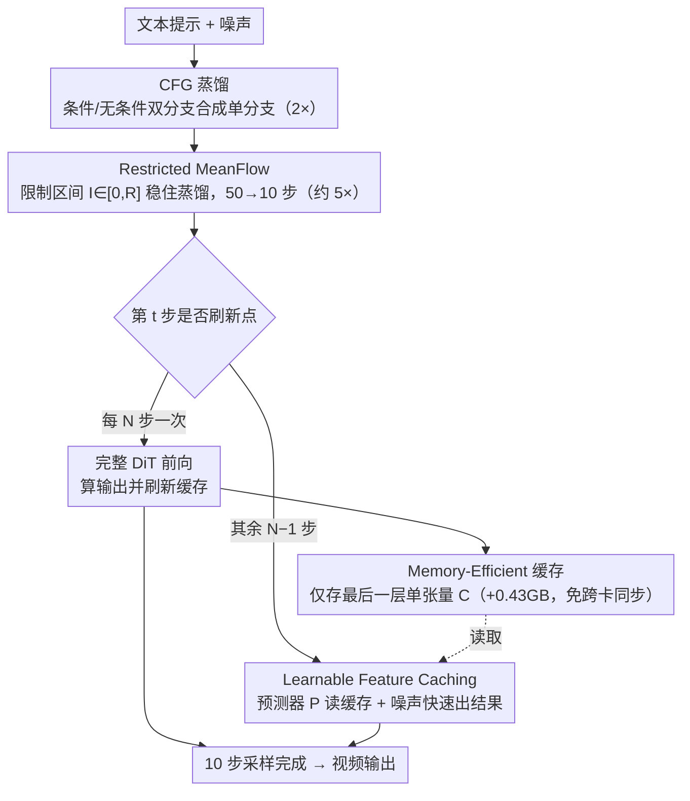

# DisCa: Accelerating Video Diffusion Transformers with Distillation-Compatible Learnable Feature Caching

**会议**: CVPR 2026  
**arXiv**: [2602.05449](https://arxiv.org/abs/2602.05449)  
**代码**: 即将公开  
**领域**: 视频生成 / 扩散模型加速  
**关键词**: 特征缓存, 步蒸馏, MeanFlow, 可学习预测器, HunyuanVideo

## 一句话总结

DisCa 首次将可学习特征缓存与步蒸馏统一为兼容框架，用轻量神经预测器（<4% 模型参数）替代手工缓存策略，配合 Restricted MeanFlow 稳定大规模视频 DiT 蒸馏，在 HunyuanVideo 上实现 11.8× 近无损加速。

## 研究背景与动机

**领域现状**：视频扩散模型（如 HunyuanVideo）生成质量已达 SOTA 水平，但推理极慢——以 HunyuanVideo 为例，50 步 CFG 推理生成一段 5 秒 704×704 视频需 1155 秒。现有加速手段主要有两条路线：减少采样步数的**步蒸馏**（如 MeanFlow），以及跳过冗余计算的**特征缓存**（如 TaylorSeer、TeaCache）。

**现有痛点**：步蒸馏方面，MeanFlow 在图像生成上表现优秀，但直接应用于大规模视频 DiT 时，JVP 运算的数值误差加上原始设计过于激进（目标一步生成），导致训练发散和严重伪影——10 步 MeanFlow 语义分直降 17.1%。特征缓存方面，传统方法依赖步间特征相似性进行复用或 Taylor 展开预测，但在步蒸馏后采样轨迹变得稀疏，相邻步特征差异剧增，简单手工策略完全失效——TaylorSeer 在高加速比场景下语义分也下降 13.3%。

**核心矛盾**：两种加速路线各有局限且难以兼容——蒸馏后的稀疏轨迹恰好破坏了缓存方法所依赖的步间冗余假设，简单叠加两者反而比单独使用更差。

**本文目标** 如何让步蒸馏和特征缓存两种加速策略真正兼容并互补，在大规模视频 DiT 上实现极致加速而不牺牲质量。

**切入角度**：用可学习的神经网络预测器替代手工缓存公式来捕捉高维特征演化；同时通过限制 MeanFlow 的压缩范围来稳定蒸馏过程。

**核心 idea**：蒸馏后的特征演化虽然超出 Taylor 展开等手工方法的建模能力，但轻量神经网络仍可准确学到这种高维演化规律。

## 方法详解

### 整体框架

DisCa 想解决的是一个看似矛盾的问题：步蒸馏和特征缓存这两条加速路线，单独用都有效，叠在一起反而更差——因为蒸馏把采样轨迹压稀疏后，相邻步的特征差异剧增，破坏了缓存方法赖以工作的"步间冗余"假设。DisCa 的做法是把两者重新组织成一条三级级联流水线，让它们互补而非互斥。

输入端先用 **CFG 蒸馏**把条件/无条件双分支推理合成单分支，省掉一半前向（2× 加速）；中间用 **Restricted MeanFlow** 做步蒸馏，把 50 步采样压到 10 步（约 5× 加速）；最后用 **Learnable Feature Caching**，在蒸馏后的稀疏轨迹上让一个轻量预测器替完整 DiT 干活——每 $N$ 步才做一次完整前向把缓存"刷新"一遍，中间 $N-1$ 步全部交给预测器快速出结果。三级叠加，最终在 HunyuanVideo 上跑到 11.8× 加速而质量近无损。

### 关键设计

**1. Restricted MeanFlow：用区间限制把激进的步蒸馏拉回稳定区**

直接把 MeanFlow 搬到大规模视频 DiT 上会训练发散——10 步时语义分暴跌 17.1%。问题出在 MeanFlow 把平均速度区间 $\mathcal{I}=(t-r)$ 一路采样到 $[0,1]$、奔着一步生成去，可视频 DiT 的高复杂度让其中 JVP 运算的数值误差被放大，而过大的时间区间（高压缩比）又让误差层层累积，最终崩盘。Restricted MeanFlow 的修法朴素到只改一个采样范围：引入限制因子 $\mathcal{R}\in(0,1)$，把区间约束成 $\mathcal{I}\in[0,\mathcal{R}]$，相当于直接剪掉压缩比过高的训练样本（实验里 $\mathcal{R}=0.2$ 最优）。与其逼模型学全局平均速度，不如让它稳稳学好局部平均速度，再靠多步串联拼出高质量结果——这一改在 10 步场景换来 12.0% 的语义分回升。

**2. Learnable Feature Caching：用神经预测器接住手工公式接不住的特征演化**

蒸馏之后步间特征差异巨大，已经超出 Taylor 展开这类手工缓存公式的建模上限——这正是 TaylorSeer 在高加速比下掉 13.3% 语义分的原因。DisCa 的判断是：这种高维非线性演化手工算不出，但数据驱动的网络学得出。于是它训练一个只含 2 个 DiT Block 的轻量预测器 $\mathcal{P}$（参数量 <4% 主模型），输入上一步完整计算留下的缓存 $\mathcal{C}$ 和当前噪声 $x_{t'}$，直接预测当前步的平均速度输出。关键差别在于：TaylorSeer 之流要为每层维护多阶导数缓存、额外吃掉 33.5GB 显存，而 DisCa 把"复杂缓存结构"换成了"预测器的学习能力"，只需保留最后一层的单个缓存张量（额外仅 0.43GB）。

**3. Memory-Efficient 缓存：单张量缓存绕开分布式并行的通信瓶颈**

显存只是一面，另一面是分布式部署里的隐性代价。在实际的 sequence parallel（并行度 4）环境下，为 DiT 每层维护多张量缓存意味着每步都要跨 GPU 同步这些缓存，通信开销反而把省下来的计算又吃回去。DisCa 干脆不为每层缓存，只把模型最终输出的那一个张量留作缓存传给预测器——既把额外显存压到 0.43GB，又彻底消掉了跨卡同步，使它成为唯一在真实部署里同时满足显存和延迟约束的方案。

### 一个完整示例：N=4 时一段视频怎么生成

设蒸馏后只剩 10 步采样、缓存间隔 $N=4$。第 1 步走完整 DiT 前向，算出输出的同时把最后一层张量存进缓存 $\mathcal{C}$；第 2、3、4 步不再碰大模型，全部由轻量预测器 $\mathcal{P}$ 读着 $\mathcal{C}$ 和当前噪声 $x_{t'}$ 快速出结果；到第 5 步重新做一次完整前向、把 $\mathcal{C}$ 刷新；第 6、7、8 步又交给预测器……如此循环。10 步里真正跑完整 DiT 的只有 3 次（第 1/5/9 步），其余 7 步都走预测器——这就是缓存层在蒸馏的 5× 之上又叠出来的那部分加速来源。

### 损失函数 / 训练策略

Predictor 训练采用 MSE + GAN 的两阶段策略：

- **MSE 阶段**（500 iter）：最小化预测器输出与大模型真实输出的 L2 距离
  $$\mathcal{L}_\mathcal{P} = \mathbb{E}\|\mathcal{M}_{\theta_M}(x_{t'}, r', t') - \mathcal{P}_{\theta_p}(\mathcal{C}, x_{t'}, r', t')\|_2^2$$
- **GAN 阶段**（1000 iter）：引入多尺度谱归一化判别器 $\mathcal{D}$，使用 Hinge Loss 进行对抗训练，强制预测器输出保留高频细节和视觉保真度。以大模型本身作为特征提取器 $\mathcal{F}$，在特征空间进行对抗
- 超参：预测器学习率 $10^{-4}$，判别器学习率 $10^{-2}$，对抗损失权重 $\lambda=1.0$

## 实验关键数据

### 主实验

实验在 HunyuanVideo 上进行，生成 704×704 分辨率、129 帧、5 秒视频，使用 VBench 评测。

**Restricted MeanFlow 对比**（与原始 MeanFlow 基线比）：

| 方法 | 步数 | 加速比 | 语义分↑ | 质量分↑ | 总分↑ |
|------|------|--------|---------|---------|-------|
| Original 50 步 | 50×2 | 1.0× | 73.5% | 81.5% | 79.9% |
| MeanFlow 20 步 | 20 | 4.96× | 66.6% | 81.8% | 78.8% |
| Restricted MeanFlow (R=0.2) 20 步 | 20 | 4.97× | **70.4% (+5.7%)** | 81.8% | 79.5% |
| MeanFlow 10 步 | 10 | 9.68× | 60.9% | 80.6% | 76.7% |
| Restricted MeanFlow (R=0.2) 10 步 | 10 | 9.68× | **68.2% (+12.0%)** | 81.3% | 78.7% |

**DisCa 与现有加速方法全面对比**：

| 方法 | 加速比 | Peak VRAM | 语义分↑ | 质量分↑ | 总分↑ |
|------|--------|-----------|---------|---------|-------|
| Original 50 步 | 1.0× | 99.23GB | 73.5% | 81.5% | 79.9% |
| Δ-DiT (N=8) | 4.55× | 97.68GB | 42.7% (-41.9%) | 70.9% | 65.2% |
| PAB (N=8) | 6.46× | 121.3GB | 56.3% (-23.4%) | 76.1% | 72.1% |
| TeaCache (l=0.4) | 9.22× | 97.70GB | 62.1% (-15.5%) | 78.7% | 75.4% |
| TaylorSeer (N=6) | 6.96× | 130.7GB | 63.7% (-13.3%) | 79.9% | 76.7% |
| FORA (N=6) | 8.01× | 124.6GB | 57.5% (-21.8%) | 76.4% | 72.6% |
| **DisCa (R=0.2, N=2)** | **7.56×** | **97.64GB** | **70.8% (-3.7%)** | **81.9%** | **79.7%** |
| **DisCa (R=0.2, N=3)** | **8.84×** | **97.64GB** | **70.3% (-4.4%)** | **81.8%** | **79.5%** |
| **DisCa (R=0.2, N=4)** | **11.8×** | **97.64GB** | **69.3% (-5.7%)** | **81.1%** | **78.8%** |

### 消融实验

| Restricted MeanFlow | Learnable Predictor | GAN Training | 语义分↑ | 质量分↑ | 总分↑ |
|:---:|:---:|:---:|---------|---------|-------|
| ✔ | ✔ | ✔ | 69.3% (+0.0%) | 81.1% (+0.0%) | 78.7% |
| ✘ | ✔ | ✔ | 65.2% (-5.9%) | 80.3% (-1.0%) | 77.3% |
| ✔ | ✘ | — | 67.3% (-2.9%) | 80.5% (-0.7%) | 77.9% |
| ✔ | ✔ | ✘ | 68.5% (-1.2%) | 81.0% (-0.1%) | 78.5% |

### 关键发现

- **Restricted MeanFlow 是基石**：不用 Restricted 直接在原始 MeanFlow 上训练缓存，语义分暴跌 5.9%，生成结果出现"完全不可接受的畸变"
- **可学习预测器 vs 免训练缓存**：即使在 Restricted MeanFlow 加持下，免训练缓存仍损失 2.9% 语义分和 0.7% 质量分——高维特征演化确实需要学习才能捕捉
- **GAN 训练不可或缺**：去掉对抗训练语义分下降 1.2%，说明 MSE 损失+对抗损失的组合对保持语义保真度至关重要
- **显存效率优势明显**：DisCa 仅需 97.64GB（额外 +0.43GB），而 TaylorSeer 需 130.7GB（+33.5GB）、FORA 需 124.6GB（+27.4GB）

## 亮点与洞察

- DisCa 首次证明步蒸馏和特征缓存可以互补而非冲突：关键在于用可学习预测器替代对步间冗余的硬性依赖，从而在蒸馏带来的稀疏采样轨迹上仍能有效加速。这为扩散模型加速开辟了"training-free + training-aware 协同"的新路线。
- Restricted MeanFlow 的设计极其朴素——仅仅限制训练时的时间区间采样范围——却在 10 步场景下带来 12.0% 的语义分提升。这揭示了一个重要直觉：对于大规模复杂模型的蒸馏，放弃极端压缩目标反而能获得全局更优的质量-速度权衡。
- 单张量缓存设计不仅节省显存，还在分布式并行环境下避免了跨 GPU 通信的延迟瓶颈，使得 DisCa 成为唯一在实际部署场景下同时满足显存和延迟约束的方案。

## 局限与展望

- 需要额外训练预测器和判别器（约 1500 iter），不再是完全免训练方案，每换一个基础模型或分辨率都需要重新训练
- 仅在 HunyuanVideo 上验证，对其他视频 DiT（CogVideoX、Wan 等）的迁移性未知
- 限制因子 $\mathcal{R}$ 需要手动调参（实验中 0.2 最优），缺乏自适应选择策略

## 相关工作与启发

- **vs TaylorSeer**：TaylorSeer 用 Taylor 展开预测缓存特征，在蒸馏模型的稀疏轨迹上效果大幅下降（-13.3% 语义分）且显存开销巨大（+33.5GB）。DisCa 用可学习预测器解决了建模能力和显存两个瓶颈
- **vs TeaCache**：TeaCache 用时间步嵌入做自适应缓存决策，但在高加速比下仍损失 15.5% 语义分。DisCa 在更高加速比（11.8× vs 9.22×）下仅损失 5.7%
- **vs MeanFlow**：原始 MeanFlow 为一步生成设计，对大规模视频模型过于激进。Restricted MeanFlow 以极简的区间限制策略实现了稳定蒸馏

## 评分

- 新颖性: ⭐⭐⭐⭐⭐ 首次提出蒸馏兼容的可学习缓存框架，将两大加速路线统一
- 实验充分度: ⭐⭐⭐⭐⭐ 在 HunyuanVideo 上全面对比 6 种方法，消融清晰，显存/延迟分析完整
- 写作质量: ⭐⭐⭐⭐ 结构清晰、动机强，符号偏多但推导完整
- 价值: ⭐⭐⭐⭐⭐ 11.8× 近无损加速对视频生成实际部署价值极大

<!-- RELATED:START -->

## 相关论文

- [\[CVPR 2026\] Accelerating Diffusion-based Video Editing via Heterogeneous Caching: Beyond Full Computing at Sampled Denoising Timestep](accelerating_diffusion-based_video_editing_via_heterogeneous_caching_beyond_full.md)
- [\[ICLR 2026\] PreciseCache: Precise Feature Caching for Efficient and High-fidelity Video Generation](../../ICLR2026/video_generation/precisecache_precise_feature_caching_for_efficient_and_high-fidelity_video_gener.md)
- [\[ICML 2026\] WorldCache: Accelerating World Models for Free via Heterogeneous Token Caching](../../ICML2026/video_generation/worldcache_accelerating_world_models_for_free_via_heterogeneous_token_caching.md)
- [\[CVPR 2026\] Accelerating Autoregressive Video Diffusion via History-Guided Cache and Residual Correction](accelerating_autoregressive_video_diffusion_via_history-guided_cache_and_residua.md)
- [\[CVPR 2026\] VMonarch: Efficient Video Diffusion Transformers with Structured Attention](vmonarch_efficient_video_diffusion_transformers_with_structured_attention.md)

<!-- RELATED:END -->
