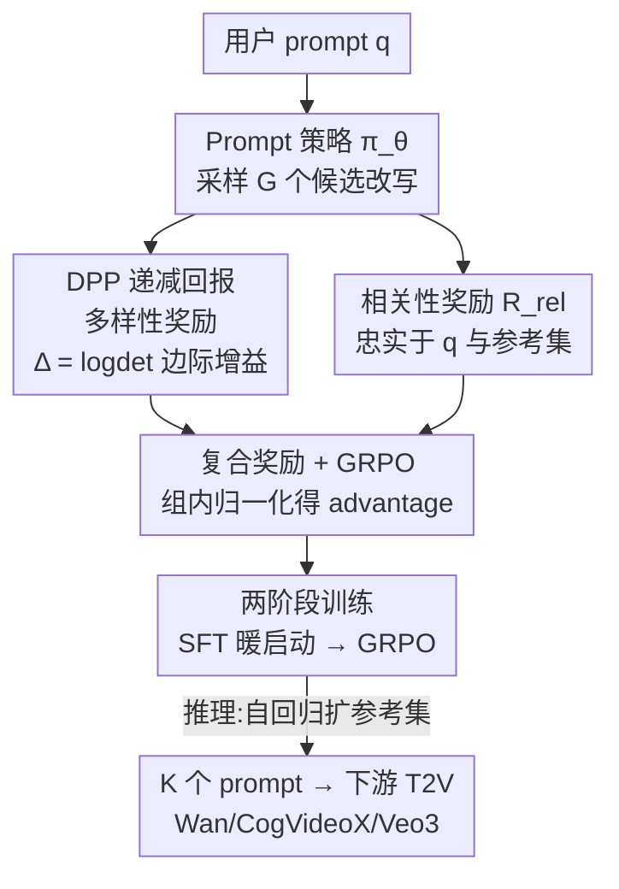

# Diverse Video Generation with Determinantal Point Process-Guided Policy Optimization

**会议**: CVPR 2026  
**论文**: [CVF Open Access](https://openaccess.thecvf.com/content/CVPR2026/html/Kazimi_Diverse_Video_Generation_with_Determinantal_Point_Process-Guided_Policy_Optimization_CVPR_2026_paper.html)  
**代码**: https://diverse-video.github.io （项目页，作者声明开源代码 + 30K prompt 基准）  
**领域**: 视频生成 / 扩散模型 / 强化学习对齐  
**关键词**: 文生视频, 多样性生成, 行列式点过程(DPP), GRPO, set-level 策略优化  

## 一句话总结
针对文生视频模型"同一 prompt 采多次结果高度雷同"的多样性塌缩问题，本文把"生成一组多样视频"建模成 set-level 策略优化，用 DPP 的边际增益给每个新样本一个"递减回报"的多样性奖励、再叠加一个相关性奖励，用 GRPO 训练一个**改写 prompt 的策略模型**（而非改视频生成器本身），即插即用地让 Wan2.1 / CogVideoX / Veo3 在不损失保真度的前提下显著提升镜头、场景、运动的多样性。

## 研究背景与动机
**领域现状**：文生视频（T2V）扩散模型在画质和 prompt 对齐上进步飞快，但当用户对同一个 prompt 多次采样、想要"一批不同的结果"时，模型往往反复输出风格、运镜、场景高度相似的视频，落入很窄的分布。

**现有痛点**：多样性塌缩在图像生成里早有研究，但已有方案搬到视频上几乎都失效。基于熵采样或注入噪声的方法（如 SPARKE）依赖**测试期迭代优化**和缓存历史 latent，对视频这种高维长序列代价过大；需要访问全部训练集做覆盖度优化、或要改模型架构（group sampling）的方法计算开销不可接受；更关键的是，这些方法都是为静态图像设计的，**忽略了视频独有的多样性维度**——物体运动、相机运镜、场景结构这些"电影化"因素。

**核心矛盾**：质量奖励（CFG、对齐奖励、标准 GRPO）天然偏好"高奖励样本"，advantage 归一化会把概率质量推向单一最优答案，于是**保真度和多样性互相打架**：越对齐就越塌缩成几个模态。用户只能靠 prompt engineering 和疯狂扫 seed/guidance 去碰运气，费时费算力且收益不稳定。

**本文目标**：给定一个 prompt 和目标集合大小 $K$，生成一组 $K$ 个视频，既覆盖运动 / 构图 / 视角的多种电影化变化，又都忠实于原意。

**切入角度**：与其在视频生成器内部反传梯度去逼它多样化（要 backprop 穿过整个视频采样，昂贵且要改模型），不如**只优化一个改写 prompt 的语言策略**——因为运镜、场景这些因素本来就能用 prompt token 自然控制，而且改 prompt 的策略对任何下游 T2V 模型（开源或黑盒 API）都即插即用。

**核心 idea**：把多样性变成一个**显式奖励信号**——用 DPP 的对数行列式度量一组样本张成的"语义体积"，新样本的边际增益越大说明它越填补了已有集合没覆盖的维度（递减回报：第一个 dolly 运镜奖励高，后续雷同变体收益递减），再用 GRPO 做组内相对反馈，把策略推向"整组联合最多样"而非"单个最高奖励"。

## 方法详解

### 整体框架
方法名为 **DPP-GRPO**。给定用户 prompt $q$、一个 T2V 生成器 $G$ 和目标输出数 $K$，目标是产出一组 prompt $P_q=\{p_1,\dots,p_K\}$，使其对应视频 $\{G(p_i)\}$ 既多样又忠实。整条管线优化的不是视频生成器，而是一个**改写/扩写 prompt 的语言策略 $\pi_\theta$**（实现用 Qwen2-7B-Instruct）。

训练时，对每个 prompt 采样 $G$ 个候选改写 $C_1,\dots,C_G$；每个候选由一个**复合奖励**打分——DPP 边际多样性增益 $\Delta(S\cup C_i)$ 加上相关性 $R_\text{rel}(C_i)$；组内归一化得到 advantage $A_i$，再用 DPP–GRPO 目标更新策略。整体走"SFT 暖启动 → GRPO 强化"两阶段，推理时**自回归**地一个个吐出 prompt、每出一个就加进参考集，逼后续候选去补没覆盖的模态。

### 关键设计

**1. Set-level 策略优化在 prompt 空间，而非视频空间**

本文不去改 T2V 模型，而是只训练一个改写 prompt 的语言策略。这一步直接回应"视频上做多样性太贵"的痛点：在 prompt 空间优化意味着**不需要把梯度反传穿过整个视频采样**，训练时间大幅缩短；运镜、构图、视角这些电影化因素本就能由 prompt token 控制，所以在 prompt 上做扰动是表达这些多样维度最自然的位置；而且产出的 prompt 是纯文本，可以喂给任意开源（Wan、CogVideoX）或黑盒（Veo3）模型，无需改架构、无需访问 latent 或梯度，真正即插即用。效率上的代价几乎为零——每条视频只增加 0.58s（+0.67% 开销），而测试期优化类方法（SPARKE）要 +12%、API 类（GPT-5）要 +26%。

**2. DPP 递减回报多样性奖励：用 log-det 边际增益量化"新样本补了多少没覆盖的模态"**

核心是用行列式点过程（DPP）度量一组 prompt 的多样性。按 L-ensemble 定义，构造相似度核矩阵 $L_\phi[p_i,p_j]=f(\phi(p_i),\phi(p_j))$，其中 $\phi(\cdot)$ 是语义嵌入、$f$ 取归一化余弦相似度，并对 $L_\phi+I$ 正则以避免奇异矩阵。一组 prompt 的多样性定义为对数行列式

$$\text{Div}(p_{1:k})=\log\det\big(L_\phi(p_{1:k})+I\big)$$

它度量这些嵌入向量张成的"对数体积"：向量越线性无关（越多样）体积越大，越相似则坍缩变小。关键的"递减回报"来自**边际增益**——给某个候选 $p_i$ 相对参考集 $R_q$ 的多样性奖励是它加入后体积的增量：

$$\Delta(p_i\mid R_q)=\log\det L_\phi(R_q\cup\{p_i\})-\log\det L_\phi(R_q)$$

直觉是：若 $p_i$ 张出了 $R_q$ 还没覆盖的维度，体积增量大、奖励高；若它和已有样本雷同，增量趋近于零。所以第一次出现的"dolly 运镜"奖励高、后续雷同变体回报递减，这正是"diminishing returns"抑制冗余的机制。这里 $R_q$ 是为 $q$ 精选的、彼此既忠实又互相多样的 ground-truth 变体（覆盖主体变化、运镜、布局等不同模态），让策略学会"把候选分散到这些模态上"而非塌缩到一个。

**3. 相关性奖励：双重约束防止"为多样而跑偏"**

只奖励多样性会让策略生成五花八门但偏离原意的 prompt。相关性项 $R_\text{rel}$ 同时约束候选 $p_i$ 既要像原 query $q$、又要像参考集元素 $g$：

$$R_\text{rel}=\frac{1}{|R_q|}\sum_{g\in R_q}\cos(\phi(p_i),\phi(q))\cdot\cos(\phi(p_i),\phi(g))$$

两个余弦相乘构成**联合约束**——必须对原 query 和有效变体都高相似才得高分。比如对"a dog playing with a ball at the beach"，"a dolly shot of a poodle playing with a red ball at the beach"该得高分，而"a dog playing near the beach with a ball"这种琐碎复制或无关变体会被压低。最终复合奖励把两项加权：

$$R(p\mid q,g)=\lambda_\text{div}\,\Delta(p_i\mid R_q)+\lambda_\text{rel}\,R_\text{rel}$$

默认 $\lambda_\text{div}=\lambda_\text{rel}=0.5$。两项各管一个失效模式：$\Delta$ 防多样性塌缩，$R_\text{rel}$ 守语义保真。

**4. 两阶段训练 + 自回归推理：把复合奖励喂进 GRPO**

训练先做 SFT 暖启动（最多 50 iter）：语料 $D=\{(x,y)\}$ 是"用户 prompt + 用 chain-of-thought 生成的多样变体"配对，让策略先有个会扩写的初始化。然后按 GRPO 强化（约 1200 iter）：对 query 采样 $G$ 个改写，用上面的复合奖励算 reward，再做组内归一化得 advantage

$$A_i=\frac{r_i-\text{mean}(r_{1:G})}{\text{std}(r_{1:G})}$$

代入带 clip 和 KL 正则的 GRPO 目标更新 $\pi_\theta$。这样策略学到一条**可迁移规则**：如何提出一个既扩展已有参考集语义覆盖、又忠实原 query 的新候选。推理时镜像训练结构——初始化空参考集 $R_q=\varnothing$，第一个 $p_1$ 只条件于 $(s,q)$ 生成并入集，随后**自回归**地给 $(s,q,R_q)$ 生成 $p_2,p_3,\dots$，每出一个就扩 $R_q$ 直到产出 $K$ 个；这让"评估相对于已构造集合的边际增益"的策略在推理期也成立，且无需再依赖训练时那套精选参考集。

### 损失函数 / 训练策略
- **奖励**：复合奖励 $R=\lambda_\text{div}\Delta+\lambda_\text{rel}R_\text{rel}$，默认两权重各 0.5。
- **目标**：标准 GRPO 目标（带 importance ratio clip 与 $\beta\,D_\text{KL}(\pi_\theta\Vert\pi_\text{ref})$）。
- **超参**：SFT 学习率 $2\times10^{-5}$（50 iter），GRPO 学习率 $2\times10^{-7}$（约 1200 iter）；视频 guidance scale 6、40 步、81 帧；4× NVIDIA L40S。
- **数据集**：用 GPT-5-nano 造 3K base prompt，再用 architect+critic 的 agentic pipeline（critic 用 TIE/TCE/CLIP 等视频级指标打分）每个扩出 10 个多样变体，得 30K 样本，作为该问题首个基准数据集。

## 实验关键数据

骨干：Wan2.1、CogVideoX（开源）+ Veo3（黑盒）。对齐模型 Qwen2-7B-Instruct。评测在 VBench 采 200 prompt、每 prompt 生成 20 视频（共 4000 视频/方法）。多样性指标：TCE（截断 CLIP 熵，语义多样性）、TIE（截断 Inception 熵，感知多样性）、VENDI（特征值熵的分布多样性）；质量用 VideoScore、VBench。基线：Promptist、Prompt-A-Video、GPT-5。

### 主实验（Wan2.1，多样性 + CLIP 对齐）

| 方法 | TCE↑ | TIE↑ | VENDI↑ | CLIP↑ |
|------|------|------|--------|-------|
| Original prompts | 19.76 | 39.70 | 9.20 | 0.280 |
| Promptist | 19.79 | 37.58 | 8.26 | 0.290 |
| GPT-5 | 16.71 | 29.27 | 8.15 | 0.305 |
| Prompt-A-Video | 15.72 | 24.10 | 8.45 | 0.304 |
| **Ours (DPP-GRPO)** | **31.95** | **49.09** | **11.29** | **0.311** |

多样性三项（TCE/TIE/VENDI）全面、显著领先；值得注意的是 prompt 优化基线（GPT-5、Prompt-A-Video）反而比原始 prompt 多样性更低（更对齐却更塌缩），印证了"质量奖励压多样性"的矛盾。本文在**提升多样性的同时 CLIP 对齐还最高**，说明多样性增益没牺牲保真。CogVideoX 上趋势一致（TCE 22.21→27.59、TIE 40.33→45.46、VENDI 8.10→10.30），且 VideoScore 最强。

### 消融实验（Wan2.1，复合奖励拆解，Table 3）

| 配置 | TCE↑ | TIE↑ | VENDI↑ | CLIP↑ | 说明 |
|------|------|------|--------|-------|------|
| Ours (SFT only) | 14.05 | 17.13 | 11.05 | 0.251 | 仅暖启动，多样性和对齐都弱 |
| Ours (only relevance) | 20.06 | 35.66 | 8.87 | 0.283 | 只留相关性 → 塌回类似 base 的重复输出 |
| Ours (only DPP) | 27.05 | 45.21 | 11.72 | 0.255 | 只留 DPP → 多样性高但文-视频一致性下滑 |
| **Ours (full)** | **31.95** | **49.09** | 11.29 | **0.311** | 双项平衡，多样性与保真同时最优 |

### 关键发现
- **双项奖励缺一不可**：只用相关性会塌缩成重复输出（TIE 仅 35.66）；只用 DPP 多样性冲高但 CLIP 掉到 0.255；完整模型在两个维度同时最好——确认"多样 vs 保真"必须靠复合奖励平衡，而非单项。
- **效率几乎免费**：每条视频仅 +0.58s（+0.67% 开销），仅次于 Promptist 的 +0.51s，远低于 SPARKE(+12%)、Prompt-A-Video(+12%)、GPT-5(+26%)——因为不反传穿过视频采样。
- **随集合增大持续发现新模态**：Wan 基线很早就在多样性上 plateau，DPP-GRPO 在每个集合规模上 TCE/TIE 都更高且持续上升，CLIP 对齐保持稳定。
- **模型无关**：Wan / CogVideoX / Veo3 上都涨，多样性建模不绑定特定扩散模型。
- **人类评测**（10 prompt、每组 4 clip、盲评 5 分 Likert）：Diversity 4.07、Alignment 4.28，两项都显著高于所有基线。
- **条件指标稳健**：换 DINOv2 等嵌入后 VENDI 3.207→9.848、CondVENDI 3.006→4.932、RKE 1.729→3.876，多样性增益不依赖单一嵌入选择。

## 亮点与洞察
- **把"递减回报"做成显式奖励**：DPP 的 log-det 边际增益天然让"第一个新模态高分、雷同变体收益递减"，这比简单的 pairwise 距离更适合刻画 set 级多样性——是这篇最"啊哈"的设计，把抽象的"多样性"翻译成了可被 GRPO 直接优化的标量。
- **在 prompt 空间而非视频空间优化**，一举拿下效率（不反传视频）+ 可控性（运镜靠 token）+ 通用性（黑盒 API 也能用）三件事，是把问题"挪位置"的巧思，可迁移到任何想多样化但生成器昂贵/不可访问的场景。
- **自回归扩参考集的推理**与训练目标严格对齐：每个新样本都相对"已生成集合"评估边际增益，使学到的多样化策略在推理期无需精选参考集即可工作。
- **复合奖励的"双余弦联合约束"**（对 query 和对参考集都要相似）是个可复用的相关性度量 trick，能有效压掉"为多样而跑题"。

## 局限与展望
- 作者承认：方法**继承底座模型在复杂时序动态上的局限**——时序由生成器的 temporal attention 决定，本文只改 prompt，管不到运动的物理合理性。
- ⚠️ 多样性主要来自 prompt 层面的语义/电影化扰动，对于"同一语义下细粒度的运动学多样性"（如同一动作的不同力学表现）是否真正多样，正文未深入，需看补充材料。
- 参考集 $R_q$ 的质量（由 GPT-5-nano + agentic pipeline 构造）直接影响策略学到的模态分布，对该数据构造的依赖与偏差未做充分敏感性分析（仅在 SM 提供 $R_q$ 消融）。
- 评测多样性指标（TCE/TIE/VENDI）本身偏帧级特征熵，与人类感知的"有意义的多样"未必完全一致，尽管人类研究给出了正向佐证。
- 改进方向：把 DPP 多样性奖励直接接入生成器的少量可训练参数（如 LoRA），在保持即插即用的同时覆盖时序多样性。

## 相关工作与启发
- **vs 图像多样性方法（SPARKE / 低密度采样 / DreamDistribution）**：它们多为图像设计、依赖测试期迭代优化或访问内部模型/训练集，开销大且不覆盖视频独有的运动-运镜-场景维度；本文 prompt 级 + DPP 边际增益，开销近乎为零且面向视频电影化因素。
- **vs RL-based 视频生成（VideoDPO / Flow-DPO / DenseDPO / DanceGRPO）**：这些把偏好学习/GRPO 用于提升**单条视频**的质量、运动平滑或时序一致，优化的是"更好"；本文优化的是"一组更不一样"，是首个直接针对视频生成**多样性**的工作。
- **vs DisCo**：同样用 GRPO + 组合奖励，但 DisCo 解决多人生成的身份重复；本文解决通用 T2V 的 set 级多样性塌缩，用 DPP 把多样性显式化。
- **vs Promptist / Prompt-A-Video / GPT-5（prompt 优化基线）**：它们改写 prompt 以提质量/对齐，实验显示反而降低多样性（更塌缩）；本文证明在 prompt 空间也能同时拿到多样性与对齐。

## 评分
- 新颖性: ⭐⭐⭐⭐⭐ 首个直接攻视频生成多样性的工作，DPP 边际增益 × GRPO 的 set-level 形式化很干净
- 实验充分度: ⭐⭐⭐⭐ 三骨干 + 多样性/质量/人类研究/效率全覆盖，奖励项消融到位；但时序多样性、$R_q$ 依赖的分析偏弱
- 写作质量: ⭐⭐⭐⭐ 动机-公式-机制链条清晰，框架图与目标对齐；部分细节（$R_q$ 构造、时序局限）压在补充材料
- 价值: ⭐⭐⭐⭐⭐ 即插即用、近零开销、对黑盒 API 也适用，外加 30K 多样 prompt 基准，实用与生态价值都高

<!-- RELATED:START -->

## 相关论文

- [\[CVPR 2026\] VIVA: VLM-Guided Instruction-Based Video Editing with Reward Optimization](viva_vlm-guided_instruction-based_video_editing_with_reward_optimization.md)
- [\[CVPR 2026\] Identity-Preserving Image-to-Video Generation via Reward-Guided Optimization](identity-preserving_image-to-video_generation_via_reward-guided_optimization.md)
- [\[CVPR 2026\] Generative Video Motion Editing with 3D Point Tracks](generative_video_motion_editing_with_3d_point_tracks.md)
- [\[CVPR 2025\] Optical-Flow Guided Prompt Optimization for Coherent Video Generation](../../CVPR2025/video_generation/optical-flow_guided_prompt_optimization_for_coherent_video_generation.md)
- [\[CVPR 2026\] DynamicsBoost: Dynamic Plausible Video Generation via Annotation-Free Continuation Preference Optimization](dynamicsboost_dynamic_plausible_video_generation_via_annotation-free_continuatio.md)

<!-- RELATED:END -->
