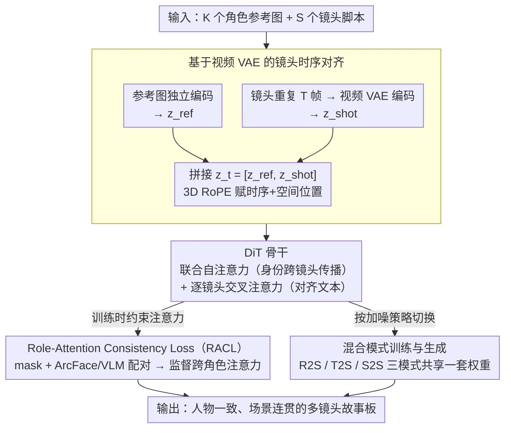

# DreamShot: Personalized Storyboard Synthesis with Video Diffusion Prior

**会议**: CVPR 2026  
**arXiv**: [2604.17195](https://arxiv.org/abs/2604.17195)  
**代码**: [https://ll3rd.github.io/DreamShot/](https://ll3rd.github.io/DreamShot/)  
**领域**: 视频生成  
**关键词**: 故事板生成, 视频扩散模型, 角色一致性, 多角色参考, 注意力约束

## 一句话总结

提出 DreamShot，利用视频扩散模型的时空先验来生成人物一致、场景连贯的多镜头故事板，通过 Role-Attention Consistency Loss 解决多角色混淆问题，统一支持文本到镜头、参考到镜头和镜头到镜头三种模式。

## 研究背景与动机

**领域现状**：故事板生成旨在为电影叙事生成连贯的关键镜头序列。当前方法主要分两类：基于图像扩散模型的方法（如 StoryDiffusion、AnyStory、StoryMaker）通过 IP-Adapter 或 ControlNet 保持角色一致性；基于视频模型的方法（如 StoryAnchors）利用时序一致性但仅支持文本或前帧条件。

**现有痛点**：图像模型天然倾向多样性而非时序稳定性，跨镜头角色一致性差，在多角色场景下出现严重的角色混淆（不同角色的面部、服装特征错误融合）。视频模型虽有更好的一致性但密集帧生成计算开销大，且缺乏细粒度的个性化控制。

**核心矛盾**：图像模型有灵活性但缺一致性，视频模型有一致性但缺效率——存在根本性的 trade-off。

**本文目标**：结合视频模型的时空一致性先验与图像级生成的效率和可控性，实现高质量个性化故事板。

**切入角度**：视频 VAE（如 Wan-VAE）将连续帧压缩到潜空间时保持因果时序结构，如果把每个故事板镜头重复 T 帧再编码，就能将独立的静态镜头转化为一个连贯的时序潜空间序列。

**核心 idea**：在视频扩散模型（DiT）的框架下，将角色参考图像作为时序前置锚点、故事板镜头作为后续时序段，利用 3D RoPE 位置编码自然传播角色身份信息，同时通过 RACL 约束跨角色注意力防止混淆。

## 方法详解

### 整体框架

DreamShot 要解决的核心问题是：怎么让一串静态故事板镜头既保持角色身份稳定、又保持场景连贯，同时还能像图像生成那样只产出关键帧而不是密集视频。它的做法是把这件事整个搬到视频扩散模型（Video-VAE + DiT）里来做。输入是 K 个角色参考图像加 S 个镜头的文本脚本；每个参考图像单独编码成潜向量，每个故事板镜头先被「假装」成一段视频（重复成 T 帧）再由视频 VAE 编码。参考 token 和镜头 token 拼成一条序列送进 DiT——自注意力在所有 token 上联合计算，让角色身份能跨镜头流动；交叉注意力则按镜头各自和对应文本对齐，保证每个镜头画的是脚本里说的内容。这套结构同时撑起三种使用方式：给参考图生成镜头（Reference-to-Shot）、纯文本生成镜头（Text-to-Shot）、以及在已有镜头后续写（Shot-to-Shot）。

### 关键设计

**1. 基于视频 VAE 的镜头时序对齐：把孤立镜头骗成一段连贯视频**

故事板的镜头本是彼此独立的静态图，图像模型逐帧画就天然缺乏跨镜头的身份延续。DreamShot 的切入点是利用视频 VAE 的因果时序结构：把除首镜头外的每个镜头重复成 T 帧再编码，得到 $z_{shot} \in \mathbb{R}^{s \times d \times h \times w}$；参考图像编码为 $z_{ref}$，再沿序列把两者拼起来 $z_t = [z_{ref}, z_{shot}]$，由视频模型的 3D RoPE 统一给上时序与空间位置。关键在排布顺序——参考图放在序列最前端、镜头按叙事顺序排在后面，DiT 在做联合自注意力时就会自然地把角色身份沿时间轴往后传播。这等于不改架构、只靠摆放位置，就让原本只会画单帧的 DiT 获得了图像模型缺失的跨镜头一致性传播能力。

**2. Role-Attention Consistency Loss（RACL）：让每个角色只盯着自己**

多角色场景里最棘手的混淆——A 的脸长到 B 身上、两人的服装特征互相串味——根子在注意力层：不同角色的特征在自注意力里被错误地揉到了一起。RACL 直接在这一层动手。它先拿到角色的空间归属：参考图一侧用显著性检测取角色 mask，故事板一侧用 grounding segmentation 取角色 mask，再用 ArcFace 加 VLM 把参考角色和镜头角色一一对上号。配好对之后，在 DiT 自注意力里取出参考角色 $r_k$ 与故事板角色 $s_k$ 之间的注意力图 $A_{r_k\text{-}s_k}$，拿对应的 mask 当监督，逼这张注意力图把质量压在匹配的角色区域上。也就是说，它不是事后纠错，而是从训练阶段就显式禁止角色之间的注意力越界，把混淆掐死在源头。

**3. 混合模式训练与生成：一个模型吃下创作和续写两种需求**

真实的故事板制作既要从零起一组镜头，也要在已有镜头后接着画，为这两件事各训一个模型既费力又割裂。DreamShot 用加噪策略把它们统一进同一框架：Reference-to-Shot 只对镜头 token 加噪、参考图保持干净，让身份信息单向流入；Text-to-Shot 对所有镜头 token 加噪，纯靠文本驱动；Shot-to-Shot 则把前序镜头当作干净条件去引导后续镜头的生成。三种模式共享同一套 Flow Matching 训练目标，区别只在「哪些 token 干净、哪些加噪」，因此一套权重就能在推理时按需切换场景。

### 损失函数 / 训练策略

主损失为 Flow Matching 目标 $\mathcal{L}_{diff}$，RACL 作为辅助损失约束角色注意力一致性。数据集由真实和合成视频中提取的时序连贯镜头序列构建，每个序列配有代表性参考帧和镜头级标注。

## 实验关键数据

### 主实验

论文强调了与图像模型方法的定性和定量对比，展示了在角色一致性、场景连贯性和生成效率方面的优势。DreamShot 在多角色场景中避免了角色混淆问题，而 StoryDiffusion、AnyStory 等图像模型方法频繁出现角色特征错位。

| 对比维度 | DreamShot | 图像模型方法 |
|---------|-----------|------------|
| 角色一致性 | 强（跨镜头身份稳定） | 弱（频繁角色混淆） |
| 场景连贯性 | 强（视频先验保证） | 弱（镜头间不一致） |
| 多角色支持 | 良好（RACL 约束） | 差（特征纠缠） |
| 生成效率 | 高（关键帧而非密集帧） | 中等 |

### 消融实验

| 配置 | 角色一致性指标 | 说明 |
|------|-------------|------|
| Full model | 最优 | RACL + 视频先验 |
| w/o RACL | 下降 | 多角色场景出现混淆 |
| 图像模型 backbone | 显著下降 | 缺乏时序一致性 |

### 关键发现

- 视频扩散先验对跨镜头一致性的贡献是决定性的，不是简单的图像模型"升级"能替代的
- RACL 在多角色（≥2）场景中的效果尤为显著，单角色场景下增益有限
- Shot-to-Shot 模式的续写质量高度依赖前序镜头的质量

## 亮点与洞察

- "用视频模型生成关键帧而非密集帧"的思路很巧妙——保留了视频先验的一致性优势，同时避免了大量冗余帧的计算浪费
- RACL 的设计直击多角色混淆的根本原因（注意力层面的特征纠缠），通过显式的 mask 监督约束注意力分布，思路清晰且有效
- 将参考图像放在 token 序列前端利用 3D RoPE 的时序编码来传播身份信息，这是对视频模型位置编码语义的创造性利用

## 局限与展望

- 依赖预训练视频模型（如 Wan2.1）的质量，受限于基础模型的生成能力
- RACL 需要角色 mask 检测和一对一匹配，在遮挡严重或角色外观相似时可能失效
- 当前评估主要基于定性比较，缺乏标准化的故事板生成 benchmark
- 未来可扩展至交互式编辑（修改特定镜头而保持其余不变）

## 相关工作与启发

- **vs StoryDiffusion/StoryAdapter**: 基于图像模型的跨帧注意力一致性方法，本质上受限于图像模型的帧独立性，本文通过视频先验从根本上解决了一致性问题
- **vs StoryAnchors**: 同样使用视频范式，但只支持文本/前帧条件，缺乏多角色参考控制

## 评分

- 新颖性: ⭐⭐⭐⭐ 视频先验驱动的故事板生成是新方向，RACL 设计巧妙
- 实验充分度: ⭐⭐⭐ 定性为主，缺乏标准化定量对比
- 写作质量: ⭐⭐⭐⭐ 动机清晰，框架描述完整
- 价值: ⭐⭐⭐⭐ 开辟了故事板生成的新范式，实用性强

<!-- RELATED:START -->

## 相关论文

- [\[CVPR 2026\] Generative Neural Video Compression via Video Diffusion Prior](generative_neural_video_compression_via_video_diffusion_prior.md)
- [\[CVPR 2026\] MoVieDrive: Urban Scene Synthesis with Multi-Modal Multi-View Video Diffusion Transformer](moviedrive_urban_scene_synthesis_with_multi-modal_multi-view_video_diffusion_tra.md)
- [\[ICLR 2026\] JavisDiT: Joint Audio-Video Diffusion Transformer with Hierarchical Spatio-Temporal Prior Synchronization](../../ICLR2026/video_generation/javisdit_joint_audio-video_diffusion_transformer_with_hierarchical_spatio-tempor.md)
- [\[CVPR 2026\] NOVA: Sparse Control, Dense Synthesis for Pair-Free Video Editing](nova_sparse_control_dense_synthesis_for_pair-free_video_editing.md)
- [\[CVPR 2025\] StreetCrafter: Street View Synthesis with Controllable Video Diffusion Models](../../CVPR2025/video_generation/streetcrafter_street_view_synthesis_with_controllable_video_diffusion_models.md)

<!-- RELATED:END -->
