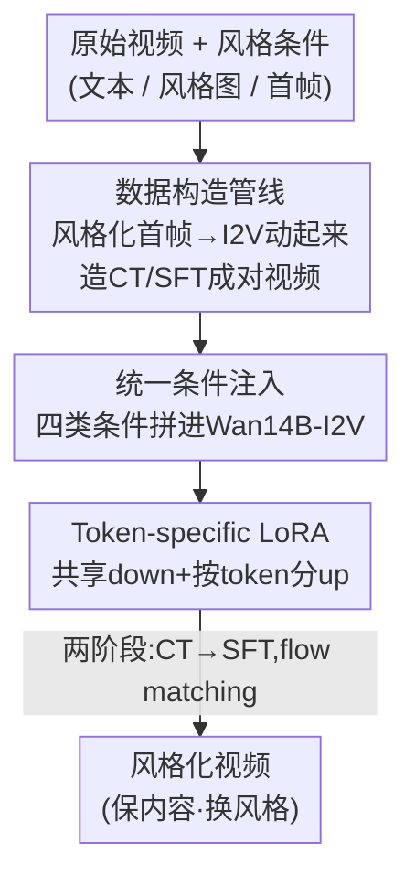

# DreamStyle: A Unified Framework for Video Stylization

**会议**: CVPR 2026  
**论文**: [CVF Open Access](https://openaccess.thecvf.com/content/CVPR2026/html/Li_DreamStyle_A_Unified_Framework_for_Video_Stylization_CVPR_2026_paper.html)  
**代码**: 未公开  
**领域**: 视频生成 / 视频风格化 / 扩散模型  
**关键词**: 视频风格化, 统一框架, 条件注入, Token-specific LoRA, 数据构造管线

## 一句话总结
DreamStyle 把文本、风格图、风格化首帧这三种风格条件统一进一个基于 Wan14B-I2V 的视频风格化模型，靠一套「先风格化首帧、再 I2V 生成成对视频」的数据构造管线解决无配对数据问题，并用 token-specific LoRA 消除不同条件 token 之间的串扰，在三类风格化任务上都打过各自的专用模型。

## 研究背景与动机

**领域现状**：视频风格化是视频生成的重要下游任务，输入风格条件通常有三种——文本（最灵活）、风格图（视觉锚点最准）、风格化首帧（让长视频风格化可行）。每种条件各有所长，但现有方法（TokenFlow、StyleCrafter、StyleMaster、UNIC 等）几乎都只支持其中**一种**，适用面被锁死。

**现有痛点**：单模态条件本身就有硬伤——文本提示模糊、约束弱，描述不了抽象风格；风格图虽然视觉准，但对没见过的风格很难找到合适的参考图，可用性和创造力都差。更要命的是**缺高质量成对视频数据**：一类方法从图像风格化数据集学能力再迁到视频，天然要在风格一致性、时序一致性、运动幅度三者间做妥协；UNIC 用 T2V 合成风格化视频再用 gray-tile ControlNet 反演出真实视频凑配对，但质量被 T2V 模型卡住，且 tile ControlNet 的严格对齐处理不了带几何形变的风格。

**核心矛盾**：现有 SOTA 风格化方法被绑死在「单条件 + 无好数据」上，而要做统一模型，又会撞上一个新问题——多种条件 token 喂进同一个模型时会互相干扰（inter-token confusion），用标准 LoRA 训会出现风格退化、风格混淆。

**本文目标**：(1) 一个模型同时支持文本/风格图/首帧三种条件；(2) 造出高质量的「风格化-原始」成对视频数据；(3) 顺带解锁多风格融合、长视频风格化等扩展应用。

**切入角度**：当前图像生成/编辑模型在视觉质量、结构、美学、文本跟随上都强于视频模型，所以**让图像模型先把首帧风格化好**，再用 I2V 模型把高质量首帧「动起来」，首帧天然成了风格约束 + 内容锚点。

**核心 idea**：把视频风格化重构成一个统一的 Video-to-Video（V2V）任务——在原版 I2V 模型上通过精心设计的条件注入机制塞进四类条件，配 token-specific LoRA 区分条件 token，再用自建的成对数据两阶段训练。

## 方法详解

### 整体框架
DreamStyle 由两条相对独立又前后衔接的管线构成：**离线的数据构造管线**先造出成对训练数据，**在线的 DreamStyle 框架**在 Wan14B-I2V 上注入四类条件并用专门的 LoRA 训练。输入是一段原始视频加任意一种（或多种）风格条件，输出是保留原视频主体内容、但换成目标风格的视频。

数据侧：取一段真实视频，用 SOTA 图像风格化模型把首帧（及其他参考图）风格化，再用配了 ControlNet 的 I2V 模型把首帧动成完整风格化视频，从而和原视频凑成「风格化-原始」配对，经自动+人工过滤后得到大规模 CT 数据集和小规模高质量 SFT 数据集。模型侧：把原视频走图像通道、文本走 cross-attention、风格化首帧拼到序列开头、风格图拼到序列末尾，统一喂进 DiT，用 token-specific LoRA 微调，flow matching loss 监督。

### 关键设计

**1. 数据构造管线：用「先风格化首帧、再 I2V 动起来」绕开无配对数据的死结**

视频风格化最大的瓶颈是没有「同一段运动、一边真实一边风格化」的成对视频。本文的关键观察是：图像模型的质量远超视频模型，且**一帧高质量风格化首帧能为整段 I2V 生成提供风格约束和内容锚点**。于是管线分两步：先用图像风格化模型把原视频首帧（及 K 张额外参考图）风格化，再用 I2V 模型把首帧生成成完整风格化视频。为保证风格化视频和原视频的运动一致（这样才能配对），作者给自家 I2V 模型定制了 depth 和 human-pose 两个 ControlNet——depth 适合通用场景，pose 对人体运动控制更精准、还能容忍较大形变。这里有个 ⚠️ 值得注意的细节：直接用「从原视频抽的控制条件」去驱动风格化首帧会出现运动错配（depth/pose 抓不全复杂运动动态，见原文 Fig.4），所以作者改成**用同一份控制条件同时驱动风格化视频和原视频的生成**，把错配压下去。

数据形式化为 $D=\{(x_i^{raw}, x_i^{sty}, t_i^{ns}, t_i^{sty}, s_i^{1...K})\}$，其中 $x^{raw}/x^{sty}$ 是原始/风格化视频，$t^{ns}/t^{sty}$ 是「不含/含风格描述」的两套文本（用 VLM 给风格化视频打 caption，生成 $t^{ns}$ 时强制剔除画风、色板、纹理、色调等风格相关属性），$s^{1...K}$ 是 K 张风格参考图。考虑到两类图像风格化模型特性不同，作者造了两套数据：用 InstantStyle（SDXL + depth ControlNet + ID plugin）生成大规模 CT 数据保证核心能力和泛化；用 Seedream 4.0 生成小规模高质量 SFT 数据抬上限。质量控制上 CT 数据用 VLM + CSD score 自动过滤（CSD > 0.5），SFT 数据则全人工过滤并核对内容一致性。

**2. 统一条件注入：把四类条件按各自语义角色「各走各的门」塞进同一个 I2V 模型**

要在一个模型里统一三种风格条件，难点是怎么让四类条件（原视频 + 文本/风格图/首帧三种风格条件）互不打架地进入网络。DreamStyle 建在 Wan14B-I2V 上，针对每类条件用最贴合的注入口、并坚持「对基座最小改动」：

- **文本条件**：直接复用 Wan14B-I2V 原生的文本 cross-attention，不做任何改动；
- **首帧条件**：把风格化首帧喂进基座原有的图像条件通道，并把首帧的 mask 通道置 1.0（和基座 I2V 一致）；
- **风格图条件**：设风格图 VAE latent 为 $z^s$，沿通道维拼成 $z^s_t = \text{add\_noise}(z^s,t)\oplus_c \mathbf{1}^{4\times1\times H\times W}\oplus_c z^s$，其中 $\oplus_c$ 是通道拼接、mask 通道全填常数 1.0；同时还借用 Wan14B-I2V 自带的 CLIP 图像特征分支注入风格图的高层语义，强化风格语义一致性；
- **原视频条件**：把原视频和风格化视频编码成 latent 后，沿通道拼上**全 0** 的 mask：$z^v_t = \text{add\_noise}(z^{sty},t)\oplus_c \mathbf{0}^{4\times F\times H\times W}\oplus_c z^{raw}$（mask 取 0.0 仍是「最小改动」原则）。

关键在于不同条件用**帧维拼接**组织进序列：风格图张量 $z^s_t$ 作为额外一帧拼到 $z^v_t$ 末尾（$z^v_t \oplus_f z^s_t$）以实现风格图引导；首帧张量 $z^{1st}_t$ 拼到开头（$z^{1st}_t \oplus_f z^v_t$）以实现首帧引导。这种「图像通道注原视频 + 帧维拼额外条件」的方式相比 UNIC 的 in-context 帧注入，额外计算开销极小，保住了原 I2V 模型的效率和固有能力。

**3. Token-specific LoRA：让一个 LoRA 按 token 类型分头适配，消除条件 token 串扰**

patchify 之后，首帧、风格图、原视频三类条件变成三段 token 序列，但它们语义角色完全不同，用标准 LoRA 微调会导致 inter-token confusion（实测出现风格退化、风格混淆）。受 HydraLoRA 启发，作者把 LoRA 的 up 矩阵做成**token-specific**：对输入 token $x_{in}$，先过一个**共享**的 down 矩阵 $W_{down}$，再按 token 类型 $i\in\{0,1,2\}$ 选对应的 up 矩阵算残差 $x_{out}=W^i_{up}W_{down}x_{in}$，作用在 full attention 和 FFN 层。这本质上是一个「人工路由的 LoRA MoE」——大部分参数（down 矩阵）共享保证训练稳定，少量 up 矩阵分头让模型对三类 token 学到各自适配的特征。消融显示去掉它 CSD score 从 0.515 掉到 0.413，是风格一致性的关键。

### 损失函数 / 训练策略
训练沿用 flow matching 目标。模型 $v_\theta$ 接收五个输入（视频张量 $z^v_t$、时间步 $t$、首帧张量 $z^{1st}_t$、风格图张量 $z^s_t$、文本 $t^{ns/sty}$），每个 batch 按预设比例随机采样风格条件，目标为三类任务的回归项之和：

$$L(\theta)=\mathbb{E}_D\|v_\theta(z^v_t,t,\varnothing,\varnothing,t^{sty})-(z^{sty}-\epsilon)\|^2 + \mathbb{E}_D\|v_\theta(z^v_t,t,\varnothing,z^s_t,t^{ns})-(z^{sty}-\epsilon)\|^2 + \mathbb{E}_D\|v_\theta(z^v_t,t,z^{1st}_t,\varnothing,t^{ns})-(z^{sty}-\epsilon)\|^2$$

三项依次对应文本引导、风格图引导、首帧引导，$\epsilon\sim N(0,1)$。三种条件采样比例为文本:风格图:首帧 = 1:2:1。采用**两阶段训练**：第一阶段在 40K 的大规模 CT 数据上训 6000 步，让模型学到多样风格、建立三条件的基础能力；第二阶段在 5K 高质量 SFT 数据上训 3000 步，抬升视觉质量和风格一致性。LoRA rank=64，AdamW，lr=4e-5，8×A100，有效 batch size 16（per-GPU=1 + 2 步梯度累积），总计约 1700 A100 GPU 小时。

## 实验关键数据

### 主实验
三类任务分别对比专用模型/商业模型。文本引导对比 Luma/Pixverse/Runway（无开源专用模型），风格图引导对比 StyleMaster，首帧引导对比 VACE/VideoX-Fun。CSD score 量风格一致性，DINO 量结构保留，外加 VBench 五项质量指标。

| 任务 | 方法 | CSD↑ | DINO↑ | Dynamic↑ | Aesthetic↑ |
|------|------|------|-------|----------|-----------|
| 文本引导 | Runway | 0.154 | — | 0.504 | 0.606 |
| 文本引导 | **DreamStyle** | **0.167** | — | **0.584** | **0.656** |
| 风格图引导 | StyleMaster(T2V) | 0.198 | — | 0.289 | 0.610 |
| 风格图引导 | **DreamStyle(T2V)** | **0.532** | — | 0.689 | **0.641** |
| 风格图引导 | DreamStyle(V2V) | 0.515 | 0.526 | **0.867** | 0.635 |
| 首帧引导 | VideoX-Fun | 0.766 | **0.702** | 0.844 | 0.594 |
| 首帧引导 | **DreamStyle** | **0.851** | 0.640 | 0.856 | **0.630** |

> 注：文本引导这一栏的「CSD」实为 CLIP-T（只用风格提示词测文本-视频相似度，故整体偏低）。

文本引导上 DreamStyle 在文本跟随（CLIP-T）和结构保留（DINO）双高；风格图引导上 CSD 从 StyleMaster 的 0.198 跃到 0.532（T2V 模式，因 StyleMaster 只开源了 T2V）；首帧引导上 CSD 0.851 最优。结构保留（DINO）在首帧引导上略逊 VACE/VideoX-Fun——作者解释带几何形变的风格化首帧偶尔会和原视频结构冲突，是风格一致性换来的代价。

### 消融实验
都在风格图引导任务上评估（原文 Table 2）：

| 配置 | CSD↑ | DINO↑ | 说明 |
|------|------|-------|------|
| Full | 0.515 | 0.526 | 完整模型，风格/结构平衡 |
| w/o token-specific LoRA | 0.413 | 0.518 | 换标准 LoRA，CSD 暴跌、出现风格退化/混淆 |
| Only CT Data | 0.535 | 0.483 | 只用 CT，CSD 高但结构差、渲不出像素图案 |
| Only SFT Data | 0.459 | 0.547 | 只用 SFT，数据量不足、V2V 适配不稳 |
| w/o 风格图 cross-attn | 0.484 | — | 去掉 CLIP 特征注入，CSD 从 0.515 降到 0.484 |

### 关键发现
- **token-specific LoRA 贡献最大**：去掉后 CSD 从 0.515 掉到 0.413（−0.102），且视觉上出现明显风格退化和风格混淆，印证了「多条件 token 必须分头适配」这一核心论点。
- **两套数据缺一不可**：只用 CT（量大质低）结构保留差，只用 SFT（质高量小）适配不稳；两阶段 CT→SFT 才在风格一致性和结构保留间取得稳健平衡。
- **CLIP 全局特征是 VAE 局部特征的补充**：风格图的 cross-attention 注入提供全局风格线索，去掉后 CSD 降 0.031，说明局部 + 全局双路注入对风格语义有用。
- **image quality 与 dynamic degree 负相关**：高动态视频易有运动模糊，拉低 image quality，所以 DreamStyle 唯独 image quality 不占优其实是高动态的副作用。

## 亮点与洞察
- **「图像模型造数据喂视频模型」是绕开数据瓶颈的实用解法**：先用强图像模型风格化首帧、再 I2V 动起来，把视频风格化的无配对难题转成可规模化的数据生产，且用同一控制条件驱动双路生成压住运动错配，这套 trick 可迁移到其他「成对视频稀缺」的视频编辑任务。
- **token-specific LoRA 把「条件冲突」当成路由问题解**：共享 down + 按 token 分 up，等价于人工路由的 LoRA MoE，既区分了语义角色又靠共享参数稳住训练，是统一多条件模型里很可复用的设计。
- **最小改动复用基座原生通道**：文本走原 cross-attention、原视频走图像通道、额外条件帧维拼接，几乎零额外开销就把 I2V 扩成 V2V，保住了基座效率和能力——这种「不动基座、只在输入端做文章」的思路很值得借鉴。
- 多条件可在单次前向内共存，直接解锁多风格融合和长视频风格化两个扩展应用。

## 局限与展望
- **结构保留是风格一致性的代价**：首帧引导上 DINO 输给 VACE/VideoX-Fun，带几何形变的风格化首帧会和原视频结构冲突，作者自己承认这点。
- **依赖大量闭源/自研组件**：数据管线用到 Seedream 4.0、自家 I2V 模型、自定制 ControlNet，代码未公开，复现门槛高。⚠️ 视频质量上限被所选图像风格化模型和 I2V 基座共同卡住。
- **分辨率和长度受限**：训练数据仅 480P、最长 81 帧，更高分辨率/更长视频的表现未验证。
- 改进方向：把结构约束（如更鲁棒的运动控制）与风格一致性解耦，或引入可学习的形变对齐，缓解几何形变风格下的结构漂移。

## 相关工作与启发
- **vs UNIC**：UNIC 用 T2V 合成风格化视频再用 gray-tile ControlNet 反演凑配对，质量被 T2V 卡住、处理不了几何形变，且用 in-context 帧注入开销大；DreamStyle 反过来「先图像风格化首帧再 I2V」，并用图像通道注入原视频，开销小、能处理几何形变。
- **vs StyleMaster**：StyleMaster 在 DiT 上接全局+局部风格提取器、靠 StillMoving 训时序 LoRA，需要在基座里显式做时序建模、偏离主流架构，且只支持风格图条件；DreamStyle 不改基座时序结构，统一支持三种条件，风格图任务上 CSD 大幅领先（0.532 vs 0.198，T2V）。
- **vs TokenFlow / AnyV2V**：它们靠图像风格化首帧/关键帧再传播到整段，依赖耗时的 DDIM 反演、无法独立做视频风格化；DreamStyle 是端到端 V2V，无需反演。

## 评分
- 新颖性: ⭐⭐⭐⭐ 首个统一三种风格条件的视频风格化框架，token-specific LoRA 和数据管线都有巧思，但单点技术多为已有组件的组合。
- 实验充分度: ⭐⭐⭐⭐ 三任务全覆盖、对比商业+开源模型、消融到位；但分辨率/时长单一，部分对比受限于基线只开源 T2V。
- 写作质量: ⭐⭐⭐⭐ 动机清晰、公式和管线讲得明白，图文对照充分。
- 价值: ⭐⭐⭐⭐ 数据构造管线和统一注入思路实用、可迁移，对工业级视频风格化有直接参考价值。

<!-- RELATED:START -->

## 相关论文

- [\[CVPR 2026\] TV2TV: A Unified Framework for Interleaved Language and Video Generation](tv2tv_a_unified_framework_for_interleaved_language_and_video_generation.md)
- [\[CVPR 2026\] U-Mind: A Unified Framework for Real-Time Multimodal Interaction with Audiovisual Generation](u-mind_a_unified_framework_for_real-time_multimodal_interaction_with_audiovisual.md)
- [\[CVPR 2026\] UniTalking: A Unified Audio-Video Framework for Talking Portrait Generation](unitalking_a_unified_audio-video_framework_for_talking_portrait_generation.md)
- [\[CVPR 2026\] VGA-Bench: A Unified Benchmark and Multi-Model Framework for Video Aesthetics and Generation Quality Evaluation](vga-bench_a_unified_benchmark_and_multi-model_framework_for_video_aesthetics_and.md)
- [\[CVPR 2026\] THEval: Evaluation Framework for Talking Head Video Generation](theval_evaluation_framework_for_talking_head_video_generation.md)

<!-- RELATED:END -->
