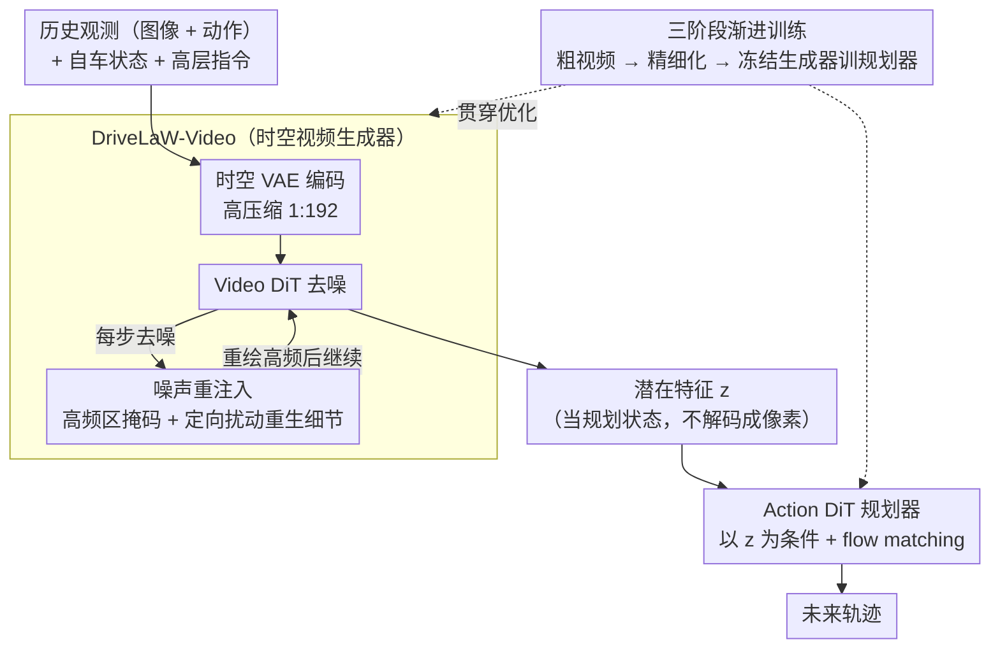

# DriveLaW: Unifying Planning and Video Generation in a Latent Driving World

**会议**: CVPR 2026  
**arXiv**: [2512.23421](https://arxiv.org/abs/2512.23421)  
**代码**: [https://github.com/xiaomi-research/drivelaw](https://github.com/xiaomi-research/drivelaw)  
**领域**: 视频生成  
**关键词**: 世界模型, 自动驾驶规划, 视频生成, 潜在空间, 扩散策略

## 一句话总结

提出 DriveLaW，一个通过共享潜在空间将视频生成与运动规划统一的驾驶世界模型，将视频生成器的中间潜在特征直接注入扩散规划器，在 nuScenes 视频预测和 NAVSIM 规划基准上同时达到 SOTA。

## 研究背景与动机

世界模型通过学习驾驶场景的时序演化来应对真实世界的长尾挑战，但当前方法将世界模型的角色限制在三个间接层面：(1) 数据生成器——合成稀有场景数据或作为闭环仿真环境；(2) 监督信号——预测未来视觉/可达性信号来监督规划；(3) 并行生成——在统一架构中共同生成视频和轨迹但仍是解耦过程。

核心矛盾：**即使在"统一"架构中，视频生成器和规划器仍作为独立模块运行**——Epona 和 DriveVLA-W0 分别训练视频生成和策略头，未利用生成器内部潜在表示作为规划状态。视频生成器虽然从大规模数据中学到了丰富的场景语义、物体动力学和物理规律，但这些知识被"浪费"在渲染上而未传导给规划器。

核心洞察：**视频生成器的内部激活编码了丰富的、时序连贯的场景理解——这正是规划所需的表示。** DriveLaW 将生成器从"渲染器"重新定位为"特征提取器"，将其去噪后的潜在特征直接作为规划器的条件输入。

## 方法详解

### 整体框架

DriveLaW 想解决的是「视频生成器学到的场景知识被浪费在渲染上、传不到规划器」这个问题，做法是把生成器和规划器串成一条链，让前者的中间表示直接喂给后者。整条流水线由两个组件接力：前半段是 **DriveLaW-Video**，一个时空视频生成器，由时空 VAE 和 Video DiT（扩散 Transformer）组成，吃进历史观测和动作，去噪出未来视频的潜在特征 $z$（去噪过程中用噪声重注入补回高频细节）；后半段是 **DriveLaW-Act**，一个轻量的 Action DiT 扩散规划器，它不再去看原始图像，而是直接以 $z$ 为条件，用 flow matching 生成未来轨迹。关键在于中间那个 $z$：它不是用来解码成像素的，而是当作规划状态被传下去——视频生成器在这里从「渲染器」转岗成了「特征提取器」。整套生成器与规划器再由三阶段渐进训练分别优化、最后级联。

### 关键设计

**1. 链式生成-规划架构：让视频潜在特征当规划状态，而不是各算各的**

以往所谓的「统一」架构（如 Epona、DriveVLA-W0）其实是并行设计——视频分支和轨迹分支各自从共享 backbone 引出独立的输出头，生成器内部的表示根本没流到规划器那边去。DriveLaW 把这条信息流接通：Video DiT 去噪后的潜在特征 $z$ 不经过解码，直接注入 Action DiT 作为条件输入，Action DiT 沿用标准 DiT 架构、用 flow matching 目标训练。这样做有三处好处：一是把大规模视频预训练里学到的场景语义、智能体动力学、物理规律全都接管过来当规划先验，而不是重新学一遍；二是训练时两个任务不再共享一组要同时优化的参数，规避了视频生成和规划之间的梯度互相干扰；三是规划轨迹和它「看到」的视觉细节天然来自同一份 $z$，级联结构保证了两者一致。

**2. 噪声重注入机制：靠高频区定向扰动，把高压缩下糊掉的细节「逼」回来**

时空 VAE 压缩比高达 1:192（远超常见的 1:48 / 1:96），这对规划效率很友好（潜在空间小、Action DiT 跑得快，还能在同等算力下预测更长时程），但代价是高速、大位移场景下边界过度平滑、纹理消失、模糊和重影累积，车辆、车道线、远景的结构一致性被破坏。噪声重注入不是全局加噪，而是**定向**的：每一步去噪时先预测一版干净潜在、解码回像素并转灰度，用拉普拉斯算子算出高频响应图、按自适应阈值取出高频区掩码，只在这些高频区注入少量受控噪声。这逼着模型调用它强大的生成先验去「重绘」（inpaint）被扰动的区域、补出合理的高频细节，而不是把它们抹平；天空这类平滑区域则保持不动。它本质上是高保真视觉合成与高压缩效率之间张力的一个旋钮——既留住高压缩 VAE 的效率，又把它损害细节的副作用补回来。

**3. 三阶段渐进训练：把视频生成和规划拆到各自最佳的学习窗口里分别优化**

直接端到端一起训，视频生成目标和规划目标会打架。DriveLaW 把训练切成三段递进：第一阶段先训 Video DiT 生成粗粒度视频，把长时运动的时序动力学理解建立起来；第二阶段在更高分辨率、更精细的去噪步骤下继续微调，补上空间细节和视觉质量；第三阶段冻结整个 Video DiT，只把它的潜在特征链到 Action DiT，专门训练规划器。每个组件都在自己最该被优化的阶段里被优化，避免了多目标同时下降时的相互拖累。

### 损失函数 / 训练策略

Video DiT 用标准扩散去噪损失训练，Action DiT 用 flow matching 目标生成轨迹。三阶段中第三阶段冻结 Video DiT 参数、只更新 Action DiT，因此规划器的训练完全建立在已经固定下来的视频表示之上。

## 实验关键数据

### 主实验

**nuScenes 视频生成**

| 方法 | FID↓ | FVD↓ | 说明 |
|------|------|------|------|
| 之前 SOTA | 基线 | 基线 | 各类世界模型和视频生成器 |
| **DriveLaW-Video** | **-33.3%** | **-1.8%** | 大幅领先 |

**NAVSIM 规划基准（PDMS）**

| 方法 | PDMS | 说明 |
|------|------|------|
| 之前 SOTA（世界模型方法） | 基线 | 各种世界模型+规划方法 |
| **DriveLaW-Act** | **新纪录** | 无需后训练(RL)或后处理(scorers) |

### 消融实验

| 配置 | FID | PDMS | 说明 |
|------|-----|------|------|
| 仅 BEV 特征→规划 | 更高 | 更低 | 传统 BEV 表示 |
| 仅 VLM 特征→规划 | 中等 | 中等 | 视觉-语言模型特征 |
| **视频潜在特征→规划** | **最低** | **最高** | 视频生成器的表示最优 |
| 并行设计 | 中等 | 中等 | 生成和规划独立输出 |
| **链式设计** | **最低** | **最高** | 潜在特征传导给规划器 |

### 关键发现

- 视频生成器的潜在表示优于 BEV 和 VLM 特征作为规划输入——证明从大规模视频预训练中学到的表示有独特价值
- 链式设计相比并行设计在两个任务上都更优，验证了表示传导优于独立输出
- 噪声重注入机制在高速场景下显著减少模糊和结构不一致
- 无需 RL 后训练或评分器后处理即达到 NAVSIM SOTA，说明视频先验已足够强

## 亮点与洞察

- **"视频生成器即特征提取器"** 是深刻的范式转换：将生成模型从端输出器重新定位为中间表示提供者，跨越了"生成"和"理解"的边界
- **链式 vs 并行**的对比令人信服：即使在"统一"架构中，信息流的方向和耦合方式至关重要
- **三阶段训练**巧妙避免了多目标冲突——先分别优化再级联微调的策略具有通用性

## 局限与展望

- 链式设计意味着规划延迟受视频生成速度限制，实时性可能不足
- 当前仅单视图视频生成，多视图一致性未涉及
- 仅在 nuScenes 和 NAVSIM 上验证，真实闭环驾驶部署的鲁棒性待测试
- 视频生成器的错误会直接传播到规划器（误差级联）

## 相关工作与启发

- **vs Epona**: 并行生成视频和轨迹，解耦设计未利用生成器内部表示
- **vs DriveVLA-W0**: 也用混合 Transformer 生成两种模态，但仍是并行输出流
- **vs DiffusionDrive**: 纯扩散规划，无视频生成的世界理解先验

## 评分

- 新颖性: ⭐⭐⭐⭐⭐ 首次将视频生成器的中间潜在表示作为规划状态，链式设计有原创性
- 实验充分度: ⭐⭐⭐⭐⭐ 双任务 SOTA + 表示对比消融 + 架构设计消融
- 写作质量: ⭐⭐⭐⭐ 结构清晰，但三阶段训练细节可更详尽
- 价值: ⭐⭐⭐⭐⭐ 为自动驾驶世界模型提供了新范式，来自小米 EV 有实际应用背景

<!-- RELATED:START -->

## 相关论文

- [\[CVPR 2026\] LAMP: Language-Assisted Motion Planning for Controllable Video Generation](lamp_language-assisted_motion_planning_for_controllable_video_generation.md)
- [\[ICML 2026\] OLAF-World: Orienting Latent Actions for Video World Modeling](../../ICML2026/video_generation/olaf-world_orienting_latent_actions_for_video_world_modeling.md)
- [\[ICLR 2026\] DrivingGen: A Comprehensive Benchmark for Generative Video World Models in Autonomous Driving](../../ICLR2026/video_generation/drivinggen_a_comprehensive_benchmark_for_generative_video_world_models_in_autono.md)
- [\[CVPR 2026\] Phantom: Physics-Infused Video Generation via Joint Modeling of Visual and Latent Physical Dynamics](phantom_physics-infused_video_generation_via_joint_modeling_of_visual_and_latent.md)
- [\[CVPR 2026\] A Frame is Worth One Token: Efficient Generative World Modeling with Delta Tokens](a_frame_is_worth_one_token_efficient_generative_world_modeling_with_delta_tokens.md)

<!-- RELATED:END -->
