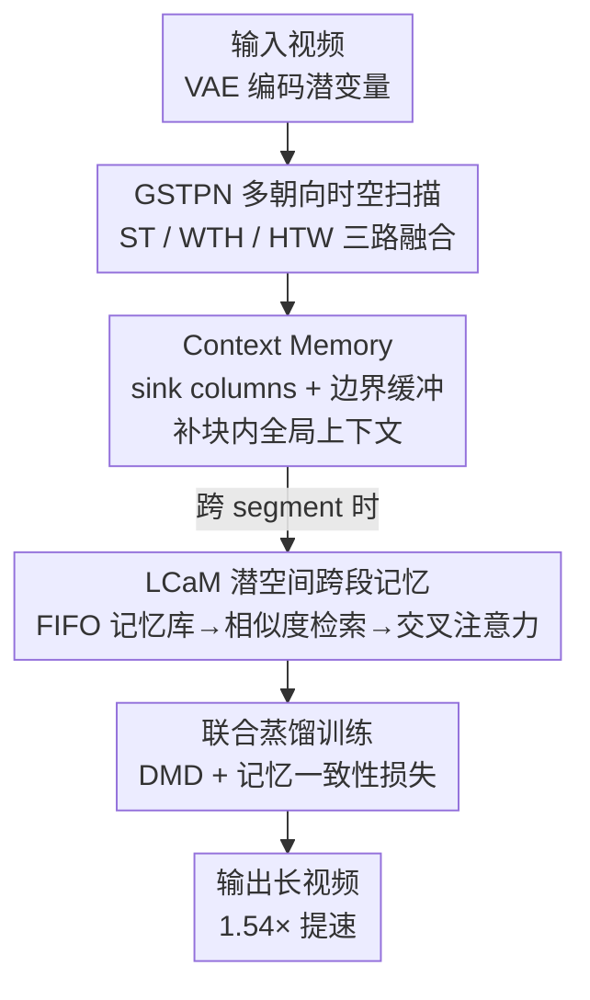

# Dual-Granularity Memory for Efficient Video Generation

**会议**: CVPR 2026  
**论文**: [CVF Open Access](https://openaccess.thecvf.com/content/CVPR2026/html/Wang_Dual-Granularity_Memory_for_Efficient_Video_Generation_CVPR_2026_paper.html)  
**代码**: 待确认  
**领域**: 视频生成 / 扩散模型 / 高效架构  
**关键词**: 线性循环架构, 分块隔离, 注意力 sink, 潜空间记忆, 知识蒸馏

## 一句话总结
针对线性循环视频生成器因分块并行导致的"分块隔离"问题，本文在 GSTPN 主干上叠加两套互补记忆——块内的 Context Memory（sink columns + 边界缓冲，仅 +150K 参数）和跨段的 LCaM（潜空间记忆库 + 内容检索 + 交叉注意力），在保持与全注意力相当画质的同时把推理提速 1.54×。

## 研究背景与动机
**领域现状**：视频生成主流是 diffusion transformer，画质高但自注意力是 $O(N^2)$ 复杂度，高分辨率长序列下计算与显存都吃不消（Wan 2.1 生成 5 秒 720p 要 32 分钟）。为此线性循环架构（GSPN、Mamba 类）成为高效替代，提供 $O(N)$ 复杂度和常数显存。

**现有痛点**：循环模型为了在 GPU 上并行，必须把序列切成固定大小的 chunk（如 L=200），每个 chunk 独立计算、丢弃上一个 chunk 的隐状态。作者把这个现象命名为**分块隔离（chunk isolation）**：位置 201 完全访问不到位置 1–200 的状态，于是丢失初始条件、相机运动、场景布局等信息，在 chunk 边界处表现为画面突变和身份漂移。

**核心矛盾**：循环架构靠隐状态沿单向因果传播，没有 transformer 那种"全局随机读取"的能力；一旦分块，全局上下文就断了。而且现代视频系统在训练/推理时还会按 segment 分段处理，更长的视频跨多个 segment，块内机制也够不到已清空的历史 segment。

**切入角度**：作者借鉴 StreamingLLM 的发现——KV cache 里保留少数初始 token 作为"attention sink"就能大幅改善长上下文一致性。这说明**少数被战略性保留的位置足以承载全局信息**。问题是：这个在全局可读的注意力里成立的原理，能不能搬到只能单向传播的循环架构上？

**核心 idea**：用"双粒度记忆"同时补两个洞——块内用可学习的 sink columns + 边界缓冲恢复全局锚点（Context Memory），跨段用纯潜空间的记忆库检索历史 segment（LCaM），两者拼成短程 + 长程一致性的完整方案。

## 方法详解

### 整体框架
方法建立在 GSTPN（把 2D 的 GSPN 扩展到时空的 Generalized Spatial-Temporal Propagation Network）之上，整套系统由 WanVideo-1.3B 通过 DMD（Distribution Matching Distillation）蒸馏而来：把原 DiT 里所有自注意力层换成 GSTPN 模块，再插入两套记忆。一段视频先经 VAE 编码成潜变量，进入 GSTPN 做多朝向时空扫描；扫描时块内由 Context Memory 提供持久全局锚点和边界续接；跨 segment 时由 LCaM 从历史潜变量记忆库里检索相关片段、经交叉注意力融合进当前生成。最终在保持画质的前提下，把延迟从全注意力的 103s 降到 67s。

### 关键设计

**1. GSTPN 多朝向时空扫描：让线性循环吃下 4D 视频张量**

GSPN 原本只处理 2D 空间数据，逐行传播一个隐状态：$h^c_i = w^c_i h^c_{i-1} + \lambda^c_i \odot x^c_i$，其中传播矩阵 $w_i$ 被约束成行随机（row-stochastic，每行非负且和为 1），保证 $\sum_j W_{ij}=1$ 从而隐状态是历史输入的归一化加权和，不会指数爆炸/衰减。视频张量 $X\in\mathbb{R}^{C\times F\times H\times W}$ 既有严格因果的时间维、又有双向的空间维，直接拍平成长度 $FHW$ 的序列会破坏这种结构、还加剧分块隔离。

作者提出把 4D 张量沿三个朝向投影成三个 2D 平面再分别扫描：ST 合并空间维沿时间扫，WTH 合并宽-时沿高扫，HTW 合并高-时沿宽扫。三路输出还原后用可学习权重 $\alpha_o = e^{\beta_o}/\sum_{o'}e^{\beta_{o'}}$ 做软融合并过一个 MLP。消融显示单朝向有方向偏置（质量 80.2），三朝向互补覆盖时空依赖后涨到 83.5，是后续两套记忆能发挥作用的主干。

**2. Context Memory：sink columns + 边界缓冲，解块内隔离**

这是把"attention sink"原理移植到循环架构的核心。它由两个互补组件构成。**Sink columns** 指定前 $N_{sink}$（默认 3）个列作为全局可访问锚点，让 $w\ge N_{sink}$ 的位置在标准递推外额外加一项对 sink 的读取：

$$h_{j,w} = w_j h_{j-1,w-1} + \lambda_j \odot x_{j,w} + \sum_{i\in S} G_{sink}[j,i]\odot h_{j,i}$$

关键区别在于：注意力 sink 是被动缓存的，而 sink columns 通过可学习门 $G_{sink}$（与输入无关的参数）**主动参与循环计算**，让模型自己学"该保留哪些全局信息"。这把依赖集从只限本 chunk 扩展为并上 $\{(j,i)\mid i\in S\}$，因为 $S$ 跨所有 chunk 持久存在，分块隔离被消除。**边界缓冲（boundary buffer）** 则补局部连续性：把 chunk $k$ 的可访问范围向前延伸 $N_{buf}$（默认 2）个位置 $[\max(0,kL-N_{buf}),(k+1)L)$，让边界处的位置能直接续上前一个 chunk 的紧邻前驱。两者只加约 150K 参数（<0.1% 模型量级），却把质量从 79.1（无 sink）拉到 83.5，且消融显示二者有协同（合并增益 +4.5 略超各自之和 +4.1）——sink 提供长程上下文，边界缓冲在局部把它传得更顺。

**3. LCaM 潜空间跨段检索记忆：解跨 segment 隔离**

Context Memory 管不到已被清空的历史 segment。已有方法（Context-as-Memory）存原始帧、按相机 FOV 检索，但需要相机标注、存储昂贵还要 VAE 解码。LCaM 改成**纯潜空间**运作。它维护一个只保留最近 $M$ 段潜变量的 FIFO 记忆库 $M_t=\{z_\tau\mid \tau\in[\max(1,t-M),t-1]\}$，满了就先进先出替换，显存 $O(M)$ 与总长无关。存潜变量而非原帧带来巨大压缩比 $\rho = 3s^2/C_z$（典型 $s=8,C_z=16$ 理论 12×，混合精度下实测 >60×），所以能塞下数十段历史。

检索不靠相机位姿，而靠潜空间天然的语义相似性：先用时空平均池化把每段压成全局描述子 $F(z)=\frac{1}{TH'W'}\sum_{f,h,w}z[:,f,h,w]\in\mathbb{R}^{C_z}$（丢掉细节只留场景级统计如平均色彩、亮度、语义），再用余弦相似度 $s(z_t,z_\tau)=\langle F(z_t),F(z_\tau)\rangle/(\|F(z_t)\|\|F(z_\tau)\|)$ 度量。检索取超过阈值 $\tau$ 的候选里 top-$K$：$R_t=\text{TopK}(\{z\mid s\ge\tau\})$，阈值充当质量过滤器、防弱相关段注入噪声。检索到的段经多头交叉注意力（query 是当前段、key/value 是历史段）融合，再用一个可学习门 $g$（初始化为大负值使 $\sigma(g)\approx0$）软注入：

$$z^{cond}_t = z_t + \sigma(g)\cdot \text{Unflatten}(O)$$

门随训练逐渐放大记忆的参与度，避免训练初期记忆扰动破坏主干。

**4. 联合蒸馏训练目标：把记忆塞进 DMD 蒸馏**

LCaM 通过一个辅助的记忆一致性损失接入蒸馏。对学生预测的潜变量 $\hat z_t$，在记忆库非空时计算其记忆条件化版本 $\hat z^{cond}_t$，并约束 $L_{mem}=\lambda_{mem}\|\hat z^{cond}_t - sg(\hat z_t)\|_F^2$（$sg$ 是 stop-gradient，把记忆库当只读上下文）。总目标为蒸馏项 + 可选像素对齐项 + 记忆项：$L = L_{distill}(\hat z_t, z^{teach}_t) + \lambda_{align}L_{align} + \mathbb{1}_{|M_t|>0}L_{mem}$。训练只解冻 GSTPN 模块（约 10% 参数）、sink 门（150K）和 LCaM 组件（51K），冻住文本编码器/VAE/基座 transformer，64 卡 H100 上约 7 小时。这套设计特别契合"只有预抽取潜变量、拿不到原帧"的蒸馏场景，正是 LCaM 走潜空间路线的现实理由。

## 实验关键数据

### 主实验
在 WanVideo-1.3B（81 帧 × 480 × 832，33K tokens）上以 VBench 七维评测，单 H100 测延迟：

| 方法 | IQ↑ | AQ↑ | SC↑ | VA↑ | VT↑ | VR↑ | 延迟↓ |
|------|-----|-----|-----|-----|-----|-----|-------|
| Full Attention | 62.1 | 56.1 | 93.0 | 76.8 | 82.9 | 0.059 | 103s |
| SVG | 61.0 | 55.7 | 92.5 | 75.1 | 80.8 | 0.035 | 90s |
| MoBA | 60.1 | 54.8 | 92.7 | 72.8 | 78.2 | 0.021 | 126s |
| VMoBA | 60.1 | 55.2 | 92.9 | 73.5 | 79.3 | 0.025 | 104s |
| **本文** | **62.3** | **55.9** | 92.8 | **75.5** | **81.0** | **0.040** | **67s** |

本文 67s 即比全注意力快 1.54×，在所有高效方法中延迟最低；IQ 62.3 甚至略超全注意力（62.1），作者归因于多朝向扫描 + sink 锚点能保住本会在分块隔离下退化的细粒度细节。SC（92.8）和 AQ（55.9）都贴近全注意力。短板是 OC（21.6 vs 23.3）和 VR（0.040 vs 0.059），作者解释为 GSTPN 循环主干与 LCaM 交叉注意力路径"异构"导致全局一致性/文本对齐受损。

### 消融实验

| 配置 | 质量分 | 延迟 | 说明 |
|------|--------|------|------|
| ST only（单朝向） | 80.2 | 52s | 有方向偏置 |
| ST + WTH | 81.6 | 59s | 补互补时空模式 |
| ST + WTH + HTW（Full） | **83.5** | 67s | 三朝向互补，默认 |
| 无 sink（$N_{sink}=0$） | 79.1 | — | 受分块隔离 |
| + sink only | 82.3 | — | 单加 sink +3.2 |
| + boundary only | 80.0 | — | 单加边界 +0.9 |
| sink + boundary（Full） | 83.6 | — | 协同 +4.5（超各自之和） |

LCaM 超参：检索 $K=3$ 最优（质量 84.8、VR 0.052），$K$ 再大则平均相似度从 0.61 掉到 0.55、弱相关段稀释信号；阈值 $\tau=0.3$ 平衡命中率 74% 与精度 79%（平均检索 2.6 段），过高（0.5）虽精度 91% 但命中率仅 42%、上下文不足。chunk size $L=200$ 平衡并行与 sink 访问频率（$L=100$ 质量 84.2 但慢 19%，$L=400$ 质量降到 81.9）。

### 关键发现
- **sink columns 贡献最大**：单加 sink 涨 +3.2 远超单加边界缓冲（+0.9），证明"持久全局锚点"才是解分块隔离的主力；二者协同（+4.5 > 4.1）说明边界缓冲是把全局上下文在局部传顺的放大器。
- **检索多样性能缓解一致性短板**：OC/VR 落后于全注意力，但增大 $K$ 可部分弥补（VR 随 $K$ 1→3 从 0.042 升到 0.052），印证短板来自交叉注意力路径的语义对齐而非画质本身。
- **潜空间存储是数量级优势**：理论 12×、混合精度 >60× 压缩，使记忆库能容纳数十段历史，而帧级方法只能存少数几段——这是 LCaM 能做跨段一致性的物质基础。

## 亮点与洞察
- **把 attention sink 原理"翻译"到循环因果架构**：注意力 sink 是被动缓存、全局可读；本文用可学习门让 sink columns 主动参与递推，本质是把"全局随机读"改写成"少数持久状态沿递推被反复注入"，是很巧的跨范式迁移。
- **用 VAE 潜空间语义相似性替代相机几何检索**：不依赖相机标注、不需解码回像素，靠时空平均池化 + 余弦相似度就能做内容检索，既省存储又能泛化到任意视频域——对"只有预抽取潜变量"的蒸馏场景几乎是唯一可行解。
- **门控初始化为大负值的渐进式记忆注入**：$\sigma(g)\approx0$ 起步让记忆训练初期不破坏主干、随训练自动放大，这个 trick 可迁移到任何"新增旁路模块怕扰动预训练主干"的场景。

## 局限与展望
- **全局一致性与人类偏好仍逊于全注意力**：OC 21.6 vs 23.3、VR 0.040 vs 0.059，作者承认是 GSTPN 与 LCaM 交叉注意力路径异构所致，目前只能靠增大 $K$ 部分缓解，没有从根上统一两条路径。
- **方法强绑定蒸馏设置**：LCaM 的潜空间路线和记忆一致性损失都是为"只有预抽取潜变量"的 DMD 蒸馏量身定制，是否能直接用于从头训练（而非蒸馏）未验证。⚠️ 论文未给从头训练的对比。
- **检索描述子过于粗糙**：时空平均池化丢掉所有细粒度时空信息，只保留场景级统计；对"同场景但细节关键差异"（如同一房间不同物体状态）可能检索不出区分度，这部分鲁棒性论文未深究。

## 相关工作与启发
- **vs StreamingLLM（attention sink）**：StreamingLLM 在 KV cache 里被动保留初始 token；本文把这一原理迁到循环架构，用可学习门让 sink 主动参与递推，区别在"全局可读"vs"沿因果传播"，本文优势是几乎零参数开销，劣势是失去注意力的全局随机访问。
- **vs Context-as-Memory（帧级记忆）**：前者存原始帧、按相机 FOV 检索，需相机标注、存储贵、要 VAE 解码；LCaM 纯潜空间运作、内容检索，省 60× 存储且无需标注，劣势是描述子粗糙、检索精度上限受限。
- **vs 高效注意力（SVG / MoBA / VMoBA / SageAttn）**：这些走稀疏/近似注意力路线仍受 KV cache 约束；本文走线性循环 + 记忆增强路线，在高效方法中取得最佳综合画质与最低延迟，代表了"循环 + 记忆"相对"稀疏注意力"的另一条高效路径。

## 评分
- 新颖性: ⭐⭐⭐⭐ 首个系统研究循环视频生成器"分块隔离"并用双粒度记忆解决，sink 迁移与潜空间检索都很巧
- 实验充分度: ⭐⭐⭐⭐ VBench 七维 + 朝向/sink/边界/chunk/K/阈值多组消融扎实，但缺从头训练与更大模型验证
- 写作质量: ⭐⭐⭐⭐ 问题定义清晰、公式完整、消融分析到位
- 价值: ⭐⭐⭐⭐ 为高效长视频生成提供"循环 + 记忆"可落地方案，蒸馏场景下尤其实用

<!-- RELATED:START -->

## 相关论文

- [\[CVPR 2026\] Spatia: Video Generation with Updatable Spatial Memory](spatia_video_generation_with_updatable_spatial_memory.md)
- [\[CVPR 2026\] OneStory: Coherent Multi-Shot Video Generation with Adaptive Memory](onestory_coherent_multi-shot_video_generation_with_adaptive_memory.md)
- [\[ICLR 2026\] Dual-IPO: Dual-Iterative Preference Optimization for Text-to-Video Generation](../../ICLR2026/video_generation/dual-ipo_dual-iterative_preference_optimization_for_text-to-video_generation.md)
- [\[CVPR 2026\] Captain Safari: A World Engine with Pose-Aligned 3D Memory](captain_safari_a_world_engine_with_pose-aligned_3d_memory.md)
- [\[CVPR 2026\] Reward Forcing: Efficient Streaming Video Generation with Rewarded Distribution Matching Distillation](reward_forcing_efficient_streaming_video_generation_with_rewarded_distribution_m.md)

<!-- RELATED:END -->
