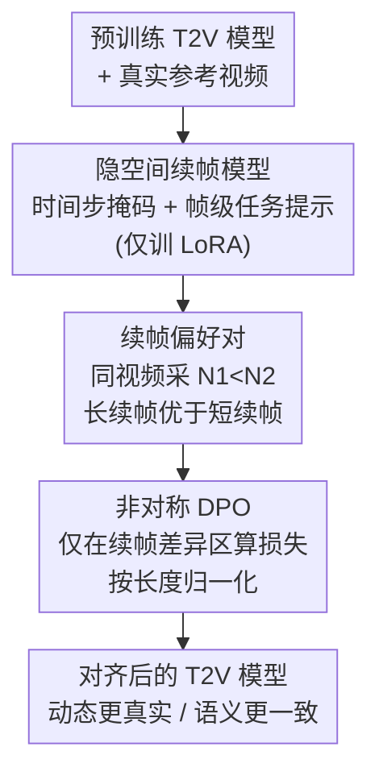

# DynamicsBoost: Dynamic Plausible Video Generation via Annotation-Free Continuation Preference Optimization

**会议**: CVPR 2026  
**论文**: [CVF Open Access](https://openaccess.thecvf.com/content/CVPR2026/html/Li_DynamicsBoost_Dynamic_Plausible_Video_Generation_via_Annotation-Free_Continuation_Preference_Optimization_CVPR_2026_paper.html)  
**代码**: 未公开  
**领域**: 视频生成 / 扩散模型  
**关键词**: 视频生成, 偏好对齐, DPO, 视频续帧, 无标注监督  

## 一句话总结
把"视频续帧"当成天然的偏好信号——条件帧给得越多、生成的内容越少、质量越高——从而不需要任何人工/VLM 打标就能自动构造结构匹配的偏好对，再用只在生成区域计算的 Asymmetrical DPO 去对齐文生视频模型，显著提升动态真实性与语义一致性。

## 研究背景与动机
**领域现状**：文生视频（T2V）扩散/流匹配模型（Wan、Sora、CogVideoX、HunyuanVideo 等）已经能合成画质不错、时序基本连贯的视频，但要进一步对齐到"用户想要的动态"还得靠后训练。当前主流的对齐范式有两条：训练一个视频奖励模型（RM）再做 RLHF，或者直接用正负视频对做 DPO。

**现有痛点**：这两条路都卡在"偏好数据"上。RM 路线要先采集大规模带排序的视频对来训 VLM 打分器，成本高；DPO 虽然省掉了显式 RM，但仍要先生成视频对，再让人或 VLM 判断哪个更好。问题是——**视频的偏好判断本身就是模糊的**：标注者得同时权衡画质、时序一致性、运动动态、语义对齐，而且偏好可能随时间戳变化（前 2 秒好、后 2 秒崩）。结果就是无论人还是 VLM 都给不出准确、一致的视频偏好标签。

**核心矛盾**：偏好对齐需要"准确且可规模化"的偏好数据，但视频偏好标注天然"既贵又不准"。这二者直接对立，成了视频对齐扩展的最大瓶颈。

**切入角度**：作者观察到一个现象——**视频续帧（continuation）任务的数据天然带有一个有序结构**。给定一段真实参考视频，用模型把它"补全"：条件帧给得多，需要模型自己编的部分就少，由于生成片段的质量普遍不如真实帧，所以条件帧越多、整段质量越高。这个单调关系不依赖任何外部判断。

**核心 idea**：用续帧长度代替人工标注来诱导偏好顺序——对同一段参考视频做两次续帧、用不同数量的条件帧（$N_1 < N_2$），$N_2$ 那条（生成内容更短）必然优于 $N_1$ 那条，于是自动得到一个结构匹配的偏好对；再设计一个只在两者真正不同的"续帧区域"上算损失的 Asymmetrical DPO 去做对齐。

## 方法详解

### 整体框架
DynamicsBoost 把"做对齐"拆成两件事：**先把偏好对造出来，再用它对齐**。第一步，把任意一个预训练 T2V 模型扩展成一个能处理"任意条件帧数"的隐空间续帧模型（只训 LoRA + 任务提示，主干冻结）；第二步，对同一段参考视频采两个不同的续帧长度 $N_1<N_2$，把短续帧（生成多）当 loser、长续帧（生成少）当 winner，组成偏好对；第三步，用 Asymmetrical DPO 只在两条视频真正不同的"续帧区域"上施加偏好损失，把模型推向更高保真、动态更合理的方向。整个管线不需要人工标注，也不需要奖励模型，偏好顺序完全由续帧长度自动产生。

### 关键设计

**1. 续帧偏好对：把"续帧长度的单调性"变成免标注的偏好顺序**

这是全文的立足点，针对的痛点就是"视频偏好标注又贵又不准"。做法是：给定一段 $N$ 帧的真实参考视频 $z_{ref}$，取它前 $N_1$ 帧作为条件帧 $z_{cond}$，让模型续生成剩下 $N-N_1$ 帧 $z_{gen}$，拼起来得到一段新的 $N$ 帧视频，称为 $z_{ref}$ 的"$N_1$-帧续帧"。再用前 $N_2$ 帧（$N_2 > N_1$）做一次同样的续帧。由于动态视频里生成片段总是不如对应的真实帧，而 $N_2$ 续帧的生成部分更短、真实条件更多，所以可以推断 $N_2$ 续帧整体质量优于 $N_1$ 续帧——一个结构一致的偏好顺序就这样自动出现了，全程零人工判断、零外部打分。

作者还实证验证了这个"单调假设"：固定总长（13 隐帧），把条件帧数 $N_{cond}$ 从 0 扫到 13，除了纯 T2V（$N_{cond}=0$，结构会大幅偏离参考、打破单调）以外，**条件帧越多、VBench 与 VideoReward 分数越高**（见消融表 3）。这说明续帧对确实满足偏好假设，是可靠的 DPO 监督信号。这也是为什么负样本不能直接用纯 T2V：它和续帧样本的结构差异太大，给出的是"弱且不可比"的偏好信号。

**2. 隐空间任意长度续帧模型：用时间步掩码 + 可学习任务提示把 T2V 改造成续帧器**

要让上面的偏好对能被批量造出来，得先有个能"任意帧条件"的续帧模型。作者不重训主干，而是通过两个机制把预训练 T2V 改造成续帧模型。给定隐序列 $z_0$、噪声 $z_1$、时间步 $t$，先画一个逐帧二值掩码 $M$（$M_i=1$ 为条件帧、$M_i=0$ 为待生成帧）：

$$t' = t \cdot (1 - M), \qquad z'_t = (1-t')z_0 + t' z_1$$

即条件帧拿到 0 时间步（保持干净），待生成帧保留采样的噪声水平，这叫**时间步掩码 + 非均匀加噪**。其次注入**可学习的帧级任务提示**：用两个可训练嵌入 $P_{cond}$、$P_{noisy}$ 分别标记"该帧是条件还是要生成"，拼成 $P_{task} = M \odot P_{cond} + (1-M) \odot P_{noisy}$，再和上下文嵌入拼接喂给流模型 $v_\Phi$。监督只算在待生成帧上，避免破坏条件内容：

$$L = \mathbb{E}\big[\,\|(1-M)\odot((z_1-z_0) - v_\Phi(z'_t, t', P_{task}))\|^2\,\big]$$

训练时只优化 LoRA 适配器与任务提示嵌入、冻结主干。消融（表 3 下半）显示去掉任务提示或去掉时间步掩码都会掉点，尤其在运动平滑度和整体一致性上，说明这两个件都是续帧建模不可少的。

**3. Asymmetrical DPO：偏好损失只打在"两条视频真正不同"的续帧区域**

有了偏好对后，直接套标准 Flow-DPO 会有个问题：标准 DPO 在整段视频上累加偏好损失，但 winner（$N_2$ 续帧）和 loser（$N_1$ 续帧）的**前 $N_1$ 帧是完全相同的真实条件帧**，在这段相同内容上强行学偏好只会引入噪声梯度、稀释真正的信号。作者据此把两条序列切成三段：①共享前缀（0 到 $N_1$，两者相同的真实帧）；②非对称区（$N_1$ 到 $N_2$，winner 用真实帧、loser 用生成帧）；③全生成区（$N_2$ 到 $N$，两者都是生成）。Asymmetrical DPO 只在 ②③ 区算损失：

$$L_{\text{AsymDPO}} = -\frac{1}{N - \min(N_1,N_2)} \log \sigma(-\beta \cdot \Delta E)$$

$$\Delta E = \sum_{i=\min(N_1,N_2)}^{N} \big(\|v^w_i - v_\theta(x^w_{t,i},t)\|^2 - \|v^l_i - v_\theta(x^l_{t,i},t)\|^2\big)$$

其中 $\sigma$ 是 sigmoid、$\beta$ 是 DPO 温度。前面那个 $\frac{1}{N-\min(N_1,N_2)}$ 的归一化是关键：每个训练步采的续帧长度不同、非对称区长度在变，不归一化会导致梯度规模随长度漂移、训练不稳；归一化后不同长度的续帧对才可比。消融（表 4）证实：只在 ②③ 区算损失最好，只在 ③ 区次之，把 ① 区也算进去（即退化成标准 DPO）一致掉点——说明在"两段相同"的帧上学偏好确实是有害的噪声。该设计与 Flow-DPO 完全兼容，不增加额外训练成本或结构改动。

### 损失函数 / 训练策略
基于 DiT 流匹配 T2V 模型。从 OpenVid 精选 10 万段动态高质量视频：8 万用于续帧训练，2 万作为对齐阶段的条件输入。视频统一为 49 帧、288×512。续帧训练用 LoRA（rank 196、$\alpha$=196，lr $8\times10^{-5}$，batch 16，2 万步）。对齐分两步：先用 2 万条件视频做 LoRA-based SFT 冷启（lr $1\times10^{-5}$、batch 32、rank 128、0.6 epoch），再从同一 LoRA 权重接着做 Asymmetrical DPO（lr $5\times10^{-6}$、batch 32、rank 128、$\beta=800$、1 epoch）。正样本条件取前 80–100% 帧、负样本取前 60% 以内的前缀，每步从区间内随机采样。8×A800。（⚠️ $\beta=800$ 这个温度数值偏大，以原文为准。）

## 实验关键数据

### 主实验
在 VBench、VideoGen-Eval、PhysGenBench 三个基准上对比 Pretrain、SFT、Flow-DPO、Flow-StructuralDPO、Flow-DenseDPO。所有 DPO 方法都用同一 SFT 冷启初始化、用 VideoReward 当奖励模型以保证公平。下表为 VBench 主结果（↑ 越高越好）：

| 方法 | 美学质量 | 成像质量 | 背景一致性 | 运动平滑度 | 动态程度 | 整体一致性 |
|------|---------|---------|-----------|-----------|---------|-----------|
| Pretrain | 55.51 | 65.12 | 96.71 | 98.81 | 34.72 | 24.48 |
| SFT | 55.80 | 64.52 | 96.85 | 96.84 | 34.15 | 24.02 |
| Flow-DPO | 59.14 | 63.31 | 98.15 | 97.36 | 31.22 | 25.22 |
| Flow-StructuralDPO | 58.08 | 65.06 | 97.02 | 96.15 | 35.25 | 24.18 |
| Flow-DenseDPO | 58.95 | 67.91 | 97.11 | 98.16 | 40.10 | 25.02 |
| **Ours** | **59.92** | 66.81 | 97.53 | **99.21** | **44.92** | **25.64** |

最突出的是**动态程度（Dynamic Degree）从次优的 40.10 跳到 44.92**——这正是"动态合理"这条主线想拉的指标；运动平滑度与整体一致性也都是最优。在 PhysGenBench / VideoGen-Eval 上同样在动态程度、整体一致性等多数指标取得最佳（如 VideoGen-Eval 动态程度 56.31 vs 次优 52.25）。定性上，倒蜂蜜水的例子里 StructuralDPO 出现水流倒灌、DenseDPO 出现杯底漏水，而本文全程保持动态与物理一致。

### 消融实验
**续帧采样策略 + 损失区域**（VBench，↑）：

| 配置 | 美学 | 成像 | 背景 | 运动平滑 | 动态程度 | 整体一致 | 说明 |
|------|------|------|------|---------|---------|---------|------|
| $N_1\in[0,0.6N],N_2\in[0.8N,N]$ | 59.30 | 66.61 | 97.24 | 98.89 | 43.92 | 25.31 | 负样本含纯 T2V |
| $N_1\in[1,0.6N],N_2\in[0.8N,N]$ | **59.92** | 66.81 | 97.53 | **99.21** | **44.92** | **25.64** | 双向随机（最终方案） |
| $N_1=0,N_2=N$ | 57.09 | 65.08 | 96.76 | 96.11 | 34.32 | 24.42 | 固定长度 + 纯 T2V 负样本 |
| $N_1=1,N_2=N$ | 58.71 | 66.59 | 96.47 | 97.48 | 35.72 | 24.94 | 固定长度 |
| $N_1\in[1,0.6N],N_2=N$ | 59.41 | 66.94 | 96.90 | 98.32 | 46.41 | 25.44 | 仅负样本随机 |
| 损失区域 ①–③（=标准 DPO） | 58.10 | 66.42 | 96.63 | 97.21 | 42.48 | 22.15 | 含共享前缀 |
| 损失区域 ②–③（本文） | **59.92** | 66.81 | 97.53 | **99.21** | **44.92** | **25.64** | 仅续帧差异区 |
| 损失区域 ③ | 59.31 | 66.23 | 97.71 | 98.63 | 38.21 | 24.10 | 仅全生成区 |

### 关键发现
- **续帧长度是有效的免标注偏好信号**：固定总长扫条件帧数，VBench/VideoReward 随条件帧增多单调上升（纯 T2V 除外，它结构偏离最大、打破单调），证实续帧对天然满足偏好假设。
- **负样本不能用纯 T2V**：$N_1=0$ 的设置（Setting 1 vs 2、Setting 3 vs 4）增益甚微，因为 T2V 输出与续帧样本结构差异太大、偏好信号弱、梯度引导不足。
- **续帧长度要随机、别固定**：固定续帧长度（尤其固定负样本）会损害泛化，双向随机采样 $N_1,N_2$ 的策略最稳最好——多样的长度差提供了更有信息量的偏好监督。
- **损失区域选 ②③ 最优**：把共享前缀 ①（两段完全相同）也算进损失会一致掉点（整体一致性从 25.64 跌到 22.15），印证"在相同内容上学偏好=注入噪声梯度"。

## 亮点与洞察
- **把"任务的天然结构"当监督信号**：续帧长度↔质量的单调关系本来是续帧任务的副产物，作者把它直接当成偏好顺序，绕开了视频偏好标注这个老大难——这种"从数据结构里挖免费标签"的思路可迁移到其他难标注的生成对齐任务（如音频、3D）。
- **结构匹配的偏好对**：传统 DPO 的正负样本是两次独立采样、结构差异大，偏好信号噪声多；而续帧对共享同一段真实前缀，winner/loser 在结构上高度对齐，差异精确集中在"谁生成得多"，信号干净。
- **Asymmetrical DPO 的"对齐到差异区"很巧**：只在两条视频真正分叉的帧上算损失并按长度归一，既消除了共享前缀的噪声梯度，又解决了变长续帧带来的梯度规模漂移，几乎零额外成本即可插进现有 Flow-DPO。

## 局限与展望
- **依赖"生成片段必劣于真实帧"这一前提**：对高度动态、生成质量已逼近真实的场景，或续帧模型本身偏弱时，这个单调假设可能松动，偏好顺序未必可靠（⚠️ 论文主要在动态视频上验证）。
- **续帧模型质量是上限**：偏好对的质量受限于改造出的续帧模型，若续帧模型本身有偏（如对某类运动续得差），会把偏置带进对齐目标。
- **未公开代码、$\beta=800$ 等超参偏特殊**：复现需谨慎；Flow-StructuralDPO / Flow-DenseDPO 为作者按原文伪代码自行复现，横向对比结论需带一点 caveat。
- **可改进**：把"续帧长度"这一标量偏好维度扩展成多维（如分别对运动、语义构造续帧偏好），或与少量 RM/VLM 信号混合，可能进一步提升对齐精度。

## 相关工作与启发
- **vs Flow-DPO / 标准 DPO**：标准 DPO 需要人或 VLM 判定正负、且在整段视频上算损失；本文用续帧长度自动定序（免标注）、且只在续帧差异区算损失（Asymmetrical），动态程度等指标显著更优。
- **vs Flow-StructuralDPO / Flow-DenseDPO**：这两者仍依赖奖励模型/VLM 打分（DenseDPO 把视频切五段分别让 VLM 评分），本文完全去掉了人工标注与奖励模型，靠续帧的内在有序结构监督。
- **vs 视频奖励模型路线（LiFT / VisionReward / VideoAlign）**：RM 路线要采集大规模带排序视频对来训 VLM 打分器，成本高且规模受限；本文以近乎零成本批量造偏好对，可规模化扩展。

## 评分
- 新颖性: ⭐⭐⭐⭐⭐ 用续帧长度的单调性把视频偏好对齐做成完全免标注，切入点干净且少见
- 实验充分度: ⭐⭐⭐⭐ 三基准对比 + 续帧采样/损失区域/续帧模块多组消融充分，但缺代码与更多动态-逼真极端场景验证
- 写作质量: ⭐⭐⭐⭐ 动机—机制—验证链条清晰，公式编号有小笔误（模型名 DynamicBuff/DynamicsBoost 混用）
- 价值: ⭐⭐⭐⭐⭐ 直接打掉视频偏好标注这个规模化瓶颈，方法可插进现有 Flow-DPO，实用价值高

<!-- RELATED:START -->

## 相关论文

- [\[CVPR 2026\] LocalDPO: Direct Localized Detail Preference Optimization for Video Diffusion Models](mind_the_generative_details_direct_localized_detail_preference_optimization_for_.md)
- [\[ICLR 2026\] Dual-IPO: Dual-Iterative Preference Optimization for Text-to-Video Generation](../../ICLR2026/video_generation/dual-ipo_dual-iterative_preference_optimization_for_text-to-video_generation.md)
- [\[CVPR 2026\] Chain of Event-Centric Causal Thought for Physically Plausible Video Generation](chain_of_event-centric_causal_thought_for_physically_plausible_video_generation.md)
- [\[CVPR 2026\] SoliReward: Mitigating Susceptibility to Reward Hacking and Annotation Noise in Video Generation Reward Models](solireward_mitigating_susceptibility_to_reward_hacking_and_annotation_noise_in_v.md)
- [\[NeurIPS 2025\] DenseDPO: Fine-Grained Temporal Preference Optimization for Video Diffusion Models](../../NeurIPS2025/video_generation/densedpo_finegrained_temporal_preference_optimization_for_vi.md)

<!-- RELATED:END -->
