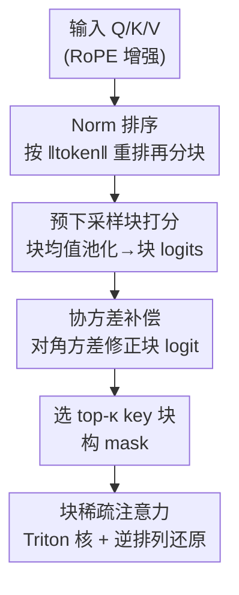

# Efficient Long-Context Modeling in Diffusion Language Models via Block Approximate Sparse Attention

**会议**: CVPR 2026  
**arXiv**: [2605.19726](https://arxiv.org/abs/2605.19726)  
**代码**: https://github.com/JIA-Lab-research/Block-Approximate-Sparse-Attention (待发布)  
**领域**: 扩散语言模型 / 稀疏注意力 / 长上下文效率 / 视频生成  
**关键词**: Block-Sparse Attention、Diffusion Language Model、下采样注意力、Norm 排序、协方差补偿

## 一句话总结
针对扩散语言模型（DLM）超长上下文下注意力的二次复杂度瓶颈，提出免训练的 BA-Att：先在**下采样的块空间**里直接评估每个块的重要性（不依赖固定的位置先验），再用 **norm 排序**让块内更同质、用**对角协方差补偿**修正块均值带来的系统偏差，在 128K 序列上相比 FlashAttention 加速 6.95×，并在语言/多模态/视频生成三类任务上以约 50% 稀疏度逼近全注意力。

## 研究背景与动机
**领域现状**：扩散语言模型（DLM，又称 masked diffusion model）把文本生成建模成对整段噪声序列的并行去噪，相比 GPT/LLaMA 这类自回归模型，天然支持双向、全局一致、可控的生成，被视为下一代生成式语言建模的重要方向。但它在每一步去噪都要对整条序列做全注意力，复杂度 $O(L^2)$，扩到超长上下文（128K 甚至 256K）时计算成本爆炸。

**现有痛点**：缓解二次复杂度的主流是块稀疏注意力，但已有方法分两类各有硬伤。一类是**学习门控**预测块重要性（如 SeerAttention），需要额外训练，难以即插即用部署；另一类是**免训练**方法，靠经验观察设计固定模式——StreamingLLM 的 A-Shape、MInference 的 Vertical-Slash、FlexPrefill 的 query-specific 模式、XAttention 的反对角线打分。这些免训练方法都在**高分辨率注意力空间**里按固定位置先验采样，搜索覆盖率往往 <5%~12.5%（见 Table 1），容易漏掉真正显著的 token，且在分布漂移下不稳定。

**核心矛盾**：免训练的位置先验采样（省算力但覆盖率低、易漏 token）与训练门控（覆盖率高但要 fine-tune）之间存在 trade-off，本质是「效率」与「保真」难两全。

**本文目标**：设计一个**免训练**、却能在下采样块空间里**全覆盖**搜索的稀疏注意力，同时保住效率与鲁棒性。

**切入角度**：作者发现，与其在 $L\times L$ 的高分辨率注意力图上稀疏采样，不如先把 Q、K 池化到块级（$N_q\times N_k$，块大小 $B$ 通常 128），在这个**压缩空间**里对所有块对做全量打分——复杂度降到 $O((L/B)^2)$ 却能 100% 覆盖。难点在于：块均值会丢信息，下采样后的块分布 $m$ 和理想的 oracle 块分布 $\hat{m}$ 有多大差距？这个差距可控吗？

**核心 idea**：用「下采样块空间的全量打分」替代「高分辨率空间的位置先验采样」，并通过理论刻画下采样误差上界 $U_{g_q,g_k}$，针对性地用 norm 排序压方差、用协方差补偿去偏差，把块分布拉近 oracle。

## 方法详解

### 整体框架
BA-Att 是一个免训练的块稀疏注意力算子，输入是 RoPE 增强后的 $Q,K,V$，输出是稀疏注意力结果，整体分三个串行环节：①**预下采样块打分**——对 Q、K 做块内均值池化得到块表示，在块空间算 logits 并 softmax 得块分布 $m$，据此选 top-$\kappa$ 个 key 块构成稀疏 mask；②为了让这个下采样近似更准，先用 **norm 排序**重排 token、再分块，压低块内方差；③再用**协方差补偿**修正块均值丢掉的二阶偏差；最后在选中的块对上用 Triton 核做块稀疏注意力，并按逆排列还原回原顺序。

理论锚点是一个 **oracle 块分布** $\hat{m}_{g_q,g_k}=\frac{1}{|I(g_q)|}\sum_{i\in I(g_q)}\sum_{j\in J(g_k)}A_{ij}$：它直接在全分辨率注意力图 $A$ 上聚合 token 级分数，是「理论上最优的块重要性」。BA-Att 的目标就是让廉价的下采样分布 $m$ 尽量逼近这个（但算不起的）oracle $\hat{m}$，norm 排序和协方差补偿正是为缩小二者差距而生。

### 关键设计

**1. 预下采样块稀疏注意力：在压缩空间全覆盖搜索，甩掉位置先验**

针对的痛点是免训练方法只能在高分辨率空间按固定先验稀疏采样、覆盖率低易漏 token。BA-Att 反其道而行：先对每个 query/key 块做均值池化得块表示 $\bar{Q}_{g_q},\bar{K}_{g_k}$，在块空间算块级 logit $\ell_{g_q,g_k}=(\bar{Q}_{g_q}\cdot\bar{K}_{g_k})/\sqrt{d}$，softmax 得块分布 $m_{g_q,g_k}$，再按预算选 top-$\kappa$ 个 key 块。因为是在 $N_q\times N_k$ 的小图上**对所有块对**打分，搜索覆盖率达 100%，复杂度却只有 $O((L/B)^2)$——既不像 MInference/XAttention 那样靠 sink/反对角线先验（覆盖 <5%~12.5%），也不像 SeerAttention 那样需要训练门控。这是全文效率与鲁棒性兼得的根基

**2. 下采样误差上界 $U_{g_q,g_k}$：把「块均值丢多少信息」量化成可优化的目标**

预下采样虽快，但块均值替代 token 必然有误差。作者把 token 级 logit 写成块级 logit 加扰动：$Q_i=\bar{Q}_{g_q}+\delta Q_i$、$K_j=\bar{K}_{g_k}+\delta K_j$，因 softmax 在 $\ell_\infty$ 下 Lipschitz 连续，logit 偏差可作为块分布偏差的代理。展开并用 Cauchy–Schwarz 放缩，得到上界

$$U_{g_q,g_k}=\frac{R^{Q}_{g_q}M^{K}_{g_k}+M^{Q}_{g_q}R^{K}_{g_k}+R^{Q}_{g_q}R^{K}_{g_k}}{\sqrt{d}},\quad |\hat{\ell}_{ij}-\ell_{g_q,g_k}|\le U_{g_q,g_k}$$

其中 $R^{Q}_{g_q}=\max_i\|Q_i-\bar{Q}_{g_q}\|_2$ 是块内「半径」（token 偏离块均值多远），$M^{Q}_{g_q}=\max_i\|Q_i\|_2$ 是块内最大范数（块的尺度），K 侧同理。直觉是：块内若 token 的 norm 差异大（半径大），注意力就分散、近似越差；半径为零（块完全同质）时 $U=0$，块 logit 精确等于 token logit。这个上界把抽象的「下采样保真度」拆成可下手的几何量，直接催生后面两个设计——压半径（设计 3）、去偏差（设计 4）。Fig. 2 中 $U$ 与真实 logit 偏差的 Pearson 相关 $R>0.5$，证明它是个有效代理

**3. Norm 排序：免训练地重排 token，把块内方差压下去**

既然误差由块内半径主导，而免训练又不能用可学门控去校准，作者干脆**重排块的组成**。给每个 key token 算标量分 $s_j^K=\|K_j\|_2$，按 norm 非降序排出排列 $\pi_k$，得 $K'_i=K_{\pi_k(i)}$，再对连续 $B$ 个 token 重新分块；Q 侧用 $s_i^Q=\|Q_i\|_2$ 同样处理。在常见的重尾激活分布下，按 norm 排序后相邻 token 范数接近，块内方差和半径 $R^Q,R^K$ 显著下降，从而收紧 $U_{g_q,g_k}$、把高激活 token 聚成簇。整个过程完全确定、无参数，复杂度仅 $O(L\times D)$，契合免训练理念。Fig. 2 显示排序后（红组）$U$ 与真实偏差的相关 $R$ 进一步提升——它不仅压低了误差幅度，还让上界更能预测真实误差

**4. 协方差补偿：补回块均值抹掉的二阶偏差**

norm 排序压的是方差项，但 logit 分解 $\hat{\ell}_{ij}-\ell_{g_q,g_k}=\frac{1}{\sqrt{d}}(\delta Q_i\!\cdot\!\bar{K}_{g_k}+\bar{Q}_{g_q}\!\cdot\!\delta K_j+\delta Q_i\!\cdot\!\delta K_j)$ 里，前两项块期望为零，但交叉项 $\delta Q_i\!\cdot\!\delta K_j$ 会留下系统性偏差：$\mathbb{E}_{i,j}[\hat{\ell}_{ij}-\ell_{g_q,g_k}]\approx\frac{1}{d}\mathrm{tr}(\Sigma^{Q}_{g_q}\Sigma^{K}_{g_k})$。于是给块 logit 加一个二阶修正项 $\tilde{\ell}_{g_q,g_k}=\ell_{g_q,g_k}+\beta\Delta_{g_q,g_k}$，$\Delta=\frac{1}{d}\mathrm{tr}(\Sigma^{Q}_{g_q}\Sigma^{K}_{g_k})$（默认 $\beta=1$），它给那些 query/key 残差更相关的块加权，找回只用块均值时丢失的对比度。精确算 $\mathrm{tr}(\Sigma^Q\Sigma^K)$ 要 $O(Ld^2)$，作者用**对角方差近似**

$$\Delta_{g_q,g_k}\approx\frac{1}{d}\sum_{t=1}^{d}\Big(\mathrm{Var}[Q_t]_{g_q}\bar{K}_{g_k,t}^2+\mathrm{Var}[K_t]_{g_k}\bar{Q}_{g_q,t}^2+\mathrm{Var}[Q_t]_{g_q}\mathrm{Var}[K_t]_{g_k}\Big)$$

只需块级一阶/二阶矩（与 $\bar{Q},\bar{K}$ 一起算），把复杂度从 $O(Ld^2)$ 降到 $O(Ld)$。实践中只在首尾层（注意力最敏感）施加补偿，兼顾保真与速度。norm 排序（减方差）与协方差补偿（去偏差）互补，共同把 $m$ 拉向 $\hat{m}$，全程无训练、不构造稠密图

### 损失函数 / 训练策略
本方法**完全免训练（training-free）**，作为即插即用算子直接替换 DLM 推理时的全注意力，无额外可学参数、无 fine-tune。关键超参：块大小 $B=128$，稀疏度设在 50% 以上，补偿权重 $\beta=1$ 默认，且只在首尾层启用协方差补偿。算子用 Triton 实现，配合 Fast-DLLM 加速评测，全部实验在 A100(80GB) 上、贪心解码。

## 实验关键数据

### 主实验
评测覆盖三大域：自然语言（LLaDA1.5、UltraLLaDA）、多模态理解（LLaDA-V）、视频生成（Wan2.1-T2V-14B）；稠密基线为 FlashAttention-2，视频生成强基线为 SVG2。

LongBench（截断到 16K，AVG 为按题数加权平均）：

| 模型 | 方法 | AVG |
|------|------|-----|
| LLaDA1.5 | 全注意力 | 31.5 |
| LLaDA1.5 | +XAttention | 28.8 |
| LLaDA1.5 | +Ours | 31.3 |
| UltraLLaDA | 全注意力 | 37.2 |
| UltraLLaDA | +XAttention | 34.9 |
| UltraLLaDA | +Ours | 37.2 |

RULER 长上下文（AVG 按题数加权，"–" 表示失败）：

| 模型 | 4K | 8K | 16K | 32K |
|------|----|----|----|----|
| LLaDA1.5 (全) | 89.74 | 50.25 | 15.73 | – |
| LLaDA1.5+XAtt | 59.64 | 34.93 | 17.51 | – |
| LLaDA1.5+Ours | 87.54 | 51.85 | 26.62 | – |
| UltraLLaDA (全) | 88.37 | 86.22 | 77.51 | 73.63 |
| UltraLLaDA+XAtt | 81.43 | 70.50 | 58.38 | 53.28 |
| UltraLLaDA+Ours | **90.06** | **87.71** | **80.93** | 72.88 |

UltraLLaDA+Ours 在 4K/8K/16K 甚至**超过全注意力**，且全面碾压 XAttention（后者在 VT 变量追踪上经常崩到个位数）。视频生成（Wan2.1，VBench，约 75K token，10 步全注意力 warmup + 50 步去噪）：

| 方法 | PSNR↑ | SSIM↑ | MS_SSIM↑ | LPIPS↓ |
|------|-------|-------|----------|--------|
| SVG2 | 21.51 | 0.762 | 0.832 | 0.173 |
| Ours(60%) | 22.34 | 0.782 | 0.865 | 0.163 |
| Ours(50%) | **24.08** | **0.833** | **0.906** | **0.112** |

相比专用视频加速器 SVG2，Ours(50%) PSNR 提升 >2.5 dB、LPIPS 降低约 35%。多模态理解上，LLaDA-V+Ours 在视频（VideoMME 56.56 vs 基线 56.07、MLVU-dev 59.71 vs 59.61）和图像（6 任务 AVG 59.49 vs 基线 59.43）均**持平或略超**全注意力基线，而 Flex（图像 AVG 仅 36.54）、XAtt（56.92）明显掉点。

### 消融实验

Norm 排序策略（Ruler-4K，不同稀疏度，分值越高越好）：

| 配置 | 90% 稀疏 | 70% 稀疏 | 50% 稀疏 |
|------|---------|---------|---------|
| Baseline（不排序） | 22.34 | 52.91 | 81.08 |
| SortQ | 24.07 | 55.66 | 82.64 |
| SortK | 27.13 | 60.56 | 87.25 |
| SortQ+SortK | 26.98 | **61.66** | **88.27** |

算子级加速（相对 FlashAttention，256K 序列，A100）：

| 配置 | 256K 加速比 | 说明 |
|------|------------|------|
| XAttn-8 | 3.5× | 反对角线先验 |
| Flex | 4.56× | query-specific 模式 |
| Ours (Sort) | **6.95×** | 仅 norm 排序 |
| Ours (Sort+Cov) | 5.70× | 首尾层加协方差补偿，质量更好 |

### 关键发现
- **排 K 比排 Q 更重要**：SortK 单独就把 50% 稀疏下的分数从 81.08 抬到 87.25，远超 SortQ（82.64）；说明把显著信息集中进少数 key 块是收益主来源，Q+K 联合排序在高稀疏度下再略增。
- **协方差补偿是「质量换一点速度」的取舍**：纯 Sort 在 256K 达 6.95×，但加补偿后降到 5.70×；作者因此只在注意力最敏感的首尾层施加补偿，平衡保真与效率。
- **理论上界 $U$ 确实有预测力**：Fig. 2 中 norm 排序后 $U$ 与真实 logit 偏差的 Pearson 相关 $R$ 提升且 >0.5，验证了「压半径→收紧上界→近似更准」这条因果链不是空谈。
- **泛化性强**：同一算子在语言、图像、视频、视频生成四类任务上都逼近全注意力，而固定模式的 XAttention 在 NarrativeQA、PassRe-zh 等任务会不稳定掉点。

## 亮点与洞察
- **「先下采样再全覆盖」破解 trade-off**：传统免训练法在高分辨率图上稀疏采样（省算力但漏 token），本文把搜索整体搬到块空间，于是能 100% 覆盖且复杂度只有 $O((L/B)^2)$——用「降分辨率」换「全覆盖」，是很巧的换维思路。
- **理论上界直接指导工程设计**：$U_{g_q,g_k}$ 把下采样误差拆成块内半径和最大范数，norm 排序压半径、协方差补偿去偏差，两个模块各自对应误差公式里的具体一项，不是拍脑袋堆 trick，可解释性强。
- **对角协方差近似很实用**：把 $O(Ld^2)$ 的协方差迹用块级一阶/二阶矩近似成 $O(Ld)$，且这些矩本来就和块均值一起算，几乎零额外开销——这种「复用已算统计量」的省法可迁移到其他需要二阶修正的稀疏/量化场景。
- **免训练 + 跨模态即插即用**：同一个算子无须改任何权重就能塞进语言、多模态、视频生成模型，部署友好度远高于需要训练门控的 SeerAttention。

## 局限与展望
- **仅限扩散模型**：作者承认当前设计针对 DLM（双向、无因果掩码），扩到自回归模型需处理因果掩码下的块选择，可能带来新挑战。
- **协方差补偿仍有开销**：当前是部分协方差估计，加上后 256K 加速从 6.95× 掉到 5.70×；作者指出可通过 Triton 优化或低秩近似进一步提速。
- **norm 排序依赖重尾激活假设**：方法的有效性建立在「按 norm 排序能显著降块内方差」之上，对激活分布较均匀的模型/层，排序收益可能有限（论文未给这类反例分析）。⚠️ 此为笔者推断，原文未明确讨论。
- **稀疏度下限**：实验主要在 50%~90% 稀疏区间，更激进的稀疏（如 95%+）下保真度如何、是否还能逼近全注意力，论文未充分展开。

## 相关工作与启发
- **vs SeerAttention**：同样在下采样块空间选模式、同样 100% 覆盖，但 SeerAttention 需要训练一个可学门控模块；本文用 norm 排序 + 协方差补偿在**免训练**前提下达到类似覆盖，部署上无须 fine-tune 是核心优势。
- **vs XAttention**：XAttention 用反对角线打分在高分辨率空间稀疏采样（覆盖 12.5%），属固定结构先验，在 NarrativeQA、变量追踪 VT 等任务上不稳定（RULER 上 VT 经常崩到个位数）；本文不依赖任何位置先验，跨任务更鲁棒。
- **vs MInference / FlexPrefill / StreamingLLM**：这些都靠 sink、Vertical-Slash、query-specific 等经验模式采样（覆盖 <5%），本质是「先验驱动」；本文是「数据驱动 + 全覆盖」，且给出了下采样误差的理论刻画，方法论上更扎实。
- **vs SVG2（视频生成加速器）**：SVG2 是面向视频生成的专用稀疏注意力，本文作为通用算子在 Wan2.1 上反而 PSNR 高 2.5+ dB、LPIPS 低 35%，说明「块空间全覆盖 + 误差补偿」的通用配方在视频长序列上也吃得开。

## 评分
- 新颖性: ⭐⭐⭐⭐⭐ 「下采样块空间全覆盖搜索」+「理论误差上界驱动的 norm 排序/协方差补偿」是一套自洽且少见的免训练设计
- 实验充分度: ⭐⭐⭐⭐⭐ 覆盖语言/多模态/视频生成四类任务，含 LongBench、RULER、VBench 多基准与完整消融
- 写作质量: ⭐⭐⭐⭐ 理论推导清晰、动机—公式—模块对应紧密；但部分符号（如 oracle 与 deviation 推导）较密集，需对照公式细读
- 价值: ⭐⭐⭐⭐⭐ 免训练即插即用、跨模态通用、6.95× 加速且逼近全注意力，对 DLM 长上下文落地有直接价值

<!-- RELATED:START -->

## 相关论文

- [\[ICML 2026\] Lightning Unified Video Editing via In-Context Sparse Attention](../../ICML2026/video_generation/lightning_unified_video_editing_via_in-context_sparse_attention.md)
- [\[CVPR 2026\] VMonarch: Efficient Video Diffusion Transformers with Structured Attention](vmonarch_efficient_video_diffusion_transformers_with_structured_attention.md)
- [\[CVPR 2026\] FrameDiT: Diffusion Transformer with Matrix Attention for Efficient Video Generation](framedit_diffusion_transformer_with_matrix_attention_for_efficient_video_generat.md)
- [\[CVPR 2026\] LinVideo: A Post-Training Framework towards O(n) Attention in Efficient Video Generation](linvideo_a_post-training_framework_towards_on_attention_in_efficient_video_gener.md)
- [\[CVPR 2026\] MotionEnhancer: Leveraging Video Diffusion for Motion-Enhanced Vision-Language Models](motionenhancer_leveraging_video_diffusion_for_motion-enhanced_vision-language_mo.md)

<!-- RELATED:END -->
