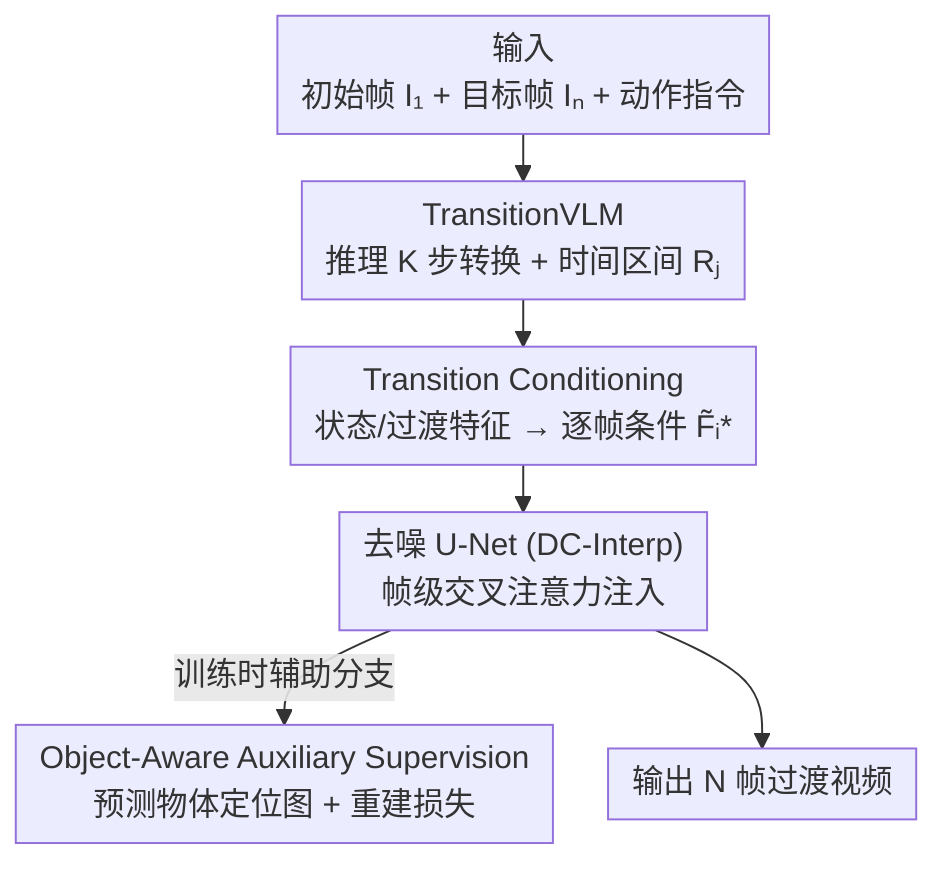

# Ego-InBetween: Generating Object State Transitions in Ego-Centric Videos

**会议**: CVPR 2026  
**论文**: [CVF Open Access](https://openaccess.thecvf.com/content/CVPR2026/html/Ge_Ego-InBetween_Generating_Object_State_Transitions_in_Ego-Centric_Videos_CVPR_2026_paper.html)  
**代码**: 无  
**领域**: 视频生成  
**关键词**: 第一人称视频, 物体状态转换, 视频插帧, 视觉语言模型, 帧级条件注入  

## 一句话总结
针对"给定初始帧、目标帧和一句动作指令，生成中间帧把物体从初态平滑变到末态"的新任务（EIVST），EgoIn 先用微调后的 TransitionVLM 推理出分几步、每步发生在哪个时间段，再把这些条件逐帧注入扩散插帧模型，并用物体定位辅助监督保住物体外观一致性，在四个第一人称/机器人操作数据集上 FVD 等指标全面领先。

## 研究背景与动机

**领域现状**：让机器理解"物体如何随动作变化"对具身智能很关键。现有相关任务分两类：一类是文本条件的视频预测（TVP，如 Seer、AID），从单张参考帧 + 指令预测未来帧；另一类是图像间的过渡视频生成，包括视频插帧（VFI）和场景过渡（如 SEINE、FILM），目标是在两张参考图之间生成平滑的运动/外观过渡。

**现有痛点**：TVP 类方法只给一张参考帧和指令，**没有目标状态的视觉引导**，不知道该往哪儿生成——比如给一张关着的冰箱，很难推断里面有什么、怎么取出一碗生菜。插帧/过渡类方法虽然有首尾两帧，但只擅长**平滑外观插值**，遇到多步、组合性的动作就会退化成简单重复的运动，因为它们过度依赖额外引导条件、缺乏在两个物体状态之间"推理出过渡过程"的能力。

**核心矛盾**：现有 I2V 模型倾向于**过度依赖给定的显式信息**，不会像人那样调动更广的上下文去推理"哪些物体在变、发生了什么变换、变换在序列的什么位置发生"。而直接把通用 VLM 接进来又会**幻觉**：编造视觉上不存在的过渡步、把步骤延伸到目标帧之外、把时间区间均匀乱分。

**本文目标**：定义并解决 **Egocentric Instructed Visual State Transition (EIVST)** 任务——给初始帧 $I_1$、目标帧 $I_N$ 和一句动作指令，生成中间帧序列 $\{\hat{I}_i \mid 2 \le i \le N-1\}$，刻画物体经 $K$ 步推理出的状态转换过程。

**切入角度**：模仿人推理状态转换的方式，把问题拆成两段——先"想清楚怎么变"（推理过程），再"画出来"（生成帧），即 divide-and-conquer。关键在于先用一个**被驯服过、不乱编**的 VLM 把过渡过程显式推理出来，再当作逐帧条件喂给生成器。

**核心 idea**：用微调 VLM 显式推理"分 K 步 + 每步时间段"的过渡过程，再通过帧级交叉注意力把它注入扩散插帧模型，从而把"看不见的推理"变成"可控的逐帧生成条件"。

## 方法详解

### 整体框架
EgoIn 分两阶段串行：**阶段一**用微调后的 TransitionVLM 读初始帧、目标帧和动作指令，推理出初/末物体状态描述、$K$ 步物体状态转换以及每步的时间区间 $\{R_j\}_{j=1}^K$；**阶段二**由 Transition Conditioning (TC) 模块把这些状态/过渡信息编码成**逐帧条件** $\{\tilde{F}_i^*\}_{i=1}^N$，经帧级交叉注意力注入去噪 U-Net，生成 $N$ 帧视频。训练时额外挂一个 Object-Aware Auxiliary Supervision (OAS)：让 U-Net 顺便预测被操作物体的定位图，和视频重建损失一起优化，保物体外观一致。整套生成器搭在轻量的 DynamiCrafter Interpolation (DC-Interp) 上。

### 关键设计

**1. TransitionVLM：把通用 VLM 驯服成"只说图里有的、还会分步分时段"的过渡推理器**

直接拿 Qwen2.5-VL 7B 去推理状态转换会幻觉——编造不存在的过渡、把步骤延伸出目标帧、时间区间均匀乱分。作者用 GPT-4o **构造监督数据**来纠正它：① 对状态描述，先按动作指令找出被操作物体、用 Qwen2.5-VL 检测出 bounding box，把 box 一起喂给 GPT-4o，逼它聚焦物体区域、少描述无关背景，得到初/末物体状态描述；② 对过渡描述，把**完整 $N$ 帧视频**喂给 GPT-4o（而不是只给首尾两帧），让它生成 $K$ 个状态转换步及对应时间区间——有了全程视频，过渡描述才"看得见"地准确。

微调时为保住原模型的推理与泛化能力，用 **LoRA 而非全参微调**，并把状态、过渡两路解耦：注入 S-Adapter + S-LoRA + 一个预测头学状态信息（$\mathcal{L}_S$、$\mathcal{L}_T$ 监督初/末状态），再注入 T-Adapter + T-LoRA + 另一个预测头学过渡信息（$K$ 步转换 + 时间区间，$\mathcal{L}_R$ 监督区间）。微调后幻觉显著减少——消融里把"原 VLM 推理的步骤"换成 TransitionVLM 的步骤，生成视频的合理性明显改善（如先开冰箱门、再放锅，而非颠三倒四）。

**2. Transition Conditioning：把 VLM 的文本推理变成逐帧、带时间权重的生成条件**

I2V 模型靠注意力**隐式**建模输入条件，缺乏显式的逐帧引导，导致难以确定每步过渡的时间区间、常漏掉某些步骤。TC 把 TransitionVLM 的输出转成显式逐帧条件，分两支：

*Multi-modal Semantic State Encoding（状态编码）*：取首尾帧 $\{I_1, I_N\}$ 和 TransitionVLM 的状态特征。这里**不直接用生成的文本 prompt，而是取预测头之前的特征** $F_1^S$、$F_N^S$，因为它们信息更丰富、对噪声更鲁棒。初态 $\{I_1, F_1^S\}$ 和末态 $\{I_N, F_N^S\}$ 各过一个权重共享的 SQ-Former（借鉴 BLIP）对齐视觉与语义，再经多层 Self-Attn + FFN 融合得 $\tilde{F}^S$；还引入可学习位置 token 区分初/末状态、强化时序感知。

*Range-Aware Transition Encoding（过渡编码）*：核心是一个**软化加权机制**——基于 TransitionVLM 预测的时间区间 $\{R_j\}_{j=1}^K$，给每帧 $i$、每步 $j$ 从高斯分布重采样权重 $W_{i,j}$，其中区间 $R_j$ 的中心和长度分别当作高斯的均值与标准差。这样把硬邦邦、有噪声的步边界**平滑**成连续权重，避免步与步交界处的突变。每帧的过渡特征由 $\{F_1^T,\dots,F_K^T\}$ 按 $\{W_{i,1},\dots,W_{i,K}\}$ 加权求和得到。最后把 $\tilde{F}^S$ 与逐帧 $\{\tilde{F}_i^T\}_{i=1}^N$ 拼接，过 MLP + Self-Attn 得最终逐帧条件 $\{\tilde{F}_i^*\}_{i=1}^N$，经帧级交叉注意力注入 U-Net。消融显示用预测区间（非均匀分配）能让过渡在时间上更自然对齐。

**3. Object-Aware Auxiliary Supervision：用"顺手定位物体"的辅助任务保住外观一致**

生成的过渡视频常出现被操作物体外观漂移、运动不连贯。OAS 用**多任务学习**让 U-Net 在重建帧的同时学会定位关键物体：在 U-Net 最后一个卷积块后接一个由两层卷积组成的定位头，预测物体概率图。真值由 Qwen2.5-VL 按指令找出物体、再用 SAM2 逐帧生成掩码并下采样到定位头分辨率得到；监督用预测图与真值掩码的逐像素交叉熵。整体目标为

$$\min_{\theta}\ \mathbb{E}_{z,t,\epsilon}\big\|\epsilon - \epsilon_{\theta}(z_t; t, f_r, I_1, I_N, \{\tilde{F}_i^*\}_{i=1}^N)\big\|_2^2 + \lambda \mathcal{L}_{\text{LOC}}$$

其中 $\lambda$ 控制定位损失权重，经验设为 $0.1$ 以平衡两个目标并保训练稳定。关键是 SAM2 **只在训练时造真值**，推理时不需要任何掩码/box，零额外开销。

### 损失函数 / 训练策略
- TransitionVLM：在约 10k 状态描述 + 30k 过渡描述（Epic100/EgoFHO）、外加约 2k+4k（机器人数据集）上微调，Adapter 学习率 $1\times10^{-5}$、LoRA 学习率 $5\times10^{-5}$，lora rank=64、alpha=32，4 个 epoch、batch 128。
- 生成器：分两步——先冻结其余参数、单独优化 TC 模块 20k 步（lr $1\times10^{-4}$，batch 64）防训练不稳；再联合微调 U-Net 空间层 + TC 模块 10k 步（lr $2\times10^{-5}$，batch 32）。推理用 50 步 DDIM。SQ-Former 取 16 个 query，$\tilde{F}^S$ 与 $\{F_j^T\}$ 特征长度分别为 32、77，状态编码层数 $M_1=M_2=2$。

## 实验关键数据

### 主实验
四个数据集（两个人-物交互 Epic100/EgoFHO，两个机器人操作 DualArm/Bridge），指标遵循 VBench：FVD↓、视频时序质量 VTQ↑、视频-文本一致性 VTC↑、视频-图像一致性 VIC↑。所有对比方法都已在本文 EIVST 训练集上微调以保公平。

| 数据集 | 指标 | DC-Interp（次优） | EgoIn（本文） |
|--------|------|------|------|
| Epic100 | FVD↓ / VTQ↑ / VTC↑ / VIC↑ | 296.67 / 0.8797 / 0.2041 / 0.9081 | **215.27 / 0.9081 / 0.2373 / 0.9313** |
| EgoFHO | FVD↓ / VTQ↑ / VTC↑ / VIC↑ | 290.30 / 0.8740 / 0.2079 / 0.9196 | **203.85 / 0.8987 / 0.2340 / 0.9396** |
| DualArm | FVD↓ / VTQ↑ / VTC↑ / VIC↑ | 298.51 / 0.8895 / 0.2107 / 0.9324 | **209.63 / 0.9142 / 0.2361 / 0.9468** |
| Bridge | FVD↓ / VTQ↑ / VTC↑ / VIC↑ | 287.47 / 0.9153 / 0.2092 / 0.9302 | **191.09 / 0.9374 / 0.2395 / 0.9511** |

FVD 在四个数据集上相对次优均下降约 70~100 点（如 Epic100 296.67→215.27），VTC（视频-文本一致性）提升最显著。40 人用户研究中，EgoIn 在过渡步合理性 / 指令对齐 / 运动质量三项均拿到 **70%+** 的偏好票（如运动质量 77.06%），远超 DC-Interp 的约 11%。

### 消融实验

各组件逐步叠加（以微调后的 DC-Interp 为 Baseline，Epic100）：

| 配置 | FVD↓ | VTQ↑ | VTC↑ | VIC↑ | 说明 |
|------|------|------|------|------|------|
| Baseline | 296.67 | 0.8797 | 0.2041 | 0.9081 | 微调后的 DC-Interp |
| + TransitionVLM | 261.78 | 0.8909 | 0.2233 | 0.9146 | 加扩展文本条件，过渡步更合理 |
| + TVLM & TC | 232.10 | 0.9013 | 0.2312 | 0.9251 | 帧级条件让步骤更可控、时间分配更准 |
| + TVLM & TC & OAS | **215.27** | **0.9081** | **0.2373** | **0.9313** | 加物体定位监督，外观/运动一致性更好 |

过渡步数 $K$ 的消融（Epic100 FVD）：$K{=}1$ 上下文太少（247.41），$K{=}2$ 明显改善（228.66），$K{=}4$ 对简单过渡引入冗余步反而变差（233.25），而**自适应 $K\in[1,4]$ 最优**（215.27）——说明步数应随过渡复杂度变，不能固定。

### 关键发现
- **三个组件各管一段、缺一不可**：TransitionVLM 管"步对不对"，TC 管"每步落在哪几帧、可不可控"，OAS 管"物体长得一不一致"；从 296.67→215.27 的 FVD 改善由三者叠加而来。
- **VLM 必须微调**：toy 实验里用原版 Qwen2.5-VL 7B 推理出的步骤会让生成出现不合理状态（如往已满的冰箱里塞锅造成物体重叠），换成 TransitionVLM 后步骤顺序与物理合理性明显改善。
- **时间区间要"预测"不要"均匀分"**：用 TransitionVLM 预测的非均匀区间（如 $R_1{:}1{-}3, R_2{:}4{-}12, R_3{:}13{-}16$）比均匀切（$1{-}5,5{-}10,11{-}16$）生成的过渡更自然、时序更对齐。

## 亮点与洞察
- **"先推理后生成"的解耦很对路**：把"分几步、每步在哪段时间"这种需要常识推理的活交给 VLM，把"画得像不像"交给扩散模型，比让一个 I2V 模型端到端硬扛要靠谱——这套 divide-and-conquer 思路可迁移到其他需要"过程推理 + 高保真生成"的任务。
- **高斯软加权把离散步边界变连续**：用区间中心/长度当高斯均值/方差重采样逐帧权重，是个轻巧的 trick——既尊重 VLM 给的离散步划分，又避免步交界处的硬切变，可复用到任何"把分段标签转成逐帧/逐位置软条件"的场景。
- **训练用 SAM2 造真值、推理零开销**：OAS 把强分割模型当"训练期教师"蒸进一个两层卷积定位头，推理时完全不调用 SAM2/检测器——是"训练重、推理轻"的典型且实用的做法。
- **取预测头之前的特征当条件**：不用 VLM 输出的文本 prompt 而用其内部特征 $F^S$，因为信息更密、抗噪——提醒我们把 VLM 接进生成器时，中间表征往往比生成文本更好用。

## 局限与展望
- 作者承认：**长时程、伴随大幅场景/视角变化**的状态转换仍是难题，需要更强的长程依赖建模和多视角一致性。
- 自己发现：⚠️ 论文未提供代码，且 SQ-Former、Adapter 等多个新模块的精确结构主要靠图示，**复现门槛较高**；高斯重采样的具体形式（均值/方差如何由区间映射、是否归一化）描述较略，复现时需以原文/补充材料为准。
- 严重依赖 GPT-4o 造数据 + Qwen2.5-VL 检测 + SAM2 分割的"数据流水线"，这些上游模型的检测/分割误差会直接污染训练真值，论文未分析其敏感性。
- 评测全用自动指标（FVD/VBench 协议）+ 用户研究，缺少对"物理合理性"的客观度量（如物体守恒、动作可行性）。

## 相关工作与启发
- **vs Seer / AID（文本条件视频预测）**: 它们从单张参考帧 + 指令预测未来帧，**没有目标状态的视觉锚点**，常到不了期望末态；本文把目标帧也当条件，并显式推理中间过渡过程，更可控也更适合研究"物理世界如何运作"。
- **vs FILM / TRF / GI（视频插帧）**: 这些方法擅长两帧间平滑外观/运动插值，但遇到多步、组合动作会退化成简单重复运动；本文靠 VLM 推理 + 帧级过渡条件，能生成语义复杂的动作过渡。
- **vs SEINE（场景过渡）**: 面向平滑场景切换，不建模动作诱导的物体变换；本文聚焦"指令驱动的物体状态转换"，是更细粒度的语义任务。
- **vs Free-Bloom / VSTAR / AID（VLM 辅助生成）**: 它们多直接用未微调 VLM 拆解 prompt 或预测动作步，易产生"听起来合理但无视觉依据"的幻觉；本文用 GPT-4o 造数据 + 双路 LoRA 微调，专门压幻觉、并把状态/过渡解耦。

## 评分
- 新颖性: ⭐⭐⭐⭐⭐ 提出 EIVST 新任务，"先 VLM 推理过渡、再帧级条件注入扩散"的解耦设计 + 高斯软加权区间编码组合新颖。
- 实验充分度: ⭐⭐⭐⭐ 四个数据集 + 四指标 + 用户研究 + 多组消融（组件/步数/VLM 有效性）较完整，但缺代码与上游模型误差敏感性分析。
- 写作质量: ⭐⭐⭐⭐ 任务定义清晰、动机层层推进；部分新模块（SQ-Former、高斯重采样细节）偏依赖图示、文字略简。
- 价值: ⭐⭐⭐⭐ 对具身智能/机器人操作的"过程可视化"有实用价值，多个 trick（训练造真值、中间特征当条件、区间软加权）可迁移。

<!-- RELATED:START -->

## 相关论文

- [\[CVPR 2026\] VideoRealBench: A Chain-of-Thought Realism Evaluation Benchmark for Generated Human-Centric Videos](videorealbench_a_chain-of-thought_realism_evaluation_benchmark_for_generated_hum.md)
- [\[ACL 2026\] OSCBench: Benchmarking Object State Change in Text-to-Video Generation](../../ACL2026/video_generation/oscbench_benchmarking_object_state_change_in_text-to-video_generation.md)
- [\[CVPR 2026\] OmniLottie: Generating Vector Animations via Parameterized Lottie Tokens](omnilottie_generating_vector_animations_via_parameterized_lottie_tokens.md)
- [\[CVPR 2026\] ShotDirector: Directorially Controllable Multi-Shot Video Generation with Cinematographic Transitions](shotdirector_directorially_controllable_multi-shot_video_generation_with_cinemat.md)
- [\[CVPR 2026\] HandWorld: Hand-Centric Unified Video Action Generation](handworld_hand-centric_unified_video_action_generation.md)

<!-- RELATED:END -->
